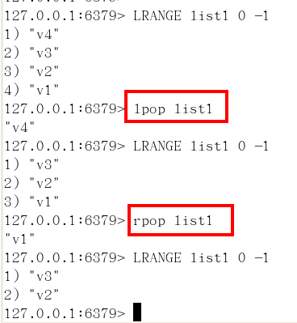

## 1：NoSql入门和概述

### 1）入门概述

#### A、互联网时代背景下大机遇，为什么用nosql

##### 单机MySQL的美好年代

在90年代，一个网站的访问量一般都不大，用单个数据库完全可以轻松应付。
在那个时候，更多的都是静态网页，动态交互类型的网站不多。


上述架构下，我们来看看数据存储的瓶颈是什么？

1. 数据量的总大小 一个机器放不下时
2. 数据的索引（B+ Tree）一个机器的内存放不下时
3. 访问量(读写混合)一个实例不能承受

如果满足了上述1 or 3个，进化......

##### Memcached(缓存)+MySQL+垂直拆分

后来，随着访问量的上升，几乎大部分使用MySQL架构的网站在数据库上都开始出现了性能问题，web程序不再仅仅专注在功能上，同时也在追求性能。程序员们开始大量的使用缓存技术来缓解数据库的压力，优化数据库的结构和索引。开始比较流行的是通过文件缓存来缓解数据库压力，但是当访问量继续增大的时候，多台web机器通过文件缓存不能共享，大量的小文件缓存也带了了比较高的IO压力。在这个时候，Memcached就自然的成为一个非常时尚的技术产品。


 Memcached作为一个独立的分布式的缓存服务器，为多个web服务器提供了一个共享的高性能缓存服务，在Memcached服务器上，又发展了根据hash算法来进行多台Memcached缓存服务的扩展，然后又出现了一致性hash来解决增加或减少缓存服务器导致重新hash带来的大量缓存失效的弊端

##### Mysql主从读写分离

 由于数据库的写入压力增加，Memcached只能缓解数据库的读取压力。读写集中在一个数据库上让数据库不堪重负，大部分网站开始使用主从复制技术来达到读写分离，以提高读写性能和读库的可扩展性。Mysql的master-slave模式成为这个时候的网站标配了。


##### 分表分库+水平拆分+mysql集群 

 在Memcached的高速缓存，MySQL的主从复制，读写分离的基础之上，这时MySQL主库的写压力开始出现瓶颈，而数据量的持续猛增，由于MyISAM使用表锁，在高并发下会出现严重的锁问题，大量的高并发MySQL应用开始使用InnoDB引擎代替MyISAM。

 同时，开始流行使用分表分库来缓解写压力和数据增长的扩展问题。这个时候，分表分库成了一个热门技术，是面试的热门问题也是业界讨论的热门技术问题。也就在这个时候，MySQL推出了还不太稳定的表分区，这也给技术实力一般的公司带来了希望。虽然MySQL推出了MySQL Cluster集群，但性能也不能很好满足互联网的要求，只是在高可靠性上提供了非常大的保证。


##### MySQL的扩展性瓶颈

MySQL数据库也经常存储一些大文本字段，导致数据库表非常的大，在做数据库恢复的时候就导致非常的慢，不容易快速恢复数据库。比如1000万4KB大小的文本就接近40GB的大小，如果能把这些数据从MySQL省去，MySQL将变得非常的小。关系数据库很强大，但是它并不能很好的应付所有的应用场景。MySQL的扩展性差（需要复杂的技术来实现），大数据下IO压力大，表结构更改困难，正是当前使用MySQL的开发人员面临的问题。

##### 今天是什么样子？？


##### 为什么用NoSQL


为什么使用NoSQL ?

今天我们可以通过第三方平台（如：Google,Facebook等）可以很容易的访问和抓取数据。用户的个人信息，社交网络，地理位置，用户生成的数据和用户操作日志已经成倍的增加。我们如果要对这些用户数据进行挖掘，那SQL数据库已经不适合这些应用了, NoSQL数据库的发展也却能很好的处理这些大的数据。


#### B、是什么？

NoSQL(NoSQL = Not Only SQL )，意即“不仅仅是SQL”，泛指非关系型的数据库。随着互联网web2.0网站的兴起，传统的关系数据库在应付web2.0网站，特别是超大规模和高并发的SNS类型的web2.0纯动态网站已经显得力不从心，暴露了很多难以克服的问题，而非关系型的数据库则由于其本身的特点得到了非常迅速的发展。NoSQL数据库的产生就是为了解决大规模数据集合多重数据种类带来的挑战，尤其是大数据应用难题，包括超大规模数据的存储。

（例如谷歌或Facebook每天为他们的用户收集万亿比特的数据）。这些类型的数据存储不需要固定的模式，无需多余操作就可以横向扩展。

#### C、能干嘛

##### 易扩展

NoSQL数据库种类繁多，但是一个共同的特点都是去掉关系数据库的关系型特性。数据之间无关系，这样就非常容易扩展。也无形之间，在架构的层面上带来了可扩展的能力。

##### 大数据量高性能 

NoSQL数据库都具有非常高的读写性能，尤其在大数据量下，同样表现优秀。这得益于它的无关系性，数据库的结构简单。
一般MySQL使用Query Cache，每次表的更新Cache就失效，是一种大粒度的Cache，在针对web2.0的交互频繁的应用，Cache性能不高。而NoSQL的Cache是记录级的，是一种细粒度的Cache，所以NoSQL在这个层面上来说就要性能高很多了

##### 多样灵活的数据模型

NoSQL无需事先为要存储的数据建立字段，随时可以存储自定义的数据格式。而在关系数据库里，增删字段是一件非常麻烦的事情。如果是非常大数据量的表，增加字段简直就是一个噩梦。

##### 传统RDBMS VS NOSQL


1. RDBMS

    - 高度组织化结构化数据
    - 结构化查询语言（SQL）
    - 数据和关系都存储在单独的表中。
    - 数据操纵语言，数据定义语言
    - 严格的一致性
    - 基础事务

2. NoSQL

    - 代表着不仅仅是SQL
    - 没有声明性查询语言
    - 没有预定义的模式
    -键 - 值对存储，列存储，文档存储，图形数据库
    - 最终一致性，而非ACID属性
    - 非结构化和不可预知的数据
    - CAP定理
    - 高性能，高可用性和可伸缩性

### 2）3V+3高

1. 大数据时代的3V
   * 海量Volume
   * 多样Variety
   * 实时Velocity

2. 互联网需求的3高
   * 高并发
   * 高可扩
   * 高性能

### 3）当下的NoSQL经典应用

1. 当下的应用是sql和nosql一起使用

2. 阿里巴巴中文站商品信息如何存放

#### 架构发展历程

演变过程


第5代


第5代架构使命


#### 多数据源多数据类型的存储问题


#### 1. 商品基本信息

1. 名称、价格，出厂日期，生产厂商等

2. 关系型数据库：mysql/oracle目前淘宝在去O化(也即拿掉Oracle)，注意，淘宝内部用的Mysql是里面的大牛自己改造过的

为什么去IOE？

 

 2008年，王坚加盟阿里巴巴成为集团首席架构师，即现在的首席技术官。这位前微软亚洲研究院常务副院长被马云定位为：将帮助阿里巴巴集团建立世界级的技术团队，并负责集团技术架构以及基础技术平台搭建。
在加入阿里后，带着技术基因和学者风范的王坚就在阿里巴巴集团提出了被称为“去IOE”（在IT建设过程中，去除IBM小型机、Oracle数据库及EMC存储设备）的想法，并开始把云计算的本质，植入阿里IT基因。
王坚这样概括“去IOE”运动和阿里云之间的关系：“去IOE”彻底改变了阿里集团IT架构的基础，是阿里拥抱云计算，产出计算服务的基础。“去IOE”的本质是分布化，让随处可以买到的Commodity PC架构成为可能，使云计算能够落地的首要条件。


#### 2. 商品描述、详情、评价信息(多文字类)

- 多文字信息描述类，IO读写性能变差
- 文档数据库MongDB中

#### 3. 商品的图片

1. 商品图片展现类
2. 分布式的文件系统中
   * 淘宝自己的TFS
   * Google的GFS
   * Hadoop的HDFS

#### 4. 商品的关键字

- 搜索引擎，淘宝内用
- ISearch

#### 5. 商品的波段性的热点高频信息

- 内存数据库
- Tair、Redis、Memcache

#### 6. 商品的交易、价格计算、积分累计

- 外部系统，外部第3方支付接口
- 支付宝

#### 总结大型互联网应用(大数据、高并发、多样数据类型)的难点和解决方案

1. 难点

   - 数据类型多样性
   - 数据源多样性和变化重构
   - 数据源改造而数据服务平台不需要大面积重构

2. 解决办法

   阿里、淘宝干了什么？UDSL

   

   

   什么样

   

   

   映射

   

   

   API

   
   
   
   
   热点缓存
   
   
   
   

### 4）NoSQL数据模型简介


#### 聚合模型

1. 列族

   顾名思义，是按列存储数据的。最大的特点是方便存储结构化和半结构化数据，方便做数据压缩，
   对针对某一列或者某几列的查询有非常大的IO优势。

   

2. 图形

   
   
   


### 5）NoSQL数据库的四大分类

1. KV键值：典型介绍

   新浪：BerkeleyDB+redis
   美团：redis+tair
   阿里、百度：memcache+redis

2. 文档型数据库(bson格式比较多)：典型介绍

   * CouchDB

   * MongoDB
     MongoDB 是一个基于分布式文件存储的数据库。由 C++ 语言编写。旨在为 WEB 应用提供可扩展的高性能数据存储解决方案。

     MongoDB 是一个介于关系数据库和非关系数据库之间的产品，是非关系数据库当中功能最丰富，最像关系数据库的。

   

4. 列存储数据库

   * Cassandra, HBase
   * 分布式文件系统

5. 图关系数据库

   * 它不是放图形的，放的是关系比如:朋友圈社交网络、广告推荐系统
   * 社交网络，推荐系统等。专注于构建关系图谱
   * Neo4J, InfoGrid

6. 四者对比
   
   
   
   
   


### 6）在分布式数据库中CAP原理CAP+BASE

#### 1. 传统的ACID分别是什么

   * A (Atomicity) 原子性
   * C (Consistency) 一致性
   * I (Isolation) 独立性
   * D (Durability) 持久性

#### 2. CAP

   * C:Consistency（强一致性）
   * A:Availability（可用性）
   * P:Partition tolerance（分区容错性）

#### 3. CAP的3进2
   CAP理论就是说在分布式存储系统中，最多只能实现上面的两点。
   而由于当前的网络硬件肯定会出现延迟丢包等问题，所以分区容忍性是我们必须需要实现的。所以我们只能在一致性和可用性之间进行权衡，没有NoSQL系统能同时保证这三点。

- CA 传统Oracle数据库
- AP 大多数网站架构的选择
- CP Redis、Mongodb

注意：分布式架构的时候必须做出取舍。


   一致性和可用性之间取一个平衡。多余大多数web应用，其实并不需要强一致性。因此牺牲C换取P，这是目前分布式数据库产品的方向

   **一致性与可用性的决择**

   对于web2.0网站来说，关系数据库的很多主要特性却往往无用武之地

   **数据库事务一致性需求** 
   　　很多web实时系统并不要求严格的数据库事务，对读一致性的要求很低， 有些场合对写一致性要求并不高。允许实现最终一致性。

   **数据库的写实时性和读实时性需求**
   　　对关系数据库来说，插入一条数据之后立刻查询，是肯定可以读出来这条数据的，但是对于很多web应用来说，并不要求这么高的实时性，比方说发一条消息之 后，过几秒乃至十几秒之后，我的订阅者才看到这条动态是完全可以接受的。

   **对复杂的SQL查询，特别是多表关联查询的需求** 
   　　任何大数据量的web系统，都非常忌讳多个大表的关联查询，以及复杂的数据分析类型的报表查询，特别是SNS类型的网站，从需求以及产品设计角 度，就避免了这种情况的产生。往往更多的只是单表的主键查询，以及单表的简单条件分页查询，SQL的功能被极大的弱化了。

#### 4. 经典CAP图

CAP理论的核心是：一个分布式系统不可能同时很好的满足一致性，可用性和分区容错性这三个需求，
最多只能同时较好的满足两个。

因此，根据 CAP 原理将 NoSQL 数据库分成了满足 CA 原则、满足 CP 原则和满足 AP 原则三大类：

- CA - 单点集群，满足一致性，可用性的系统，通常在可扩展性上不太强大。
- CP - 满足一致性，分区容忍必的系统，通常性能不是特别高。
- AP - 满足可用性，分区容忍性的系统，通常可能对一致性要求低一些。
  


#### 5. BASE

BASE就是为了解决关系数据库强一致性引起的问题而引起的可用性降低而提出的解决方案。

BASE其实是下面三个术语的缩写：
 * 基本可用（Basically Available）
* 软状态（Soft state）
* 最终一致（Eventually consistent）

它的思想是通过让系统放松对某一时刻数据一致性的要求来换取系统整体伸缩性和性能上改观。为什么这么说呢，缘由就在于大型系统往往由于地域分布和极高性能的要求，不可能采用分布式事务来完成这些指标，要想获得这些指标，我们必须采用另外一种方式来完成，这里BASE就是解决这个问题的办法

#### 6. 分布式+集群简介

分布式系统（distributed system）：由多台计算机和通信的软件组件通过计算机网络连接（本地网络或广域网）组成。分布式系统是建立在网络之上的软件系统。正是因为软件的特性，所以分布式系统具有高度的内聚性和透明性。因此，网络和分布式系统之间的区别更多的在于高层软件（特别是操作系统），而不是硬件。分布式系统可以应用在在不同的平台上如：Pc、工作站、局域网和广域网上等。 

简单来讲：

- 分布式：不同的多台服务器上面部署不同的服务模块（工程），他们之间通过Rpc/Rmi之间通信和调用，对外提供服务和组内协作。
- 集群：不同的多台服务器上面部署相同的服务模块，通过分布式调度软件进行统一的调度，对外提供服务和访问。


## 2：Redis入门介绍

Redis（REmote DIctionary Server(远程字典服务器)）是完全开源免费的，用C语言编写的，遵守BSD协议，是一个高性能的(key/value)分布式内存数据库，基于内存运行并支持持久化的NoSQL数据库，是当前最热门的NoSql数据库之一,也被人们称为数据结构服务器。

Redis 与其他 key - value 缓存产品有以下三个特点

- Redis支持数据的持久化，可以将内存中的数据保持在磁盘中，重启的时候可以再次加载进行使用

- Redis不仅仅支持简单的key-value类型的数据，同时还提供list，set，zset，hash等数据结构的存储

- Redis支持数据的备份，即master-slave模式的数据备份

### 1）Redis作用

- 内存存储和持久化：redis支持异步将内存中的数据写到硬盘上，同时不影响继续服务
- 取最新N个数据的操作，如：可以将最新的10条评论的ID放在Redis的List集合里面
- 模拟类似于HttpSession这种需要设定过期时间的功能
- 发布、订阅消息系统
- 定时器、计数器

### 2）Redis安装

#### Centos7中安装redis

* 操作系统：Centos7

```shell
[root@Linux5 software]# cat /etc/os-release
NAME="CentOS Linux"
VERSION="7 (Core)"
ID="centos"
ID_LIKE="rhel fedora"
VERSION_ID="7"
PRETTY_NAME="CentOS Linux 7 (Core)"
ANSI_COLOR="0;31"
CPE_NAME="cpe:/o:centos:centos:7"
HOME_URL="https://www.centos.org/"
BUG_REPORT_URL="https://bugs.centos.org/"

CENTOS_MANTISBT_PROJECT="CentOS-7"
CENTOS_MANTISBT_PROJECT_VERSION="7"
REDHAT_SUPPORT_PRODUCT="centos"
REDHAT_SUPPORT_PRODUCT_VERSION="7"
#内核信息
[root@Linux5 ~]# uname -r
3.10.0-957.el7.x86_64
[root@Linux5 ~]# cat /etc/redhat-release 
CentOS Linux release 7.6.1810 (Core) 
[root@Linux5 ~]# 
```

* Redis版本：redis-5.0.8


##### 下载[redis](Http://redis.io/)


```shell
[root@Linux5 software]# wget http://download.redis.io/releases/redis-5.0.8.tar.gz
--2020-04-03 02:02:02--  http://download.redis.io/releases/redis-5.0.8.tar.gz
Resolving download.redis.io (download.redis.io)... 109.74.203.151
Connecting to download.redis.io (download.redis.io)|109.74.203.151|:80... connected.
HTTP request sent, awaiting response... 200 OK
Length: 1985757 (1.9M) [application/x-gzip]
Saving to: ‘redis-5.0.8.tar.gz’

100%[=================================================================================================================>] 1,985,757   40.9KB/s   in 45s    

2020-04-03 02:02:54 (42.7 KB/s) - ‘redis-5.0.8.tar.gz’ saved [1985757/1985757]

[root@Linux5 software]# 
```


##### 编译和安装

```shell

[root@Linux5 software]# tar xzf redis-5.0.8.tar.gz
[root@Linux5 software]# ls
redis-5.0.8  redis-5.0.8.tar.gz

[root@Linux5 software]# cd redis-5.0.8  
[root@Linux5 redis-5.0.8]# make
cd src && make all
make[1]: Entering directory `/opt/software/redis-5.0.8/src'
    CC Makefile.dep
make[1]: Leaving directory `/opt/software/redis-5.0.8/src'
make[1]: Entering directory `/opt/software/redis-5.0.8/src'
rm -rf redis-server redis-sentinel redis-cli redis-benchmark redis-check-rdb redis-check-aof *.o *.gcda *.gcno *.gcov redis.info lcov-html Makefile.dep dict-benchmark
(cd ../deps && make distclean)
make[2]: Entering directory `/opt/software/redis-5.0.8/deps'
(cd hiredis && make clean) > /dev/null || true
(cd linenoise && make clean) > /dev/null || true
(cd lua && make clean) > /dev/null || true
(cd jemalloc && [ -f Makefile ] && make distclean) > /dev/null || true
(rm -f .make-*)
make[2]: Leaving directory `/opt/software/redis-5.0.8/deps'
(rm -f .make-*)
echo STD=-std=c99 -pedantic -DREDIS_STATIC='' >> .make-settings
echo WARN=-Wall -W -Wno-missing-field-initializers >> .make-settings
echo OPT=-O2 >> .make-settings
echo MALLOC=jemalloc >> .make-settings
echo CFLAGS= >> .make-settings
echo LDFLAGS= >> .make-settings
echo REDIS_CFLAGS= >> .make-settings
echo REDIS_LDFLAGS= >> .make-settings
echo PREV_FINAL_CFLAGS=-std=c99 -pedantic -DREDIS_STATIC='' -Wall -W -Wno-missing-field-initializers -O2 -g -ggdb   -I../deps/hiredis -I../deps/linenoise -I../deps/lua/src -DUSE_JEMALLOC -I../deps/jemalloc/include >> .make-settings
echo PREV_FINAL_LDFLAGS=  -g -ggdb -rdynamic >> .make-settings
(cd ../deps && make hiredis linenoise lua jemalloc)
make[2]: Entering directory `/opt/software/redis-5.0.8/deps'
(cd hiredis && make clean) > /dev/null || true
(cd linenoise && make clean) > /dev/null || true
(cd lua && make clean) > /dev/null || true
(cd jemalloc && [ -f Makefile ] && make distclean) > /dev/null || true
(rm -f .make-*)
(echo "" > .make-cflags)
(echo "" > .make-ldflags)
MAKE hiredis
cd hiredis && make static
make[3]: Entering directory `/opt/software/redis-5.0.8/deps/hiredis'
gcc -std=c99 -pedantic -c -O3 -fPIC  -Wall -W -Wstrict-prototypes -Wwrite-strings -g -ggdb  net.c
make[3]: gcc: Command not found
make[3]: *** [net.o] Error 127
make[3]: Leaving directory `/opt/software/redis-5.0.8/deps/hiredis'
make[2]: *** [hiredis] Error 2
make[2]: Leaving directory `/opt/software/redis-5.0.8/deps'
make[1]: [persist-settings] Error 2 (ignored)
    CC adlist.o
/bin/sh: cc: command not found
make[1]: *** [adlist.o] Error 127
make[1]: Leaving directory `/opt/software/redis-5.0.8/src'
make: *** [all] Error 2
[root@Linux5 redis-5.0.8]# 
```

**"make[3]: gcc: Command not found"**,没有GCC，安装GCC

```shell
[root@Linux5 redis-5.0.8]# yum -y install gcc
```


再次make：

```shell
[root@Linux5 redis-5.0.8]# make
cd src && make all
make[1]: Entering directory `/opt/software/redis-5.0.8/src'
    CC Makefile.dep
make[1]: Leaving directory `/opt/software/redis-5.0.8/src'
make[1]: Entering directory `/opt/software/redis-5.0.8/src'
    CC adlist.o
In file included from adlist.c:34:0:
zmalloc.h:50:31: fatal error: jemalloc/jemalloc.h: No such file or directory
 #include <jemalloc/jemalloc.h>
                               ^
compilation terminated.
make[1]: *** [adlist.o] Error 1
make[1]: Leaving directory `/opt/software/redis-5.0.8/src'
make: *** [all] Error 2
[root@Linux5 redis-5.0.8]# 
```

**"jemalloc/jemalloc.h: No such file or directory"**

清理后，再次进行编译：

```shell
[root@Linux5 redis-5.0.8]# make distclean
```

再次make：

```shell
[root@Linux5 redis-5.0.8]# make 
...
Hint: It's a good idea to run 'make test' ;)

make[1]: Leaving directory `/opt/software/redis-5.0.8/src' 
```


make install

```shell
[root@Linux5 redis-5.0.8]# make install
cd src && make install
make[1]: Entering directory `/opt/software/redis-5.0.8/src'
    CC Makefile.dep
make[1]: Leaving directory `/opt/software/redis-5.0.8/src'
make[1]: Entering directory `/opt/software/redis-5.0.8/src'

Hint: It's a good idea to run 'make test' ;)

    INSTALL install
    INSTALL install
    INSTALL install
    INSTALL install
    INSTALL install
make[1]: Leaving directory `/opt/software/redis-5.0.8/src'
[root@Linux5 redis-5.0.8]#
```

查看安装路径：

```shell
[root@Linux5 redis-5.0.8]# ll /usr/local/bin
total 32780
-rwxr-xr-x. 1 root root 4366904 Apr  3 02:15 redis-benchmark
-rwxr-xr-x. 1 root root 8125104 Apr  3 02:15 redis-check-aof
-rwxr-xr-x. 1 root root 8125104 Apr  3 02:15 redis-check-rdb
-rwxr-xr-x. 1 root root 4807888 Apr  3 02:15 redis-cli
lrwxrwxrwx. 1 root root      12 Apr  3 02:15 redis-sentinel -> redis-server
-rwxr-xr-x. 1 root root 8125104 Apr  3 02:15 redis-server
-rwxr--r--. 1 root root     240 Jul 20  2019 xcall
-rwxr--r--. 1 root root     394 Jul 20  2019 xsync
[root@Linux5 redis-5.0.8]# 
```


关于这些文件的说明：

* Redis-benchmark:性能测试工具

* Redis-check-aof：修复有问题的AOF文件

* Redis-check-dump：修复有问题的dump.rdb文件

  ```shell
  [root@Linux5 ~]# redis-benchmark 
  ====== PING_INLINE ======
    100000 requests completed in 2.14 seconds
    50 parallel clients
    3 bytes payload
    keep alive: 1
  
  85.03% <= 1 milliseconds
  97.43% <= 2 milliseconds
  99.29% <= 3 milliseconds
  99.63% <= 4 milliseconds
  99.85% <= 5 milliseconds
  99.93% <= 6 milliseconds
  99.95% <= 8 milliseconds
  99.95% <= 9 milliseconds
  99.99% <= 10 milliseconds
  100.00% <= 10 milliseconds
  46620.05 requests per second
  
  ====== PING_BULK ======
    100000 requests completed in 2.23 seconds
    50 parallel clients
    3 bytes payload
    keep alive: 1
  
  84.86% <= 1 milliseconds
  96.22% <= 2 milliseconds
  98.92% <= 3 milliseconds
  99.53% <= 4 milliseconds
  99.76% <= 5 milliseconds
  99.90% <= 6 milliseconds
  99.93% <= 7 milliseconds
  99.95% <= 8 milliseconds
  99.99% <= 9 milliseconds
  100.00% <= 9 milliseconds
  44843.05 requests per second
  
  ====== SET ======
    100000 requests completed in 2.18 seconds
    50 parallel clients
    3 bytes payload
    keep alive: 1
  
  83.27% <= 1 milliseconds
  97.92% <= 2 milliseconds
  99.62% <= 3 milliseconds
  99.79% <= 4 milliseconds
  99.94% <= 5 milliseconds
  99.98% <= 6 milliseconds
  99.98% <= 7 milliseconds
  99.99% <= 9 milliseconds
  99.99% <= 10 milliseconds
  100.00% <= 11 milliseconds
  100.00% <= 12 milliseconds
  100.00% <= 14 milliseconds
  100.00% <= 14 milliseconds
  45955.88 requests per second
  
  ====== GET ======
    100000 requests completed in 2.10 seconds
    50 parallel clients
    3 bytes payload
    keep alive: 1
  
  84.44% <= 1 milliseconds
  98.35% <= 2 milliseconds
  99.74% <= 3 milliseconds
  99.88% <= 4 milliseconds
  99.95% <= 5 milliseconds
  99.99% <= 6 milliseconds
  100.00% <= 6 milliseconds
  47619.05 requests per second
  
  ====== INCR ======
  ```
  **默认情况下在Redis上写数据每秒钟8万，读数据每秒钟11万。**
* Redis-cli：客户端，操作入口

* Redis-sentinel：redis集群使用

* Redis-server：Redis服务器启动命令


拷贝“redis.conf”到“/opt/module/redis”文件下：

```shell
[root@Linux5 redis-5.0.8]# mkdir -p /opt/module/redis
[root@Linux5 redis-5.0.8]# ls
00-RELEASENOTES  CONTRIBUTING  deps     Makefile   README.md   runtest          runtest-moduleapi  sentinel.conf  tests
BUGS             COPYING       INSTALL  MANIFESTO  redis.conf  runtest-cluster  runtest-sentinel   src            utils
[root@Linux5 redis-5.0.8]# cp redis.conf /opt/module/redis/
[root@Linux5 redis-5.0.8]# 
```


##### 启动redis

```shell
[root@Linux5 redis-5.0.8]# redis-server /opt/module/redis/redis.conf 
11461:C 03 Apr 2020 02:21:39.374 # oO0OoO0OoO0Oo Redis is starting oO0OoO0OoO0Oo
11461:C 03 Apr 2020 02:21:39.374 # Redis version=5.0.8, bits=64, commit=00000000, modified=0, pid=11461, just started
11461:C 03 Apr 2020 02:21:39.374 # Configuration loaded
11461:M 03 Apr 2020 02:21:39.375 * Increased maximum number of open files to 10032 (it was originally set to 1024).
                _._                                                  
           _.-``__ ''-._                                             
      _.-``    `.  `_.  ''-._           Redis 5.0.8 (00000000/0) 64 bit
  .-`` .-```.  ```\/    _.,_ ''-._                                   
 (    '      ,       .-`  | `,    )     Running in standalone mode
 |`-._`-...-` __...-.``-._|'` _.-'|     Port: 6379
 |    `-._   `._    /     _.-'    |     PID: 11461
  `-._    `-._  `-./  _.-'    _.-'                                   
 |`-._`-._    `-.__.-'    _.-'_.-'|                                  
 |    `-._`-._        _.-'_.-'    |           http://redis.io        
  `-._    `-._`-.__.-'_.-'    _.-'                                   
 |`-._`-._    `-.__.-'    _.-'_.-'|                                  
 |    `-._`-._        _.-'_.-'    |                                  
  `-._    `-._`-.__.-'_.-'    _.-'                                   
      `-._    `-.__.-'    _.-'                                       
          `-._        _.-'                                           
              `-.__.-'                                               

11461:M 03 Apr 2020 02:21:39.377 # WARNING: The TCP backlog setting of 511 cannot be enforced because /proc/sys/net/core/somaxconn is set to the lower value of 128.
11461:M 03 Apr 2020 02:21:39.377 # Server initialized
11461:M 03 Apr 2020 02:21:39.377 # WARNING overcommit_memory is set to 0! Background save may fail under low memory condition. To fix this issue add 'vm.overcommit_memory = 1' to /etc/sysctl.conf and then reboot or run the command 'sysctl vm.overcommit_memory=1' for this to take effect.
11461:M 03 Apr 2020 02:21:39.377 # WARNING you have Transparent Huge Pages (THP) support enabled in your kernel. This will create latency and memory usage issues with Redis. To fix this issue run the command 'echo never > /sys/kernel/mm/transparent_hugepage/enabled' as root, and add it to your /etc/rc.local in order to retain the setting after a reboot. Redis must be restarted after THP is disabled.
11461:M 03 Apr 2020 02:21:39.377 * Ready to accept connections
```

这是在界面上打印了redis的启动信息，可以设置让redis进程在后台运行，**修改redis.conf文件将里面的daemonize no 改成 yes，让服务在后台启动**。


查看redis进程

```shell
[root@Linux5 ~]# ps -ef|grep redis
root     11461  6704  0 02:21 pts/0    00:00:00 redis-server 127.0.0.1:6379
root     11466 11299  0 02:22 pts/1    00:00:00 grep --color=auto redis
[root@Linux5 ~]# lsof -i:6379
-bash: lsof: command not found
[root@Linux5 ~]# yum whatprovides lsof
Loaded plugins: fastestmirror
Loading mirror speeds from cached hostfile
 * base: mirrors.ustc.edu.cn
 * extras: mirrors.tuna.tsinghua.edu.cn
 * updates: mirrors.tuna.tsinghua.edu.cn
lsof-4.87-6.el7.x86_64 : A utility which lists open files on a Linux/UNIX system
Repo        : base

[root@Linux5 ~]# yum -y install lsof-4.87-6.el7.x86_64

[root@Linux5 ~]# lsof -i:6379                         
COMMAND     PID USER   FD   TYPE DEVICE SIZE/OFF NODE NAME
redis-ser 11461 root    6u  IPv4  40130      0t0  TCP localhost:6379 (LISTEN)
[root@Linux5 ~]# 
```

##### 连接redis客户端

```shell
[root@Linux5 ~]# redis-cli
127.0.0.1:6379> ping 
PONG
127.0.0.1:6379> 
127.0.0.1:6379> info
# Server
redis_version:5.0.8
redis_git_sha1:00000000
redis_git_dirty:0
redis_build_id:c0c3cff97fc00d2d
redis_mode:standalone
os:Linux 3.10.0-957.el7.x86_64 x86_64
arch_bits:64
multiplexing_api:epoll
atomicvar_api:atomic-builtin
gcc_version:4.8.5
process_id:11461
run_id:2b4f257679a4677bf23beccf9a8902582154e4ff
tcp_port:6379
uptime_in_seconds:343
uptime_in_days:0
hz:10
configured_hz:10
lru_clock:8836938
executable:/opt/software/redis-5.0.8/redis-server
config_file:/opt/module/redis/redis.conf

# Clients
connected_clients:1
client_recent_max_input_buffer:2
client_recent_max_output_buffer:0
blocked_clients:0

# Memory
used_memory:854544
used_memory_human:834.52K
used_memory_rss:12734464
used_memory_rss_human:12.14M
used_memory_peak:854544
used_memory_peak_human:834.52K
used_memory_peak_perc:100.03%
...

# CPU
used_cpu_sys:0.337036
used_cpu_user:0.199066
used_cpu_sys_children:0.000000
used_cpu_user_children:0.000000

# Cluster
cluster_enabled:0

# Keyspace
127.0.0.1:6379>
```

redis默认是不设置密码的：

```shell
127.0.0.1:6379> config get requirepass
1) "requirepass"
2) ""
127.0.0.1:6379>
```


##### 远程连接redis

这里我们采用的是Reids Desktop Manager来远程管理Redis。

准备工作：

```shell
vi /opt/module/redis/redis.conf  
```

修改为如下配置：


关闭防火墙：

```shell
[root@Linux5 ~]# firewall-cmd --state
running
[root@Linux5 ~]# systemctl stop firewalld.service
[root@Linux5 ~]# systemctl disable firewalld.service
Removed symlink /etc/systemd/system/multi-user.target.wants/firewalld.service.
Removed symlink /etc/systemd/system/dbus-org.fedoraproject.FirewallD1.service.
[root@Linux5 ~]# firewall-cmd --state
not running
[root@Linux5 ~]# 

```


连接方法：

    


连接成功后：


##### 关闭redis

* 单实例关闭：redis-cli shutdown

* 多实例关闭，指定端口关闭:redis-cli -p 6379 shutdown

也可以在redis-cli连接中关闭redis关闭Redis


#### Docker中安装redis

##### 安装docker（已安装可忽略）

```shell
[root@Linux5 ~]# yum -y install docker
Loaded plugins: fastestmirror
Loading mirror speeds from cached hostfile
 * base: mirrors.ustc.edu.cn
 * extras: mirrors.tuna.tsinghua.edu.cn
 * updates: mirrors.tuna.tsinghua.edu.cn
Resolving Dependencies
--> Running transaction check
---> Package docker.x86_64 2:1.13.1-109.gitcccb291.el7.centos will be installed
...
```

```shell
[root@Linux5 ~]# systemctl start docker         //启动docker
[root@Linux5 ~]#  docker -v
Docker version 1.13.1, build cccb291/1.13.1
[root@Linux5 ~]# systemctl enable docker       //开机启动docker
Created symlink from /etc/systemd/system/multi-user.target.wants/docker.service to /usr/lib/systemd/system/docker.service.
[root@Linux5 ~]# 
```


##### pull redis

 https://hub.docker.com/_/redis/?tab=tags 


```shell
[root@Linux5 ~]# docker pull redis
Using default tag: latest
Trying to pull repository docker.io/library/redis ... 
latest: Pulling from docker.io/library/redis
c499e6d256d6: Pull complete 
bf1bc8a5a7e4: Pull complete 
7564fb795604: Pull complete 
ec6e86f783e4: Pull complete 
1371d6223f46: Pull complete 
021fd554320f: Pull complete 
Digest: sha256:a732b1359e338a539c25346a50bf0a501120c41dc248d868e546b33e32bf4fe4
Status: Downloaded newer image for docker.io/redis:latest
##查看所下载的images
[root@Linux5 ~]# docker images
REPOSITORY          TAG                 IMAGE ID            CREATED             SIZE
docker.io/redis     latest              4cdbec704e47        2 days ago          98.2 MB
```


##### 启动redis

```shell
[root@Linux5 ~]# docker run -d -p 6379:6379 --name myredis 4cdbec704e47
f3e65e372701b633141e06bc3e29da56a2882699c02a432615fe1a722539355b
[root@Linux5 ~]# docker ps 
CONTAINER ID        IMAGE               COMMAND                  CREATED             STATUS              PORTS                    NAMES
f3e65e372701        4cdbec704e47        "docker-entrypoint..."   21 seconds ago      Up 21 seconds       0.0.0.0:6379->6379/tcp   myredis
[root@Linux5 ~]# 
```

**“docker run -d -p 6379:6379 --name myredis 4cdbec704e47”**的解释。docker run运行镜像，-d表示在后台运行，-p 6379:6379 表示将操作系统的6379端口和docker中的6379端口做映射，-name表示容器名 ，“4cdbec704e47”也即镜像的id，也可以写“docker.io/redis”。

##### 远程连接redis

使用Reids Desktop Manager来远程管理Redis。


```shell
#获取redis的容器ID
[root@Linux5 ~]# docker ps
CONTAINER ID        IMAGE               COMMAND                  CREATED             STATUS              PORTS                    NAMES
f3e65e372701        4cdbec704e47        "docker-entrypoint..."   14 minutes ago      Up 14 minutes       0.0.0.0:6379->6379/tcp   myredis

#进入redis容器
[root@Linux5 ~]# docker exec -it f3e65e372701 /bin/bash
root@f3e65e372701:/data#
root@f3e65e372701:/data# ls /usr/local/bin 
docker-entrypoint.sh  gosu  redis-benchmark  redis-check-aof  redis-check-rdb  redis-cli  redis-sentinel  redis-server
root@f3e65e372701:/data# 
```


关闭redis

```shell
[root@Linux5 ~]# docker ps
CONTAINER ID        IMAGE               COMMAND                  CREATED             STATUS              PORTS                    NAMES
f3e65e372701        4cdbec704e47        "docker-entrypoint..."   30 minutes ago      Up 30 minutes       0.0.0.0:6379->6379/tcp   myredis
#停止redis容器
[root@Linux5 ~]# docker kill f3e65e372701
f3e65e372701
[root@Linux5 ~]# docker ps 
CONTAINER ID        IMAGE               COMMAND             CREATED             STATUS              PORTS               NAMES
[root@Linux5 ~]# 
```


### 3）杂项

1. 单进程

   * 单进程模型来处理客户端的请求。对读写等事件的响应 是通过对epoll函数的包装来做到的。Redis的实际处理速度完全依靠主进程的执行效率

   * Epoll是Linux内核为处理大批量文件描述符而作了改进的epoll，是Linux下多路复用IO接口select/poll的增强版本， 它能显著提高程序在大量并发连接中只有少量活跃的情况下的系统CPU利用率。

2. 默认16个数据库，类似数组下表从零开始，初始默认使用零号库

   设置数据库的数量，默认数据库为0，可以使用SELECT \<dbid\>命令在连接上指定数据库id， 
   
   **可以修改配置文件中可以配置默认库的数量：**
   
```shell
   # Set the number of databases. The default database is DB 0, you can select
   设置数据库的数量。默认数据库起始于0，在每个连接上，使用select <dbid> 可以切换到另外的数据库上，<dbid>的范围为0-（databases-1）
   # a different one on a per-connection basis using SELECT <dbid> where
   # dbid is a number between 0 and 'databases'-1
   databases 16
```

   关于默认16个数据库，实际上我们在前面通过“Reids Desktop Manager”连接redis的时候，已经看到了这点：
   

   

3. Select命令切换数据库

4. Dbsize查看当前数据库的key的数量

5. Flushdb：清空当前库

6. Flushall；通杀全部库

7. 统一密码管理，16个库都是同样密码，要么都OK要么一个也连接不上

8. Redis索引都是从零开始

9. 默认端口是6379，也即九宫格输入的“Alessia  Merz”


通过DBSIZE能够查看key的数量，而keys * 能够查看都有哪些key


？匹配：


如果在某个库下，执行FLUSHDB，则会清空当前库。如下面是在0号库下执行该命令后的结果：


如果想要删除整个库，可以执行FLUSHALL。


## 3：Redis数据类型

### 1）Redis的五大数据类型

#### String（字符串）

- string是redis最基本的类型，可以理解成与Memcached一模一样的类型，一个key对应一个value。

- string类型是二进制安全的。意思是redis的string可以包含任何数据。比如jpg图片或者序列化的对象 。

- string类型是Redis最基本的数据类型，一个redis中字符串value最多可以是512M

#### Hash（哈希，类似java里的Map）

- 
  Redis hash 是一个键值对集合。
- Redis hash是一个string类型的field和value的映射表，hash特别适合用于存储对象。
- 
  类似Java里面的Map<String,Object>


#### List（列表）

- Redis 列表是简单的字符串列表，按照插入顺序排序。可以添加一个元素导列表的头部（左边）或者尾部（右边）。
- 它的底层实际是个双向链表

#### Set（集合）

Redis的Set是string类型的无序集合。它是通过HashTable实现实现的，

#### Zset(sorted set：有序集合)

- Redis zset 和 set 一样也是string类型元素的集合,且不允许重复的成员。不同的是每个元素都会关联一个double类型的分数。
- redis通过分数来为集合中的成员进行从小到大的排序。
- zset的成员是唯一的,但分数(score)却可以重复。


### 2）Redis 键(key)


 * keys *

 * exists key的名字，判断某个key是否存在

 * move key db   --->当前库就没有了，被移除了move命令，
   将一个key移动到另外一个库中：

   

   上面的操作是将k3，移动到2号库中。

 * expire key 秒钟：为给定的key设置过期时间

 * ttl key 查看还有多少秒过期，-1表示永不过期，-2表示已过期

   

   

   而且一旦过期后，通过get操作就查询不到值了，而且keys查看时，也不会显示key

   

   

 * type key 查看你的key是什么类型
   通过type 能够查看key的类型

   

   


### 3）Redis字符串(String)

在Redis中，String是单值单value类型的。

#### 常用方法


#### set/get/del/append/strlen

#### Incr/decr/incrby/decrby,一定要是数字才能进行加减

#### getrange/setrange

* getrange:获取指定区间范围内的值，类似between......and的关系
  从零到负一表示全部


* setrange设置指定区间范围内的值，格式是setrange key 具体值


#### setex(set with expire)键秒值/setnx(set if not exist)

setex:设置带过期时间的key，动态设置。
setex 键 秒值 真实值


setnx:只有在 key 不存在时设置 key 的值。


#### mset/mget/msetnx

* mset:同时设置一个或多个 key-value 对。


* mget:获取所有(一个或多个)给定 key 的值。


* msetnx:同时设置一个或多个 key-value 对，当且仅当所有给定 key 都不存在。

  

 

 

#### getset(先get再set)

getset:将给定 key 的值设为 value ，并返回 key 的旧值(old value)。
简单一句话，先get然后立即set

 

### 4）Redis列表(List)

在Redis中List，是单值多value类型的。

#### 常用API


#### lpush/rpush/lrange

#### lpop/rpop




#### lindex，按照索引下标获得元素(从上到下)

通过索引获取列表中的元素 lindex key index


#### llen

#### lrem key 删N个value


 * 从left往right删除2个值等于v1的元素，返回的值为实际删除的数量
 *  LREM list3 0 值，表示删除全部给定的值。零个就是全部值


 

#### ltrim key 开始index 结束index，截取指定范围的值后再赋值给key


ltrim：截取指定索引区间的元素，格式是ltrim list的key 起始索引 结束索引


#### rpoplpush 源列表 目的列表

移除列表的最后一个元素，并将该元素添加到另一个列表并返回

 

#### lset key index value

 

 

#### linsert key  before/after 值1 值2

在list某个已有值的前后再添加具体值


#### 性能总结

- 它是一个字符串链表，left、right都可以插入添加；
- 如果键不存在，创建新的链表；
- 如果键已存在，新增内容；
- 如果值全移除，对应的键也就消失了。
- 链表的操作无论是头和尾效率都极高，但假如是对中间元素进行操作，效率就很惨淡了。


### 5）Redis集合(Set)

### 6）Redis哈希(Hash)

### 7）Redis有序集合Zset(sorted set)


在设置数据的时候，如果有重复的key，则值会发生覆盖


 setex(set with expire)键值秒/setnx(set if not exist) 


在上面的这个操作中，如果k1b不存在，则设置值为v11，如果存在则不设置值。上面在执行setnx时，得到了响应码0，表示失败，在redis中响应码0表示失败，1表示成功，如果操作有错误，则给出error


通过msetnx设置值时，如果部分key已经存在，则都不生效，只有key都不存在时，设置才生效。


### LRANGE

返回存储在 key 的列表里指定范围内的元素。 start 和 end 偏移量都是基于0的下标，即list的第一个元素下标是0（list的表头），第二个元素下标是1，以此类推。

偏移量也可以是负数，表示偏移量是从list尾部开始计数。 例如， -1 表示列表的最后一个元素，-2 是倒数第二个，以此类推。

* 求范围函数的一致性

   如果你有一个list，里面的元素是从0到100，那么 `LRANGE list 0 10` 这个命令会返回11个元素，即最右边的那个元素也会被包含在内。

* 超过范围的下标

  当下标超过list范围的时候不会产生error。 如果start比list的尾部下标大的时候，会返回一个空列表。 如果stop比list的实际尾部大的时候，Redis会当它是最后一个元素的下标。 

* 返回值

  [array-reply](http://www.redis.cn/topics/protocol.html#array-reply): 指定范围里的列表元素。

注意：LRANGE不会出队元素，只是查看元素。lpop和rpop会出队元素。


在Redis中，list使用使用是双向链表来实现的，它可以作为队列，也可以作为栈，当组合lpush+rpop或rpush+lpop时为队列，当组合为lpush+lpop或rpush+rpop。

当组合为lpush+rpush+lpop时，前半部分为栈，后半部分为队列：

```shell
127.0.0.1:6379> lpush mylist 0 1 2 3 4 5
(integer) 6
127.0.0.1:6379> lrange mylist 0 -1
1) "5"
2) "4"
3) "3"
4) "2"
5) "1"
6) "0"

127.0.0.1:6379> rpush mylist 6 7 8 9 10
(integer) 11
127.0.0.1:6379> lrange mylist 0 -1
 1) "5"
 2) "4"
 3) "3"
 4) "2"
 5) "1"
 6) "0"
 7) "6"
 8) "7"
 9) "8"
10) "9"
11) "10"
127.0.0.1:6379> 
127.0.0.1:6379> lpop mylist
"5"
127.0.0.1:6379> lpop mylist
"4"
127.0.0.1:6379> lpop mylist
"3"
127.0.0.1:6379> lpop mylist
"2"
127.0.0.1:6379> lpop mylist
"1"
127.0.0.1:6379> lpop mylist
"0"
127.0.0.1:6379> lpop mylist
"6"
127.0.0.1:6379> lpop mylist
"7"
127.0.0.1:6379> lpop mylist
"8"
127.0.0.1:6379> lpop mylist
"9"
127.0.0.1:6379> lpop mylist
"10"
127.0.0.1:6379> lpop mylist
(nil)
127.0.0.1:6379> 
```

可以看到“lpush mylist 0 1 2 3 4 5”压入顺序，弹出顺序为5,4,3,2,1，先入后出；“rpush mylist 6 7 8 9 10”的压入顺序，弹出顺序为“6,7,8,9,10”，先入先出。

至于“lpush+rpush+rpop”同理。

你可能还会想到“lpush+lpop+rpop”或“rpush+lpop+rpop”的组合。在“lpush+lpop+rpop”中，将“lpush+lpop”看做栈，将“lpush+rpop”看做队列即可。

### LTRIM

LTRIM key start stop

**起始版本：1.0.0**

**时间复杂度：**O(N) where N is the number of elements to be removed by the operation.

修剪(trim)一个已存在的 list，这样 list 就会只包含指定范围的指定元素。start 和 stop 都是由0开始计数的， 这里的 0 是列表里的第一个元素（表头），1 是第二个元素，以此类推。

例如： `LTRIM foobar 0 2` 将会对存储在 foobar 的列表进行修剪，只保留列表里的前3个元素。

start 和 end 也可以用负数来表示与表尾的偏移量，比如 -1 表示列表里的最后一个元素， -2 表示倒数第二个，等等。

超过范围的下标并不会产生错误：如果 start 超过列表尾部，或者 start > end，结果会是列表变成空表（即该 key 会被移除）。 如果 end 超过列表尾部，Redis 会将其当作列表的最后一个元素。

`LTRIM` 的一个常见用法是和 [LPUSH](http://www.redis.cn/commands/lpush.html) / [RPUSH](http://www.redis.cn/commands/rpush.html) 一起使用。 例如：

- LPUSH mylist someelement
- LTRIM mylist 0 99

这一对命令会将一个新的元素 push 进列表里，并保证该列表不会增长到超过100个元素。这个是很有用的，比如当用 Redis 来存储日志。 需要特别注意的是，当用这种方式来使用 LTRIM 的时候，操作的复杂度是 O(1) ， 因为平均情况下，每次只有一个元素会被移除。

**返回值**

[simple-string-reply](http://www.redis.cn/topics/protocol.html#simple-string-reply)

**例子**

```shell
redis> RPUSH mylist "one"
(integer) 1
redis> RPUSH mylist "two"
(integer) 2
redis> RPUSH mylist "three"
(integer) 3
redis> LTRIM mylist 1 -1
OK
redis> LRANGE mylist 0 -1
1) "two"
2) "three"
redis> 
```


## 4：解析配置文件

redis默认是没有密码的，可以通过如下的方式查看是否要求密码：


查看Redis的启动路径：


这个路径也就是在什么路径下执行启动redis，则显示的就是什么路径，不一定都是redis的安装路径。


注意：在什么位置启动redis，日志文件就写入到什么路径下。

这是由Redis的配置所规定的：


为Redis设置密码：


进行密码认证：


如果想要移除密码：


Redis的缓存过期策略：


默认是永不过期：


## 5：redis.conf

## 6：Redis的持久化

修改Redis的配置文件，在快照部分增加如下部分，只要2分钟内修改10次，就会生成dump文件


启动redis，添加如下的key和value


到达两分钟的时候，可以发现dump文件已经生成了：


这个dump文件，通常建议放置到其他设备上，做容灾备份。这里为了方便，拷贝一份命名为“dump.rdb_bak”


如果此时清空Redis数据库并且关闭Redis连接


执行Flush操作，会将内存中的数据刷写到磁盘上，形成dump文件。


在redis中dump文件默认的命名规则为：


再次启动redis的时候，发现没有数据


分析原因：因为在执行flush操作后，将内存中数据刷写到磁盘，这样dump.rdb保存了所有的database信息，此时内存已经被清空，在shutdown操作时，又会生成一个dump.rdb文件会覆盖原来的dump.rdb文件，这个新生成的dump文件没有任何内容，所以当再次启动redis时，读取到的是一个空的dump文件。这也是为什么上面我们做了一个dump.rdb_bak文件的原因。

为了能够让数据顺利的恢复，需要删除原来的dump.rdb，将dump.rdb_bak重命名为dump.rdb。

这样当再次启动redis的时候，数据会恢复了


如果想要禁用save，在只需要设置为“”即可

如果想要立即备份，则可以直接使用save命令。


开启AOF


默认的追加文件名：


实验：

拷贝redis配置文件为/myredis/redis_aof.conf

启动redis


启动Redis，AppendOnly文件自动生成：


设置值，然后清空所有库的数据：


能看到如下两个文件


删除这个rdb文件

查看aof文件的内容：


可以看到包含了数据和它的库信息。但是也要注意到数据的末尾存在了一个FLUSHALL操作，这个需要我们手动来删除，否则在恢复的时候，依然无法正常恢复，因为最终还是会执行这个FLUSHALL命令。

再次启动redis，数据恢复


AOF和DUMP可以同时存在，并且AOF优先级更高。

如果AOF顺坏，可以使用如下的命令来进行修复


关于自动重写。

所有的在开启对应的策略后，如everySec，always或no，所有的操作和数据都会被追加到AOF文件中，导致文件很大，此时就可以通过自动重写来解决这个问题。

默认清空下redis的AOF文件会在增加到原来的一倍并且文件大小大于64M时，才会触发自动重写。


## 7：Redis的事务


实例：开启事务并且批量执行插入数据操作


在一个事务内，如果不想要某次操作，可以DISCARD这个事务


如果某个事务在执行过程中出现了错误（出错的任务并没有被加入到队列中，而是直接报错），则整个事务也不会被提交：


在被加入到队列中的任务，在执行过程中出现了错误，则只有出错的任务不会提交，但其他的数据能够正常的插入


这里k1所设置的是一个字符串，它不能自增，所以执行时会出错，但是其他数据却能够正常的插入。


通过对比上面的两个操作可以发现，它们两者的根本区别在于，出错时的任务是否在队列中。

通过上面的两个对比，可以发现Redis对于事务的支持是部分性的，不向传统的Mysql或Oracle那样绝对的强一致性。


表锁和行锁

表锁：锁的是整张表。

行锁：锁的是表的某一行。

表锁并发性比较差，但是一致性比较的好。


悲观锁只要没有同步或锁策略，操作就一定会出现问题。


乐观锁假设所有操作都是异步执行的，没有并发问题，在发送并发问题时，就采用相应的同步措施。反映到数据库中，为表的每个字段增加一个version字段，对于写操作而言，会先查询版本号是否相同，相同则更新，否则重新查询，然后再更新。


## 8：Redis的发布订阅
## 9：Redis的复制(Master/Slave)

在主从复制中，Master负责数据的写，从机负责数据的读取，不负责数据的写入，也就是说从机是只读的。

在没有配置哨兵模式时，Master上的数据，Slaves会复制一遍；在Master down了后，Slaves之间不会进行选举Master，在Master恢复后，会重新建立起与Slaves之间的关系（如果Master的数据被清空了，Slaves上保存的数据会怎么处理？）。在Slaves down了后，重新上线时会拷贝Master的数据到自己的仓库中。


如果此时想要让Slave成为Master，只需要执行SLAVEOF no one即可


## 10：Redis的Java客户端Jedis

