## Zookeeper服务注册与发现

### 1）Eureka停止更新了,你怎么办?

https://github.com/Netflix/eureka/wiki

### 2）SpringCloud整合Zookeeper替代Eureka

#### 1. 注册中心Zookeeper
  Zookeeper是一个分布式协调工具,可以实现注册中心功能
  关闭Linux服务器防火墙后启动Zookeeper服务器

```shell
1. linux
systemctl stop firewalld
systemctl status firewalld
 
2.windows

```

  Zookeeper服务器取代Eureka服务器,zk作为服务注册中心

#### 2. 服务提供者

##### 新建cloud-provider-payment8004
##### POM

```xml
<?xml version="1.0" encoding="UTF-8"?>
<project xmlns="http://maven.apache.org/POM/4.0.0"
         xmlns:xsi="http://www.w3.org/2001/XMLSchema-instance"
         xsi:schemaLocation="http://maven.apache.org/POM/4.0.0 http://maven.apache.org/xsd/maven-4.0.0.xsd">
    <parent>
        <artifactId>cloud2020</artifactId>
        <groupId>com.atguigu.springcloud</groupId>
        <version>1.0-SNAPSHOT</version>
    </parent>
    <modelVersion>4.0.0</modelVersion>

    <artifactId>cloud-provider-payment8004</artifactId>
    <description>Zookeeper服务提供者</description>

    <dependencies>
        <dependency>
            <groupId>com.atguigu.springcloud</groupId>
            <artifactId>cloud-api-common</artifactId>
            <version>${project.version}</version>
        </dependency>
        <dependency>
            <groupId>org.springframework.boot</groupId>
            <artifactId>spring-boot-starter-web</artifactId>
        </dependency>
        <!--SpringBoot整合Zookeeper客户端-->
        <dependency>
            <groupId>org.springframework.cloud</groupId>
            <artifactId>spring-cloud-starter-zookeeper-discovery</artifactId>
        </dependency>
        <dependency>
            <groupId>org.springframework.boot</groupId>
            <artifactId>spring-boot-starter-actuator</artifactId>
        </dependency>
        <dependency>
            <groupId>org.springframework.boot</groupId>
            <artifactId>spring-boot-devtools</artifactId>
            <scope>runtime</scope>
            <optional>true</optional>
        </dependency>
        <dependency>
            <groupId>org.projectlombok</groupId>
            <artifactId>lombok</artifactId>
            <optional>true</optional>
        </dependency>
        <dependency>
            <groupId>org.springframework.boot</groupId>
            <artifactId>spring-boot-starter-test</artifactId>
            <scope>test</scope>
        </dependency>
    </dependencies>

</project>
 

```


##### YML

```yaml
server:
  # 8004表示注册到zookeeper服务器的支付服务提供者端口号
  port: 8004
spring:
  application:
    # 服务别名---注册zookeeper到注册中心的名称
    name: cloud-provider-payment
  cloud:
    zookeeper:
      # 默认localhost:2181
      connect-string: localhost:2181
 

```


##### 主启动类

```java
package com.atguigu.springcloud;

import org.springframework.boot.SpringApplication;
import org.springframework.boot.autoconfigure.SpringBootApplication;
import org.springframework.cloud.client.discovery.EnableDiscoveryClient;

@SpringBootApplication
@EnableDiscoveryClient
public class PaymentMain8004 {
    public static void main(String[] args) {
        SpringApplication.run(PaymentMain8004.class, args);
    }
}

```

  @EnableDiscoveryClient
##### Controller

```java
package com.atguigu.springcloud.controller;

import org.springframework.beans.factory.annotation.Value;
import org.springframework.web.bind.annotation.RequestMapping;
import org.springframework.web.bind.annotation.RestController;

import java.util.UUID;

@RestController
@RequestMapping("/payment")
public class PaymentController {

    @Value("${server.port}")
    private String SERVER_PORT;

    @RequestMapping("/zk")
    public String paymentZK() {
        return "com.com.springcloud with zookeeper :" + SERVER_PORT + "\t" + UUID.randomUUID().toString();
    }
}

```


##### 启动8004注册进zookeeper


1. 启动zk
     zkServer.sh start

2. 启动后问题
   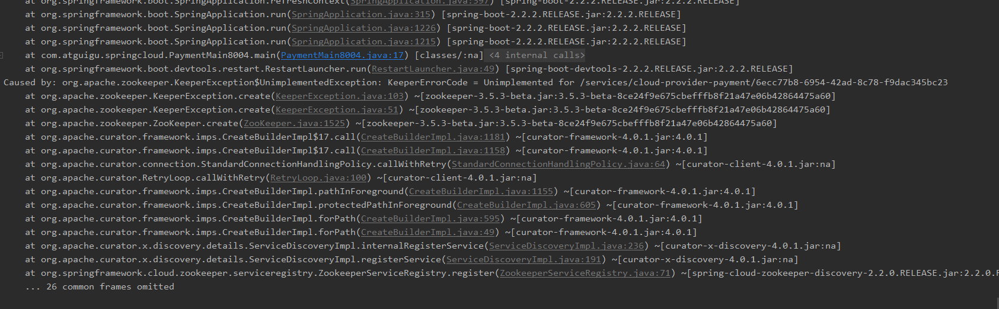

3. why
     解决zookeeper版本jar包冲突问题

   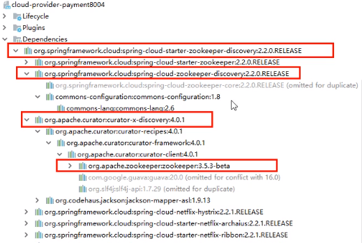

     排除zk冲突后的新POM

   ```xml
    <!--SpringBoot整合Zookeeper客户端-->
           <dependency>
               <groupId>org.springframework.cloud</groupId>
               <artifactId>spring-cloud-starter-zookeeper-discovery</artifactId>
               <exclusions>
                   <!--先排除自带的zookeeper3.5.3-->
                   <exclusion>
                       <groupId>org.apache.zookeeper</groupId>
                       <artifactId>zookeeper</artifactId>
                   </exclusion>
               </exclusions>
           </dependency>
           <!--添加zookeeper3.4.9版本-->
           <dependency>
               <groupId>org.apache.zookeeper</groupId>
               <artifactId>zookeeper</artifactId>
               <version>3.4.9</version>
           </dependency>
   
   ```

   

##### 验证测试

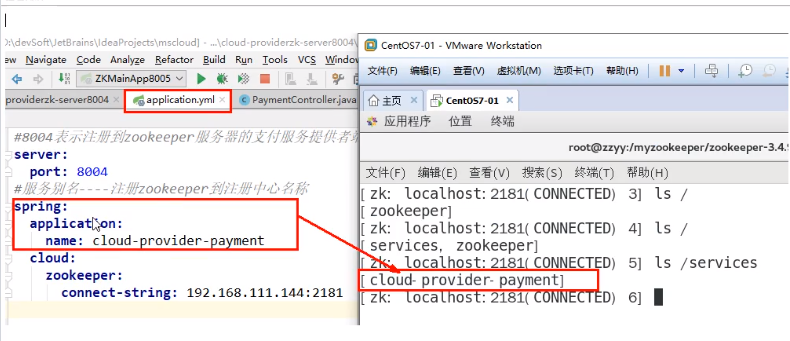

http://localhost:8004/payment/zk


##### 验证测试2

获得json串后用在线工具查看试试

```shell
[zk: localhost:2181(CONNECTED) 13] get /services/cloud-provider-payment/ba3eface-c269-41b9-b186-5f05b6eda6fc 
{"name":"cloud-provider-payment","id":"ba3eface-c269-41b9-b186-5f05b6eda6fc","address":"localhost","port":8004,"sslPort":null,"payload":{"@class":"org.springframework.cloud.zookeeper.discovery.ZookeeperInstance","id":"application-1","name":"cloud-provider-payment","metadata":{}},"registrationTimeUTC":1586352884172,"serviceType":"DYNAMIC","uriSpec":{"parts":[{"value":"scheme","variable":true},{"value":"://","variable":false},{"value":"address","variable":true},{"value":":","variable":false},{"value":"port","variable":true}]}}
cZxid = 0x7600000007
ctime = Wed Apr 08 21:34:52 CST 2020
mZxid = 0x7600000007
mtime = Wed Apr 08 21:34:52 CST 2020
pZxid = 0x7600000007
cversion = 0
dataVersion = 0
aclVersion = 0
ephemeralOwner = 0x17159cb25ed0001
dataLength = 530
numChildren = 0
[zk: localhost:2181(CONNECTED) 14] 
```


```json
{
	"name": "cloud-provider-payment",
	"id": "ba3eface-c269-41b9-b186-5f05b6eda6fc",
	"address": "localhost",
	"port": 8004,
	"sslPort": null,
	"payload": {
		"@class": "org.springframework.cloud.zookeeper.discovery.ZookeeperInstance",
		"id": "application-1",
		"name": "cloud-provider-payment",
		"metadata": {}
	},
	"registrationTimeUTC": 1586352884172,
	"serviceType": "DYNAMIC",
	"uriSpec": {
		"parts": [{
			"value": "scheme",
			"variable": true
		}, {
			"value": "://",
			"variable": false
		}, {
			"value": "address",
			"variable": true
		}, {
			"value": ":",
			"variable": false
		}, {
			"value": "port",
			"variable": true
		}]
	}
}
```


##### 思考

服务节点是临时节点还是持久节点？

是临时节点，查看可以发现在服务重启后，结点信息不断发生着变化：

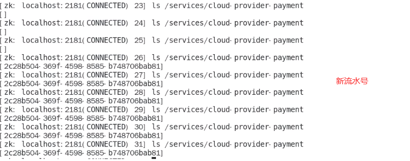


#### 3. 服务消费者
#####  新建cloud-consumerzk-order80

#####   POM

```xml
<?xml version="1.0" encoding="UTF-8"?>
<project xmlns="http://maven.apache.org/POM/4.0.0"
         xmlns:xsi="http://www.w3.org/2001/XMLSchema-instance"
         xsi:schemaLocation="http://maven.apache.org/POM/4.0.0 http://maven.apache.org/xsd/maven-4.0.0.xsd">
    <parent>
        <artifactId>cloude2020_lecture</artifactId>
        <groupId>com.atguigu.springcloud</groupId>
        <version>1.0-SNAPSHOT</version>
    </parent>
    <modelVersion>4.0.0</modelVersion>

    <artifactId>cloud-consumerzk-order80</artifactId>

    <dependencies>
        <dependency>
            <groupId>com.atguigu.springcloud</groupId>
            <artifactId>cloud-api-commons</artifactId>
            <version>${project.version}</version>
        </dependency>
        <dependency>
            <groupId>org.springframework.boot</groupId>
            <artifactId>spring-boot-starter-web</artifactId>
        </dependency>
        <!--SpringBoot整合Zookeeper客户端-->
        <dependency>
            <groupId>org.springframework.cloud</groupId>
            <artifactId>spring-cloud-starter-zookeeper-discovery</artifactId>
            <exclusions>
                <!--先排除自带的zookeeper3.5.3-->
                <exclusion>
                    <groupId>org.apache.zookeeper</groupId>
                    <artifactId>zookeeper</artifactId>
                </exclusion>
            </exclusions>
        </dependency>
        <!--添加zookeeper3.4.6版本-->
        <dependency>
            <groupId>org.apache.zookeeper</groupId>
            <artifactId>zookeeper</artifactId>
            <version>3.4.6</version>
        </dependency>
        <dependency>
            <groupId>org.springframework.boot</groupId>
            <artifactId>spring-boot-starter-actuator</artifactId>
        </dependency>
        <dependency>
            <groupId>org.springframework.boot</groupId>
            <artifactId>spring-boot-devtools</artifactId>
            <scope>runtime</scope>
            <optional>true</optional>
        </dependency>
        <dependency>
            <groupId>org.projectlombok</groupId>
            <artifactId>lombok</artifactId>
            <optional>true</optional>
        </dependency>
        <dependency>
            <groupId>org.springframework.boot</groupId>
            <artifactId>spring-boot-starter-test</artifactId>
            <scope>test</scope>
        </dependency>
    </dependencies>
</project>
```


#####   YML

```yaml
server:
  port: 80
spring:
  application:
    name: cloud-provider-order
  cloud:
    zookeeper:
      connect-string: 192.168.137.11:2181

```


#####   主启动

```java
package com.bigdata.springcloud;

import org.springframework.boot.SpringApplication;
import org.springframework.boot.autoconfigure.SpringBootApplication;
import org.springframework.cloud.client.discovery.EnableDiscoveryClient;

@SpringBootApplication
@EnableDiscoveryClient
public class OrderZKMain80 {
    public static void main(String[] args) {
        SpringApplication.run(OrderZKMain80.class, args);
    }
}

```


#####   业务类

​    配置bean

```java
package com.bigdata.springcloud.config;

import org.springframework.cloud.client.loadbalancer.LoadBalanced;
import org.springframework.context.annotation.Bean;
import org.springframework.context.annotation.Configuration;
import org.springframework.web.client.RestTemplate;


@Configuration
public class ApplicationContextConfig {

    @Bean
    @LoadBalanced//开启负载均衡
    public RestTemplate getRestTemplate() {
        return new RestTemplate();
    }
}

```

​    controller

```java
package com.bigdata.springcloud.controller;

import lombok.extern.slf4j.Slf4j;
import org.springframework.beans.factory.annotation.Autowired;
import org.springframework.web.bind.annotation.RequestMapping;
import org.springframework.web.bind.annotation.RestController;
import org.springframework.web.client.RestTemplate;

@RestController
@Slf4j
@RequestMapping("/consumer")
public class OrderZKController {

    private static final String INVOKE_URL = "http://cloud-provider-payment";

    @Autowired
    private RestTemplate restTemplate;

    @RequestMapping("/payment/zk")
    public String get() {
        String result = restTemplate.getForObject(INVOKE_URL + "/payment/zk", String.class);
        return result;
    }


}

```


#####   验证测试

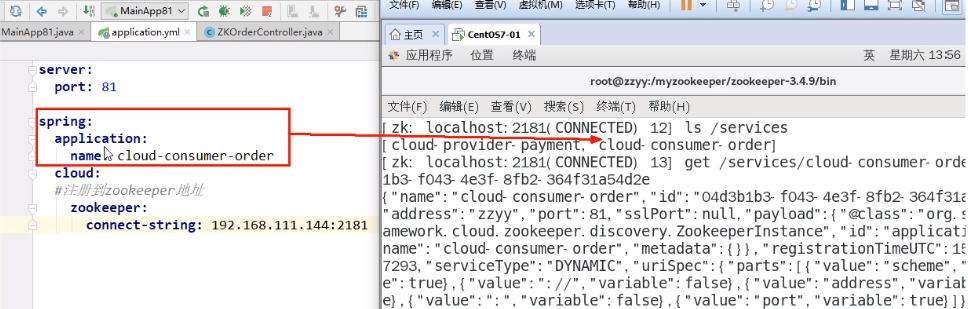

#####   访问测试地址

http://localhost/consumer/payment/zk


## Consul服务注册与发现

### 1）Consul简介

####   是什么

​    https://www.consul.io/intro/index.html

####   能干嘛

- 服务发现：提供HTTP/DNS两种发现方式

- 健康检测：支持多种方式,HTTP、TCP、Docker、shell脚本定制化

- KV存储：Key、Value的存储方式

- 多数据中心：  Consul支持多数据中心

- 可视化界面


####   下哪下

​    https://www.consul.io/downloads.html

####   怎么玩

​    https://www.springcloud.cc/spring-cloud-consul.html

### 2）安装并运行Consul

####   官网说明

​    https://learn.hashicorp.com/consul/getting-started/install.html

####   下载完成后只有一个consul.exe文件 硬盘路径下双击运行,查看版本信息


下面是在Linux上安装（废弃）

```shell
[root@Linux5 software]# wget https://releases.hashicorp.com/consul/1.7.2/consul_1.7.2_linux_amd64.zip
--2020-04-08 21:19:43--  https://releases.hashicorp.com/consul/1.7.2/consul_1.7.2_linux_amd64.zip
Resolving releases.hashicorp.com (releases.hashicorp.com)... 151.101.1.183, 151.101.65.183, 151.101.129.183, ...
Connecting to releases.hashicorp.com (releases.hashicorp.com)|151.101.1.183|:443... connected.
HTTP request sent, awaiting response... 200 OK
Length: 39650427 (38M) [application/zip]
Saving to: ‘consul_1.7.2_linux_amd64.zip’

100%[==========================================================================================>] 39,650,427   169KB/s   in 4m 32s 

2020-04-08 21:24:16 (142 KB/s) - ‘consul_1.7.2_linux_amd64.zip’ saved [39650427/39650427]

[root@Linux5 software]# ls
consul_1.7.2_linux_amd64.zip 
[root@Linux5 software]# unzip -l consul_1.7.2_linux_amd64.zip 
Archive:  consul_1.7.2_linux_amd64.zip
  Length      Date    Time    Name
---------  ---------- -----   ----
107811060  03-16-2020 16:06   consul
---------                     -------
107811060                     1 file

[root@Linux5 software]# unzip consul_1.7.2_linux_amd64.zip 
Archive:  consul_1.7.2_linux_amd64.zip
  inflating: consul                  
[root@Linux5 software]# ll
total 145956
-rwxr-xr-x. 1 root root 107811060 Mar 16 16:06 consul
-rw-r--r--. 1 root root  39650427 Mar 16 16:44 consul_1.7.2_linux_amd64.zip

[root@Linux5 software]# mv consul /opt/module/
[root@Linux5 software]# cd /opt/module/
[root@Linux5 module]# ll
total 105288
-rwxr-xr-x. 1 root    root    107811060 Mar 16 16:06 consul
[root@Linux5 module]# ./consul --version
Consul v1.7.2
Protocol 2 spoken by default, understands 2 to 3 (agent will automatically use protocol >2 when speaking to compatible agents)
[root@Linux5 module]# 

```


####   使用开发模式启动

1. ​    consul agent -dev
   下面是在windows上启动时：

   ```shell
   D:\Program_Files\consul>consul agent -dev
   ==> Starting Consul agent...
              Version: 'v1.7.2'
              Node ID: '3eb33ddb-f5da-aca7-4d22-304a088f9399'
            Node name: 'git'
           Datacenter: 'dc1' (Segment: '<all>')
               Server: true (Bootstrap: false)
          Client Addr: [127.0.0.1] (HTTP: 8500, HTTPS: -1, gRPC: 8502, DNS: 8600)
         Cluster Addr: 127.0.0.1 (LAN: 8301, WAN: 8302)
              Encrypt: Gossip: false, TLS-Outgoing: false, TLS-Incoming: false, Auto-Encrypt-TLS: false
   
   ==> Log data will now stream in as it occurs:
   
       2020-04-09T11:25:07.697+0800 [DEBUG] agent: Using random ID as node ID: id=3eb33ddb-f5da-aca7-4d22-304a088f9399
       2020-04-09T11:25:07.865+0800 [DEBUG] agent.tlsutil: Update: version=1
       2020-04-09T11:25:07.868+0800 [DEBUG] agent.tlsutil: OutgoingRPCWrapper: version=1
       2020-04-09T11:25:07.870+0800 [INFO]  agent.server.raft: initial configuration: index=1 servers="[{Suffrage:Voter ID:3eb33ddb-f5da-aca7-4d22-304a088f9399 Address:127.0.0.1:8300}]"
       2020-04-09T11:25:07.872+0800 [INFO]  agent.server.raft: entering follower state: follower="Node at 127.0.0.1:8300 [Follower]" leader=
       2020-04-09T11:25:07.873+0800 [INFO]  agent.server.serf.wan: serf: EventMemberJoin: git.dc1 127.0.0.1
       2020-04-09T11:25:07.874+0800 [INFO]  agent.server.serf.lan: serf: EventMemberJoin: git 127.0.0.1
       2020-04-09T11:25:07.875+0800 [INFO]  agent.server: Adding LAN server: server="git (Addr: tcp/127.0.0.1:8300) (DC: dc1)"
       2020-04-09T11:25:07.875+0800 [INFO]  agent.server: Handled event for server in area: event=member-join server=git.dc1 area=wan
       2020-04-09T11:25:07.875+0800 [INFO]  agent: Started DNS server: address=127.0.0.1:8600 network=udp
       2020-04-09T11:25:07.876+0800 [INFO]  agent: Started DNS server: address=127.0.0.1:8600 network=tcp
       2020-04-09T11:25:07.878+0800 [INFO]  agent: Started HTTP server: address=127.0.0.1:8500 network=tcp
       2020-04-09T11:25:07.880+0800 [INFO]  agent: Started gRPC server: address=127.0.0.1:8502 network=tcp
       2020-04-09T11:25:07.880+0800 [INFO]  agent: started state syncer
   ==> Consul agent running!
       2020-04-09T11:25:07.915+0800 [WARN]  agent.server.raft: heartbeat timeout reached, starting election: last-leader=
       2020-04-09T11:25:07.915+0800 [INFO]  agent.server.raft: entering candidate state: node="Node at 127.0.0.1:8300 [Candidate]" term=2
       2020-04-09T11:25:07.916+0800 [DEBUG] agent.server.raft: votes: needed=1
       2020-04-09T11:25:07.916+0800 [DEBUG] agent.server.raft: vote granted: from=3eb33ddb-f5da-aca7-4d22-304a088f9399 term=2 tally=1
       2020-04-09T11:25:07.917+0800 [INFO]  agent.server.raft: election won: tally=1
       2020-04-09T11:25:07.917+0800 [INFO]  agent.server.raft: entering leader state: leader="Node at 127.0.0.1:8300 [Leader]"
       2020-04-09T11:25:07.918+0800 [INFO]  agent.server: cluster leadership acquired
       2020-04-09T11:25:07.919+0800 [INFO]  agent.server: New leader elected: payload=git
   Processing server acl mode for: git - 0
       2020-04-09T11:25:07.920+0800 [INFO]  agent.server: Cannot upgrade to new ACLs: leaderMode=0 mode=0 found=true leader=127.0.0.1:8300
       2020-04-09T11:25:07.921+0800 [DEBUG] connect.ca.consul: consul CA provider configured: id=07:80:c8:de:f6:41:86:29:8f:9c:b8:17:d6:48:c2:d5:c5:5c:7f:0c:03:f7:cf:97:5a:a7:c1:68:aa:23:ae:81 is_primary=true
   ```


   下面是在Linux上启动时，绑定启动的IP地址（废弃）

   ```shell
   [root@Linux5 module]# ./consul agent -dev   -client 192.168.137.15 -ui        
   ==> Starting Consul agent...
              Version: 'v1.7.2'
              Node ID: '1f756f7d-d476-4fae-1f22-1cd56c714fe1'
            Node name: 'Linux5'
           Datacenter: 'dc1' (Segment: '<all>')
               Server: true (Bootstrap: false)
          Client Addr: [192.168.137.15] (HTTP: 8500, HTTPS: -1, gRPC: 8502, DNS: 8600)
         Cluster Addr: 127.0.0.1 (LAN: 8301, WAN: 8302)
              Encrypt: Gossip: false, TLS-Outgoing: false, TLS-Incoming: false, Auto-Encrypt-TLS: false
   
   ==> Log data will now stream in as it occurs:
   
   ```

   

2. ​    通过以下地址可以访问Consul的首页: http://192.168.137.15:8500（废弃）

   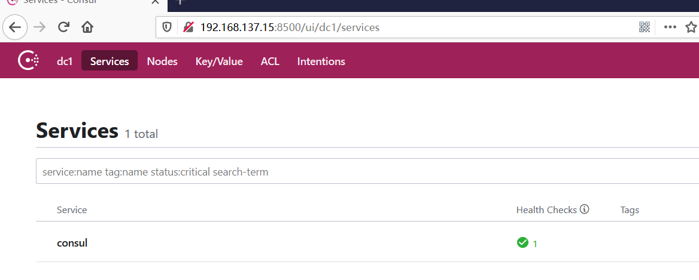

   http://localhost:8500/ui/dc1/services

   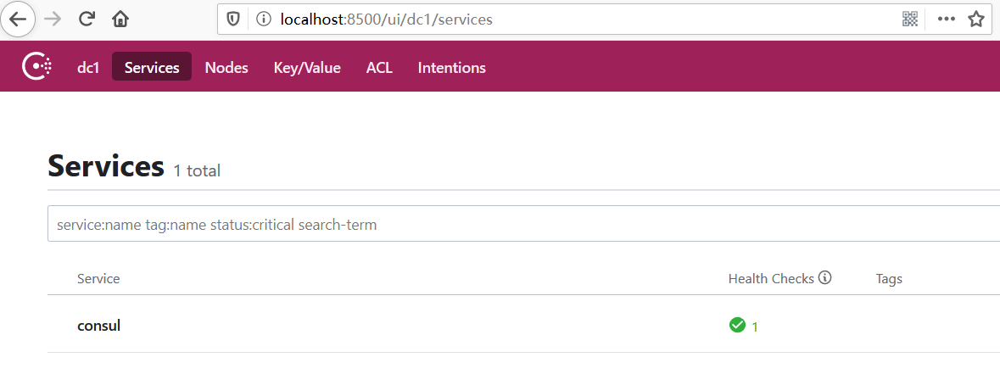

3. 结果页面

### 3）服务提供者

##### 新建Module支付服务provider8006

cloud-providerconsul-payment8006

#### POM

```xml
<?xml version="1.0" encoding="UTF-8"?>
<project xmlns="http://maven.apache.org/POM/4.0.0"
         xmlns:xsi="http://www.w3.org/2001/XMLSchema-instance"
         xsi:schemaLocation="http://maven.apache.org/POM/4.0.0 http://maven.apache.org/xsd/maven-4.0.0.xsd">
    <parent>
        <artifactId>cloude2020_lecture</artifactId>
        <groupId>com.atguigu.springcloud</groupId>
        <version>1.0-SNAPSHOT</version>
    </parent>
    <modelVersion>4.0.0</modelVersion>

    <artifactId>cloud-providerconsul-payment8006</artifactId>

    <dependencies>
        <!--SpringCloud consul-server-->
        <dependency>
            <groupId>org.springframework.cloud</groupId>
            <artifactId>spring-cloud-starter-consul-discovery</artifactId>
        </dependency>
        <dependency>
            <groupId>com.atguigu.springcloud</groupId>
            <artifactId>cloud-api-commons</artifactId>
            <version>${project.version}</version>
        </dependency>
        <dependency>
            <groupId>org.springframework.boot</groupId>
            <artifactId>spring-boot-starter-web</artifactId>
        </dependency>
        <dependency>
            <groupId>org.springframework.boot</groupId>
            <artifactId>spring-boot-starter-actuator</artifactId>
        </dependency>
        <dependency>
            <groupId>org.springframework.boot</groupId>
            <artifactId>spring-boot-devtools</artifactId>
            <scope>runtime</scope>
            <optional>true</optional>
        </dependency>
        <dependency>
            <groupId>org.projectlombok</groupId>
            <artifactId>lombok</artifactId>
            <optional>true</optional>
        </dependency>
        <dependency>
            <groupId>org.springframework.boot</groupId>
            <artifactId>spring-boot-starter-test</artifactId>
            <scope>test</scope>
        </dependency>
    </dependencies>
</project>
```


#### YML

linux上的配置（废弃）

```yaml
server:
  port: 8006
spring:
  application:
    name: consul-provider-payment
  cloud:
    consul:
      host: 192.168.137.15
      port: 8500
      discovery:
        prefer-ip-address: true
        tags: version=1.0
        instance-id: ${spring.application.name}:${server.port}
        healthCheckInterval: 15s
        health-check-url: http://${spring.cloud.client.ip-address}:${server.port}/actuator/health
    inetutils:
      preferred-networks:
        - 192.168.137.1

```


window上的配置：

```yaml
server:
  port: 8006
spring:
  application:
    name: consul-provider-payment
  cloud:
    consul:
      host: localhost
      port: 8500
      discovery:
        service-name: ${spring.application.name}

```


#### 主启动类

```java
package com.atguigu.springcloud;

import org.springframework.boot.SpringApplication;
import org.springframework.boot.autoconfigure.SpringBootApplication;
import org.springframework.cloud.client.discovery.EnableDiscoveryClient;

@SpringBootApplication
@EnableDiscoveryClient
public class PaymentMain8006 {
    public static void main(String[] args) {
        SpringApplication.run(PaymentMain8006.class, args);
    }
}

```


#### 业务类Controller

```java
package com.atguigu.springcloud.controller;

import org.springframework.beans.factory.annotation.Value;
import org.springframework.web.bind.annotation.RequestMapping;
import org.springframework.web.bind.annotation.RestController;

import java.util.UUID;

@RestController
@RequestMapping("/payment")
public class PaymentController {

    @Value("${server.port}")
    private String SERVER_PORT;

    @RequestMapping("/consul")
    public String paymentZK() {
        return "com.com.springcloud with consul :" + SERVER_PORT + "\t" + UUID.randomUUID().toString();
    }
}

```


#### 验证测试

 http://localhost:8006/payment/consul


http://192.168.137.15:8500/ui/dc1/services(废弃)

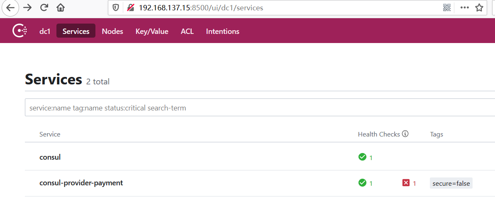

http://localhost:8500/ui/dc1/services

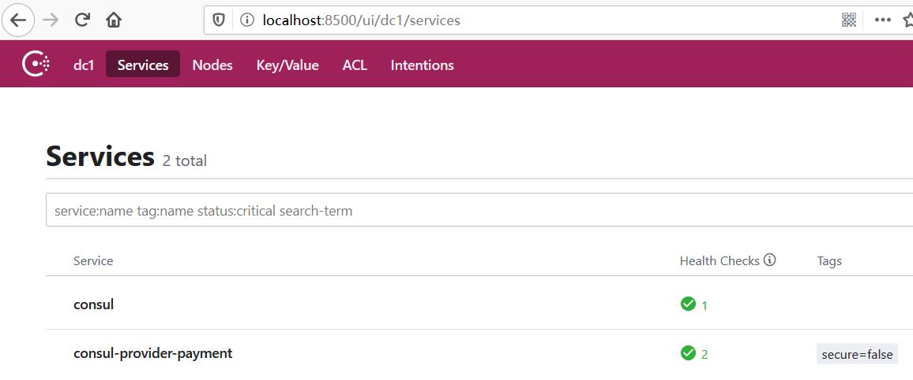


### 4）服务消费者

#### 新建Module消费服务order80

​    cloud-consumerconsul-order80

#### POM

```xml
<?xml version="1.0" encoding="UTF-8"?>
<project xmlns="http://maven.apache.org/POM/4.0.0"
         xmlns:xsi="http://www.w3.org/2001/XMLSchema-instance"
         xsi:schemaLocation="http://maven.apache.org/POM/4.0.0 http://maven.apache.org/xsd/maven-4.0.0.xsd">
    <parent>
        <artifactId>cloude2020_lecture</artifactId>
        <groupId>com.atguigu.springcloud</groupId>
        <version>1.0-SNAPSHOT</version>
    </parent>
    <modelVersion>4.0.0</modelVersion>

    <artifactId>cloud-consumerconsul-order80</artifactId>
    <dependencies>
        <!--SpringCloud consul-server-->
        <dependency>
            <groupId>org.springframework.cloud</groupId>
            <artifactId>spring-cloud-starter-consul-discovery</artifactId>
        </dependency>
        <dependency>
            <groupId>org.xzq.springcloud</groupId>
            <artifactId>cloud-api-commons</artifactId>
            <version>${project.version}</version>
        </dependency>
        <dependency>
            <groupId>org.springframework.boot</groupId>
            <artifactId>spring-boot-starter-web</artifactId>
        </dependency>
        <dependency>
            <groupId>org.springframework.boot</groupId>
            <artifactId>spring-boot-starter-actuator</artifactId>
        </dependency>
        <dependency>
            <groupId>org.springframework.boot</groupId>
            <artifactId>spring-boot-devtools</artifactId>
            <scope>runtime</scope>
            <optional>true</optional>
        </dependency>
        <dependency>
            <groupId>org.projectlombok</groupId>
            <artifactId>lombok</artifactId>
            <optional>true</optional>
        </dependency>
        <dependency>
            <groupId>org.springframework.boot</groupId>
            <artifactId>spring-boot-starter-test</artifactId>
            <scope>test</scope>
        </dependency>
    </dependencies>

</project>
```


#### YML

Linux配置（废弃）

```java
server:
  port: 80
spring:
  application:
    name: consul-consumer-payment
  cloud:
    consul:
      host: 192.168.137.15
      port: 8500
      discovery:
        service-name: ${spring.application.name}

```

windows配置

```yaml
server:
  port: 80
spring:
  application:
    name: consul-consumer-payment
  cloud:
    consul:
      host: localhost
      port: 8500
      discovery:
        service-name: ${spring.application.name}

```


#### 主启动类

```java
package com.atguigu.springcloud;

import org.springframework.boot.SpringApplication;
import org.springframework.boot.autoconfigure.SpringBootApplication;
import org.springframework.cloud.client.discovery.EnableDiscoveryClient;


@SpringBootApplication
@EnableDiscoveryClient
public class OrderConsulMain80 {
    public static void main(String[] args) {
        SpringApplication.run(OrderConsulMain80.class, args);
    }
}

```


#### 配置bean

```java
package com.atguigu.springcloud.config;

import org.springframework.cloud.client.loadbalancer.LoadBalanced;
import org.springframework.context.annotation.Bean;
import org.springframework.context.annotation.Configuration;
import org.springframework.web.client.RestTemplate;


@Configuration
public class ApplicationContextConfig {

    @Bean
    @LoadBalanced//开启负载均衡
    public RestTemplate getRestTemplate() {
        return new RestTemplate();
    }
}

```


#### Controller

```java
package com.atguigu.springcloud.controller;

import org.springframework.beans.factory.annotation.Autowired;
import org.springframework.web.bind.annotation.RequestMapping;
import org.springframework.web.bind.annotation.RestController;
import org.springframework.web.client.RestTemplate;


@RestController
@RequestMapping("/consumer")
public class OrderConsulController {

    private static final String INVOKE_URL = "http://consul-provider-payment";

    @Autowired
    private RestTemplate restTemplate;

    @RequestMapping("/payment/consul")
    public String get() {
        String result = restTemplate.getForObject(INVOKE_URL + "/payment/consul", String.class);
        return result;
    }

}
```


#### 验证测试

#### 访问测试地址

 http://localhost/consumer/payment/consul


http://localhost:8500/ui/dc1/services


### 5）三个注册中心异同点

#### CAP

分区容错性要保证,所以要么是CP,要么是AP

- C: Consistency(强一致性)
- A: Availability(可用性)
- P: Parttition tolerance(分区容错性)
- CAP理论关注粒度是否是数据,而不是整体系统设计的策略

#### 经典CAP图

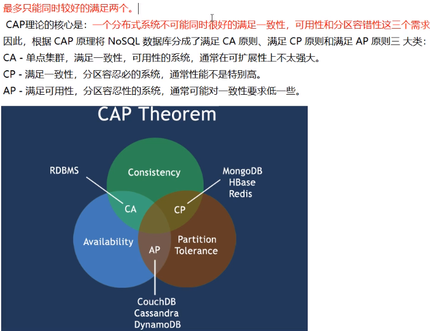

​    AP(eureka)

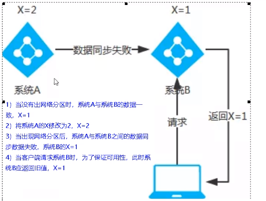

​    CP(Zookeeper/Consul)

   CP架构 当网络分区出现后,为了保证一致性,就必须拒绝请求,否则无法保证一致性
结论:违背了可用性A的要求,只满足一致性和分区容错,即CP

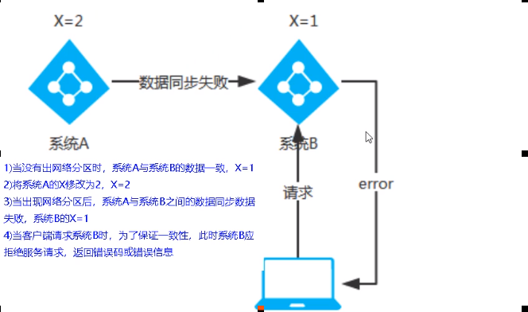


## Ribbon负载均衡调用

### 1）概述

#### 是什么

#### 官网资料

  https://github.com/Netflix/ribbon/wiki/Getting-Started
  Ribbon目前也进入维护模式

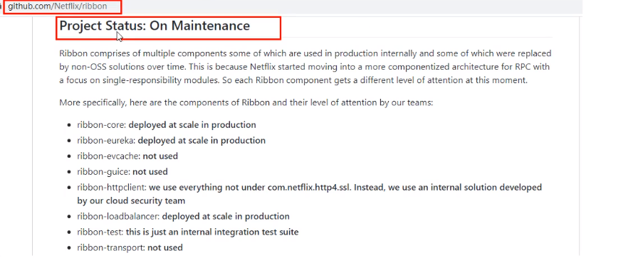

​    未来替换方案

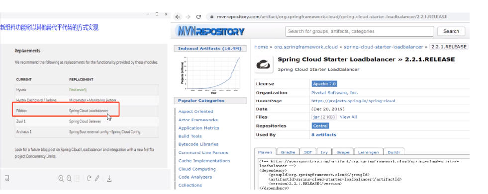

#### 能干嘛

LB(负载均衡)
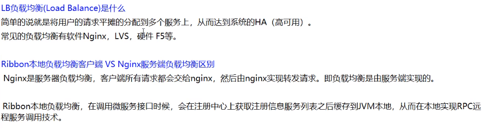

- 集中式LB
  
- 进程内LB
  

  前面我们讲解过了80通过轮询负载访问8001/8002
  一句话： 负载均衡+RestTemplate调用

### 2）Ribbon负载均衡演示

架构说明

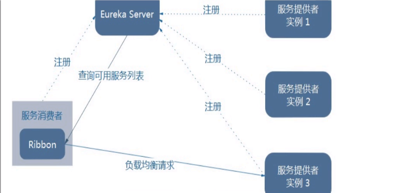

  总结: Ribbon其实就是一个软负载均衡的客户端组件,  他可以和其他所需请求的客户端结合使用,和eureka结合只是其中一个实例.
POM

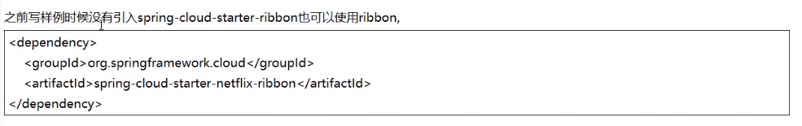

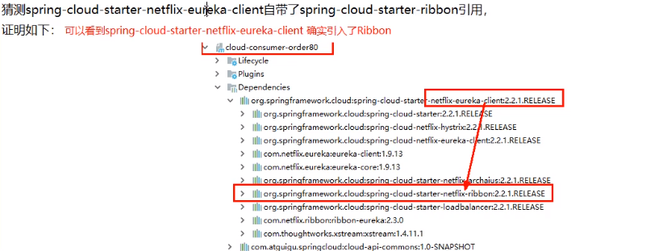

RestTemplate的使用

- 官网
  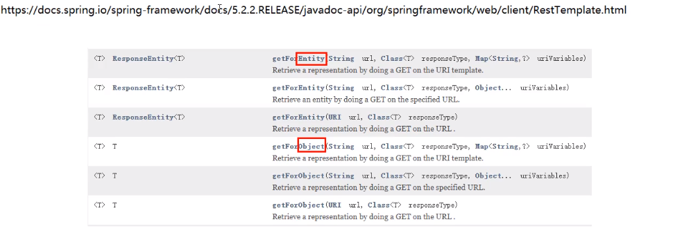
- getForObject方法/getForEntity方法
  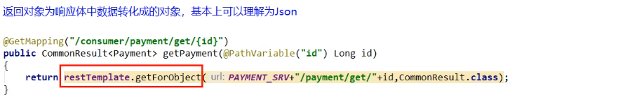
  
  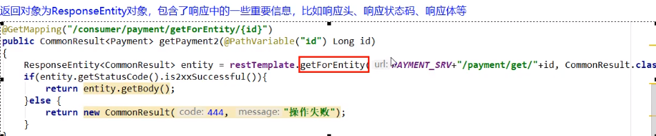
- postForObject/postEntity
- GET请求方法
- POST请求方法


### 3）Ribbon核心组件IRule

#### IRule:根据特定算法从服务列表中选取一个要访问的服务

-  com.netflix.loadbalancer.RoundRobinRule：轮询

- com.netflix.loadbalancer.RandomRule： 随机

- com.netflix.loadbalancer.RetryRule：先按照RoundRobinRule的策略获取服务,如果获取服务失败则在指定时间内进行重试,获取可用的服务

- WeightedResponseTimeRule：对RoundRobinRule的扩展,响应速度越快的实例选择权重越多大,越容易被选择

- BestAvailableRule：会先过滤掉由于多次访问故障而处于断路器跳闸状态的服务,然后选择一个并发量最小的服务

- AvailabilityFilteringRule：先过滤掉故障实例,再选择并发较小的实例

- ZoneAvoidanceRule：默认规则,复合判断server所在区域的性能和server的可用性选择服务器
      

#### 如何替换

  修改cloud-consumer-order80
 注意配置细节


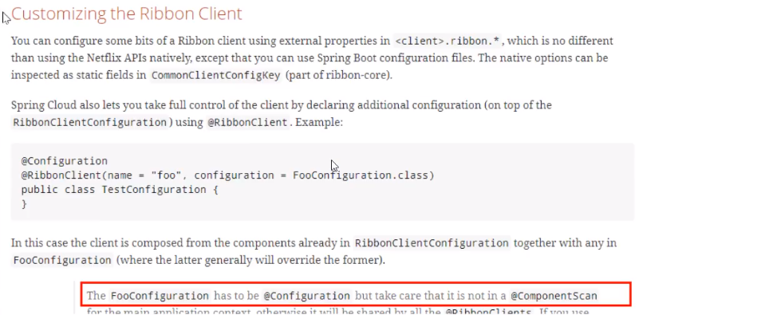


新建package
    com.atguigu.myrule
  上面包下新建MySelfRule规则类

```java
package com.atguigu.myrule;

import com.netflix.loadbalancer.IRule;
import com.netflix.loadbalancer.RoundRobinRule;
import org.springframework.context.annotation.Bean;
import org.springframework.context.annotation.Configuration;

/**
 * 自定义负载均衡路由规则类
 *
 * @author zzyy
 * @date 2020/3/6 15:15
 **/
@Configuration
public class MySelfRule {

    @Bean
    public IRule myRule() {
        // 定义为随机
        return new RoundRobinRule();
    }
}
 
 

```

  主启动类添加@RibbonClient

```java
package com.atguigu.springcloud;

import com.atguigu.myrule.MySelfRule;
import org.springframework.boot.SpringApplication;
import org.springframework.boot.autoconfigure.SpringBootApplication;
import org.springframework.cloud.netflix.eureka.EnableEurekaClient;
import org.springframework.cloud.netflix.ribbon.RibbonClient;

/**
 * @author zzyy
 * @date 2020/02/18 17:20
 **/
@SpringBootApplication
@EnableEurekaClient
@RibbonClient(name = "CLOUD-PAYMENT-SERVICE", configuration = MySelfRule.class)
public class OrderMain80 {
    public static void main(String[] args) {
        SpringApplication.run(OrderMain80.class, args);
    }
}
 
 

```

  测试
    http://localhost/consumer/payment/get/31

### 4）Ribbon负载均衡算法

#### 原理

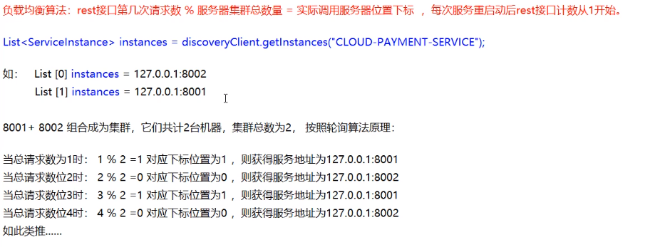

#### 源码

```java
public Server choose(ILoadBalancer lb, Object key) {
        if (lb == null) {
            log.warn("no load balancer");
            return null;
        }

        Server server = null;
        int count = 0;
        while (server == null && count++ < 10) {
            List<Server> reachableServers = lb.getReachableServers();
            //获取服务清单
            List<Server> allServers = lb.getAllServers();
            int upCount = reachableServers.size();
            int serverCount = allServers.size();
             //如果服务清单没有任何的服务，则返回null
            if ((upCount == 0) || (serverCount == 0)) {
                log.warn("No up servers available from load balancer: " + lb);
                return null;
            }
            //选取服务
            int nextServerIndex = incrementAndGetModulo(serverCount);
            //根据选取的服务，找到对应的Server
            server = allServers.get(nextServerIndex);
            //如果Server不可用，则跳出循环再次获取
            if (server == null) {
                /* Transient. */
                Thread.yield();
                continue;
            }

            if (server.isAlive() && (server.isReadyToServe())) {
                return (server);
            }

            // Next.
            server = null;
        }

        if (count >= 10) {
            log.warn("No available alive servers after 10 tries from load balancer: "
                    + lb);
        }
        return server;
}
```

在“incrementAndGetModulo”中会根据服务清单中的服务数量，先获取“nextServerCyclicCounter”值，然后将current+1后和服务总数modulo取模，然后将它设置到“nextServerCyclicCounter”中。每次请求都是这样，能够看到nextServerCyclicCounter中的值，总是在“0 ~ modulo-1”之间变动。前面在原理描述部分，使用rest第几次请求模上集群中服务总数量的表述并不准确，实际上和第几次请求并没有关系，例如：现在服务总数量为5，则第1次请求中“nextServerCyclicCounter”保存的值为1，第2次为2，第3次为3，第4次请求为4，第5次请求为0，第6次请求为1，第7次请求为2，似乎是请求数模上modulo的结果，然而并非如此。不过这样简单理解也是可以行得通的。

```java
 private int incrementAndGetModulo(int modulo) {
        for (;;) {
            int current = nextServerCyclicCounter.get();
            int next = (current + 1) % modulo;
            if (nextServerCyclicCounter.compareAndSet(current, next))
                return next;
        }
 }
```


#### 手写

  自己试着写一个本地负载均衡器试试
    7001/7002集群启动
    8001/8002集群启动
      在8001和8002的controller中，添加如下语句

```java
@GetMapping(value = "/payment/lb")
public String getPaymentLB() {
    return serverPort;
}

```

​    80订单微服务改造
​      1.ApplicationContextBean去掉注解@LoadBalanced

```java
    @Bean
//    @LoadBalanced//开启负载均衡
    public RestTemplate getRestTemplate() {
        return new RestTemplate();
    }
```

​      2.LoadBalancer接口

```java
public interface LoadBalancer {
    ServiceInstance instances(List<ServiceInstance> serviceInstances);
}
```

​      3.MyLB

```java
@Component
public class MyLB implements LoadBalancer {

    private AtomicInteger atomicInteger = new AtomicInteger(0);

    private final int getAndIncrement() {
        int current;
        int next;

        do {
            current = this.atomicInteger.get();
            next = current >= Integer.MAX_VALUE ? 0 : current + 1;
        } while (!atomicInteger.compareAndSet(current, next));
        System.out.println("第几次访问,次数next:" + next);
        return next;
    }

    @Override
    public ServiceInstance instances(List<ServiceInstance> serviceInstances) {
        int index = getAndIncrement() % serviceInstances.size();
        return serviceInstances.get(index);
    }
}
```

​      4.OrderController

```java
    @GetMapping("/consumer/payment/lb")
    public String getPaymentLB() {
        List<ServiceInstance> instances = discoveryClient.getInstances("CLOUD-PAYMENT-SERVICE");
        if (instances == null || instances.size() <= 0) {
            return null;
        }

        ServiceInstance serviceInstance = loadBalancer.instances(instances);
        URI uri = serviceInstance.getUri();

        return restTemplate.getForObject(uri + "/payment/lb", String.class);
    }
```

​      5.测试

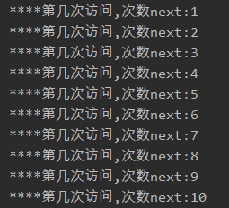
        http://localhost/consumer/payment/lb


## OpenFeign服务接口调用

### 1）概述

OpenFeign是什么

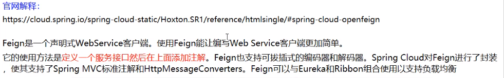

 https://cloud.spring.io/spring-cloud-static/Hoxton.SR1/reference/htmlsingle/#spring-cloud-openfeign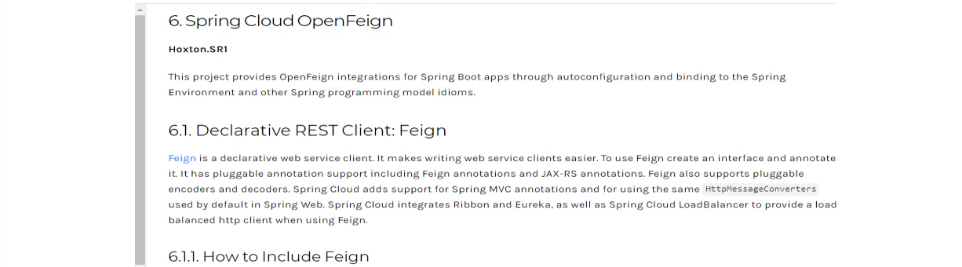

 Feign是一个声明式的Web服务客户端,让编写Web服务客户端变得非常容易,只需  创建一个接口并在接口上添加注解即可
  GitHub
    https://github.com/spring-cloud/spring-cloud-openfeign
能干嘛 

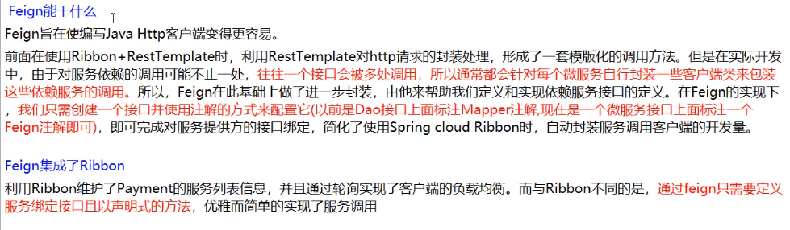Feign和OpenFeign两者区别

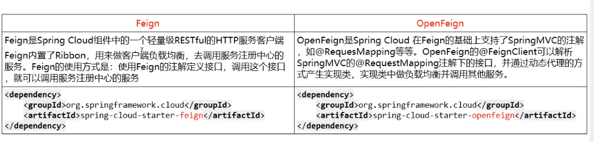


### 2）OpenFeign使用步骤

#### 接口+注解

  微服务调用接口+@FeignClient

#### 新建cloud-consumer-feign-order80

  Feign在消费端使用


#### POM

```xml
<?xml version="1.0" encoding="UTF-8"?>
<project xmlns="http://maven.apache.org/POM/4.0.0"
         xmlns:xsi="http://www.w3.org/2001/XMLSchema-instance"
         xsi:schemaLocation="http://maven.apache.org/POM/4.0.0 http://maven.apache.org/xsd/maven-4.0.0.xsd">
    <parent>
        <artifactId>cloud2020</artifactId>
        <groupId>com.atguigu.springcloud</groupId>
        <version>1.0-SNAPSHOT</version>
    </parent>
    <modelVersion>4.0.0</modelVersion>

    <artifactId>cloud-consumer-feign-order80</artifactId>
    <description>订单消费者之feign</description>

    <dependencies>
        <!--openfeign-->
        <dependency>
            <groupId>org.springframework.cloud</groupId>
            <artifactId>spring-cloud-starter-openfeign</artifactId>
        </dependency>
        <!--eureka client-->
        <dependency>
            <groupId>org.springframework.cloud</groupId>
            <artifactId>spring-cloud-starter-netflix-eureka-server</artifactId>
        </dependency>
        <dependency>
            <groupId>com.atguigu.springcloud</groupId>
            <artifactId>cloud-api-common</artifactId>
            <version>${project.version}</version>
        </dependency>
        <dependency>
            <groupId>org.springframework.boot</groupId>
            <artifactId>spring-boot-starter-web</artifactId>
        </dependency>
        <!--监控-->
        <dependency>
            <groupId>org.springframework.boot</groupId>
            <artifactId>spring-boot-starter-actuator</artifactId>
        </dependency>
        <!--热部署-->
        <dependency>
            <groupId>org.springframework.boot</groupId>
            <artifactId>spring-boot-devtools</artifactId>
            <scope>runtime</scope>
            <optional>true</optional>
        </dependency>
        <dependency>
            <groupId>org.projectlombok</groupId>
            <artifactId>lombok</artifactId>
            <optional>true</optional>
        </dependency>
        <dependency>
            <groupId>org.springframework.boot</groupId>
            <artifactId>spring-boot-starter-test</artifactId>
            <scope>test</scope>
        </dependency>
    </dependencies>

</project>
 

```


#### YML

```yaml
server:
  port: 80
eureka:
  client:
    register-with-eureka: false
    fetch-registry: true
    service-url:
      defaultZone: http://eureka7001.com:7001/eureka,http://eureka7002.com:7002/eureka
 

```


#### 主启动

  @EnableFeignClients

```java
package com.atguigu.springcloud;

import org.springframework.boot.SpringApplication;
import org.springframework.boot.autoconfigure.SpringBootApplication;
import org.springframework.cloud.netflix.eureka.EnableEurekaClient;
import org.springframework.cloud.openfeign.EnableFeignClients;

@SpringBootApplication
@EnableEurekaClient
@EnableFeignClients
public class OrderFeignMain80 {
    public static void main(String[] args) {
        SpringApplication.run(OrderFeignMain80.class, args);
    }
}

```


#### 业务类

  业务逻辑接口+@FeignClient配置调用provider服务
  新建PaymentFeignService接口并新增注解@FeignClient
    @FeignClient
  控制层Controller

#### 测试

  先启动2个eureka集群7001/7002
  再启动2个微服务8001/8002
  启动OpenFeign
  http://localhost/consumer/payment/get/31
  Feign自带负载均衡配置项
小总结

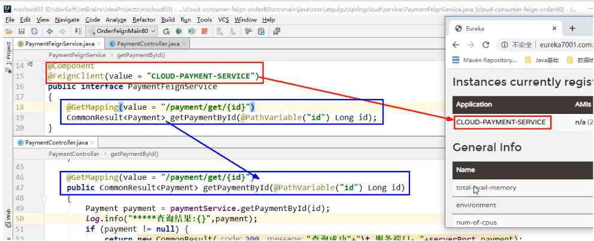

### 3）OpenFeign超时控制

#### 超时设置,故意设置超时演示出错情况

  服务提供方8001故意写暂停程序
  服务消费方80添加超时方法PaymentFeignService
  服务消费方80添加超时方法OrderFeignController
  测试
    http://localhost/consumer/payment/feign/timeout
    错误页面

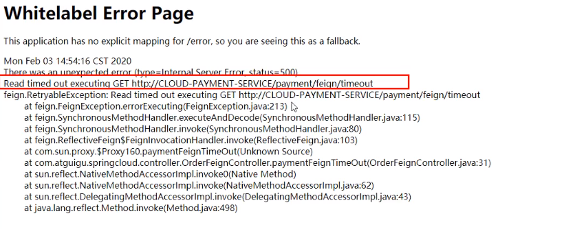

#### OpenFeign默认等待1秒钟,超过后报错

#### 是什么


  OpenFeign默认支持Ribbon

#### YML文件里需要开启OpenFeign客户端超时控制

```yaml
server:
  port: 80
eureka:
  client:
    register-with-eureka: false
    fetch-registry: true
    service-url:
      defaultZone: http://eureka7001.com:7001/eureka,http://eureka7002.com:7002/eureka
# 设置feign客户端超时时间(OpenFeign默认支持ribbon)
ribbon:
  # 指的是建立连接所用的时间,适用于网络状态正常的情况下,两端连接所用的时间
  ReadTimeout: 5000
  # 指的是建立连接后从服务器读取到可用资源所用的时间
  ConnectTimeout: 5000
 

```


### 4）OpenFeign日志打印功能

#### 日志打印功能

#### 是什么


#### 日志级别


#### 配置日志bean

```java
package com.atguigu.springcloud.config;

import feign.Logger;
import org.springframework.context.annotation.Bean;
import org.springframework.context.annotation.Configuration;

@Configuration
public class FeignConfig {

    /**
     * feignClient配置日志级别
     *
     * @return
     */
    @Bean
    public Logger.Level feignLoggerLevel() {
        // 请求和响应的头信息,请求和响应的正文及元数据
        return Logger.Level.FULL;
    }
}
 
 

```


#### YML文件里需要开启日志的Feign客户端

```yaml
server:
  port: 80
eureka:
  client:
    register-with-eureka: false
    fetch-registry: true
    service-url:
      defaultZone: http://eureka7001.com:7001/eureka,http://eureka7002.com:7002/eureka
# 设置feign客户端超时时间(OpenFeign默认支持ribbon)
ribbon:
  # 指的是建立连接所用的时间,适用于网络状态正常的情况下,两端连接所用的时间
  ReadTimeout: 5000
  # 指的是建立连接后从服务器读取到可用资源所用的时间
  ConnectTimeout: 5000
logging:
  level:
    # feign日志以什么级别监控哪个接口
    com.atguigu.springcloud.service.PaymentFeignService: debug
 

```


#### 后台日志查看

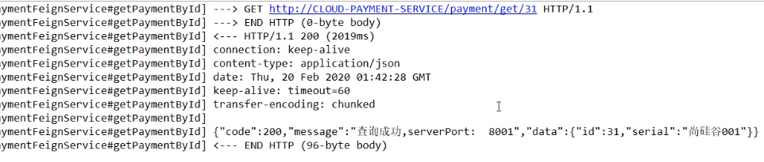

## Hystrix熔断器

### 1）概述

#### 分布式系统面临的问题

分布式系统面临的问题
复杂分布式体系结构中的应用程序   有数10个依赖关系,每个依赖关系在某些时候将不可避免地失败
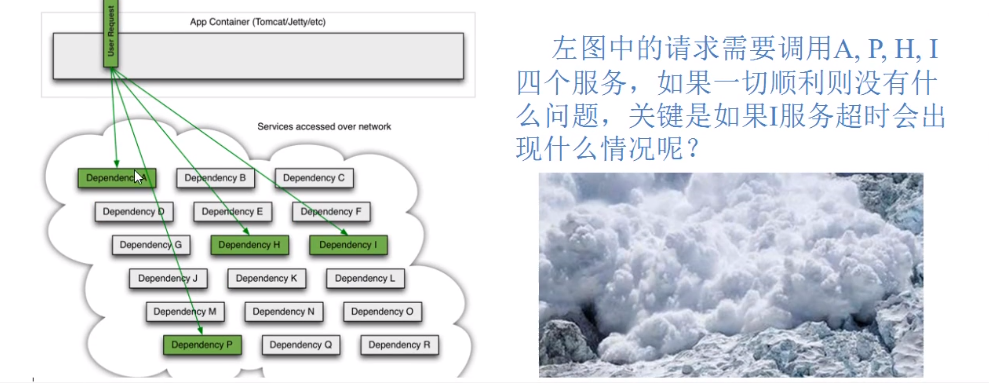


#### 是什么


#### 能干嘛

  服务降级
  服务熔断
  接近实时的监控

#### 官网资料

  https://github.com/Netflix/hystrix/wiki

#### Hystrix官宣,停更进维

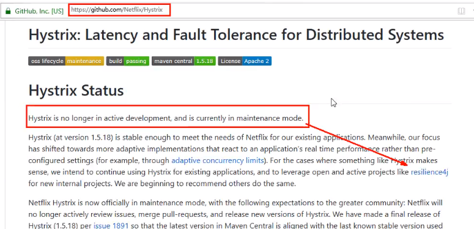

  https://github.com/Netflix/hystrix
    被动修复bugs
    不再接受合并请求
    不再发布新版本

### 2）HyStrix重要概念

#### 服务降级

  服务器忙,请稍后再试,不让客户端等待并立刻返回一个友好提示,fallback
  哪些情况会发出降级
    程序运行异常
    超时
    服务熔断触发服务降级
    线程池/信号量也会导致服务降级

#### 服务熔断

  类比保险丝达到最大服务访问后,直接拒绝访问,拉闸限电,然后调用服务降级的方法并返回友好提示
  就是保险丝
    服务的降级->进而熔断->恢复调用链路

#### 服务限流

  秒杀高并发等操作,严禁一窝蜂的过来拥挤,大家排队,一秒钟N个,有序进行


### 3）hystrix案例

#### 构建

  新建cloud-provider-hystrix-payment8001
  POM

```xml
<?xml version="1.0" encoding="UTF-8"?>
<project xmlns="http://maven.apache.org/POM/4.0.0"
         xmlns:xsi="http://www.w3.org/2001/XMLSchema-instance"
         xsi:schemaLocation="http://maven.apache.org/POM/4.0.0 http://maven.apache.org/xsd/maven-4.0.0.xsd">
    <parent>
        <artifactId>cloud2020</artifactId>
        <groupId>com.atguigu.springcloud</groupId>
        <version>1.0-SNAPSHOT</version>
    </parent>
    <modelVersion>4.0.0</modelVersion>

    <artifactId>cloud-provider-hystrix-payment8001</artifactId>

    <dependencies>
        <!--hystrix-->
        <dependency>
            <groupId>org.springframework.cloud</groupId>
            <artifactId>spring-cloud-starter-netflix-hystrix</artifactId>
        </dependency>
        <!--eureka client-->
        <dependency>
            <groupId>org.springframework.cloud</groupId>
            <artifactId>spring-cloud-starter-netflix-eureka-server</artifactId>
        </dependency>
        <dependency>
            <groupId>com.atguigu.springcloud</groupId>
            <artifactId>cloud-api-common</artifactId>
            <version>${project.version}</version>
        </dependency>
        <dependency>
            <groupId>org.springframework.boot</groupId>
            <artifactId>spring-boot-starter-web</artifactId>
        </dependency>
        <!--监控-->
        <dependency>
            <groupId>org.springframework.boot</groupId>
            <artifactId>spring-boot-starter-actuator</artifactId>
        </dependency>
        <!--热部署-->
        <dependency>
            <groupId>org.springframework.boot</groupId>
            <artifactId>spring-boot-devtools</artifactId>
            <scope>runtime</scope>
            <optional>true</optional>
        </dependency>
        <dependency>
            <groupId>org.projectlombok</groupId>
            <artifactId>lombok</artifactId>
            <optional>true</optional>
        </dependency>
        <dependency>
            <groupId>org.springframework.boot</groupId>
            <artifactId>spring-boot-starter-test</artifactId>
            <scope>test</scope>
        </dependency>
    </dependencies>

</project>
 

```

  YML

```yaml
server:
  port: 8001
spring:
  application:
    name: cloud-provider-hystrix-payment
eureka:
  client:
    register-with-eureka: true
    fetch-registry: true
    service-url:
      defaultZone: http://eureka7001.com:7001/eureka,http://eureka7002.com:7002/eureka
 
 

```

  主启动

```java
package com.atguigu.springcloud;

import org.springframework.boot.SpringApplication;
import org.springframework.boot.autoconfigure.SpringBootApplication;
import org.springframework.cloud.netflix.eureka.EnableEurekaClient;

@SpringBootApplication
@EnableEurekaClient
public class PaymentHystrixMain8001 {
    public static void main(String[] args) {
        SpringApplication.run(PaymentHystrixMain8001.class, args);
    }
}
 
```

  业务类
    service

```java
package com.atguigu.springcloud.service;

import org.springframework.stereotype.Service;

import java.util.concurrent.TimeUnit;


@Service
public class PaymentService {
    /**
     * 正常访问
     *
     * @param id
     * @return
     */
    public String paymentInfo_OK(Integer id) {
        return "线程池:" + Thread.currentThread().getName() + " paymentInfo_OK,id:" + id + "\t" + "O(∩_∩)O哈哈~";
    }

    /**
     * 超时访问
     *
     * @param id
     * @return
     */
    public String paymentInfo_TimeOut(Integer id) {
        int timeNumber = 3;
        try {
            // 暂停3秒钟
            TimeUnit.SECONDS.sleep(timeNumber);
        } catch (InterruptedException e) {
            e.printStackTrace();
        }
        return "线程池:" + Thread.currentThread().getName() + " paymentInfo_TimeOut,id:" + id + "\t" +
                "O(∩_∩)O哈哈~  耗时(秒)" + timeNumber;
    }
}
 
 

```

​    controller

```java
package com.atguigu.springcloud.controller;

import com.atguigu.springcloud.service.PaymentService;
import lombok.extern.slf4j.Slf4j;
import org.springframework.beans.factory.annotation.Value;
import org.springframework.web.bind.annotation.GetMapping;
import org.springframework.web.bind.annotation.PathVariable;
import org.springframework.web.bind.annotation.RestController;

import javax.annotation.Resource;
import java.util.concurrent.TimeUnit;


@RestController
@Slf4j
public class PaymentController {
    @Resource
    private PaymentService paymentService;

    @Value("${server.port}")
    private String servicePort;

    /**
     * 正常访问
     *
     * @param id
     * @return
     */
    @GetMapping("/payment/hystrix/ok/{id}")
    public String paymentInfo_OK(@PathVariable("id") Integer id) {
        String result = paymentService.paymentInfo_OK(id);
        log.info("*****result:" + result);
        return result;
    }

    /**
     * 超时访问
     *
     * @param id
     * @return
     */
    @GetMapping("/payment/hystrix/timeout/{id}")
    public String paymentInfo_TimeOut(@PathVariable("id") Integer id) {
        String result = paymentService.paymentInfo_TimeOut(id);
        log.info("*****result:" + result);
        return result;

    }
}
 
 

```

  正常测试
    启动eureka7001
    启动eureka-provider-hystrix-payment8001
    访问
      success的方法
        http://localhost:8001/payment/hystrix/ok/31
      每次调用耗费5秒钟
        http://localhost:8001/payment/hystrix/timeout/31
    上述module均OK
      以上述为根基平台,从正确->错误->降级熔断->恢复

#### 高并发测试

#####   上述在非高并发情形下,还能勉强满足 but...

#####   Jmeter压测测试

```
下载地址
https://jmeter.apache.org/download_jmeter.cgi
```

​    开启Jmeter,来20000个并发压死8001,20000个请求都去访问paymentInfo_TimeOut服务


填写线程数和循环次数

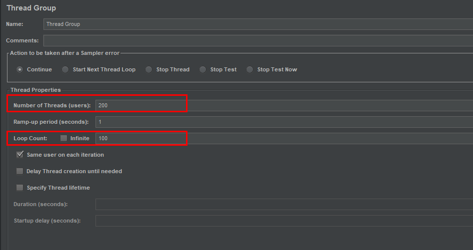


发送HTTP Request请求：

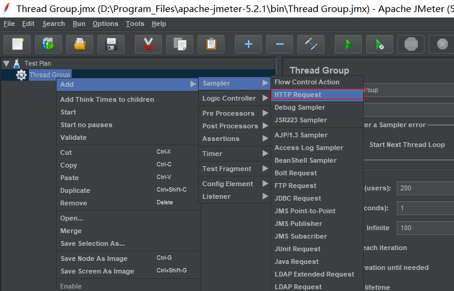

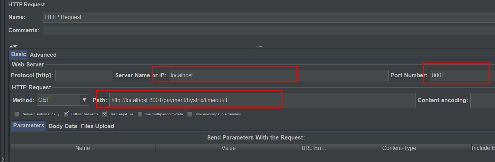


启动：

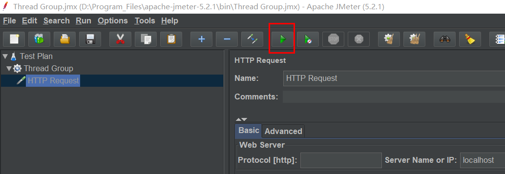


    

再来一个访问http://localhost:8001/payment/hystrix/timeout/31
    看演示结果
      两个都在转圈圈
      为什么会被卡死：tomcat的默认工作线程数被打满了,没有多余的线程来分解压力和处理

#####   Jmeter压测结论

​    上面还只是服务提供者8001自己测试,假如此时外部的消费者80也来访问,那消费者只能干等,最终导致消费端80不满意,服务端8001直接被拖死

#####   看热闹不嫌弃事大,80新建加入

​    cloud-consumer-feign-hystrix-order80

#### 故障和导致现象

  8001同一层次的其他接口被困死,因为tomcat线程池里面的工作线程已经被挤占完毕
  80此时调用8001,客户端访问响应缓慢,转圈圈

#### 上述结论

  正因为有上述故障或不佳表现  才有我们的降级/容错/限流等技术诞生

#### 如何解决?解决的要求

  超时导致服务器变慢(转圈)
    超时不再等待
  出错(宕机或程序运行出错)
    出错要有兜底
  解决
    对方服务(8001)超时了,调用者(80)不能一直卡死等待,必须有服务降级
    对方服务(8001)down机了,调用者(80)不能一直卡死等待,必须有服务降级
    对方服务(8001)ok,调用者(80)自己有故障或有自我要求(自己的等待时间小于服务提供者)

#### 服务降级

##### 降级配置

使用服务降级，需要通过如下的两个注解来完成：

  @HystrixCommand和@EnableCircuitBreaker

- 主启动类激活，标注@EnableCircuitBreaker，启动短路保护。
- 业务类启用 @HystrixCommand，在出现异常或超时，会自动调用@HystrixCommand中fallbckMethod参数所指定的方法。


​    

##### 8001先从自身找问题

  设置自身调用超时时间的峰值,峰值内可以正常运行,  超过了需要有兜底的方法处理,做服务降级fallback

##### 8001fallback（服务器端服务降级）


```java
@HystrixCommand(fallbackMethod = "paymentInfo_TimeOutHandler", commandProperties = {
            @HystrixProperty(name = "execution.isolation.thread.timeoutInMilliseconds", value = "3000")
    })
    public String paymentInfo_TimeOut(Integer id) {
        int timeNumber = 5000;
//        int age = 10 / 0; 模拟系统运行异常
        try {
            TimeUnit.SECONDS.sleep(timeNumber);
        } catch (Exception e) {
            e.printStackTrace();
        }
        return "线程池：" + Thread.currentThread().getName() + "paymentinfo_Timeout,id:" + id + "\t" + "耗时(秒)" + timeNumber;
    }

    private String paymentInfo_TimeOutHandler(Integer id) {
        return "线程池：" + Thread.currentThread().getName() + "8001系统繁忙或者运行报错,请稍后再试,id:" + id + "\t";
    }
```

上面制造了一个超时异常，限定在3秒钟，而业务需要5秒钟才能完成，超时后输出：


制造一个运行时异常，查看异常后的行为：


##### 80fallback（客户端服务降级）

Hystrix服务降级，既可以放到服务器端也可以放到客户端，前面是放到服务器端，下面是放到客户端，并且通常都是在客户端进行服务降级。

  Attention ：热部署方式对java代码修改明显，但对@HystrixCommand内属性的修改不敏感，建议重启微服务

  POM

```xml
<!--hystrix-->
<dependency>
    <groupId>org.springframework.cloud</groupId>
    <artifactId>spring-cloud-starter-netflix-hystrix</artifactId>
</dependency>
```

  YML

```yaml
server:
  port: 80
eureka:
  client:
    register-with-eureka: false
    fetch-registry: true
    service-url:
      defaultZone: http://eureka7001.com:7001/eureka,http://eureka7002.com:7002/eureka
feign:
  hystrix:
    enabled: true
 

```

  主启动
    加上@EnableHystrix

```java
@SpringBootApplication
@EnableFeignClients
@EnableHystrix
public class OrderHystrixMain80 {
    public static void main(String[] args) {
        SpringApplication.run(OrderHystrixMain80.class, args);
    }
}
```

  业务类

```java
@GetMapping("/consumer/payment/hystrix/timeout/{id}")
@HystrixCommand(fallbackMethod = "paymentTimeOutFallbackMethod", commandProperties = {
        @HystrixProperty(name = "execution.isolation.thread.timeoutInMilliseconds", value = "1500")
})
public String paymentInfo_TimeOut(@PathVariable("id") Integer id) {
    //int age = 10/0;
    return paymentHystrixService.paymentInfo_TimeOut(id);
}

public String paymentTimeOutFallbackMethod(@PathVariable("id") Integer id) {
    return "我是消费者80,对方支付系统繁忙请10秒种后再试或者自己运行出错请检查自己,o(╥﹏╥)o";
}

```

此时在客户端发访问：http://localhost/consumer/payment/hystrix/timeout/1

##### 目前问题

  如果在每个业务中，都配置一个对应的Fallback方法，代码冗余太多而且耦合度高，需要定义一个统一的Fallback方法。


##### 解决办法

可以在Controller中定义一个fallback方法用来处理异常或超时等，然后再标注上@DefaultProperties(defaultFallback="")，指明需要调用的fallback，然后在业务方法上标注@HystrixCommand。如下图所示：

​    

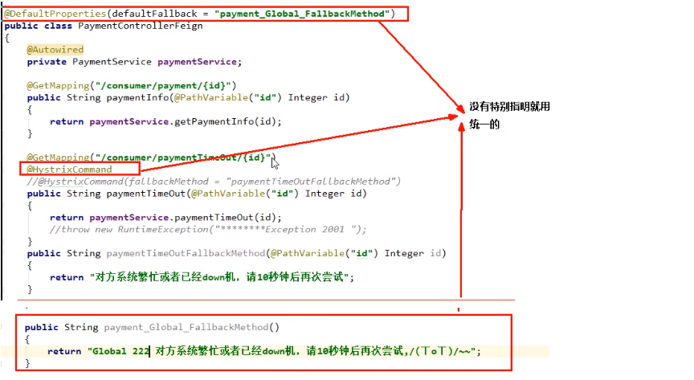

​      说明


​    controller配置

```java
package com.atguigu.springcloud.controller;

import com.atguigu.springcloud.service.PaymentHystrixService;
import com.netflix.hystrix.contrib.javanica.annotation.DefaultProperties;
import com.netflix.hystrix.contrib.javanica.annotation.HystrixCommand;
import lombok.extern.slf4j.Slf4j;
import org.springframework.web.bind.annotation.GetMapping;
import org.springframework.web.bind.annotation.PathVariable;
import org.springframework.web.bind.annotation.RestController;

import javax.annotation.Resource;

 
@RestController
@Slf4j
@DefaultProperties(defaultFallback = "payment_Global_FallbackMethod")
public class OrderHystrixController {
    @Resource
    private PaymentHystrixService paymentHystrixService;


       @GetMapping("/consumer/payment/hystrix/ok/{id}")
    public String paymentInfo_OK(@PathVariable("id") Integer id) {
        return paymentHystrixService.paymentInfo_OK(id);
    }

       @GetMapping("/consumer/payment/hystrix/timeout/{id}")
    /*@HystrixCommand(fallbackMethod = "paymentTimeOutFallbackMethod", commandProperties = {
            @HystrixProperty(name = "execution.isolation.thread.timeoutInMilliseconds", value = "1500")
    })*/
    @HystrixCommand
    public String paymentInfo_TimeOut(@PathVariable("id") Integer id) {
        //int age = 10/0;
        return paymentHystrixService.paymentInfo_TimeOut(id);
    }

    public String paymentTimeOutFallbackMethod(@PathVariable("id") Integer id) {
        return "我是消费者80,对方支付系统繁忙请10秒种后再试或者自己运行出错请检查自己,o(╥﹏╥)o";
    }

    /**
     * 全局fallback
     *
     * @return
     */
    public String payment_Global_FallbackMethod() {
        return "Global异常处理信息,请稍后重试.o(╥﹏╥)o";
    }
}
 
 

```


测试：http://localhost/consumer/payment/hystrix/timeout/31


 这样虽然结局了代码冗余的问题，但是仍然没有能够解决代码的耦合度高的问题，也即业务和异常或超时处理在一个Controller中，为了解决这个问题，我们可以在Service层来进行解耦。


   小结：

- 该案例服务降级处理是在客户端80完成
- 另外还是存在耦合度高的问题，如业务类PaymentController中业务和异常处理耦合


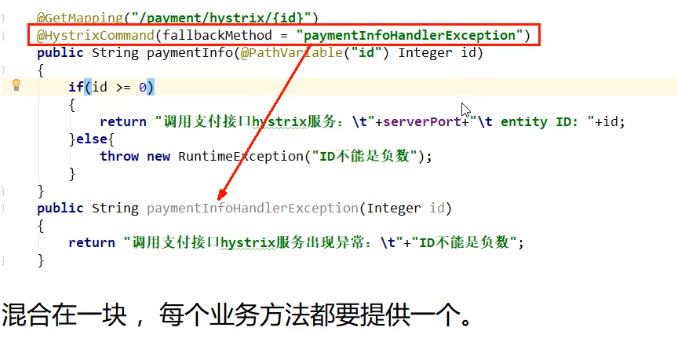


在Service层解耦合

修改cloud-consumer-feign-hystrix-order80

根据cloud-consumer-feign-hystrix-order80已经有的PaymentHystrixService接口,重新新建一个类(PaymentFallbackService)实现接口,统一为接口里面的方法进行异常处理

PaymentFallbackService类实现PaymentFeginService接口

```java
@Component
public class PaymentFallbackService implements PaymentHystrixService {
    @Override
    public String paymentInfo_OK(Integer id) {
        return "----PaymentFallbackService fall back--paymentInfo_OK";
    }

    @Override
    public String paymentInfo_TimeOut(Integer id) {
        return "----PaymentFallbackService fall back--paymentInfo_TimeOut";
    }
}
```


YML

```yaml
server:
  port: 80

eureka:
  client:
    register-with-eureka: false
    service-url:
      defaultZone: http://eureka7001.com:7001/eureka/ #入驻地址 不集群
feign:
  hystrix:
    enabled: true #在feign中开启hystrix

```

PaymentFeignClientService接口

```java
@Component
@FeignClient(value = "CLOUD-PROVIDER-HYSTRIX-PAYMENT",fallback = PaymentFallbackService.class)
public interface PaymentHystrixService {


    /**
     * 正常访问
     *
     * @param id
     * @return
     */
    @GetMapping("/payment/hystrix/ok/{id}")
    String paymentInfo_OK(@PathVariable("id") Integer id);

    /**
     * 超时访问
     *
     * @param id
     * @return
     */
    @GetMapping("/payment/hystrix/timeout/{id}")
    String paymentInfo_TimeOut(@PathVariable("id") Integer id);

}
```


测试

- 单个eureka先启动7001

- PaymentHystrixMain8001启动

- 正常访问测试
          http://localhost/consumer/payment/hystrix/ok/32
- 故意关闭微服务8001

- 客户端自己调用提示
          此时服务端provider已经down ,但是我们做了服务降级处理,  让客户端在服务端不可用时也会获得提示信息而不会挂起耗死服务器


#### 服务熔断

##### 断路器

  一句话就是家里的保险丝

##### 熔断是什么

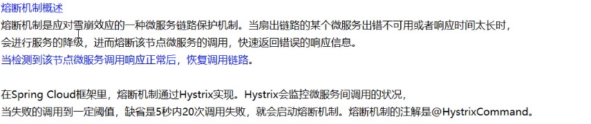

  大神论文
    https://martinfowler.com/bliki/CircuitBreaker.html

##### 实操

  修改cloud-provider-hystrix-payment8001
  PaymentService

```java
 //====服务熔断

    /**
     * 在10秒窗口期中10次请求有6次是请求失败的,断路器将起作用
     *
     * @param id
     * @return
     */
    @HystrixCommand(
            fallbackMethod = "paymentCircuitBreaker_fallback", commandProperties = {
            @HystrixProperty(name = "circuitBreaker.enabled", value = "true"),// 是否开启断路器
            @HystrixProperty(name = "circuitBreaker.requestVolumeThreshold", value = "10"),// 请求次数
            @HystrixProperty(name = "circuitBreaker.sleepWindowInMilliseconds", value = "10000"),// 时间窗口期/时间范文
            @HystrixProperty(name = "circuitBreaker.errorThresholdPercentage", value = "60")// 失败率达到多少后跳闸
    }
    )
    public String paymentCircuitBreaker(@PathVariable("id") Integer id) {
        if (id < 0) {
            throw new RuntimeException("*****id不能是负数");
        }
        String serialNumber = IdUtil.simpleUUID();
        return Thread.currentThread().getName() + "\t" + "调用成功,流水号:" + serialNumber;
    }

    public String paymentCircuitBreaker_fallback(@PathVariable("id") Integer id) {
        return "id 不能负数,请稍后重试,o(╥﹏╥)o id:" + id;
    }
```


​    why这些参数

  PaymentController

```java
 /**
     * 服务熔断
     * http://localhost:8001/payment/circuit/1
     *
     * @param id
     * @return
     */
    @GetMapping("/circuit/{id}")
    @HystrixCommand
    public String paymentCircuitBreaker(@PathVariable("id") Integer id) {
        String result = paymentService.paymentCircuitBreaker(id);
        log.info("***result:" + result);
        return result;
    }
```


  com.netflix.hystrix.HystrixCommandProperties，该类提供了一系列Hystrix的默认属性。


测试
    自测cloud-provider-hystrix-payment8001

- ​    正确
  ​      http://localhost:8001/payment/circuit/31
- ​    错误
  ​      http://localhost:8001/payment/circuit/-31
- ​    一次正确一次错误trytry
- ​    重点测试
  ​      多次正确,然后慢慢正确,发现刚开始不满足条件,就算是正确的访问也不能进行

##### 原理/小总结

  大神结论

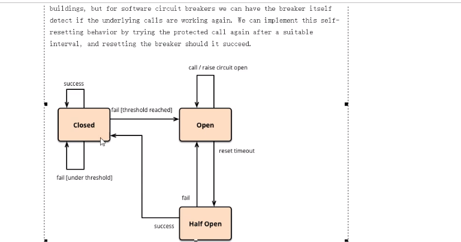

  熔断类型

- ​    熔断打开
  ​      请求不再调用当前服务,内部设置一般为MTTR(平均故障处理时间),当打开长达导所设时钟则进入半熔断状态
- ​    熔断关闭
  ​      熔断关闭后不会对服务进行熔断
- ​    熔断半开
  ​      部分请求根据规则调用当前服务,如果请求成功且符合规则则认为当前服务恢复正常,关闭熔断

  官网断路器流程图

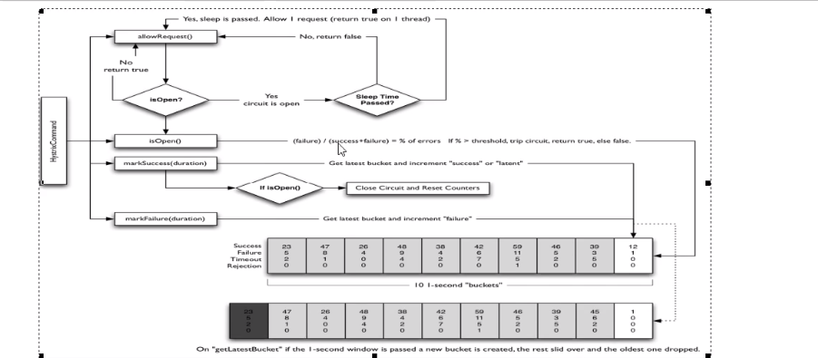

​    官网步骤

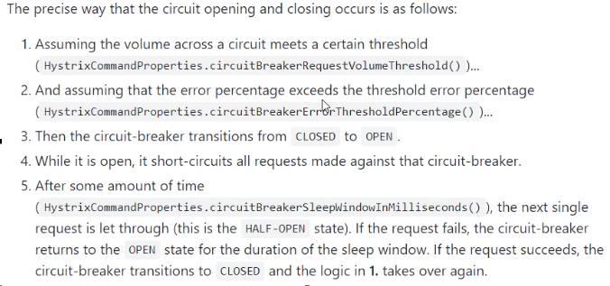


​    断路器在什么情况下开始起作用

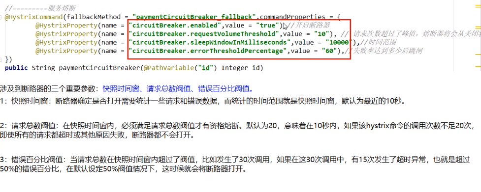


​    断路器开启或者关闭的条件

- ​      当满足一定的阈值的时候(默认10秒钟超过20个请求次数)
- ​      当失败率达到一定的时候(默认10秒内超过50%的请求次数)
- ​      到达以上阈值,断路器将会开启
- ​      当开启的时候,所有请求都不会进行转发
- ​      一段时间之后(默认5秒),这个时候断路器是半开状态,会让其他一个请求进行转发. 如果成功,断路器会关闭,若失败,继续开启.重复4和5

​    断路器打开之后

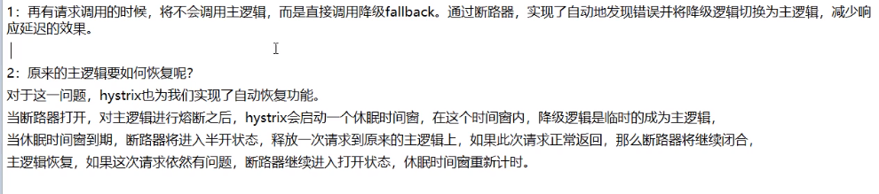

​    ALl配置

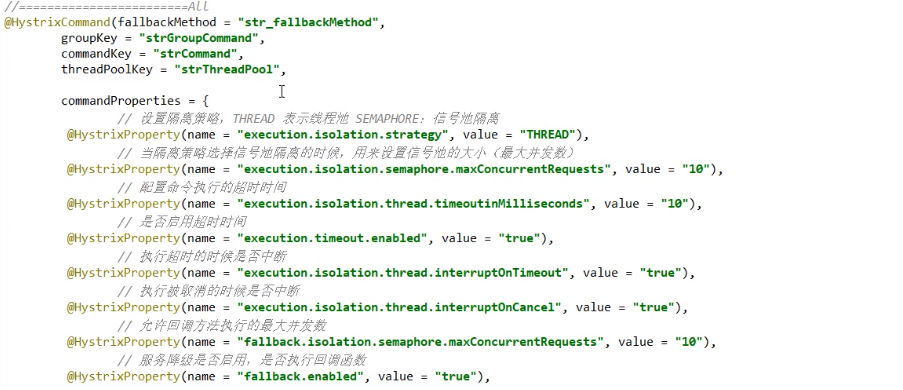

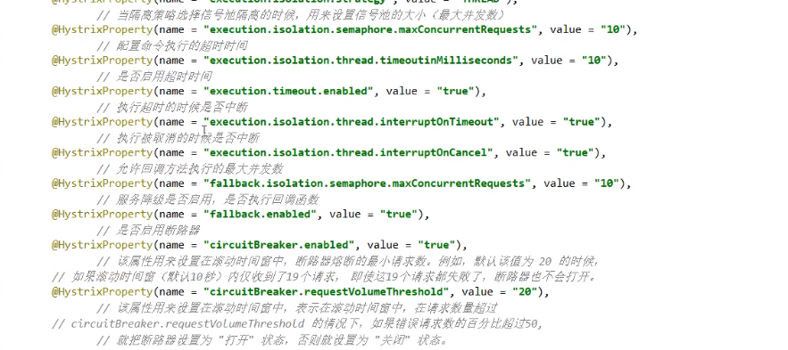

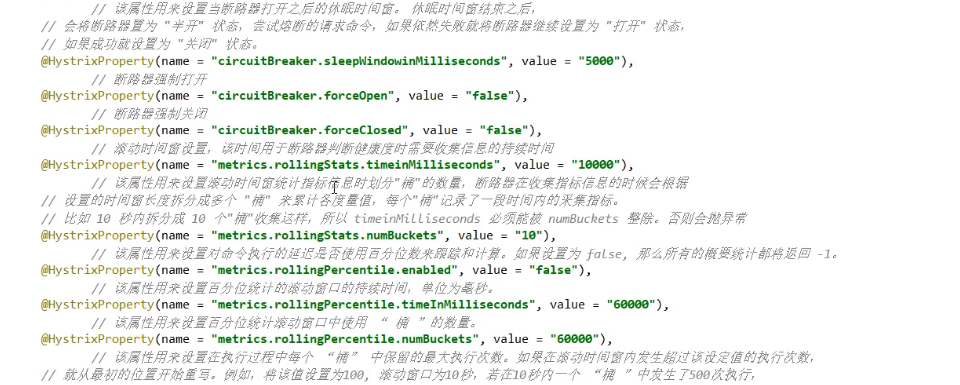

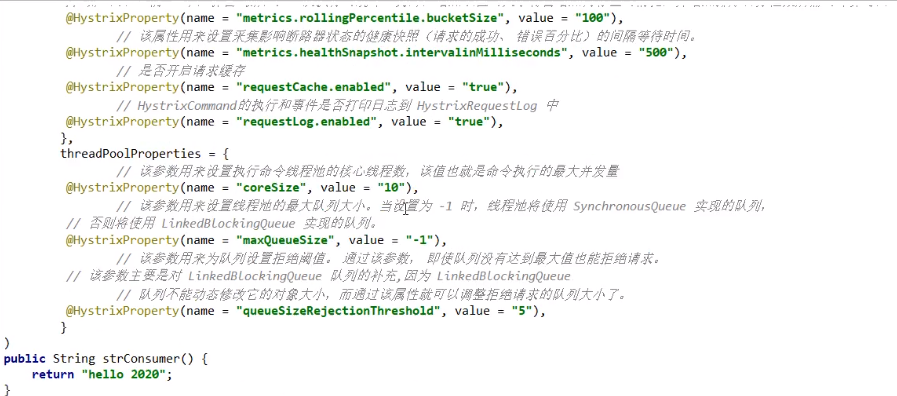


#### 服务限流

  后面高级篇讲解alibaba的Sentinel说明


### 4）hystrix工作流程

https://github.com/Netflix/Hystrix/wiki/How-it-Works
Hystrix工作流程
  官网图例

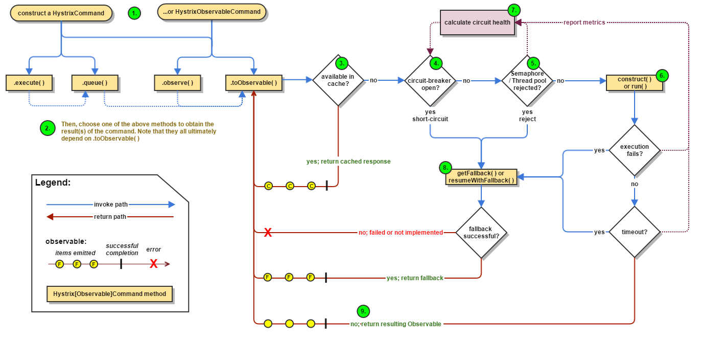

  步骤说明

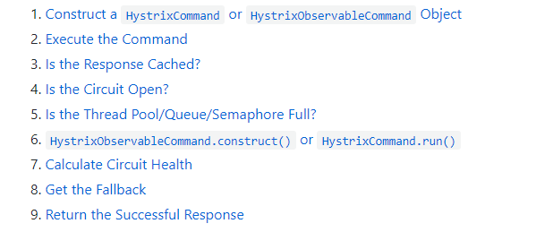

### 5）服务监控hystrixDashboard

#### 概述

#### 仪表盘9001

  新建cloud-consumer-hystrix-dashboard9001
  POM

```xml
<?xml version="1.0" encoding="UTF-8"?>
<project xmlns="http://maven.apache.org/POM/4.0.0"
         xmlns:xsi="http://www.w3.org/2001/XMLSchema-instance"
         xsi:schemaLocation="http://maven.apache.org/POM/4.0.0 http://maven.apache.org/xsd/maven-4.0.0.xsd">
    <parent>
        <artifactId>cloud2020</artifactId>
        <groupId>com.atguigu.springcloud</groupId>
        <version>1.0-SNAPSHOT</version>
    </parent>
    <modelVersion>4.0.0</modelVersion>

    <artifactId>cloud-consumer-hystrix-dashboard9001</artifactId>
    <description>hystrix监控</description>


    <dependencies>
        <!--hystrix dashboard-->
        <dependency>
            <groupId>org.springframework.cloud</groupId>
            <artifactId>spring-cloud-starter-netflix-hystrix-dashboard</artifactId>
        </dependency>
        <!--监控-->
        <dependency>
            <groupId>org.springframework.boot</groupId>
            <artifactId>spring-boot-starter-actuator</artifactId>
        </dependency>
        <!--热部署-->
        <dependency>
            <groupId>org.springframework.boot</groupId>
            <artifactId>spring-boot-devtools</artifactId>
            <scope>runtime</scope>
            <optional>true</optional>
        </dependency>
        <dependency>
            <groupId>org.projectlombok</groupId>
            <artifactId>lombok</artifactId>
            <optional>true</optional>
        </dependency>
        <dependency>
            <groupId>org.springframework.boot</groupId>
            <artifactId>spring-boot-starter-test</artifactId>
            <scope>test</scope>
        </dependency>
    </dependencies>

</project>
 

```

  YML

```yaml
server:
  port: 9001
 

```

  HystrixDashboardMain9001+新注解@EnableHystrixDashboard

```java
package com.atguigu.springcloud;

import org.springframework.boot.SpringApplication;
import org.springframework.boot.autoconfigure.SpringBootApplication;
import org.springframework.cloud.netflix.hystrix.dashboard.EnableHystrixDashboard;


@SpringBootApplication
@EnableHystrixDashboard
public class HystrixDashboardMain9001 {
    public static void main(String[] args) {
        SpringApplication.run(HystrixDashboardMain9001.class);
    }
}
```

  被监控的所有Provider微服务提供类(8001/8002/8003)都需要有监控依赖包

```xml
<dependency>
    <groupId>org.springframework.boot</groupId>
    <artifactId>spring-boot-starter-actuator</artifactId>
</dependency>
```


  启动cloud-consumer-hystrix-dashboard9001
   访问： http://localhost:9001/hystrix

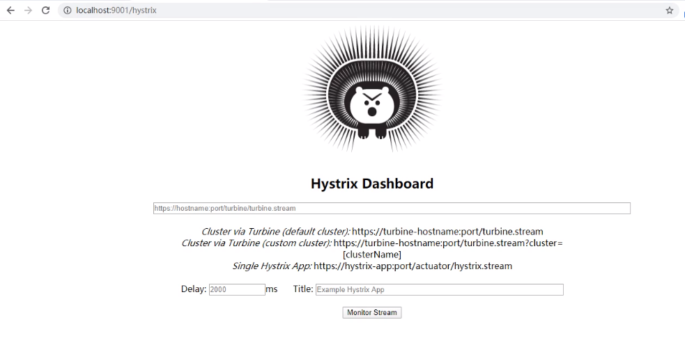

#### 断路器演示(服务监控hystrixDashboard)

#####   修改cloud-provider-hystrix-payment8001

Attention：新版本Hystrix需要在主启动MainAppHystrix8001中指定监控路径，否则容易出现"Unable to connect to Command Metric Stream"异常。

```java
package com.atguigu.springcloud;

import com.netflix.hystrix.contrib.metrics.eventstream.HystrixMetricsStreamServlet;
import org.springframework.boot.SpringApplication;
import org.springframework.boot.autoconfigure.SpringBootApplication;
import org.springframework.boot.web.servlet.ServletRegistrationBean;
import org.springframework.cloud.netflix.hystrix.dashboard.EnableHystrixDashboard;
import org.springframework.context.annotation.Bean;


@SpringBootApplication
@EnableHystrixDashboard
public class HystrixDashboardMain9001 {
    public static void main(String[] args) {
        SpringApplication.run(HystrixDashboardMain9001.class);
    }

    /**
     * 此配置是为了服务监控而配置，与服务容错本身无观，springCloud 升级之后的坑
     * ServletRegistrationBean因为springboot的默认路径不是/hystrix.stream
     * 只要在自己的项目中配置上下面的servlet即可
     * @return
     */
    @Bean
    public ServletRegistrationBean getServlet(){
        HystrixMetricsStreamServlet streamServlet = new HystrixMetricsStreamServlet();
        ServletRegistrationBean<HystrixMetricsStreamServlet> registrationBean = new ServletRegistrationBean<>(streamServlet);
        registrationBean.setLoadOnStartup(1);
        registrationBean.addUrlMappings("/hystrix.stream");
        registrationBean.setName("HystrixMetricsStreamServlet");
        return registrationBean;
    }
}
 
```

#####   监控测试

######     启动一个eureka或者3个eureka集群均可

######     观察监控窗口

​      9001监控8001

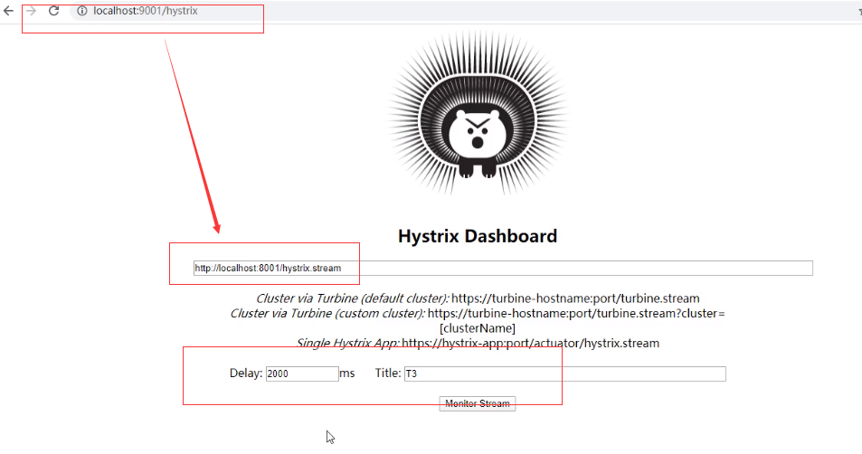

​        填写监控地址
​        http://localhost:8001/hystrix.stream
​      测试地址
​        http://localhost:8001/payment/circuit/31
​        http://localhost:8001/payment/circuit/-31
​  
​        先访问正确地址,再访问错误地址,再正确地址,会发现图标断路器都是慢慢放开的.
​          监控结果,成功

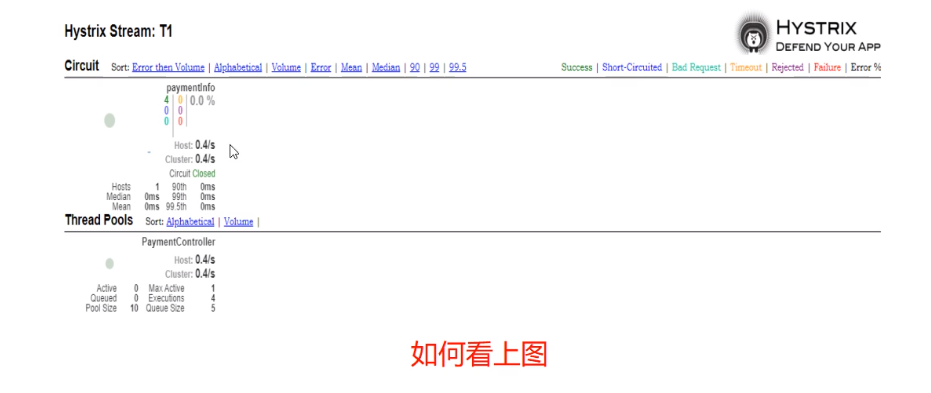

​          监控结果,失败

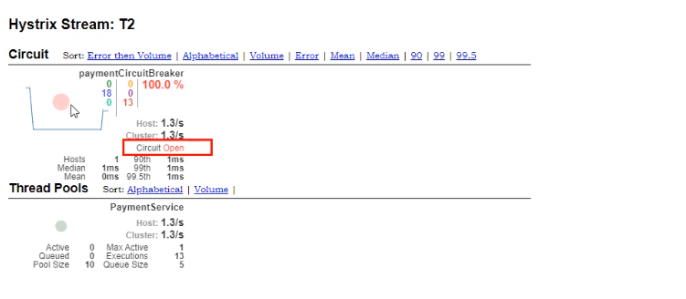

​      如何看?
​        7色

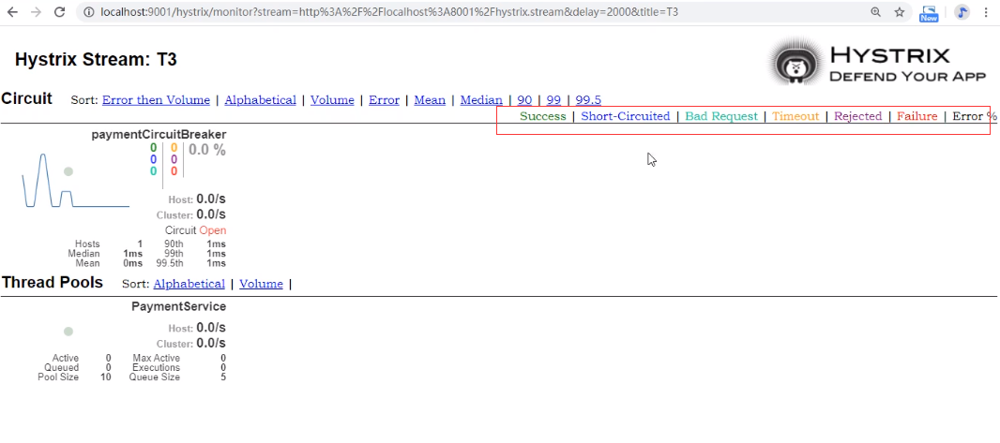


​        1圈


​        1线


​        整图说明

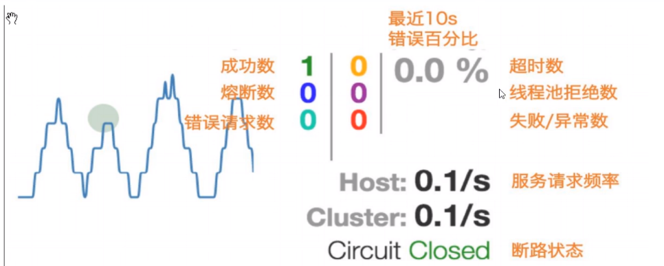

        


​        整图说明2

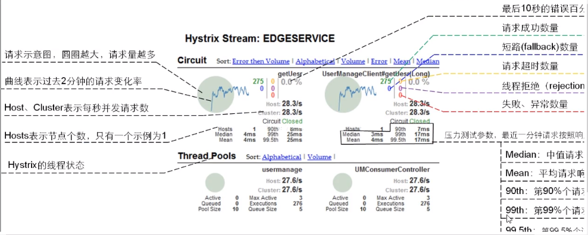

​      搞懂一个才能看懂复杂的


## 12. Gateway新一代网关

### 1）概述简介

#### 官网

  上一代zuul 1.x
    https://github.com/Netflix/zuul/wiki
  当前gateway
    https://cloud.spring.io/spring-cloud-static/spring-cloud-gateway/2.2.1.RELEASE/reference/html/

#### 是什么

  概述

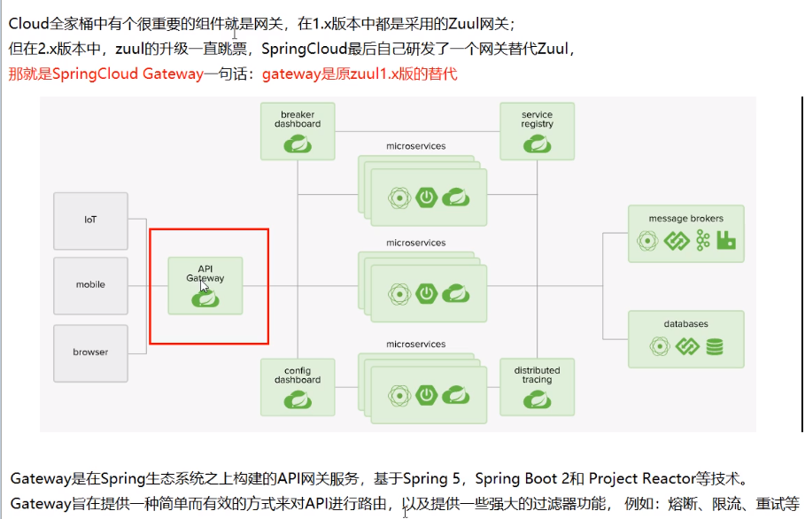

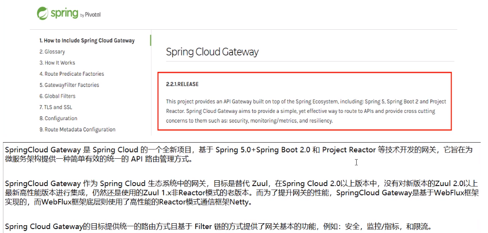

  一句话:
    SpringCloud Gateway使用的是Webflux中的reactor-netty响应式编程组件,底层使用了Netty通讯框架
    源码架构

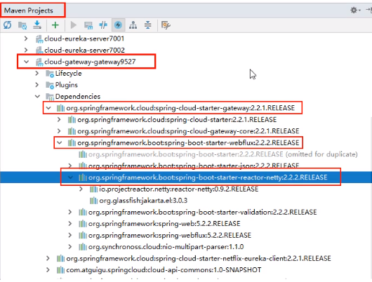

#### 能干嘛

  反向代理
  鉴权
  流量控制
  熔断
  日志监控
  .....

#### 微服务架构中网关在哪里

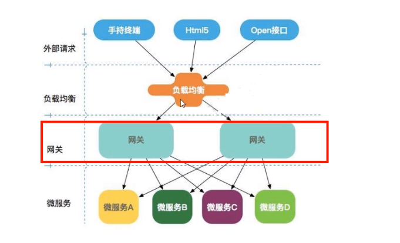


#### 有Zuull了怎么又出来gateway

  我们为什么选择Gateway?
    1.netflix不太靠谱,zuul2.0一直跳票,迟迟不发布

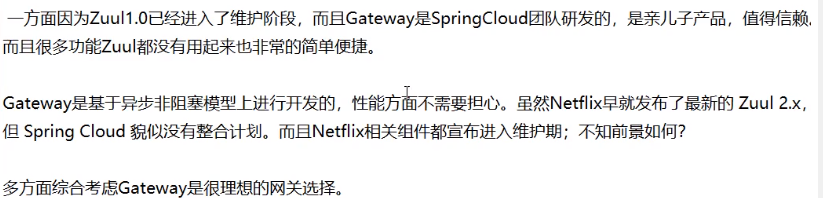


​    2.SpringCloud Gateway具有如下特性

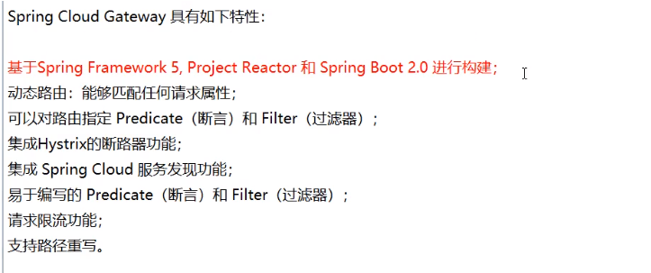

​    3.SpringCloud Gateway与Zuul的区别

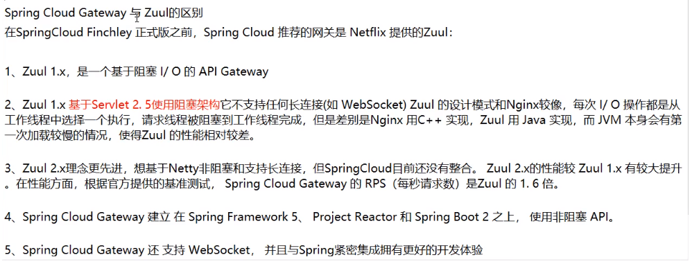

  Zuul1.x模型

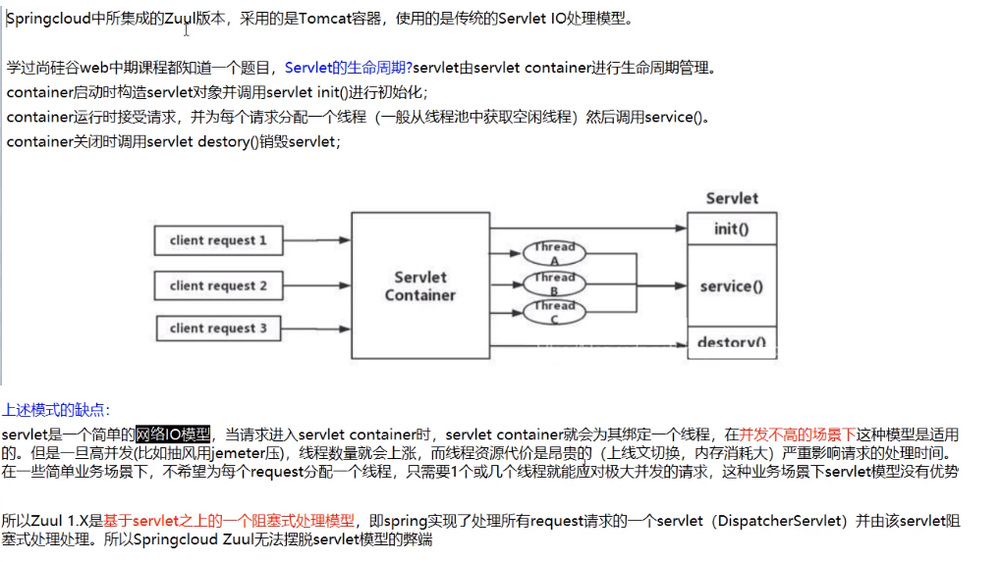


  Gateway模型
    WebFlux是什么

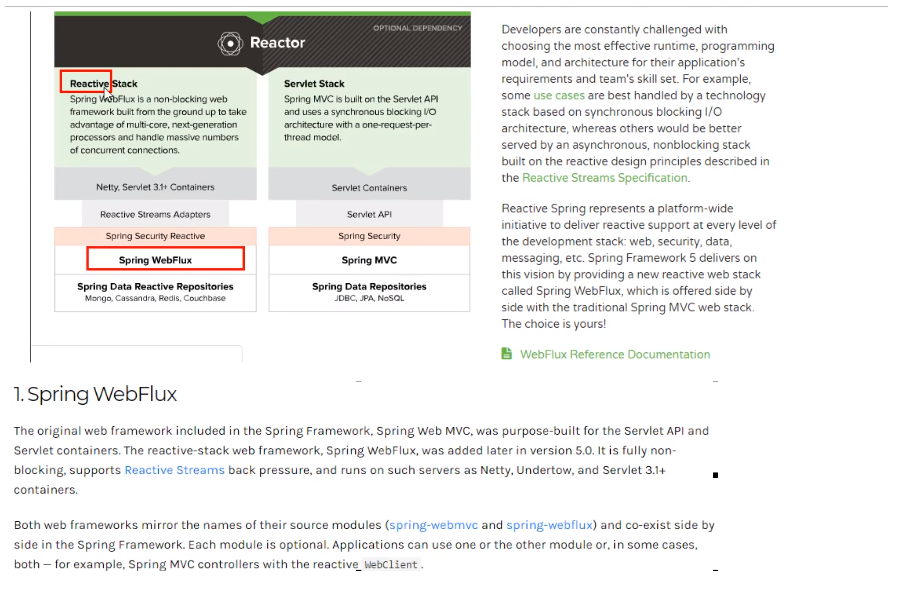


​      https://docs.spring.io/spring/docs/current/spring-framework-reference/web-reactive.html#spring-webflux
​      说明

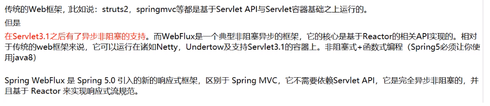


### 2）三大核心概念

1. Route(路由)：路由是构建网关的基本模块,它由ID,目标URI,一系列的断言和过滤器组成,如断言为true则匹配该路由
2. Predicate(断言)：参考的是Java8的java.util.function.Predicate 开发人员可以匹配HTTP请求中的所有内容(例如请求头或请求参数),如果请求与断言相匹配则进行路由
3.  Filter(过滤)：指的是Spring框架中GatewayFilter的实例,使用过滤器,可以在请求被路由前或者之后对请求进行修改.

  总结

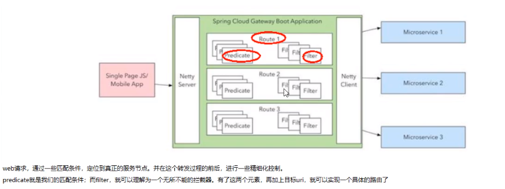

### 3）Gateway工作流程

  官网总结

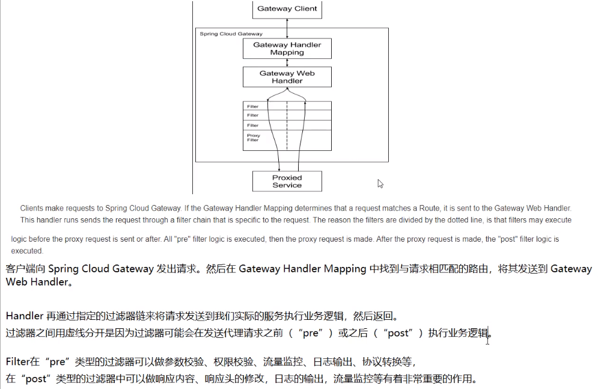

  核心逻辑
    路由转发+执行过滤器链

### 4）入门配置

#### 新建Module

  cloud-gateway-gateway9527

#### POM

```xml
     <dependencies>
        <!--需要引入spring-cloud-starter-gateway-->
        <dependency>
            <groupId>org.springframework.cloud</groupId>
            <artifactId>spring-cloud-starter-gateway</artifactId>
        </dependency>
        <!--gateway无需web和actuator-->
        <dependency>
            <groupId>org.springframework.cloud</groupId>
            <artifactId>spring-cloud-starter-netflix-eureka-client</artifactId>
        </dependency>
        <dependency>
            <groupId>org.projectlombok</groupId>
            <artifactId>lombok</artifactId>
            <optional>true</optional>
        </dependency>
        <dependency>
            <groupId>org.springframework.boot</groupId>
            <artifactId>spring-boot-starter-test</artifactId>
            <scope>test</scope>
        </dependency>
        <dependency>
            <groupId>com.atguigu.springcloud</groupId>
            <artifactId>cloud-api-commons</artifactId>
            <version>${project.version}</version>
        </dependency>
    </dependencies>
```


Attention：请不要在该项目中引入“spring-boot-starter-web”依赖包，否则容易报“**Spring MVC found on classpath, which is incompatible with Spring Cloud Gateway at this time. Please remove spring-boot-starter-web dependency.**”错误。 


#### YML

#### 业务类

  无

#### 主启动类

```java
@SpringBootApplication
@EnableEurekaClient
public class GateWayMain9527 {
    public static void main(String[] args) {
        SpringApplication.run(GateWayMain9527.class, args);
    }
}
```


#### 9527网关做路由映射

  cloud-provider-payment8001中查看controller的访问地址，/payment/get/**和/payment/lb/*

但是目前不希望暴露8001端口，而是以9527端口对外提供服务。

#### YML新增网关配置

```yaml
server:
  port: 9527

spring:
  application:
    name: cloud-gateway
  cloud:
    gateway:
      discovery:
        locator:
          enabled: true # 开启从注册中心动态创建路由的功能，利用微服务名称进行路由
      routes:
        - id: payment_route # 路由的id,没有规定规则但要求唯一,建议配合服务名
         #匹配后提供服务的路由地址
          uri: http://localhost:8001
          predicates:
            - Path=/payment/get/** # 断言，路径相匹配的进行路由
        - id: payment_route2
          uri: http://localhost:8001
          predicates:
            Path=/payment/lb/** #断言,路径相匹配的进行路由

eureka:
  instance:
    hostname: cloud-gateway-service
  client:
    fetch-registry: true
    register-with-eureka: true
    service-url:
      defaultZone: http://eureka7001.com:7001/eureka/
```


#### 测试

1.   启动cloud-eureka-server7001
2.   启动 cloud-provider-payment8001

3.   启动cloud-gateway-gateway9527

  访问说明

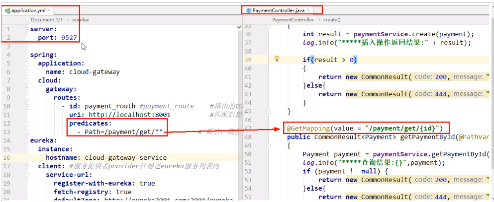

  使用8001端口来访问： http://localhost:8001/payment/get/1

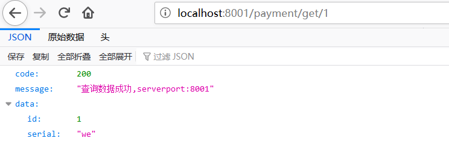


  使用9527端口来进行访问：http://localhost:9527/payment/get/1

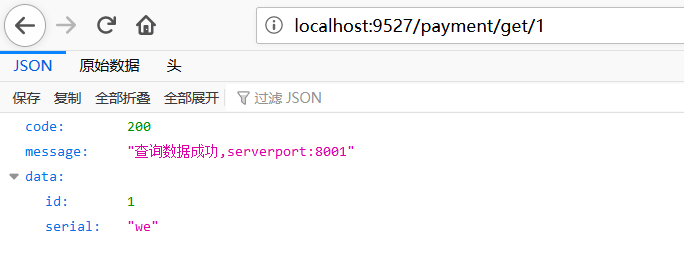

#### YML配置说明

Gateway网关路由有两种配置方式:

1. 在配置文件yaml中配置：如“cloud-gateway-gateway9527”中YML的“routes”所示。
2. 代码中注入RouteLocator的Bean

官网案例

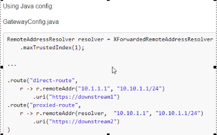


现在想要以"http://localhost:9527/guonei/"的形式访问，“https://news.baidu.com/guonei”


在"cloud-gateway-gateway9527"中做如下的配置

com.atguigu.springcloud.config.GateWayConfig

```java
package com.atguigu.springcloud.config;

import org.springframework.cloud.gateway.route.RouteLocator;
import org.springframework.cloud.gateway.route.builder.RouteLocatorBuilder;
import org.springframework.context.annotation.Bean;
import org.springframework.context.annotation.Configuration;

@Configuration
public class GateWayConfig {
    @Bean
    public RouteLocator customRouteLocator(RouteLocatorBuilder routeLocatorBuilder){
        RouteLocatorBuilder.Builder routes = routeLocatorBuilder.routes();
        routes.route("path_route_atguigu",r->r.path("/guonei").uri("https://news.baidu.com/guonei")).build();
        return routes.build();
    }
}
```

访问：http://localhost:9527/guonei/

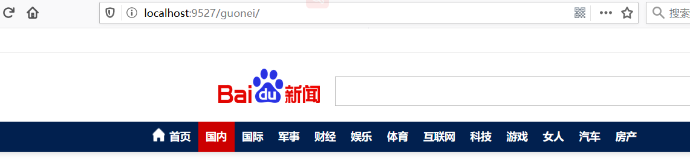


### 5）通过服务名实现动态

#### 默认情况下Gatway会根据注册中心注册的服务列表,  以注册中心上微服务名为路径创建动态路由进行转发,从而实现动态路由的功能

#### 启动

  一个eureka7001，两个服务提供者Cloud-provider-payment8001和Cloud-provider-payment8002

#### POM

```xml
<dependency>
    <groupId>org.springframework.cloud</groupId>
    <artifactId>spring-cloud-starter-netflix-eureka-client</artifactId>
</dependency>
```

#### YML

```yaml
server:
  port: 9527

spring:
  application:
    name: cloud-gateway
  cloud:
    gateway:
      discovery:
        locator:
          enabled: true # 开启从注册中心动态创建路由的功能，利用微服务名称j进行路由
      routes:
        - id: payment_route # 路由的id,没有规定规则但要求唯一,建议配合服务名
          #匹配后提供服务的路由地址
#          uri: http://localhost:8001
          uri: lb://cloud-payment-service
          predicates:
            - Path=/payment/get/** # 断言，路径相匹配的进行路由
        - id: payment_route2
#          uri: http://localhost:8001
          uri: lb://cloud-payment-service
          predicates:
            Path=/payment/lb/** #断言,路径相匹配的进行路由

eureka:
  instance:
    hostname: cloud-gateway-service
  client:
    fetch-registry: true
    register-with-eureka: true
    service-url:
      defaultZone: http://eureka7001.com:7001/eureka/

```


Attention：uri的协议lb，表示启用Gateway的负载均衡功能。
  lb://serverName是spring cloud  gatway在微服务中自动为我们创建的负载均衡uri

#### 测试

访问：http://localhost:9527/payment/lb，能够看到8001/8002两个端口来回切换。


### 6）Predicate

在启动“cloud-gateway-gateway9527”过程中，我们看到如下的输出：

```verilog
[main] o.s.c.g.r.RouteDefinitionRouteLocator    : Loaded RoutePredicateFactory [After]
[main] o.s.c.g.r.RouteDefinitionRouteLocator    : Loaded RoutePredicateFactory [Before]
[main] o.s.c.g.r.RouteDefinitionRouteLocator    : Loaded RoutePredicateFactory [Between]
[main] o.s.c.g.r.RouteDefinitionRouteLocator    : Loaded RoutePredicateFactory [Cookie]
[main] o.s.c.g.r.RouteDefinitionRouteLocator    : Loaded RoutePredicateFactory [Header]
[main] o.s.c.g.r.RouteDefinitionRouteLocator    : Loaded RoutePredicateFactory [Host]
[main] o.s.c.g.r.RouteDefinitionRouteLocator    : Loaded RoutePredicateFactory [Method]
[main] o.s.c.g.r.RouteDefinitionRouteLocator    : Loaded RoutePredicateFactory [Path]
[main] o.s.c.g.r.RouteDefinitionRouteLocator    : Loaded RoutePredicateFactory [Query]
[main] o.s.c.g.r.RouteDefinitionRouteLocator    : Loaded RoutePredicateFactory [ReadBodyPredicateFactory]
[main] o.s.c.g.r.RouteDefinitionRouteLocator    : Loaded RoutePredicateFactory [RemoteAddr]
[main] o.s.c.g.r.RouteDefinitionRouteLocator    : Loaded RoutePredicateFactory [Weight]
[main] o.s.c.g.r.RouteDefinitionRouteLocator    : Loaded RoutePredicateFactory [CloudFoundryRouteService]
```

实际上这些就是路由谓词工厂。

#### Route Predicate Factories

[谓词工厂](https://cloud.spring.io/spring-cloud-static/spring-cloud-gateway/2.2.1.RELEASE/reference/html/#gateway-request-predicates-factories)

Spring Cloud Gateway将路由匹配作为Spring WebFlux HandlerMapping基础架构的一部分。

Spring Cloud Gateway包括许多内置的Route Predicate工厂。所有这些Predicate都与HTTP请求的不同属性匹配。多个RoutePredicate工厂可以进行组合。

Spring Cloud Gateway创建Route对象时，使用RoutePredicateFactory创建Predicate对象,，Predicate对象可以赋值给Route。Spring Cloud Gateway包含许多内置的Route Predicate Factories。

所有这些谓词都匹配HTTP请求的不同属性。多种谓词工厂可以组合，并通过逻辑and。


#### 常用的Route Predicate

“RoutePredicateFactory”类的继承关系图：

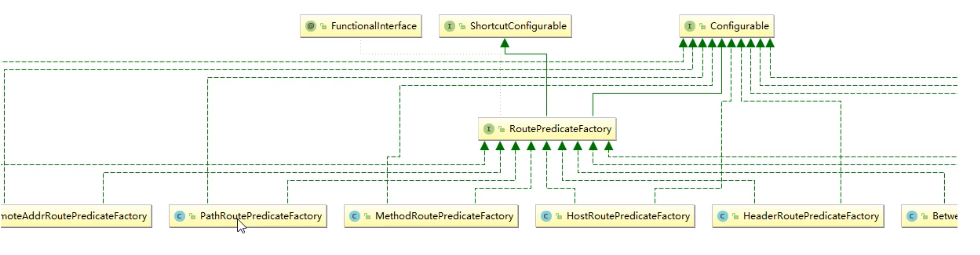

实现类：


##### 1. After Route Predicate 

查看官网：

>
>
>### [4.1. The After Route Predicate Factory](https://cloud.spring.io/spring-cloud-static/spring-cloud-gateway/2.2.1.RELEASE/reference/html/#the-after-route-predicate-factory)
>
>The after route predicate factory takes one parameter, a datetime. This predicate matches requests that happen after the specified datetime. The following example configures an after route predicate:
>after路由谓词工厂接受一个日期时间参数。此谓词匹配在指定日期时间之后，所发生的请求。下面的示例配置一个after路由谓词: 
>
>Example 1. application.yml
>
>```yaml
>spring:
>cloud:
>gateway:
> routes:
>     - id: after_route
>   uri: https://example.org
>   predicates:
>       - After=2017-01-20T17:42:47.789-07:00[America/Denver]
>```
>
>This route matches any request made after Jan 20, 2017 17:42 Mountain Time (Denver).
>这条路由匹配任何，在丹佛时间2017年1月20日17点42分以后发出的请求。

关于这个时间的取得：

~~~java
import java.time.ZonedDateTime;
public class T2 {
     public static void main(String[] args) {
         ZonedDateTime zonedDateTime = ZonedDateTime.now();
         System.out.println(zonedDateTime);
     }
}
~~~


​     

##### 2. Before Route Predicate 


##### 3. Between Route Predicate 

##### 4. Cookie Route Predicate 

>
>
>### [4.4. The Cookie Route Predicate Factory](https://cloud.spring.io/spring-cloud-static/spring-cloud-gateway/2.2.1.RELEASE/reference/html/#the-cookie-route-predicate-factory)
>
>The cookie route predicate factory takes two parameters, the cookie name and a regular expression. This predicate matches cookies that have the given name and whose values match the regular expression. The following example configures a cookie route predicate factory:
> Cookie路由谓词工厂接收两个参数，cookie名称和一个正则表达式。此谓词匹配具有给定名称且其值与正则表达式匹配的cookie。下面的示例配置一个cookie路由谓词工厂: 
>
>Example 4. application.yml
>
>```yaml
>spring:
>  cloud:
>    gateway:
>      routes:
>      - id: cookie_route
>        uri: https://example.org
>        predicates:
>        - Cookie=chocolate, ch.p
>```
>
>This route matches requests that have a cookie named `chocolate` whose value matches the `ch.p` regular expression.
> 此路由匹配具有一个名为chocolate的cookie的请求，该cookie的值与ch.p正则表达式匹配。 

Cookie Route Predicate需要两个参数,一个是Cookie name,一个是正则表达式。路由规则会通过获取对应的Cookie name值和正则表达式去匹配,如果匹配上就会执行路由,如果没有匹配上则不执行 


修改“cloud-gateway-gateway9527”YAML中的“spring.cloud.gateway.routes[1].predicates”路由规则，添加**“- Cookie=username,zzyy”**

```yaml
spring:
  application:
    name: cloud-gateway
  cloud:
    gateway:
      discovery:
        locator:
          enabled: true # 开启从注册中心动态创建路由的功能，利用微服务名称j进行路由
      routes:
        - id: payment_route # 路由的id,没有规定规则但要求唯一,建议配合服务名
          #匹配后提供服务的路由地址
#          uri: http://localhost:8001
          uri: lb://cloud-payment-service
          predicates:
            - Path=/payment/get/** # 断言，路径相匹配的进行路由
            - After=2020-04-14T23:43:19.117+08:00[Asia/Shanghai]
              #- Before=2017-01-20T17:42:47.789-07:00[America/Denver]
            - Cookie=username,zzyy
              #- Header=X-Request-Id, \d+ #请求头要有X-Request-Id属性，并且值为正数
              #- Host=**.atguigu.com
              #- Method=GET
              #- Query=username, \d+ # 要有参数名username并且值还要是正整数才能路由
              # 过滤
              #filters:
            #  - AddRequestHeader=X-Request-red, blue
        - id: payment_route2
#          uri: http://localhost:8001
          uri: lb://cloud-payment-service
          predicates:
            - Path=/payment/lb/** #断言,路径相匹配的进行路由
            - Cookie=username,zzyy
```


######  不带cookies访问

**curl http://localhost:9527/payment/lb**

```shell
Administrator@git MINGW64 ~
$ curl http://localhost:9527/payment/lb
  % Total    % Received % Xferd  Average Speed   Time    Time     Time  Current
                                 Dload  Upload   Total   Spent    Left  Speed
100   136  100   136    0     0   9066      0 --:--:-- --:--:-- --:--:--  9066{"timestamp":"2020-04-15T01:00:32.067+0000","path":"/payment/lb","status":404,"error":"Not Found","message":null,"requestId":"c3b7e7a0"}

Administrator@git MINGW64 ~

```


###### 带上cookies访问

 **curl http://localhost:9527/payment/lb --cookie "username=zzyy"**

```shell
Administrator@git MINGW64 ~
$ curl http://localhost:9527/payment/lb --cookie "username=zzyy"
  % Total    % Received % Xferd  Average Speed   Time    Time     Time  Current
                                 Dload  Upload   Total   Spent    Left  Speed
100     4  100     4    0     0    266      0 --:--:-- --:--:-- --:--:--   266
8002

Administrator@git MINGW64 ~
$ curl http://localhost:9527/payment/lb --cookie "username=zzyy"
  % Total    % Received % Xferd  Average Speed   Time    Time     Time  Current
                                 Dload  Upload   Total   Spent    Left  Speed
100     4  100     4    0     0    250      0 --:--:-- --:--:-- --:--:--   250
8002

Administrator@git MINGW64 ~
$ curl http://localhost:9527/payment/lb --cookie "username=zzyy"
  % Total    % Received % Xferd  Average Speed   Time    Time     Time  Current
                                 Dload  Upload   Total   Spent    Left  Speed
100     4  100     4    0     0    129      0 --:--:-- --:--:-- --:--:--   129
8001

```


关于Curl中文乱码问题的[解决]( https://blog.csdn.net/leedee/article/details/82685636)。

##### 5. Header Route Predicate 

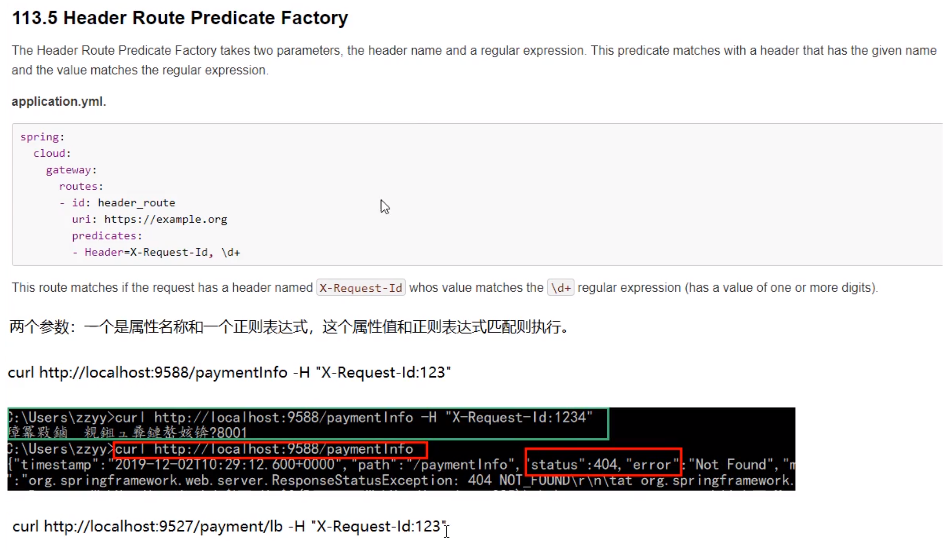

##### 6. Host Route Predicate

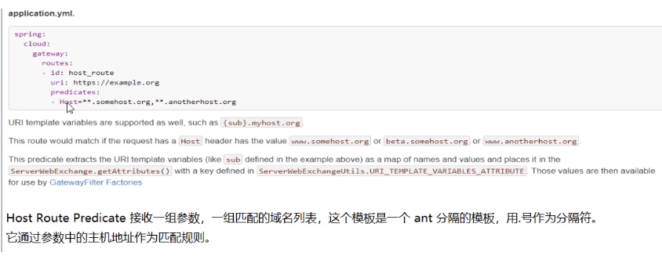

##### 7. Method Route Predicate 

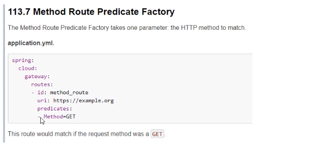

##### 8. Path Route Predicate

##### 9. Query Route Predicate 

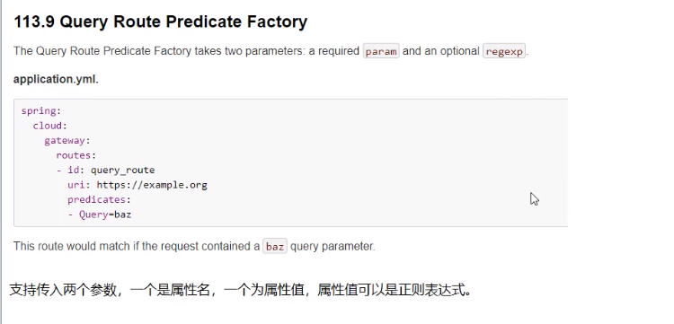
    
YML 
    
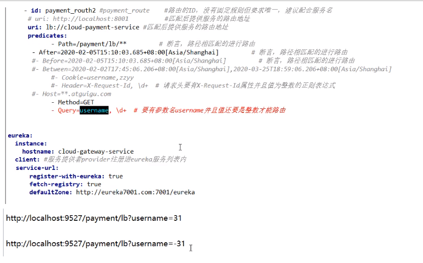

##### 10. RemoteAddr Route Predicate

##### 11. Weight Route Predicate

​       

小总结
 ALL
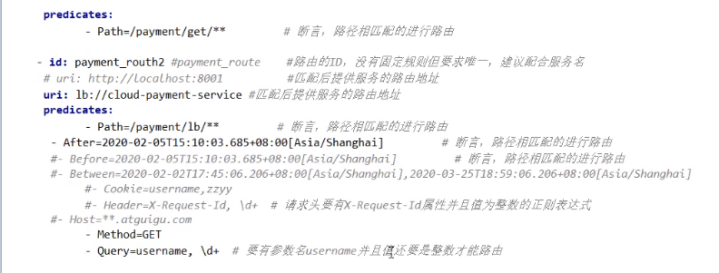

说白了,Predicate就是为了实现一组匹配规则,  让请求过来找到对应的Route进行处理


### 7）Filter的使用

#### 是什么

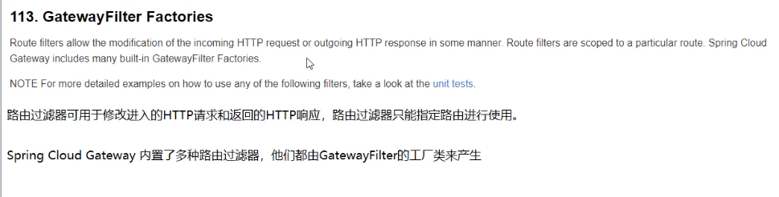

#### Spring Cloud Gateway的filter

SpringCloud中过滤器生命周期有两个，pre和post，类似于Spring的前置通知和后置通知。

过滤器的种类有两种，全局过滤器 [GlobalFilter](https://cloud.spring.io/spring-cloud-static/spring-cloud-gateway/2.2.1.RELEASE/reference/html/#global-filters)和网关过滤器[GatewayFilter](https://cloud.spring.io/spring-cloud-static/spring-cloud-gateway/2.2.1.RELEASE/reference/html/#gatewayfilter-factories)
     

#### 常用的GatewayFilter


>
>
>### [5.1. The `AddRequestHeader` `GatewayFilter` Factory](https://cloud.spring.io/spring-cloud-static/spring-cloud-gateway/2.2.1.RELEASE/reference/html/#the-addrequestheader-gatewayfilter-factory)
>
>The `AddRequestHeader` `GatewayFilter` factory takes a name and value parameter. The following example configures an `AddRequestHeader` `GatewayFilter`:
>
>Example 13. application.yml
>
>```yaml
>spring:
>  cloud:
>    gateway:
>      routes:
>      - id: add_request_header_route
>        uri: https://example.org
>        filters:
>        - AddRequestHeader=X-Request-red, blue
>```
>
>This listing adds `X-Request-red:blue` header to the downstream request’s headers for all matching requests.
>
> 此AddRequestHeader将“X-Request-red:blue”添加到所有匹配的下游请求。 
>
>`AddRequestHeader` is aware of the URI variables used to match a path or host. URI variables may be used in the value and are expanded at runtime. The following example configures an `AddRequestHeader` `GatewayFilter` that uses a variable:
>
> AddRequestHeader 中能够使用用于匹配路径或主机的URI变量。URI变量可以在值中使用，并在运行时展开。下面的例子配置了一个AddRequestHeader ，它使用了一个URL变量: 
>
>Example 14. application.yml
>
>```yaml
>spring:
>  cloud:
>    gateway:
>      routes:
>      - id: add_request_header_route
>        uri: https://example.org
>        predicates:
>        - Path=/red/{segment}
>        filters:
>        - AddRequestHeader=X-Request-Red, Blue-{segment}
>```

下面在项目中，我们将使用“ AddRequestParameter”网关过滤规则，在YAML文件中增加如下的配置即可：


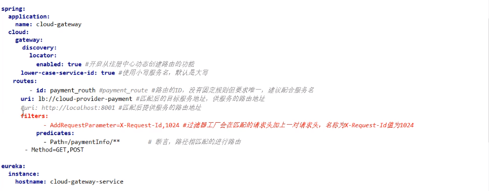  


#### 自定义过滤器

Hystrix提供了一些既定的规则，但是多数情况下，我们想要自定义自己的过滤规则，此时就可以通过实现“GlobalFilter”和“OrderId”两个接口来实现自定义的过滤规则。

 实例：

```java
package com.atguigu.springcloud.filter;

import lombok.extern.slf4j.Slf4j;
import org.springframework.cloud.gateway.filter.GatewayFilterChain;
import org.springframework.cloud.gateway.filter.GlobalFilter;
import org.springframework.core.Ordered;
import org.springframework.http.HttpStatus;
import org.springframework.http.server.reactive.ServerHttpRequest;
import org.springframework.stereotype.Component;
import org.springframework.web.server.ServerWebExchange;
import reactor.core.publisher.Mono;

import java.util.Date;


@Component
@Slf4j
public class MyLogGatewayFilter implements GlobalFilter, Ordered {

    @Override
    public Mono<Void> filter(ServerWebExchange exchange, GatewayFilterChain chain) {
        log.info("come in global filter: {}", new Date());

        ServerHttpRequest request = exchange.getRequest();
        String uname = request.getQueryParams().getFirst("uname");
        if (uname == null) {
            log.info("用户名为null，非法用户");
            exchange.getResponse().setStatusCode(HttpStatus.NOT_ACCEPTABLE);
            return exchange.getResponse().setComplete();
        }
        // 放行
        return chain.filter(exchange);
    }

    /**
     * 过滤器加载的顺序 越小,优先级别越高
     *
     * @return
     */
    @Override
    public int getOrder() {
        return 0;
    }
}

```

​    测试

启动：Cloud-provider-payment8001，Cloud-provider-payment8002，cloud-eureka-server7001和cloud-gateway-gateway9527。


http://localhost:9527/payment/lb?uname=z3，能够正常的访问，但是如果去掉username参数则无法访问页面。
​     

## 13. SpringCloud config分布式配置中心

### 1）概述

#### 分布式系统面临的---配置问题

微服务意味着要将单体应用中的业务拆分成一个个子服务，每个服务的粒度相对较小，因此系统中会出现大量的服务。由于每个服务，都需要必要的配置信息才能运行，所以一套集中式的、动态的配置管理设施是必不可少的。

SpringCloud提供了ConfigServer来解决这个问题，每一个微服务自己带着一个application.yml，上百个配置文件的管理将变得易如反手。

#### 是什么

SpringCloud Config为微服务架构中的微服务提供集中化的外部配置支持，配置服务器为各个不同微服务应用的所有环境提供了一个中心化的外部配置。

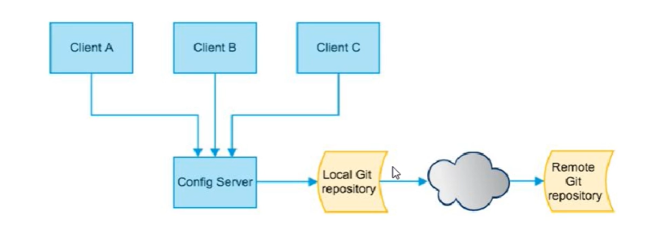

SpringCloud Config分为客户端和服务端两部分。

服务端也称为分布式配置中心，它是一个独立的微服务应用，用来连接配置服务器并未客户端提供获取配置信息，加密/解密信息等访问接口。

客户端则是通过指定的配置中心来管理应用资源，以及与业务相关的配置内容，并在启动的时候从配置中心获取和加载配置信息，配置服务器默认采用git来存储配置信息，这样就有助于对环境配置进行版本管理，并且可以通过git客户端工具来方便的管理和访问配置内容。


#### 能干嘛

- 集中管理配置文件

- 不同环境不同配置，动态化的配置更新，分环境比如dev/test/prod/beta/release

- 运行期间动态调整配置，不再需要在每个服务部署的机器上编写配置文件，服务会向配置中心同意拉去配置自己的信息

- 当配置发生改变时，服务不需要重启即可感知到配置的变化并应用新的配置

- 将配置信息以REST接口的形式暴露
      post/crul访问刷新即可...

#### 与GitHub整合配置

  由于SpringCloud Config默认使用GIt来存储配置文件(也有其他方式，比如支持SVN和本地文件)，但最推荐还是Git，而且使用的是http/https访问的形式

#### 官网

 https://spring.io/projects/spring-cloud-bus#learn 

 https://www.springcloud.cc/spring-cloud-bus.html#_quick_start 


### 2）Config服务端配置与测试

#### 在Github上创建名为“springcloud-config”的Repository，然后[克隆](https://github.com/zzyybs/springcloud-config)到本地

在克隆后的本地目录中，添加如下的yaml文件

config-dev.yml  

```yaml
config:
  info: "master branch,springcloud-config/config-dev.yml version=7" 
```

config-prod.yml  

```yaml
config:
  info: "master branch,springcloud-config/config-prod.yml version=1" 
```

config-test.yml

```yaml
config:
  info: "master branch,springcloud-config/config-test.yml version=1" 
```


然后推送到远程即可。


#### 新建cloud-config-center-3344模块，它即为Cloud的配置中心模块（cloudConfig Center）

#### 新建POM

```xml
<dependencies>
  <dependency>
      <groupId>org.springframework.cloud</groupId>
      <artifactId>spring-cloud-starter-bus-amqp</artifactId>
  </dependency>
  <dependency>
      <groupId>org.springframework.cloud</groupId>
      <artifactId>spring-cloud-config-server</artifactId>
  </dependency>
  <dependency>
      <groupId>org.springframework.cloud</groupId>
      <artifactId>spring-cloud-starter-netflix-eureka-client</artifactId>
  </dependency>
  <dependency>
      <groupId>org.springframework.boot</groupId>
      <artifactId>spring-boot-starter-web</artifactId>
  </dependency>
  <dependency>
      <groupId>org.springframework.boot</groupId>
      <artifactId>spring-boot-starter-actuator</artifactId>
  </dependency>
  <dependency>
      <groupId>org.projectlombok</groupId>
      <artifactId>lombok</artifactId>
      <optional>true</optional>
  </dependency>
  <dependency>
      <groupId>org.springframework.boot</groupId>
      <artifactId>spring-boot-starter-test</artifactId>
      <scope>test</scope>
  </dependency>

</dependencies>
```


#### 新建YML

```yaml
server:
  port: 3344

spring:
  application:
    name: cloud-config-center
  cloud:
    config:
      server:
        git:
          skipSslValidation: true # 跳过ssl认证
          uri: https://github.com/cosmoswong/springcloud-config.git
          search-paths:
            - com.springcloud-config
      label: master


eureka:
  client:
    service-url:
      defaultZone: http://eureka7001.com:7001/eureka

```


#### 新建主启动类

  ConfigCenterMain3344，  **@EnableConfigServer**

```java
package com.atguigu.springcloud;

import org.springframework.boot.SpringApplication;
import org.springframework.boot.autoconfigure.SpringBootApplication;
import org.springframework.cloud.config.server.EnableConfigServer;

/**
 * @ClassName: MainAppConfigCenter3344
 * @description:
 * @author: XZQ
 * @create: 2020/3/9 16:28
 **/
@SpringBootApplication
@EnableConfigServer
public class MainConfigCenter3344 {
    public static void main(String[] args) {
        SpringApplication.run(MainConfigCenter3344.class, args);
    }
}
```

 

#### 修改hosts文件，添加映射规则

```
127.0.0.1 config-3344.com
```

#### 测试是否获取上GitHub既存的配置

  启动服务3344，然后[测试](http://config-3344.com:3344/master/config-dev.yml)

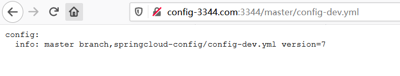


#### 读取配置规则

  官网
  /{label}/{application}-{profile}.yml
    master分支
    dev分支
  /{application}-{profile}.yml
  /{application}/{profile}/{/label}
  重点配置细节总结

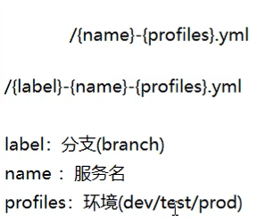

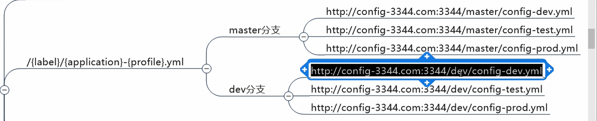


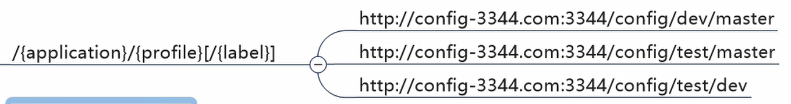


#### 成功实现了SpringCloudConfig通过Github获取配置信息


### 3）Config客户端配置与测试

#### 新建cloud-config-client-3355

#### POM

```xml
<dependencies>
    <dependency>
        <groupId>org.springframework.cloud</groupId>
        <artifactId>spring-cloud-starter-bus-amqp</artifactId>
    </dependency>
    <dependency>
        <groupId>org.springframework.cloud</groupId>
        <artifactId>spring-cloud-starter-config</artifactId>
        <version>2.2.2.RELEASE</version>
    </dependency>
    <dependency>
        <groupId>org.springframework.cloud</groupId>
        <artifactId>spring-cloud-starter-netflix-eureka-client</artifactId>
    </dependency>
    <dependency>
        <groupId>org.springframework.boot</groupId>
        <artifactId>spring-boot-starter-web</artifactId>
    </dependency>
    <dependency>
        <groupId>org.springframework.boot</groupId>
        <artifactId>spring-boot-starter-actuator</artifactId>
    </dependency>
    <dependency>
        <groupId>org.projectlombok</groupId>
        <artifactId>lombok</artifactId>
        <optional>true</optional>
    </dependency>
    <dependency>
        <groupId>org.springframework.boot</groupId>
        <artifactId>spring-boot-starter-test</artifactId>
        <scope>test</scope>
    </dependency>

</dependencies>
```


#### bootstrap.yml

```yaml
server:
  port: 3355

spring:
  application:
    name: config-client
  cloud:
    config:
      label: master # 分支名称
      name: config #配置文件名称
      profile: dev # 读取的后缀，上述三个综合，为master分支上的config-dev.yml的配置文件被读取，http://config-3344.com:3344/master/config-dev.yml
      uri: http://localhost:3344 #配置中心的地址
      
eureka:
  client:
    service-url:
      defaultZone: http://eureka7001.com:7001/eureka
```


注：关于BootStrap

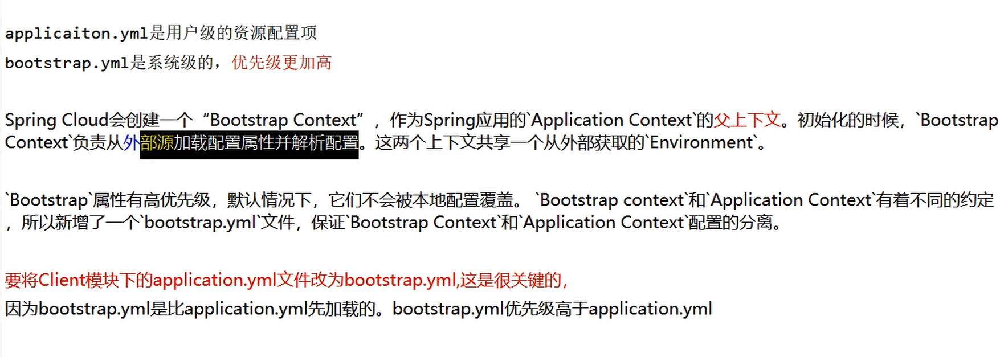


#### 修改config-dev.yml配置并提交到GitHub中，比如加个变量age或者版本号version


#### 主启动类

```java
package com.atguigu.springcloud;

import org.springframework.boot.SpringApplication;
import org.springframework.boot.autoconfigure.SpringBootApplication;
import org.springframework.cloud.netflix.eureka.EnableEurekaClient;

@SpringBootApplication
@EnableEurekaClient
public class ConfigClientMain3355 {
    public static void main(String[] args) {
        SpringApplication.run(ConfigClientMain3355.class, args);
    }
}
```


#### 业务类

```java
package com.atguigu.springcloud.controller;

import org.springframework.beans.factory.annotation.Value;
import org.springframework.cloud.context.config.annotation.RefreshScope;
import org.springframework.web.bind.annotation.GetMapping;
import org.springframework.web.bind.annotation.RestController;

@RestController
@RefreshScope
public class ConfigClientController {

    @Value("${config.info}")
    private String configInfo;

    @GetMapping("/configInfo")
    public String getConfigInfo() {
        return configInfo;
    }
}

```


#### 测试

http://localhost:3355/configInfo


成功实现了客户端3355访问SpringCloud Config3344，并通过GitHub获取信息配置

#### 问题随之而来，分布式配置的动态刷新问题

问题：在GitHub上修改配置信息，服务端3344能够及时的获悉修改，但是客户端3355在没有重启的前提下，无法及时获取到所修改的配置信息。


### 4）Config客户端之动态刷新

**使用动态刷新功能，能够避免每次更新服务器端配置都要重启客户端，客户端才能获取最新配置的问题。**


承接上面的实例，接着修改cloud-config-client3355。

#### POM引入actuator监控

```xml
<dependency>
    <groupId>org.springframework.boot</groupId>
    <artifactId>spring-boot-starter-actuator</artifactId>
</dependency>
```

通过该依赖，当项目发生变化的时候，能够被监控方说获知。

修改YML，暴露监控端口

```yaml
#暴露监控端点
management:
  endpoints:
    web:
      exposure:
        include: "*"
```


#### @refreshScope业务类Controller修改

```java
package com.atguigu.springcloud.controller;

import org.springframework.beans.factory.annotation.Value;
import org.springframework.cloud.context.config.annotation.RefreshScope;
import org.springframework.web.bind.annotation.GetMapping;
import org.springframework.web.bind.annotation.RestController;

@RestController
@RefreshScope
public class ConfigClientController {

    @Value("${config.info}")
    private String configInfo;

    @GetMapping("/configInfo")
    public String getConfigInfo() {
        return configInfo;
    }
}

```


#### 此时修改Github上的config-dev.yml配置文件

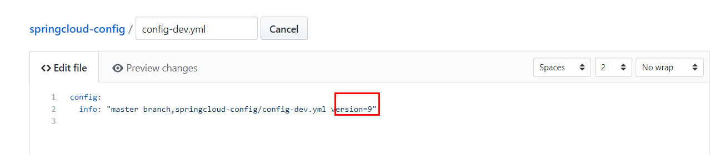


请求“http://localhost:3355/configInfo”，发现配置并没有随着发生变化，但是服务器端已经发生了变化，这种变化并没有同步到客户端上。

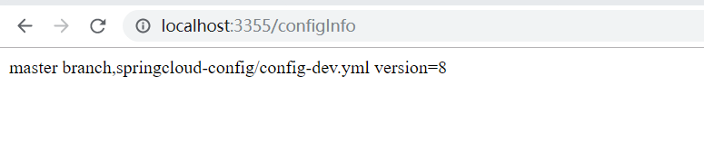

此时想要让客户端从服务器端同步配置，需要执行刷新客户端的请求，而且请求必须是POST方式的。

```shell
curl -X POST "http://localhost:3355/actuator/refresh"
```

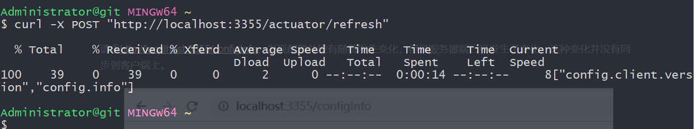

再次请求“http://localhost:3355/configInfo”，能够看到配置已经被刷新。


#### 新的问题

如果在一个配置服务器端对应于N个客户端，若每次都要执行上面的curl请求刷新配置，则效率比较低。为此我们可以借助于消息服务，客户端在订阅了对应的topic后，服务器端将会把变更主动的推送到所有订阅的客户端，这个过程是自动完成的，无需人工干预，这里的消息服务可以是RabbitMQ或Kafka。


## 14. SpringCloud Bus消息总线

### 1）概述

  上一讲解的加深和扩充，一言以蔽之
    分布式自动刷新配置功能
    Spring Cloud Bus配合Spring Cloud Config使用可以实现配置的动态刷新
  是什么

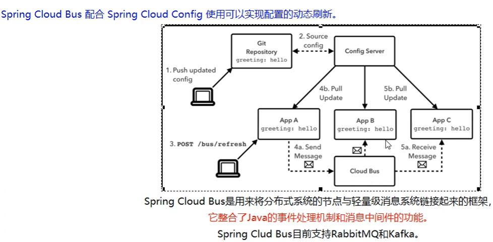


​    Bus支持两种消息代理:RabbitMQ和Kafka
  能干嘛

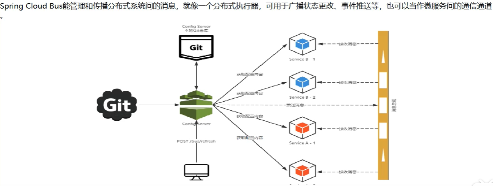

  为什么被称为总线


### 2）RabbitMQ环境配置

1.  安装Elang，下载地址https://www.erlang.org/downloads

2.  安装RabbitMQ，下载地址https://github.com/rabbitmq/rabbitmq-server/releases/download/v3.8.3/rabbitmq-server-3.8.3.exe

3.  进入RabbitMQ安装目录下的sbin目录
    输入以下命令启动管理功能
    ```shell
    rabbitmq-plugins enable rabbitmq_management
    ```
1.   访问地址看是否成功安装
   ​    http://localhost:15672
    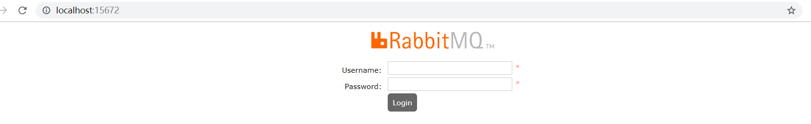
   
     默认用户名和密码：guest guest

### 3）SpringCloud Bus动态刷新全局广播

####   全局广播动态刷新设计思想

1. 利用消息总线触发一个客户端/bus/refresh，从而刷新所有客户端配置

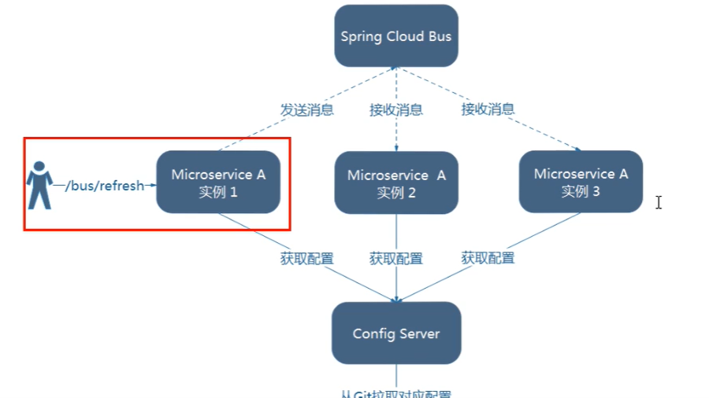


2. 利用消息总线触发一个服务端ConfigServer的/bus/refresh端点，从而刷新所有客户端配置


3. 相对于图1，图2的架构显然更加合适，这是因为

   * 客户端/bus/refresh，打破了微服务的职责单一性。因为微服务本身是业务模块，不应该承担配置刷新的职责

   * 破坏了微服务各节点的对等性

   * 有一定的局限性。例如，微服务在迁移时，网络地址常会发生变化，此时如果想要做到自动刷新就会带来更多的修改
     

   

#### 给cloud-config-center-3344配置中心服务端添加消息总线支持

pom.xml

```xml
<dependency>
    <groupId>org.springframework.cloud</groupId>
    <artifactId>spring-cloud-starter-bus-amqp</artifactId>
</dependency>
```

 bootstrap.yaml

```yaml
server:
  port: 3344

spring:
  application:
    name: cloud-config-center
  cloud:
    config:
      server:
        git:
          skipSslValidation: true # 跳过ssl认证
          uri: https://github.com/cosmoswong/springcloud-config.git
          search-paths:
            - com.springcloud-config
      label: master

rabbitmq:
  host: localhost
  port: 5672
  username: guest
  password: guest

eureka:
  client:
    service-url:
      defaultZone: http://eureka7001.com:7001/eureka

# 暴露bus刷新配置的端点
management:
  endpoints:
    web:
      exposure:
        include: "bus-refresh"

```

#### 给cloud-config-center-3355配置中心服务端添加消息总线支持

pom.xml

```xml
<dependency>
    <groupId>org.springframework.boot</groupId>
    <artifactId>spring-boot-starter-actuator</artifactId>
</dependency>
<dependency>
    <groupId>org.springframework.cloud</groupId>
    <artifactId>spring-cloud-starter-bus-amqp</artifactId>
</dependency>		
```

 bootstrap.yaml

```yaml
server:
  port: 3355

spring:
  application:
    name: config-client
  cloud:
    config:
      label: master # 分支名称
      name: config #配置文件名称
      profile: dev # 读取的后缀，上述三个综合，为master分支上的config-dev.yml的配置文件被读取，http://config-3344.com:3344/master/config-dev.yml
      uri: http://localhost:3344 #配置中心的地址


rabbitmq: #rabbitmq相关配置，15672是web管理端口，5672是mq访问端口
  port: 5672
  host: localhost
  username: guest
  password: guest


eureka:
  client:
    service-url:
      defaultZone: http://eureka7001.com:7001/eureka

#暴露监控端点
management:
  endpoints:
    web:
      exposure:
        include: "*"
```

####   给cloud-config-center-3366配置中心服务端添加消息总线支持

pom.xml

```xml
<dependency>
    <groupId>org.springframework.boot</groupId>
    <artifactId>spring-boot-starter-actuator</artifactId>
</dependency>
<dependency>
    <groupId>org.springframework.cloud</groupId>
    <artifactId>spring-cloud-starter-bus-amqp</artifactId>
</dependency>		
```

   bootstrap.yaml

```yaml
server:
  port: 3366

spring:
  application:
    name: config-client
  cloud:
    config:
      label: master # 分支名称
      name: config #配置文件名称
      profile: dev # 读取的后缀，上述三个综合，为master分支上的config-dev.yml的配置文件被读取，http://config-3344.com:3344/master/config-dev.yml
      uri: http://localhost:3344 #配置中心的地址


rabbitmq: #rabbitmq相关配置，15672是web管理端口，5672是mq访问端口
  port: 5672
  host: localhost
  username: guest
  password: guest


eureka:
  client:
    service-url:
      defaultZone: http://eureka7001.com:7001/eureka

#暴露监控端点
management:
  endpoints:
    web:
      exposure:
        include: "*"
```

#### 测试

分别查看

<http://eureka7001.com:7001/>


<http://config-3344.com:3344/master/config-dev.yml>

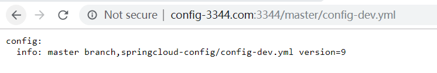

<http://localhost:3355/configInfo>


<http://localhost:3366/configInfo>


在Github上修改“**config-dev.yml**”版本号为10

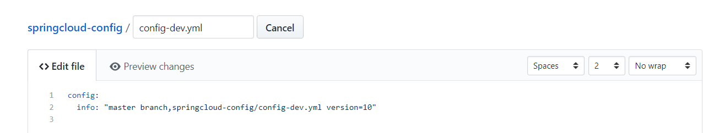


再次刷新并查看：http://localhost:3355/configInfo，http://localhost:3366/configInfo，http://config-3344.com:3344/master/config-dev.yml，可以看到3344上已经发生了变化，但是3355和3366上没有发生变化。


发送Post请求

```yaml
curl -X POST "http://localhost:3344/actuator/bus-refresh"
```

再次刷新并查看：http://localhost:3355/configInfo，http://localhost:3366/configInfo，能够发现版本号都变为了10。

  

### 4）SpringCloud Bus动态刷新定点通知

如果想要实现定点通知，也即只通知部分的客户端，则可以借助于配置中心来刷新指定的客户端。

```
http://{config server host}:{config server port}/actutor/bus-refresh/{destination}
```

案例：现在只通知3355，不通知3366。

1. 修改Github上的“”文件，修改版本号为11

2. 执行以下命令，将配置刷新到cloud-config-client3355

   ```
   curl -X POST "http://localhost:3344/actuator/bus-refresh/config-client:3355"
   ```

   注：

   - config-client：为客户端“cloud-config-client3355”微服务名
   - 3355：为客户端“cloud-config-client3355”微服务端口

3. 观察版本号变化：http://localhost:3355/configInfo

   
4. 观察版本号变化：http://localhost:3366/configInfo

   


​    通过以上的实例能够发现，/bus/refresh请求不再发送到所有客户端，而是发给destination参数所指定的客户端。


###   5）通知总结All

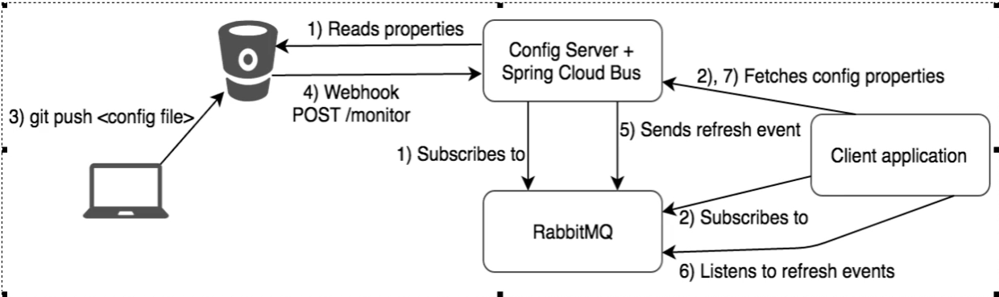

1. 配置中心订阅


## 15. SpringCloud Stream消息驱动

### 1）消息驱动概述

####   是什么

Spring Cloud Stream是一个构建消息驱动微服务的框架。

应用程序通过inputs或者outputs来与Spring Cloud Stream中binder对象交互。

通过绑定器，Spring Cloud Stream的binder对象负责与消息中间件交互所以,我们只需要搞清楚如何与Spring Cloud Streamk互就可以方便使用消息驱动的方式。通过使用Spring Integration来连接消息代理中间件以实现消息事件驱动。Spring Cloud Stream为一些供应商的消息中间件产品提供了个性化的自动化配置实现,引用了发布-订阅、消费组、分区的三个核心概念。目前仅支持RabbitMQ, Kafka. 

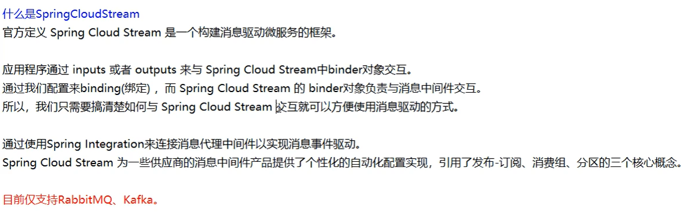


​    一句话
​      屏蔽底层消息中间件的差异，降低切换成本，统一消息的编程模型
​    官网
​      https://spring.io/projects/spring-cloud-stream
​      Spring Cloud Stream中文指导手册

 https://m.wang1314.com/doc/webapp/topic/20971999.html 

 [https://blog.csdn.net/qq_32734365/article/details/81413218#spring-cloud-stream%E4%B8%AD%E6%96%87%E6%8C%87%E5%AF%BC%E6%89%8B%E5%86%8C](https://blog.csdn.net/qq_32734365/article/details/81413218#spring-cloud-stream中文指导手册) 

####   设计思想

####     标准MQ

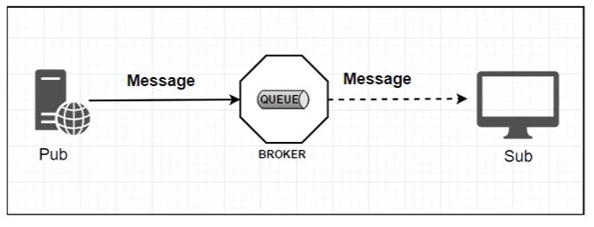

​      生产者/消费者之间靠消息媒介传递信息内容
​        Message
​      消息必须走特定的通道
​        消息通道MessageChannel
​      消息通道里的消息如何被消费呢，谁负责收发处理
​        消息通道MessageChannel的子接口SubscribableChannel，由MessageHandler消息处理器所订阅

####     为什么使用Cloud Stream

比方说我们用到了RabbitMQ和Kafka，由于这两个消息中间件的架构上的不同，如RabbitMQ有exchange, kafka有Topic和Partitions分区概念。

中间件架构上的差异，造成项目开发过程中的困扰。如只使用其中一种消息队列，则业务扩展，增加或变更消息队列时，需要大量的改动。对此springcloud Stream提供了一种解耦合的方式。


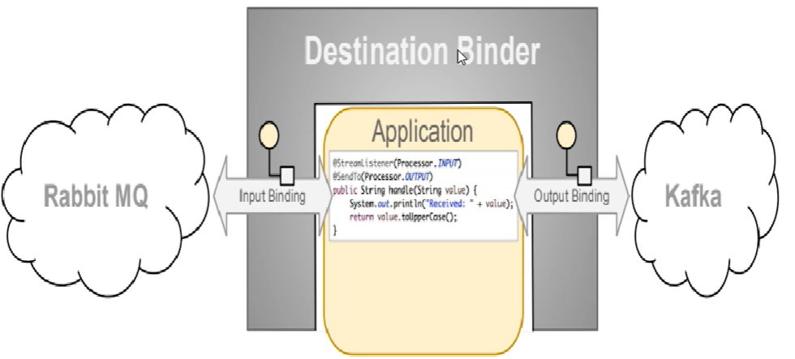

​       

 stream凭什么可以统一底层差异

在没有绑定器这个概念的情况下,我们的SpringBoot应用要直接与消息中间件进行信息交互的时候,由于各消息中间件构建的初衷不同,它们的实现细节上会有较大的差异性

通过使用绑定器作为中间层，能实现应用程序与消息中间件细节之间的隔离。通过向应用程序暴露统一的Channel通道，使得应用程序无需考虑不同的消息中间件。 


Binder

Stream对消息中间件的进一步封可以做到代码层面对中间件的无感知，甚至可以动态的切换中间件(rabbitmq切换为kafka)，使得微服务开发的高度解耦，使得开发人员更多关注自己的业务。

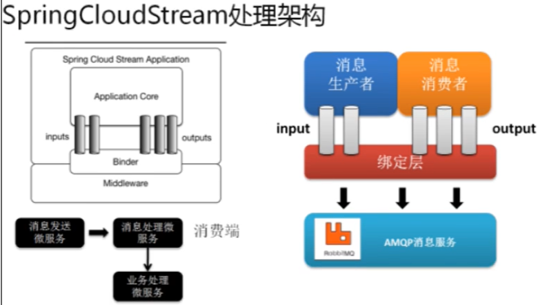

​        

INPUT对应于消费者
OUTPUT对应于生产者
Stream中的消息通信方式遵循了发布-订阅模式
Topic主题进行广播
在RabbitMQ就是Exchange
在Kafka中就是Topic

####   Spring Cloud Stream标准流程套路

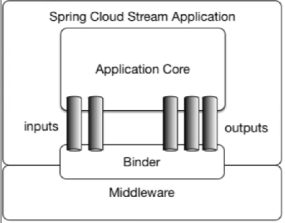

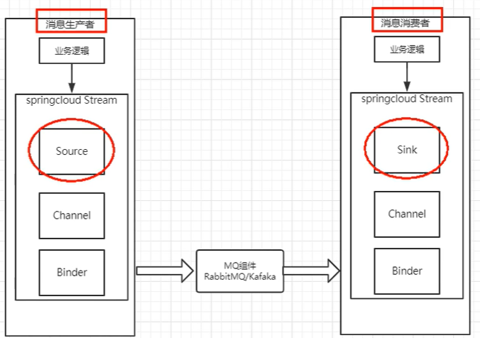

​    

1. Binder：很方便的连接中间件，屏蔽差异
2. Channel：通道，是队列Queue的一种抽象，在消息通讯系统中就是实现存储和转发的媒介，通过Channel对队列进行配置

3. Source和Sink：简单的理解为参照对象，从Stream发布消息就是输出，接受消息就是输入
         

####   编码API和常用注解

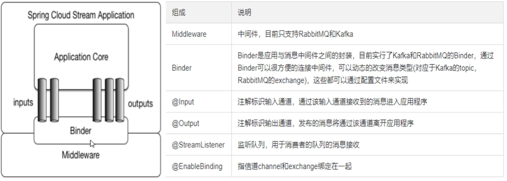

### 2）案例说明

  RabbitMQ环境已经OK
  工程中新建三个子模块
    cloud-stream-rabbitmq-provider8801 ，作为消息试生产者进行发消息模块
    cloud-stream-rabbitmq-consumer8802，作为消息接收模块
    cloud-stream-rabbitmq-consumer8803，作为消息接收模块

### 3）消息驱动之生产者

#### 新建“cloud-stream-rabbitmq-provider8801”

####  pom.xml

```xml
<dependency>
    <groupId>org.springframework.cloud</groupId>
    <artifactId>spring-cloud-starter-stream-rabbit</artifactId>
</dependency>
```

#### application.yml

```yaml
server:
  port: 8801

spring:
  application:
    name: cloud-stream-provider
  cloud:
    stream:
      binders: # 在此处配置要绑定的rabbitMQ的服务信息
        defaultRabbit: # 表示定义的名称，用于binding的整合
          type: rabbit # 消息中间件类型
          environment: # 设置rabbitMQ的相关环境配置
            spring:
              rabbitmq:
                host: localhost
                port: 5672
                username: guest
                password: guest
      bindings: # 服务的整合处理
        output: # 这个名字是一个通道的名称
          destination: studyExchange # 表示要使用的exchange名称定义
          content-type: application/json # 设置消息类型，本次为json，文本则设为text/plain
          binder: defaultRabbit # 设置要绑定的消息服务的具体设置

eureka:
  client:
    service-url:
      defaultZone: http://eureka7001.com:7001/eureka
  instance:
    lease-renewal-interval-in-seconds: 2 # 设置心跳的间隔时间，默认30
    lease-expiration-duration-in-seconds: 5 # 超过5秒间隔，默认90
    instance-id: send-8801.com # 主机名
    prefer-ip-address: true # 显示ip


```


#### 主启动类

```java
package com.atguigu.springcloud;

import org.springframework.boot.SpringApplication;
import org.springframework.boot.autoconfigure.SpringBootApplication;


@SpringBootApplication
public class StreamMQMain8801 {
    public static void main(String[] args) {
        SpringApplication.run(StreamMQMain8801.class, args);
    }
}

```


#### 业务类

发送消息接口

```java
package com.atguigu.springcloud.service;

public interface IMessageProvider {
    String send();
}

```

发送消息接口实现类

```java
package com.atguigu.springcloud.service.impl;

import com.atguigu.springcloud.service.IMessageProvider;
import org.springframework.beans.factory.annotation.Autowired;
import org.springframework.cloud.stream.annotation.EnableBinding;
import org.springframework.cloud.stream.messaging.Source;
import org.springframework.messaging.MessageChannel;
import org.springframework.messaging.support.MessageBuilder;

import java.util.UUID;


@EnableBinding(Source.class)//定义消息的推送管道
public class MessageProviderImpl implements IMessageProvider {

    @Autowired
    private MessageChannel output;//消息发送通道

    @Override
    public String send() {
        String serial = UUID.randomUUID().toString();
        output.send(MessageBuilder.withPayload(serial).build());
        System.out.println("*****serial***" + serial);
        return serial;
    }
}

```

controller

```java
package com.atguigu.springcloud.controller;

import com.atguigu.springcloud.service.IMessageProvider;
import org.springframework.beans.factory.annotation.Autowired;
import org.springframework.web.bind.annotation.GetMapping;
import org.springframework.web.bind.annotation.RestController;

@RestController
public class SendMessageController {

    @Autowired
    private IMessageProvider messageProvider;

    @GetMapping("/sendMessage")
    public String send() {
        return messageProvider.send();
    }
}

```


#### 测试

1. 启动7001 eureka

2. 启动rabbitmq

   ```shell
   rabbitmq-plugins enable rabbitmq management
   ```

    http://localhost:15672/ 
   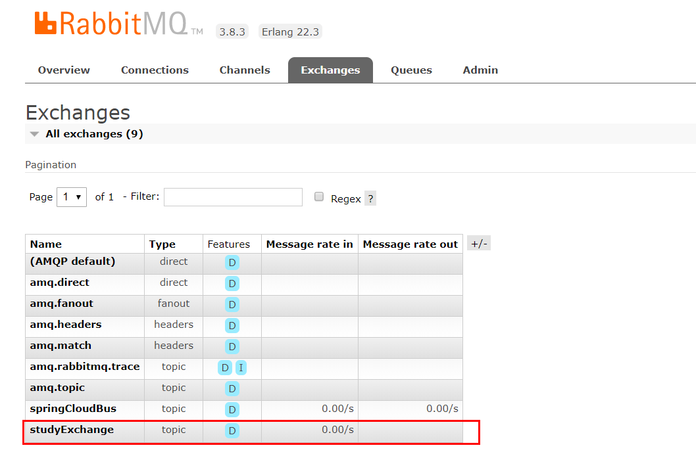

   

3. 启动"cloud-stream-rabbitmq-provider8801"

4. 访问 
    http://localhost:8801/sendMessage 

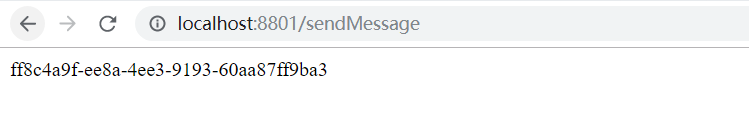

http://localhost:15672/#/
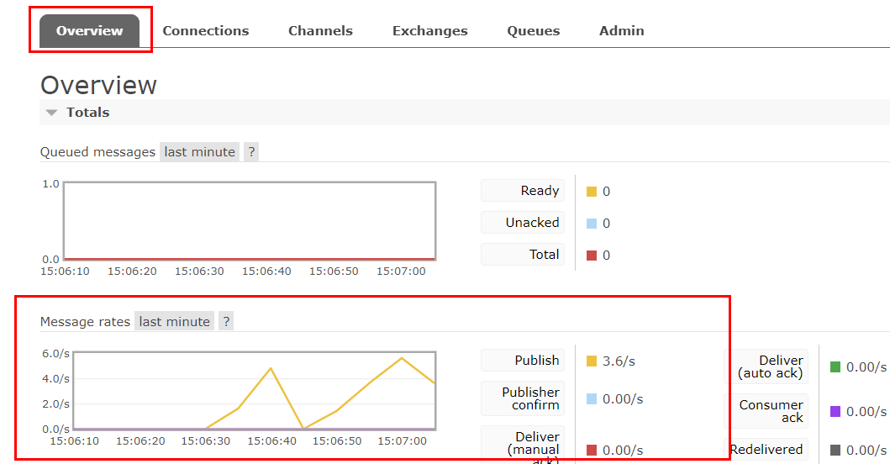 


### 4）消息驱动之消费者

#### 新建“cloud-stream-rabbitmq-consumer8802”module

#### pom.xml

```xml
<dependency>
    <groupId>org.springframework.cloud</groupId>
    <artifactId>spring-cloud-starter-stream-rabbit</artifactId>
</dependency>
```


#### yml

application.yml

```yaml
server:
  port: 8802

spring:
  application:
    name: cloud-stream-consumer
  cloud:
    stream:
      binders: # 在此处配置要绑定的rabbitMQ的服务信息
        defaultRabbit: # 表示定义的名称，用于binding的整合
          type: rabbit # 消息中间件类型
          environment: # 设置rabbitMQ的相关环境配置
            spring:
              rabbitmq:
                host: localhost
                port: 5672
                username: guest
                password: guest
      bindings: # 服务的整合处理
        input: # 这个名字是一个通道的名称
          destination: studyExchange # 表示要使用的exchange名称定义
          content-type: application/json # 设置消息类型，本次为json，文本则设为text/plain
          binder: defaultRabbit # 设置要绑定的消息服务的具体设置
          group: spectrumrpcA # 不同的组存在重复消费，相同的组之间竞争消费。

eureka:
  client:
    service-url:
      defaultZone: http://eureka7001.com:7001/eureka
  instance:
    lease-renewal-interval-in-seconds: 2 # 设置心跳的间隔时间，默认30
    lease-expiration-duration-in-seconds: 5 # 超过5秒间隔，默认90
    instance-id: receive-8802.com #主机名
    prefer-ip-address: true # 显示ip


```


#### 主启动类

```java
package com.atguigu.springcloud;

import org.springframework.boot.SpringApplication;
import org.springframework.boot.autoconfigure.SpringBootApplication;


@SpringBootApplication
public class StreamMQMain8802 {
    public static void main(String[] args) {
        SpringApplication.run(StreamMQMain8802.class, args);
    }
}

```


#### 业务类

```java
package com.atguigu.springcloud.controller;

import org.springframework.beans.factory.annotation.Value;
import org.springframework.cloud.stream.annotation.EnableBinding;
import org.springframework.cloud.stream.annotation.StreamListener;
import org.springframework.cloud.stream.messaging.Sink;
import org.springframework.messaging.Message;
import org.springframework.stereotype.Component;

@Component
@EnableBinding(Sink.class)
public class ReceiveMessageListenerController {

    @Value("${server.port}")
    private String serverPort;

    @StreamListener(Sink.INPUT)
    public void input(Message<String> message) {
        System.out.println("消费者1，-------" + message.getPayload() + "\t port:" + serverPort);
    }

}

```


#### 测试8801发送8802接收消息

 http://localhost:8801/sendMessage 


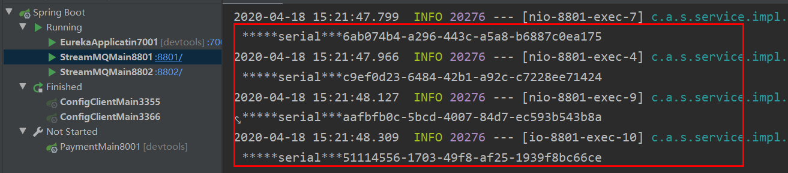


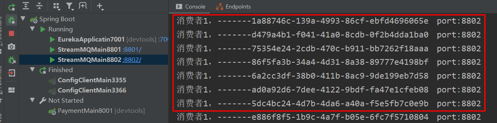

 http://localhost:15672/#/queues/%2F/studyExchange.spectrumrpcA 

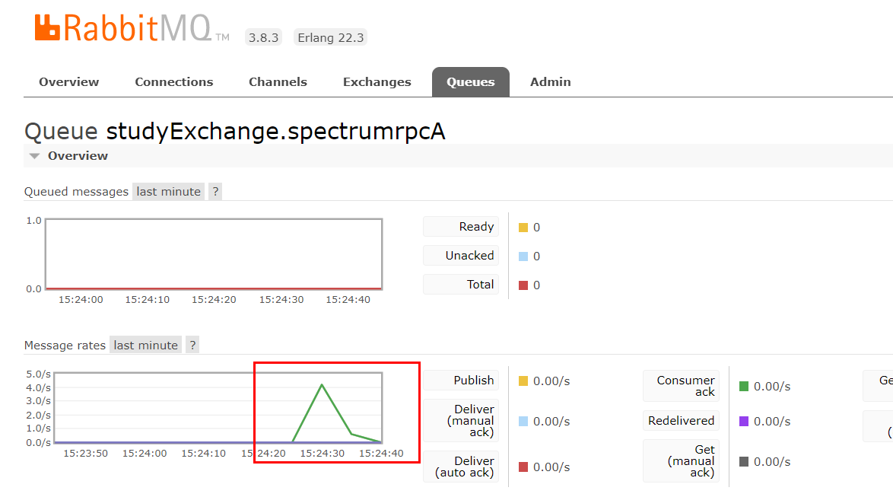


### 5）分组消费与持久化

#### 依照cloud-stream-rabbitmq-consumer8802，clone出来一份cloud-stream-rabbitmq-consumer8803


#### 启动

-  RabbitMQ 
- cloud-eureka-server7001 服务注册  
- cloud-stream-rabbitmq-provider8801 消息生产 
- cloud-stream-rabbitmq-consumer8802 消息消费 
- cloud-stream-rabbitmq-consumer8803 消息消费

#### 运行后有两个问题

有重复消费问题

消息持久化问题

#### 消费

目前是cloud-stream-rabbitmq-consumer8802和cloud-stream-rabbitmq-consumer8803同时收到了消息，存在重复消费问题      

如何解决?
分组和持久化属性group      

生产实际案例

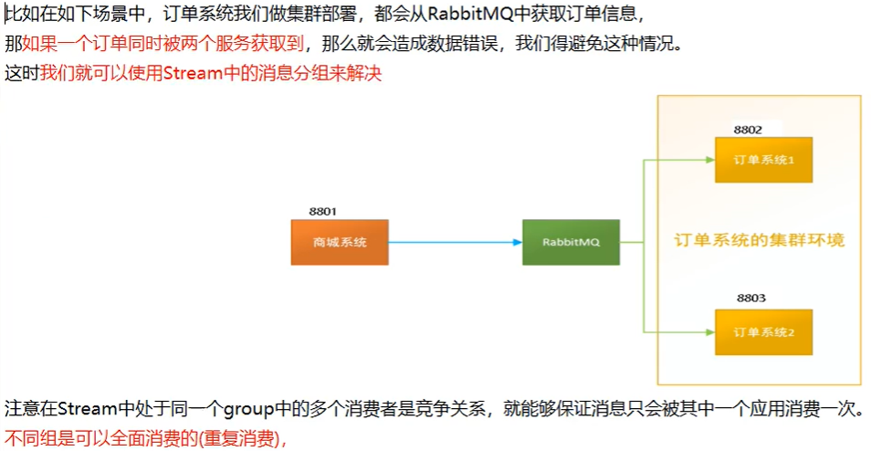

#### 分组

原理
微服务应用放置于同一个group中，就能够保证消息只会被其中一个应用消费一次。不同的组是可以消费同一个分区的数据，同一个组内的消费者不能消费同一分区的数据，任何时候只有其中一个可以消费

分别修改“cloud-stream-rabbitmq-consumer8802”和“cloud-stream-rabbitmq-consumer8803”的application.yml文件，将两个消费者置于同一个消费者组“spectrumrpcA”内：

```yaml
spring:
  application:
    name: cloud-stream-consumer
  cloud:
    stream:
      binders: # 在此处配置要绑定的rabbitMQ的服务信息
        ...
      bindings: # 服务的整合处理
        input: # 这个名字是一个通道的名称
         ...
          group: spectrumrpcA # 不同的组存在重复消费，相同的组之间竞争消费。
```

再次访问： http://localhost:8801/sendMessage ，后台查看到消息被分别的发送到了“cloud-stream-rabbitmq-consumer8802”，“cloud-stream-rabbitmq-consumer8803”。

此时观察RabbitMQ的控制台，可以看到“spectrumrpcA”分组下，有两个消费者：

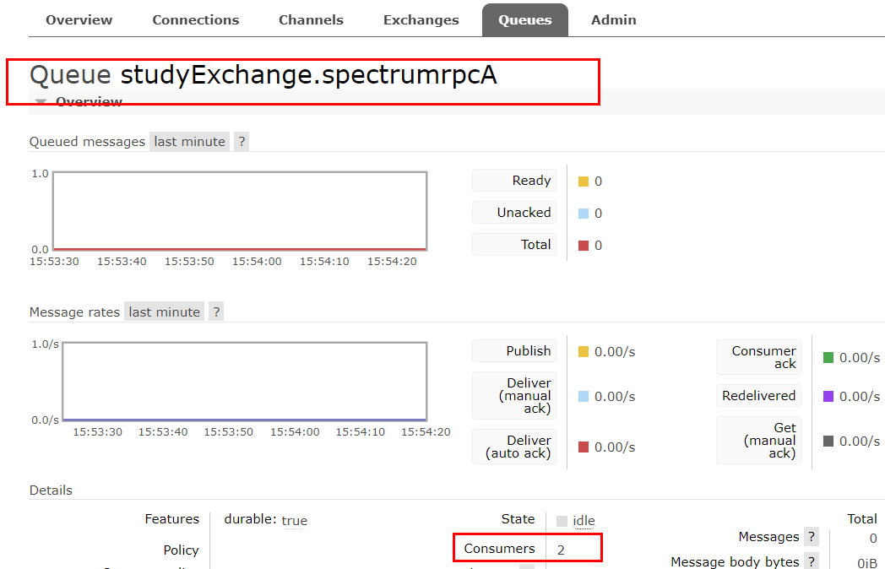


结论
    8802/8803实现了轮询分组，每次只有一个消费者，8801模块的发的消息只能被8802或8803其中一个接收到，这样避免了重复消费

#### 持久化

通过上述，解决了重复消费问题，再看看持久化

1. 停止cloud-stream-rabbitmq-consumer8802和cloud-stream-rabbitmq-consumer8803
2. 只除掉cloud-stream-rabbitmq-consumer8802分组group：spectrumrpcA
3. cloud-stream-rabbitmq-consumer8801发送4条消息到rabbitmq
4. 启动cloud-stream-rabbitmq-consumer8802，启动后后台没有打出来消息
5. 启动cloud-stream-rabbitmq-consumer8803，启动后台打出来了MQ上的消息

小结：这个实例说明了，同一个组内的消费者，即便消费过程中发生了中断，重启后也能够继续消费消息，但是没有组归属的将不会接受到消息。

## 16. SpringCloud Sleuth分布式链路跟踪

### 1）概述

  为什么会出现这个技术？需要解决哪些问题？
    问题

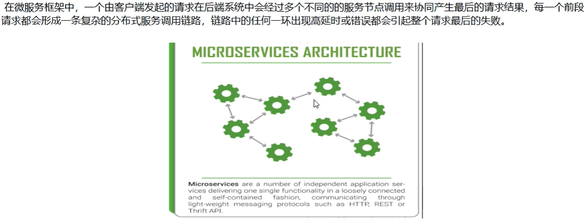

  是什么
    https://cloud.spring.io/spring-cloud-sleuth/reference/html/
    Spring Cloud Sleuth提供了一套完整的服务跟踪的解决方案
    在分布式系统中提供追踪解决方案并且兼容支持了zipkin
  解决

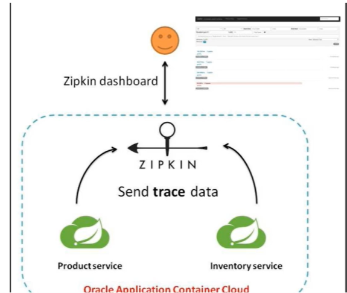

### 2）搭建链路监控步骤

####  zipkin

##### 下载

​      SpringCloud从F版已不需要自己构建Zipkin Server了，只需要调用jar包即可
​      https://dl.bintray.com/openzipkin/maven/io/zipkin/java/zipkin-server/
​      zipkin-server-2.12.9-exec.jar

##### 运行jar

​      **java -jar zipkin-server-2.12.9-exec.jar**

运行过程如下：

```shell
Administrator@git MINGW64 /d/Program_Files
$       java -jar zipkin-server-2.12.9-exec.jar
                                    ********
                                  **        **
                                 *            *
                                **            **
                                **            **
                                 **          **
                                  **        **
                                    ********
                                      ****
                                      ****
        ****                          ****
     ******                           ****                                 ***
  ****************************************************************************
    *******                           ****                                 ***
        ****                          ****
                                       **
                                       **


             *****      **     *****     ** **       **     **   **
               **       **     **  *     ***         **     **** **
              **        **     *****     ****        **     **  ***
             ******     **     **        **  **      **     **   **

:: Powered by Spring Boot ::         (v2.1.4.RELEASE)

2020-04-18 18:04:53.235  INFO 13064 --- [           main] z.s.ZipkinServer                         : Starting ZipkinServer on git with PID 13064 (D:\Program_Files\zipkin-server-2.12.9-exec.jar started by Administrator in D:\Program_Files)
2020-04-18 18:04:53.242  INFO 13064 --- [           main] z.s.ZipkinServer                         : The following profiles are active: shared
2020-04-18 18:04:55.091  INFO 13064 --- [           main] c.l.a.c.Flags                            : com.linecorp.armeria.verboseExceptions: false (default)
2020-04-18 18:04:55.092  INFO 13064 --- [           main] c.l.a.c.Flags                            : com.linecorp.armeria.verboseSocketExceptions: false (default)
2020-04-18 18:04:55.094  INFO 13064 --- [           main] c.l.a.c.Flags                            : com.linecorp.armeria.verboseResponses: false (default)
2020-04-18 18:04:55.149  INFO 13064 --- [           main] c.l.a.c.Flags                            : com.linecorp.armeria.useEpoll: false (default)
2020-04-18 18:04:56.827  INFO 13064 --- [           main] c.l.a.c.Flags                            : com.linecorp.armeria.useOpenSsl: true (default)
2020-04-18 18:04:56.829  INFO 13064 --- [           main] c.l.a.c.Flags                            : com.linecorp.armeria.maxNumConnections: 2147483647 (default)
2020-04-18 18:04:56.831  INFO 13064 --- [           main] c.l.a.c.Flags                            : com.linecorp.armeria.numCommonWorkers: 8 (default)
2020-04-18 18:04:56.844  INFO 13064 --- [           main] c.l.a.c.Flags                            : com.linecorp.armeria.numCommonBlockingTaskThreads: 200 (default)
2020-04-18 18:04:56.860  INFO 13064 --- [           main] c.l.a.c.Flags                            : com.linecorp.armeria.defaultMaxRequestLength: 10485760 (default)
2020-04-18 18:04:56.861  INFO 13064 --- [           main] c.l.a.c.Flags                            : com.linecorp.armeria.defaultMaxResponseLength: 10485760 (default)
2020-04-18 18:04:56.869  INFO 13064 --- [           main] c.l.a.c.Flags                            : com.linecorp.armeria.defaultRequestTimeoutMillis: 10000 (default)
2020-04-18 18:04:56.886  INFO 13064 --- [           main] c.l.a.c.Flags                            : com.linecorp.armeria.defaultResponseTimeoutMillis: 15000 (default)
2020-04-18 18:04:56.889  INFO 13064 --- [           main] c.l.a.c.Flags                            : com.linecorp.armeria.defaultConnectTimeoutMillis: 3200 (default)
2020-04-18 18:04:56.906  INFO 13064 --- [           main] c.l.a.c.Flags                            : com.linecorp.armeria.defaultServerIdleTimeoutMillis: 15000 (default)
2020-04-18 18:04:56.918  INFO 13064 --- [           main] c.l.a.c.Flags                            : com.linecorp.armeria.defaultClientIdleTimeoutMillis: 10000 (default)
2020-04-18 18:04:56.920  INFO 13064 --- [           main] c.l.a.c.Flags                            : com.linecorp.armeria.defaultHttp2InitialConnectionWindowSize: 1048576 (default)
2020-04-18 18:04:56.938  INFO 13064 --- [           main] c.l.a.c.Flags                            : com.linecorp.armeria.defaultHttp2InitialStreamWindowSize: 1048576 (default)
2020-04-18 18:04:56.953  INFO 13064 --- [           main] c.l.a.c.Flags                            : com.linecorp.armeria.defaultHttp2MaxFrameSize: 16384 (default)
2020-04-18 18:04:56.970  INFO 13064 --- [           main] c.l.a.c.Flags                            : com.linecorp.armeria.defaultHttp2MaxStreamsPerConnection: 2147483647 (default)
2020-04-18 18:04:56.979  INFO 13064 --- [           main] c.l.a.c.Flags                            : com.linecorp.armeria.defaultHttp2MaxHeaderListSize: 8192 (default)
2020-04-18 18:04:56.984  INFO 13064 --- [           main] c.l.a.c.Flags                            : com.linecorp.armeria.defaultHttp1MaxInitialLineLength: 4096 (default)
2020-04-18 18:04:56.994  INFO 13064 --- [           main] c.l.a.c.Flags                            : com.linecorp.armeria.defaultHttp1MaxHeaderSize: 8192 (default)
2020-04-18 18:04:57.018  INFO 13064 --- [           main] c.l.a.c.Flags                            : com.linecorp.armeria.defaultHttp1MaxChunkSize: 8192 (default)
2020-04-18 18:04:57.021  INFO 13064 --- [           main] c.l.a.c.Flags                            : com.linecorp.armeria.defaultUseHttp2Preface: true (default)
2020-04-18 18:04:57.031  INFO 13064 --- [           main] c.l.a.c.Flags                            : com.linecorp.armeria.defaultUseHttp1Pipelining: false (default)
2020-04-18 18:04:57.048  INFO 13064 --- [           main] c.l.a.c.Flags                            : com.linecorp.armeria.defaultBackoffSpec: exponential=200:10000,jitter=0.2 (default)
2020-04-18 18:04:57.049  INFO 13064 --- [           main] c.l.a.c.Flags                            : com.linecorp.armeria.defaultMaxTotalAttempts: 10 (default)
2020-04-18 18:04:57.056  INFO 13064 --- [           main] c.l.a.c.Flags                            : com.linecorp.armeria.routeCache: maximumSize=4096 (default)
2020-04-18 18:04:57.064  INFO 13064 --- [           main] c.l.a.c.Flags                            : com.linecorp.armeria.compositeServiceCache: maximumSize=256 (default)
2020-04-18 18:04:57.071  INFO 13064 --- [           main] c.l.a.c.Flags                            : com.linecorp.armeria.parsedPathCache: maximumSize=4096 (default)
2020-04-18 18:04:57.078  INFO 13064 --- [           main] c.l.a.c.Flags                            : com.linecorp.armeria.headerValueCache: maximumSize=4096 (default)
2020-04-18 18:04:57.090  INFO 13064 --- [           main] c.l.a.c.Flags                            : com.linecorp.armeria.cachedHeaders: :authority,:scheme,:method,accept-encoding,content-type (default)
2020-04-18 18:04:57.097  INFO 13064 --- [           main] c.l.a.c.Flags                            : com.linecorp.armeria.annotatedServiceExceptionVerbosity: unhandled (default)
2020-04-18 18:04:57.102  INFO 13064 --- [           main] c.l.a.c.Flags                            : /dev/epoll not available: java.lang.IllegalStateException: Only supported on Linux
2020-04-18 18:04:57.111  INFO 13064 --- [           main] c.l.a.c.Flags                            : Using OpenSSL: BoringSSL, 0x1010007f
2020-04-18 18:04:57.550  INFO 13064 --- [           main] c.l.a.c.u.SystemInfo                     : Hostname: git (from 'hostname' command)
2020-04-18 18:05:00.626  INFO 13064 --- [oss-http-*:9411] c.l.a.s.Server                           : Serving HTTP at /0:0:0:0:0:0:0:0:9411 - http://127.0.0.1:9411/
2020-04-18 18:05:00.635  INFO 13064 --- [           main] c.l.a.s.ArmeriaAutoConfiguration         : Armeria server started at ports: {/0:0:0:0:0:0:0:0:9411=ServerPort(/0:0:0:0:0:0:0:0:9411, [http])}
2020-04-18 18:05:00.688  INFO 13064 --- [           main] c.d.d.core                               : DataStax Java driver 3.7.1 for Apache Cassandra
2020-04-18 18:05:00.705  INFO 13064 --- [           main] c.d.d.c.GuavaCompatibility               : Detected Guava >= 19 in the classpath, using modern compatibility layer
```


##### 运行控制台

http://localhost:9411/zipkin/

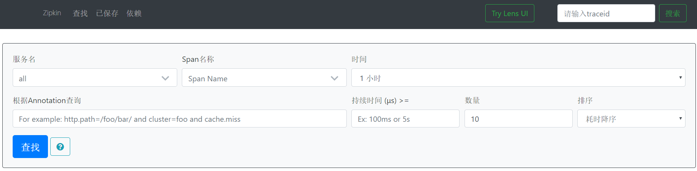

##### 术语

完整的调用链路

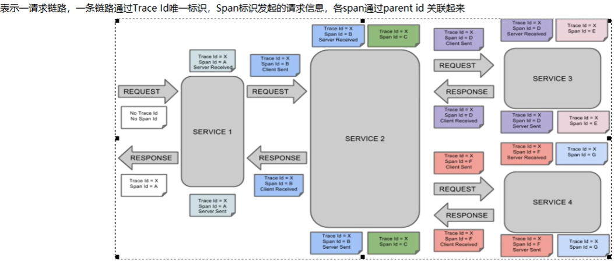

上图what

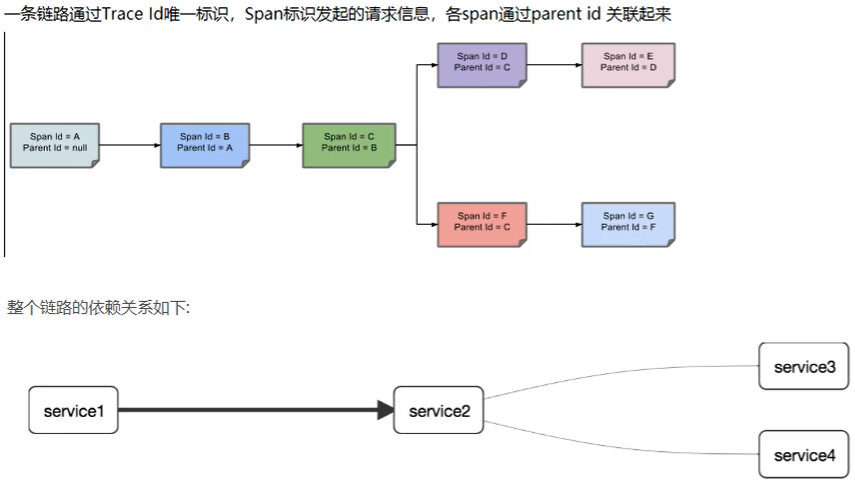


名词解释
Trace：类似于树结构的Span结合，表示一条调用链路，存在唯一标识
span：标识调用链路来源，通俗的理解span就是一次请求信息

#### 服务提供者

##### 修改cloud-provider-payment8001 module

##### POM

修改POM.xml

```xml
 <!--包含了sleuth+zipkin-->
<dependency>
    <groupId>org.springframework.cloud</groupId>
    <artifactId>spring-cloud-starter-zipkin</artifactId>
</dependency>
```

##### YML

修改application.yml，添加eureka.zipkin

```yaml
 zipkin:
    base-url: http://localhost:9411
    sleuth:
      sampler:
        probability: 1
```

##### 业务类PaymentController 

com.atguigu.springcloud.controller.PaymentController

```java
    @GetMapping("/zipkin")
    public String paymentZipkin() {
        return "hellp zipkin";
    }
```


#### 服务消费者

##### 修改cloud-consumer-order80

##### POM

修改pom.xml添加如下配置：

```xml
 <!--包含了sleuth+zipkin-->
<dependency>
    <groupId>org.springframework.cloud</groupId>
    <artifactId>spring-cloud-starter-zipkin</artifactId>
</dependency>
```


##### YML

application.yaml，添加spring.zipkin

```yaml
  zipkin:
    base-url: http://localhost:9411
    sleuth:
      sampler:
        probability: 1
```


##### 业务类OrderMain80

com.xzq.springcloud.controller.OrderController

```java
    @GetMapping("/consumer/payment/zipkin")
    public String paymentZipkin() {
        return restTemplate.getForObject(PAYMENT_URL + "/payment/zipkin", String.class);
    }
```


#### 依次启动eureka7001/Cloud-provider-payment8001/cloud-consumer-order80

​    80调用8001几次测试下： http://localhost/consumer/payment/zipkin 

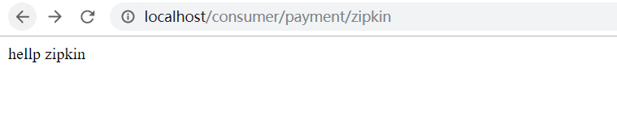

#### 打开浏览器访问http://localhost:9411

​    会出现以下界面

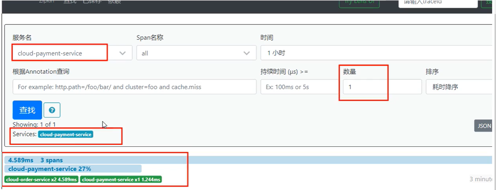

查看

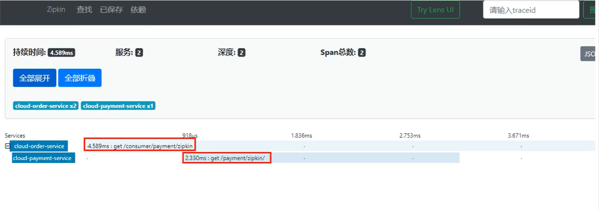

​    查看依赖关系

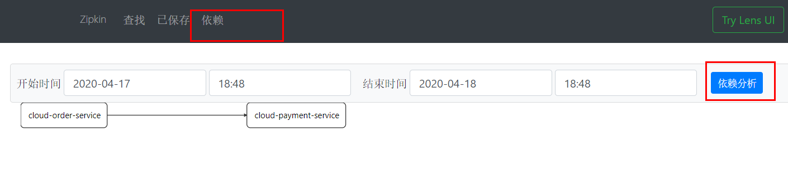


## 17. SpringCloud Alibaba入门简介


### 1）why会出现SpringCloud alibaba

  Spring Cloud Netflix项目进入到维护模式

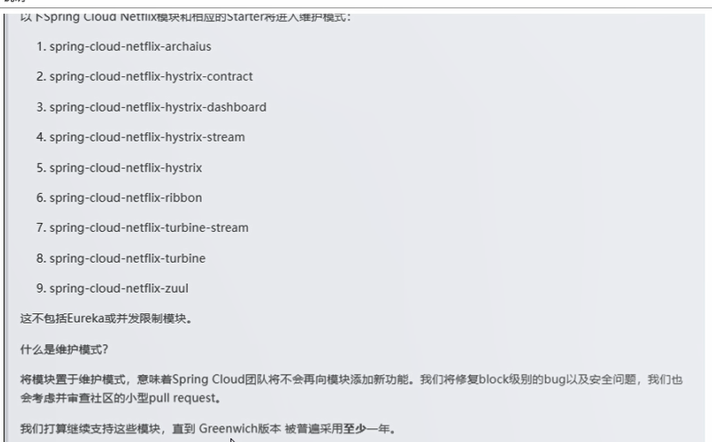  SpringCloud Netflix Projects Entering Maintenance Mode
    什么是维护模式

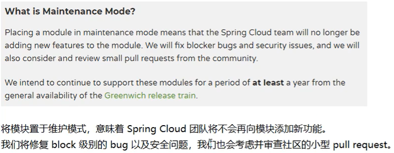    进入维护模式意味着什么


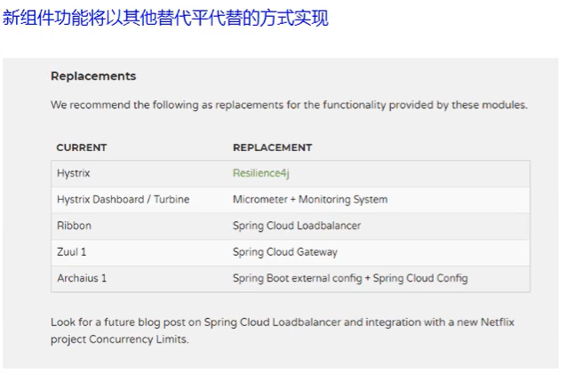

### 2）SpringCloud alibaba带来了什么

  是什么

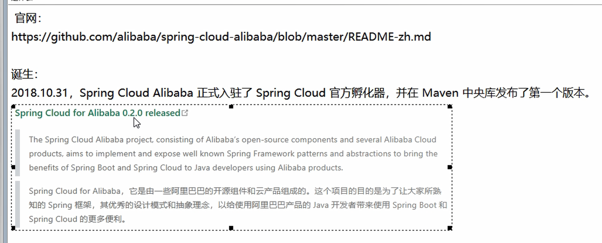

  能干嘛


  去哪下

 https://github.com/alibaba/spring-cloud-alibaba/blob/master/README-zh.md 
 https://spring.io/projects/spring-cloud-alibaba#learn 

  怎么玩

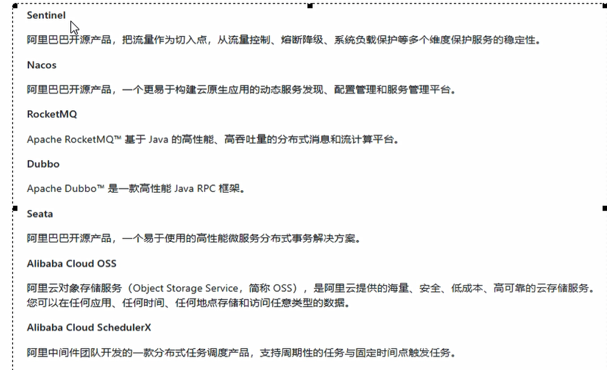


### 3）SpringCloud alibaba学习资料获取

 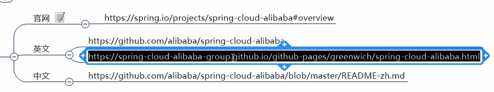


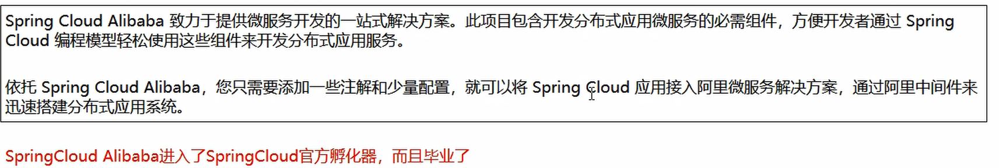


## 18. SpringCloud Alibaba Nacos服务注册和配置中心

### 1）Nacos简介


#### 为什么叫Nacos

  Nacos为Nameing，Configuration和Service的组合。

#### 是什么

* Nacos一个更易于构建原生应用的动态服务发现、配置管理和服务管理平台

* Nacos就是注册中心+配置中心的组合，等价于Nacos=Eureka+Config+Bus
        

#### 能干嘛

替代Eureka做服务注册中心
替代Config做服务配置中心

#### 去哪下

下载地址：https://github.com/alibaba/Nacos

官网文档
    https://nacos.io/zh-cn/
    https://spring-cloud-alibaba-group.github.io/github-pages/greenwich/spring-cloud-alibaba.html#_spring_cloud_alibaba_nacos_discovery

#### 各种注册中心对比

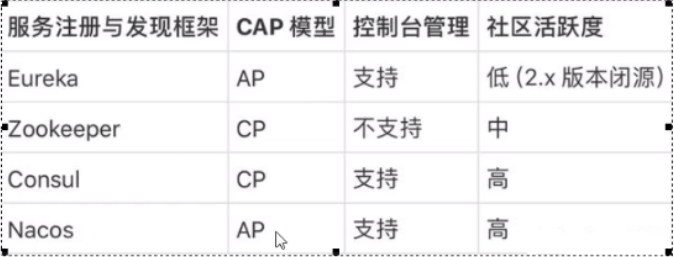

 据称在阿里巴巴内部，Nacos有超过10万的运行实例，已经过了类似双十一等各种大型流量的考验 


### 2）安装并运行Nacos

1. 已经安装了Java8+Maven

2. [下载](https://github.com/alibaba/Nacos)Nacos

3. 解压安装包，并运行bin目录下的startup.cmd

   ```shell
   D:\Program_Files\nacos-server-1.2.1\nacos\bin>startup.cmd
   
            ,--.
          ,--.'|
      ,--,:  : |                                           Nacos 1.2.1
   ,`--.'`|  ' :                       ,---.               Running in stand alone mode, All function modules
   |   :  :  | |                      '   ,'\   .--.--.    Port: 8848
   :   |   \ | :  ,--.--.     ,---.  /   /   | /  /    '   Pid: 23440
   |   : '  '; | /       \   /     \.   ; ,. :|  :  /`./   Console: http://169.254.204.80:8848/nacos/index.html
   '   ' ;.    ;.--.  .-. | /    / ''   | |: :|  :  ;_
   |   | | \   | \__\/: . ..    ' / '   | .; : \  \    `.      https://nacos.io
   '   : |  ; .' ," .--.; |'   ; :__|   :    |  `----.   \
   |   | '`--'  /  /  ,.  |'   | '.'|\   \  /  /  /`--'  /
   '   : |     ;  :   .'   \   :    : `----'  '--'.     /
   ;   |.'     |  ,     .-./\   \  /            `--'---'
   '---'        `--`---'     `----'
   
   2020-04-18 21:13:16,013 INFO Bean 'org.springframework.security.config.annotation.configuration.ObjectPostProcessorConfiguration' of type [org.springframework.security.config.annotation.configuration.ObjectPostProcessorConfiguration$$EnhancerBySpringCGLIB$$aa5a2904] is not eligible for getting processed by all BeanPostProcessors (for example: not eligible for auto-proxying)
   
   2020-04-18 21:13:16,130 INFO Bean 'objectPostProcessor' of type [org.springframework.security.config.annotation.configuration.AutowireBeanFactoryObjectPostProcessor] is not eligible for getting processed by all BeanPostProcessors (for example: not eligible for auto-proxying)
   
   2020-04-18 21:13:16,133 INFO Bean 'org.springframework.security.access.expression.method.DefaultMethodSecurityExpressionHandler@1a245833' of type [org.springframework.security.access.expression.method.DefaultMethodSecurityExpressionHandler] is not eligible for getting processed by all BeanPostProcessors (for example: not eligible for auto-proxying)
   
   2020-04-18 21:13:16,141 INFO Bean 'org.springframework.security.config.annotation.method.configuration.GlobalMethodSecurityConfiguration' of type [org.springframework.security.config.annotation.method.configuration.GlobalMethodSecurityConfiguration$$EnhancerBySpringCGLIB$$cf2ecbb6] is not eligible for getting processed by all BeanPostProcessors (for example: not eligible for auto-proxying)
   
   2020-04-18 21:13:16,156 INFO Bean 'methodSecurityMetadataSource' of type [org.springframework.security.access.method.DelegatingMethodSecurityMetadataSource] is not eligible for getting processed by all BeanPostProcessors (for example: not eligible for auto-proxying)
   
   2020-04-18 21:13:18,396 INFO Tomcat initialized with port(s): 8848 (http)
   
   2020-04-18 21:13:18,716 INFO Root WebApplicationContext: initialization completed in 6113 ms
   
   2020-04-18 21:13:33,062 INFO Initializing ExecutorService 'applicationTaskExecutor'
   
   2020-04-18 21:13:33,398 INFO Adding welcome page: class path resource [static/index.html]
   
   2020-04-18 21:13:34,037 INFO Creating filter chain: Ant [pattern='/**'], []
   
   2020-04-18 21:13:34,103 INFO Creating filter chain: any request, [org.springframework.security.web.context.request.async.WebAsyncManagerIntegrationFilter@72f46e16, org.springframework.security.web.context.SecurityContextPersistenceFilter@314b8f2d, org.springframework.security.web.header.HeaderWriterFilter@4a8a60bc, org.springframework.security.web.csrf.CsrfFilter@2cab9998, org.springframework.security.web.authentication.logout.LogoutFilter@71104a4, org.springframework.security.web.savedrequest.RequestCacheAwareFilter@5118388b, org.springframework.security.web.servletapi.SecurityContextHolderAwareRequestFilter@4a3e3e8b, org.springframework.security.web.authentication.AnonymousAuthenticationFilter@3c9168dc, org.springframework.security.web.session.SessionManagementFilter@7859e786, org.springframework.security.web.access.ExceptionTranslationFilter@669513d8]
   
   2020-04-18 21:13:34,237 INFO Exposing 2 endpoint(s) beneath base path '/actuator'
   ```

   

4. 访问http://localhost:8848/nacos
     默认用户名密码都是nacos

5. 结果页面

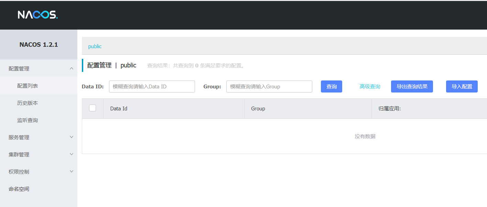


### 3）Nacos作为服务注册中心演示

#### 基于Nacos的服务提供者

##### 新建module"cloudalibaba-provider-payment9001"


##### POM

pom.xml

```xml
<dependencies>
        <dependency>
            <groupId>com.alibaba.cloud</groupId>
            <artifactId>spring-cloud-starter-alibaba-nacos-discovery</artifactId>
        </dependency>
        <dependency>
            <groupId>org.springframework.boot</groupId>
            <artifactId>spring-boot-starter-web</artifactId>
        </dependency>
        <dependency>
            <groupId>org.springframework.boot</groupId>
            <artifactId>spring-boot-starter-actuator</artifactId>
        </dependency>
        <dependency>
            <groupId>org.projectlombok</groupId>
            <artifactId>lombok</artifactId>
            <optional>true</optional>
        </dependency>
        <dependency>
            <groupId>org.springframework.boot</groupId>
            <artifactId>spring-boot-starter-test</artifactId>
            <scope>test</scope>
        </dependency>
    </dependencies>
```


##### YML

application.yml

```yaml
server:
  port: 9001

spring:
  application:
    name: nacos-payment-provider
  cloud:
    nacos:
      discovery:
        server-addr: localhost:8848

management:
  endpoints:
    web:
      exposure:
        include: "*"
```


#####  主启动

```java
package com.xzq.springcloud;

import org.springframework.boot.SpringApplication;
import org.springframework.boot.autoconfigure.SpringBootApplication;
import org.springframework.cloud.client.discovery.EnableDiscoveryClient;


@SpringBootApplication
@EnableDiscoveryClient
public class PaymentMain9001 {
    public static void main(String[] args) {
        SpringApplication.run(PaymentMain9001.class, args);
    }
}

```


##### 业务类

```java
package com.atguigu.springcloud.controller;

import org.springframework.beans.factory.annotation.Value;
import org.springframework.web.bind.annotation.GetMapping;
import org.springframework.web.bind.annotation.PathVariable;
import org.springframework.web.bind.annotation.RestController;


@RestController
public class PaymentController {

    @Value("${server.port}")
    private String serverPort;

    @GetMapping("/payment/nacos/{id}")
    public String getPayment(@PathVariable("id") Integer id) {
        return "nacos register, serverport=" + serverPort + "\t id:" + id;
    }
}

```


##### 测试

 http://localhost:8848/nacos/#/serviceManagement 

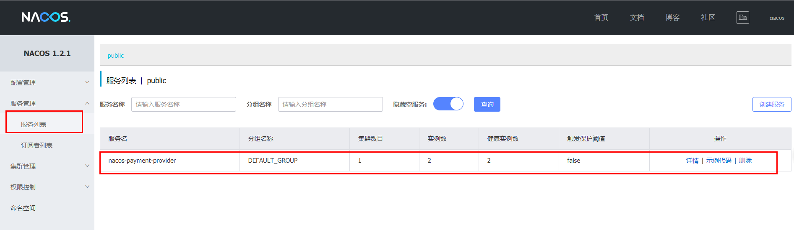

 http://localhost:9001/payment/nacos/1 

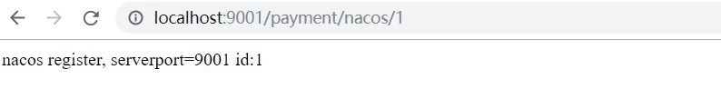

为了下一章演示nacos集群，参考9001新建9002

如果不想拷贝，也可以使用虚拟端口映射

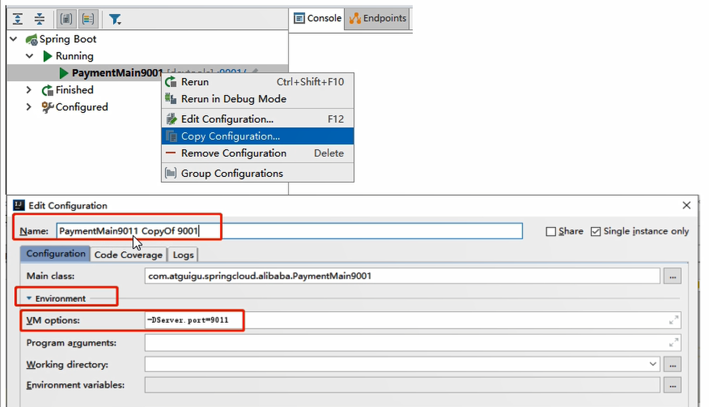

#### 基于Nacos的服务消费者

##### 新建Module“cloudalibaba-consumer-nacos-order83”

##### POM

pom.xml

```xml
<dependencies>
        <dependency>
            <groupId>com.alibaba.cloud</groupId>
            <artifactId>spring-cloud-starter-alibaba-nacos-discovery</artifactId>
        </dependency>
        <dependency>
            <groupId>org.xzq.springcloud</groupId>
            <artifactId>cloud-api-commons</artifactId>
            <version>${project.version}</version>
        </dependency>
        <dependency>
            <groupId>org.springframework.boot</groupId>
            <artifactId>spring-boot-starter-web</artifactId>
        </dependency>
        <dependency>
            <groupId>org.springframework.boot</groupId>
            <artifactId>spring-boot-starter-actuator</artifactId>
        </dependency>
        <dependency>
            <groupId>org.projectlombok</groupId>
            <artifactId>lombok</artifactId>
            <optional>true</optional>
        </dependency>
        <dependency>
            <groupId>org.springframework.boot</groupId>
            <artifactId>spring-boot-starter-test</artifactId>
            <scope>test</scope>
        </dependency>
    </dependencies>
```

为什么Nacos支持负载均衡

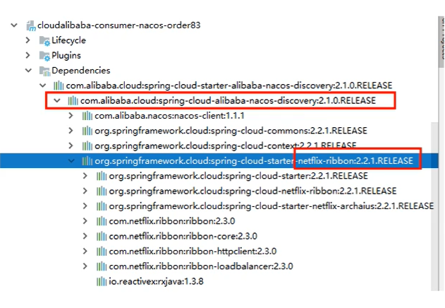


##### YML

application.yml

```yaml
server:
  port: 83

spring:
  application:
    name: nacos-order-consumer
  cloud:
    nacos:
      discovery:
        server-addr: localhost:8848

#消费者将要去访问的微服务名称（注册成功进nacos的微服务提供者）
service-url:
  nacos-user-service: http://nacos-payment-provider
```


##### 主启动

```java
package com.atguigu.springcloud;

import org.springframework.boot.SpringApplication;
import org.springframework.boot.autoconfigure.SpringBootApplication;
import org.springframework.cloud.client.discovery.EnableDiscoveryClient;


@SpringBootApplication
@EnableDiscoveryClient
public class OrderNacosMain83 {
    public static void main(String[] args) {
        SpringApplication.run(OrderNacosMain83.class, args);
    }
}

```


##### 业务类

com.atguigu.springcloud.config.ApplicationContextConfig

```java
package com.atguigu.springcloud.config;

import org.springframework.cloud.client.loadbalancer.LoadBalanced;
import org.springframework.context.annotation.Bean;
import org.springframework.context.annotation.Configuration;
import org.springframework.web.client.RestTemplate;


@Configuration
public class ApplicationContextConfig {

    @Bean
    @LoadBalanced
    public RestTemplate getRestTemplate() {
        return new RestTemplate();
    }
}

```

com.atguigu.springcloud.controller.OrderNacosController

```java
package com.atguigu.springcloud.controller;

import org.springframework.beans.factory.annotation.Autowired;
import org.springframework.beans.factory.annotation.Value;
import org.springframework.web.bind.annotation.GetMapping;
import org.springframework.web.bind.annotation.PathVariable;
import org.springframework.web.bind.annotation.RestController;
import org.springframework.web.client.RestTemplate;


@RestController
public class OrderNacosController {

    @Autowired
    private RestTemplate restTemplate;

    @Value("${service-url.nacos-user-service}")
    private String serverUrl;

    @GetMapping("/consumer/payment/nacos/{id}")
    public String paymentInfo(@PathVariable("id") Integer id) {
        return restTemplate.getForObject(serverUrl + "/payment/nacos/" + id, String.class);
    }

}

```


##### 测试

 http://localhost:8848/nacos/#/serviceManagement?namespace= 

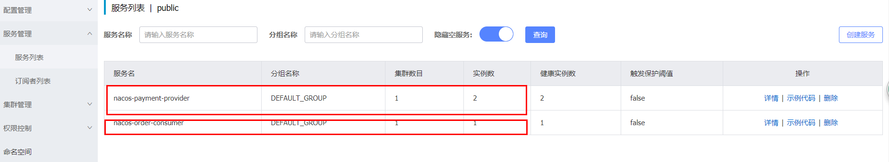


 http://localhost:83/consumer/payment/nacos/1 

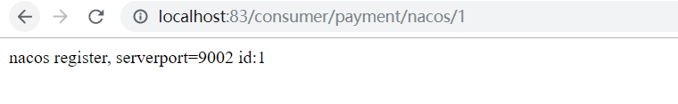

如果访问报错：

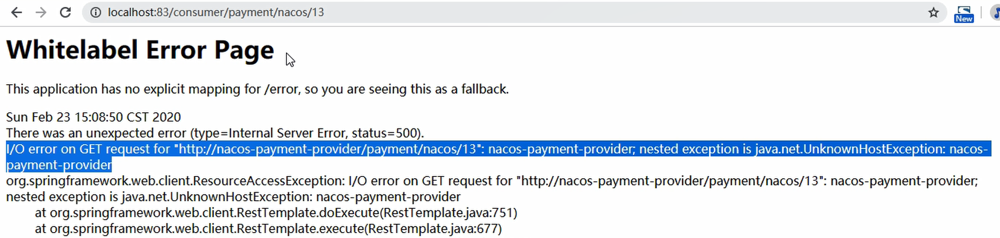

这是因为没有加上负载均衡注解所导致的，需要加上**“@LoadBalanced”**注解：

```java
@Configuration
public class ApplicationContextConfig {

    @Bean
    @LoadBalanced
    public RestTemplate getRestTemplate() {
        return new RestTemplate();
    }
}
```


#### 服务注册中心对比

Nacos全景图所示


Nacos和CAP

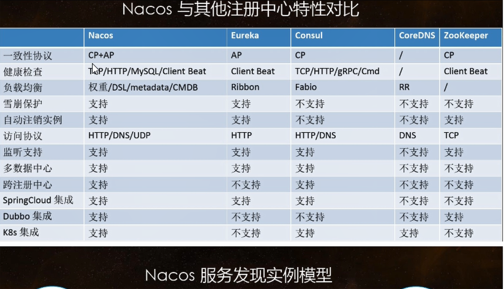

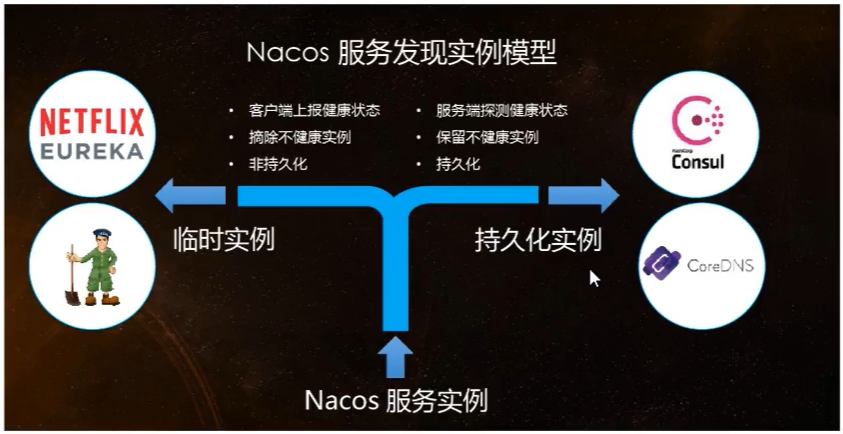

  切换
    Nacos支持AP和CP模式的切换


### 4）Nacos作为服务配置中心演示


#### Nacos作为配置中心-基础配置

#####   cloudalibaba-config-nacos-client3377

#####   POM

pom.xml

```xml
<dependencies>
        <dependency>
            <groupId>com.alibaba.cloud</groupId>
            <artifactId>spring-cloud-starter-alibaba-nacos-config</artifactId>
        </dependency>
        <dependency>
            <groupId>com.alibaba.cloud</groupId>
            <artifactId>spring-cloud-starter-alibaba-nacos-discovery</artifactId>
        </dependency>
        <dependency>
            <groupId>org.springframework.boot</groupId>
            <artifactId>spring-boot-starter-web</artifactId>
        </dependency>
        <dependency>
            <groupId>org.springframework.boot</groupId>
            <artifactId>spring-boot-starter-actuator</artifactId>
        </dependency>
        <dependency>
            <groupId>org.projectlombok</groupId>
            <artifactId>lombok</artifactId>
            <optional>true</optional>
        </dependency>
        <dependency>
            <groupId>org.springframework.boot</groupId>
            <artifactId>spring-boot-starter-test</artifactId>
            <scope>test</scope>
        </dependency>
    </dependencies>
```


#####   YML

​    why配置两个

    YML
      bootstrap

```yaml
server:
  port: 3377
spring:
  application:
    name: nacos-config-client
  cloud:
    nacos:
      discovery:
        server-addr: localhost:8848 # 注册中心
      config:
        server-addr: localhost:8848 # 配置中心
        file-extension: yaml # 这里指定的文件格式需要和nacos上新建的配置文件后缀相同，否则读不到
#        group: TEST_GROUP
#        namespace: 4ccc4c4c-51ec-4bd1-8280-9e70942c0d0c

#  ${spring.application.name}-${spring.profile.active}.${spring.cloud.nacos.config.file-extension}
```

​      application

```yaml
spring:
  profiles:
    active: dev # 开发环境
#    active: test # 测试环境
#    active: info # 开发环境
```


#####   主启动类

```java
package com.atguigu;

import org.springframework.boot.SpringApplication;
import org.springframework.boot.autoconfigure.SpringBootApplication;
import org.springframework.cloud.client.discovery.EnableDiscoveryClient;

@SpringBootApplication
@EnableDiscoveryClient
public class NacosConfigClientMain3377 {
    public static void main(String[] args) {
        SpringApplication.run(NacosConfigClientMain3377.class, args);
    }
}

```


#####   业务类

```java
package com.atguigu.controller;

import org.springframework.beans.factory.annotation.Value;
import org.springframework.cloud.context.config.annotation.RefreshScope;
import org.springframework.web.bind.annotation.GetMapping;
import org.springframework.web.bind.annotation.RestController;


@RestController
@RefreshScope//实现配置自动更新
public class ConfigClientController {
    @Value("${config.info}")
    private String configInfo;

    @GetMapping("/config/info")
    public String getConfigInfo() {
        return configInfo;
    }
}

```


#####   在Nacos中添加配置信息

​    Nacos中的匹配规则
​      理论
​        Nacos中的dataid的组成格式及与SpringBoot配置文件中的匹配规则
​        官网

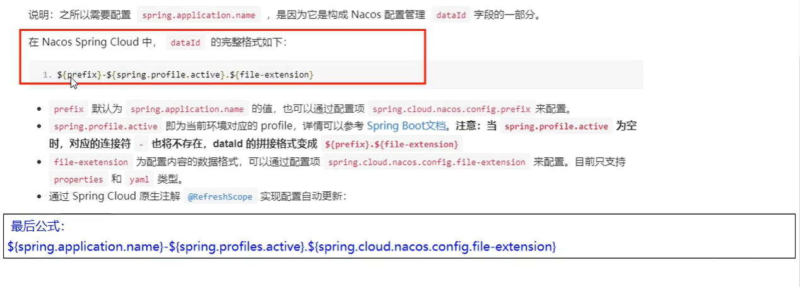

 

```
${spring.application.name}-${spring.profile.active}.${spring.cloud.nacos.config.file-extension}
```

实操
        配置新增

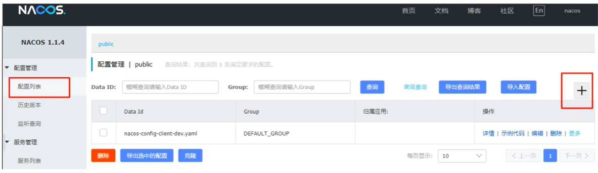

​        nacos-config-client-dev.yaml

Nacos界面配置对应


```yaml
config:
   info: "config info for dev, from nacos nacos-config-client-dev.yaml config cente. version 2"
```

设置DataId

1. 公式

   ```
   ${spring.application.name}-${spring.profiles.active}.${spring.cloud.nacos.config.file-extension}
   ```

   

2. prefix默认为spring.application.name的值

3. spring.profile.active即为当前环境对应的profile，可以通过配置项spring.profile.active来配置。

4. file-exetension为配置内容的数据格式，可以通过配置项speing.cloud.nacos.config.file-extension配置
   小总结说明

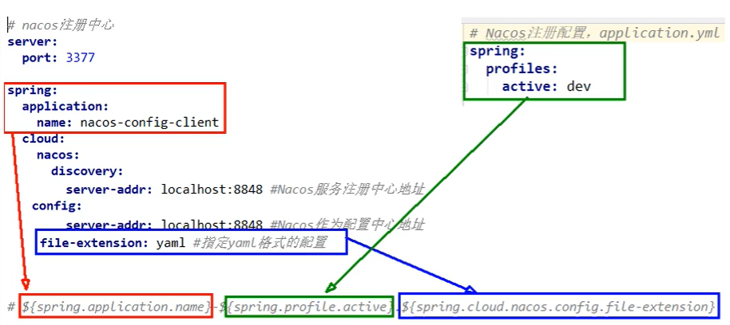

​        历史配置
​          Nacos惠济路配置文件的历史版本默认保留30天，此外还有一件回滚功能
​          回滚

#####   测试

启动前需要在nacos客户端-配置管理-配置管理栏目下有对应的yaml配置文件

运行cloud-config-nacos-client3377的主启动类

在运行过程中，经常会出现的一个小问题：

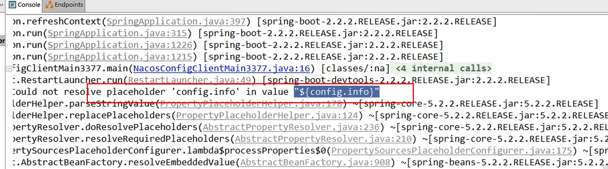

这是因为Nacos中关于YAML文件命名的问题，在配置中心中YAML的文件后缀名也就是yaml，但是我们通常处于习惯将“application.yml”中的“spring.cloud.nacos.config.file-extension”中将后缀名写作“yml”，这样就导致了问题的产生。


调用接口查看配置信息：http://localhost:3377/config/info

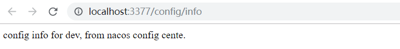      

#####   自带动态刷新

修改下Nacos中的yaml配置文件，再次调用查看配置的接口，就会发现配置已经刷新。

#### Nacos作为配置中心-分类配置

#####   问题

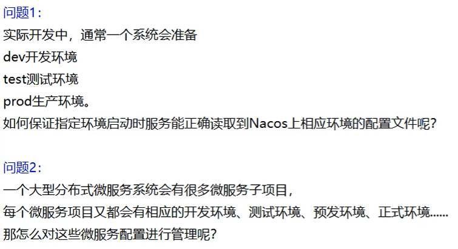

​    多环境多项目管理

#####   Nacos的图形化管理界面

​    配置管理

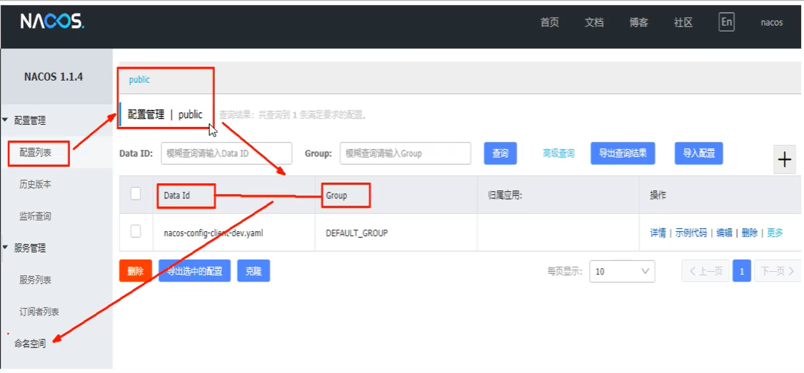

​    命名空间


#####   Namespace+group+data ID三者关系？为什么这么设计？

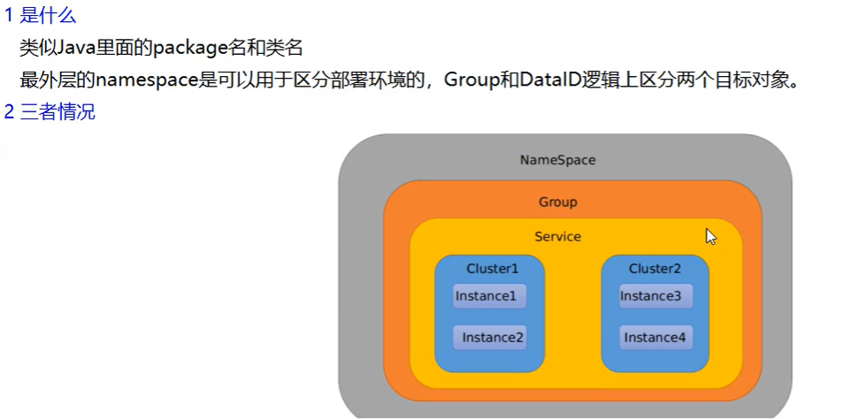


默认情况:Namespace=public, Group=DEFAULT GROUP，默认Cluster是DEFAULT

Nacos默认的命名空间是public，Namespace主要用来实现隔离。

比方说我们现在有三个环境:开发、测试、生产环境。我们就可以创建三个Namespace，不同的Namespace之间是隔离的。

Group默认是DEFAULT GROUP，Group可以把不同的微服务划分到同一个分组里面去。

Service就是微服务：一个Service可以包含多个Cluster (集群) ，Nacos默认Cluster是DEFAULT，Cluster是对指定微服务的一个虚拟划分。比方说为了容灾，将Service微服务分别部署在了杭州机房和广州机房，这时就可以给杭州机房的Service微服务起一个集群名称(HZ)，给广州机房的Service微服务起一个集群名称(GZ) ,还可以尽量让同一个机房的微服务互相调用，以提升性能。最后是Instance，就是微服务的实例。


#####   案例

三种方案加载配置

###### DataID方案

通过指定spring.profile.active和配置文件的DataID，来使不同环境下读取不同的配置
默认空间+默认分组+新建dev和test两个DataID

* 新建dev配置DataID

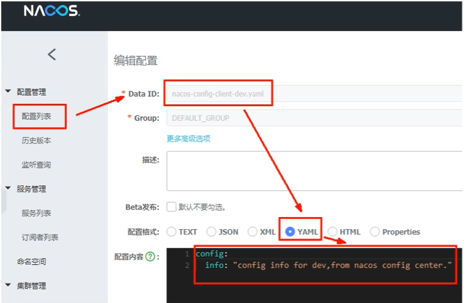


* 新建test配置DataID

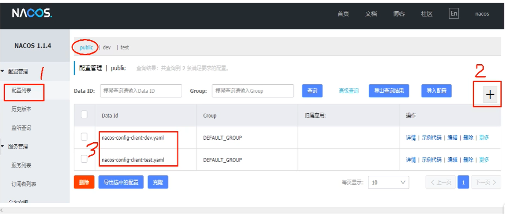

nacos-config-client-test.yaml

```yaml
config:
   info: "config info for test, from nacos nacos-config-client-test.yaml config center. version 1"
```


* 通过spring.profile.acvice属性就能进行多环境下配置文件的读取

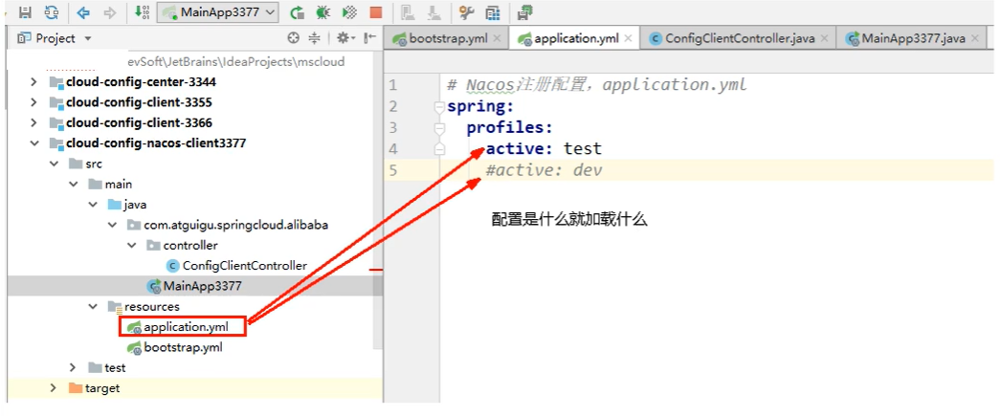


* 测试

http://localhost:3377/config/info，测试在开发环境和测试环境下，输出内容的变化。

想要切换到开发环境下，则修改“spring.profiles.active”为“dev”，想要切换到测试环境，则修改配置为“test”即可。


###### Group方案

通过Group实现环境区分

* 新建Group

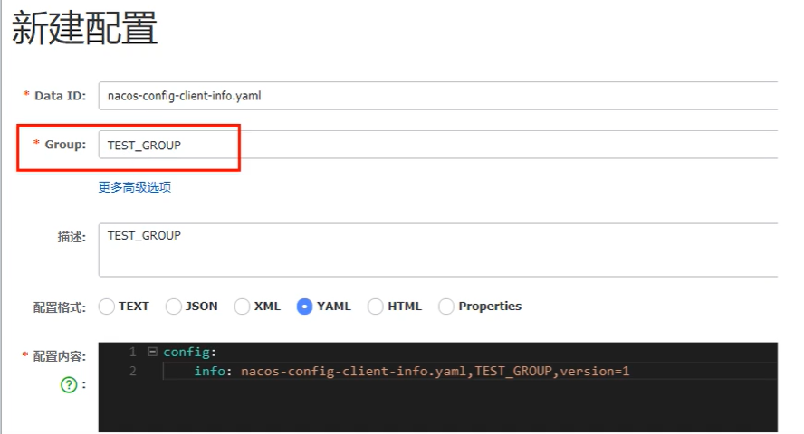


* 在nacos图形界面控制台上新建配置文件DataID

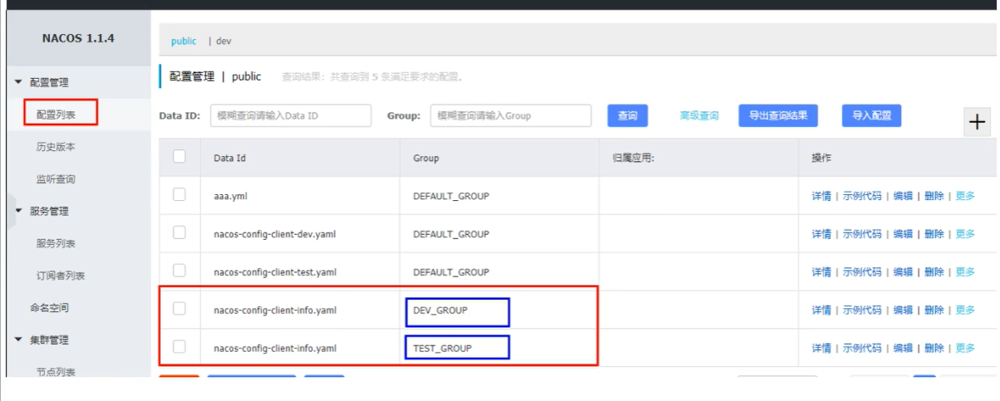


nacos-config-client-info.yaml

```yaml
config:
   info: "nacos-config-client-info.yaml. DEV_GROUP version 1"
```

nacos-config-client-info.yaml

```yaml
config:
   info: "nacos-config-client-info.yaml. TEST_GROUP version 1"
```


* bootstrap+application

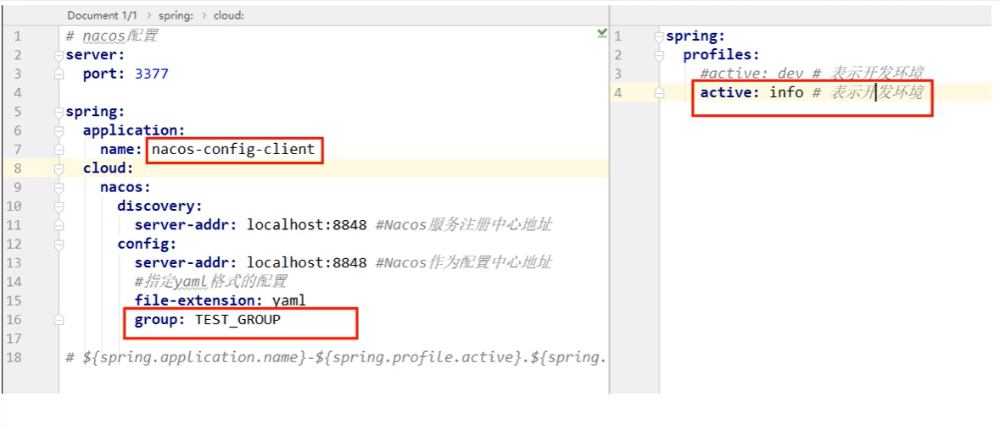

在config下增加一条group的配置即可。可配置为DEV_GROUP或TEST_GROUP

测试：<http://localhost:3377/config/info>

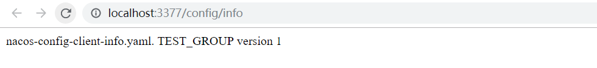

当将“spring.cloud.nacos.config.group”切换为“DEV_GROUP”时

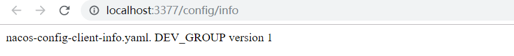


###### Namespace方案

* 新建dev/test的Namespace

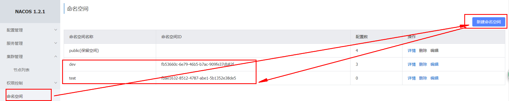

* 回到服务管理-服务列表查看

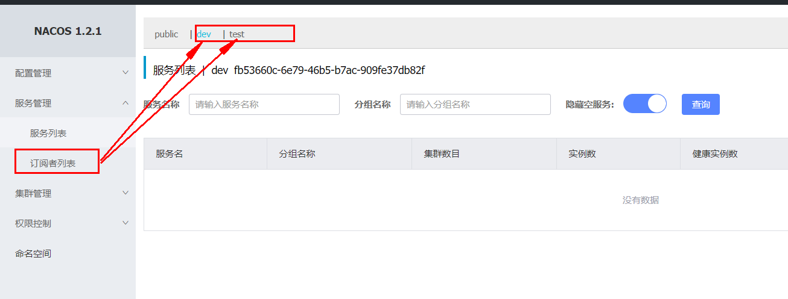

按照域名配置填写


在dev 命名空间下，创建

nacos-config-client-dev.yaml，组采用Default_Group

```yaml
config:
   info: "nacos-config-client-dev.yaml. dev namespace "
```

nacos-config-client-dev.yaml，组采用DEV_GROUP

```yaml
config:
   info: "fb53660c-6e79-46b5-b7ac-909fe37db82f DEV_GROUP nacos-config-client-dev.yaml"
```

nacos-config-client-dev.yaml，组采用TEST_GROUP

```yaml
config:
   info: "fb53660c-6e79-46b5-b7ac-909fe37db82f DEV_GROUPTEST_GROUP nacos-config-client-dev.yaml"
```


测试：

<http://localhost:3377/config/info>

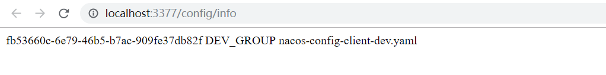

当将“spring.cloud.nacos.config.namespace”切换为“test”的命名空间，并且在该命名空间下，建立对应的“nacos-config-client-test.yaml”文件，让它们处于不同的组内，然后将“application.yml”中的“spring.profiles.active”，切换为“test”，能够看到在该命名空间，该组别下的输出。


### 5）Nacos集群和持久化配置(重要)

#### 官网说明

  https://nacos.io/zh-cn/docs
  官网架构图

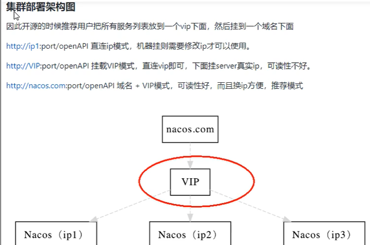

  上图翻译

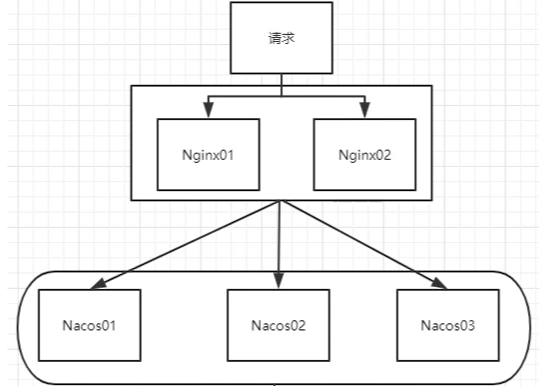


  说明

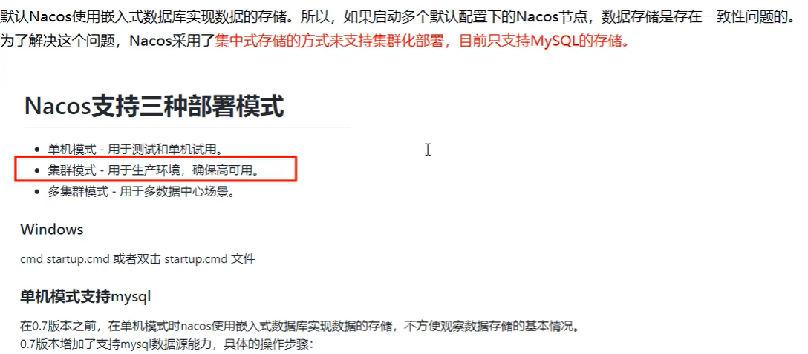

​    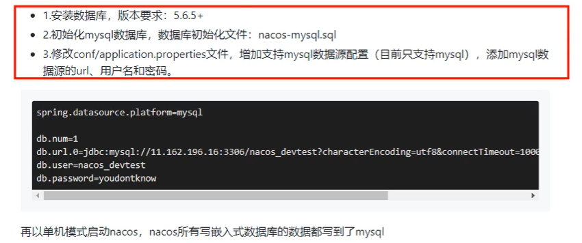

按照上说，我们需要mysql数据库
官网说明
<https://nacos.io/zh-cn/docs/cluster-mode-quick-start.html>

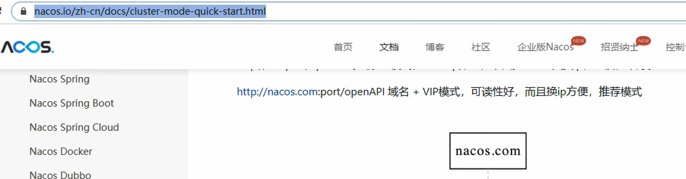

​      

#### Nacos持久化配置解释

  Nacos默认自带的是嵌入式数据库derby

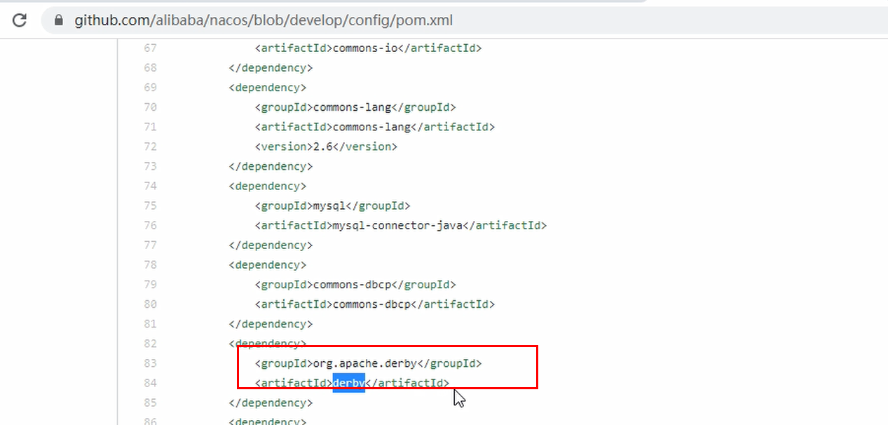


  derby到mysql切换配置步骤
（1）nacos-server-1.1.4\nacos\conf目录下找到sql脚本“nacos-mysql.sql”，然后执行脚本


（2）nacos-server-1.1.4\nacos\conf目录下找到application.properties，增加支持mysql数据源配置（目前只支持mysql），添加mysql数据源的url、用户名和密码。

```
spring.datasource.platform=mysql

db.num=1
db.url.0=jdbc:mysql://127.0.0.1:3306/nacos_config?characterEncoding=utf8&connectTimeout=1000&socketTimeout=3000&autoReconnect=true
db.user=root
db.password=Admin@123
```

（3）重启Nacos，可以看到是个全新的空记录界面

#### Linux版Nacos+MySQL生产环境配置

#####   预计需要，1个nginx+3个nacos注册中心，1个mysql

#####   Nacos下载Liunx版


​    https://github.com/alibaba/nacos/releases
​    nacos-server-1.1.4.tar.gz
​    解压后安装

#####   集群配置步骤

​    1.Linux服务器上mysql数据库配置
​      SQL脚本在哪里
​      sql语句源文件
​        nacos-mysql.sql
​      自己LInux机器上Mysql数据库粘贴
​    2.application.properties配置
​      位置

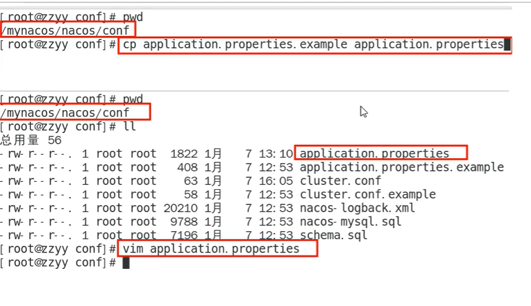

​      内容


​    3.Linux服务器上nacos的集群配置cluster.conf
​      梳理出3台nacos机器的不同服务端口号
​      复制出cluster.conf

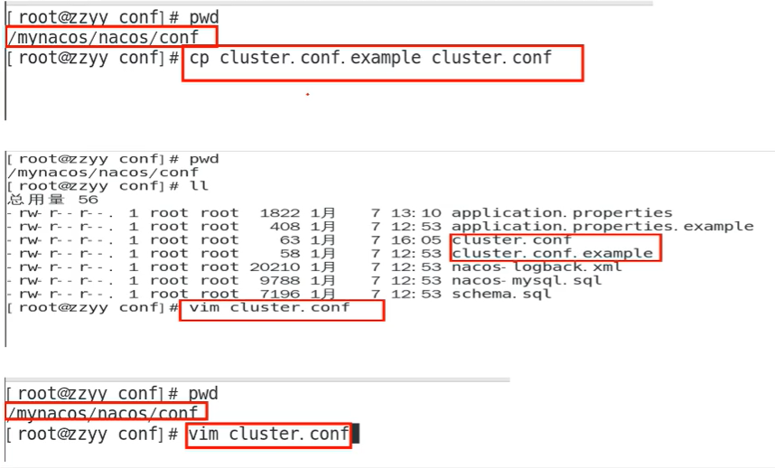


​      内容

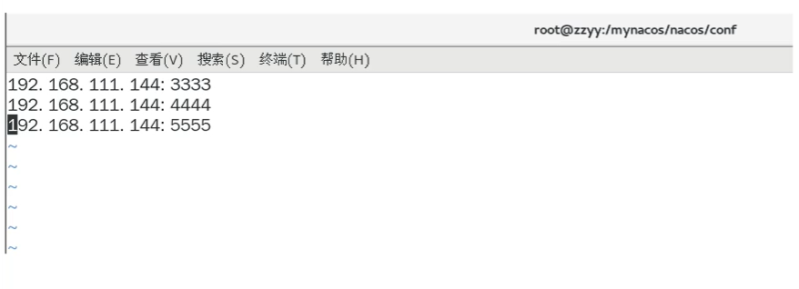


​        这个IP不能写127.0.0.1，必须是Linux命令hostname -i能够识别的IP

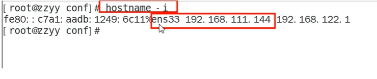

​    4.编辑Nacos的启动脚本startup.sh,使他能够接受不同的启动端口
​      /mynacos/nacos/bin 目录下有startup.sh
​      在什么地方，修改什么，怎么修改
​      思考

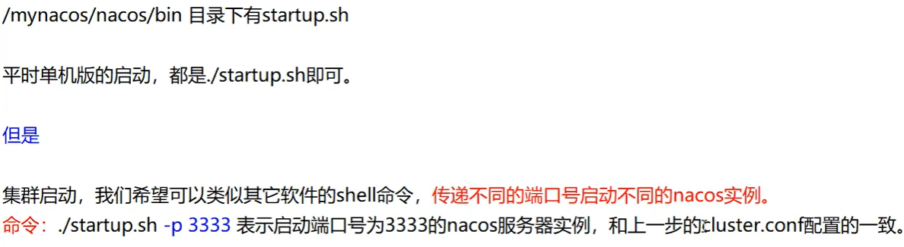

​      修改内容

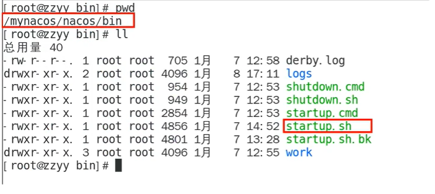

​      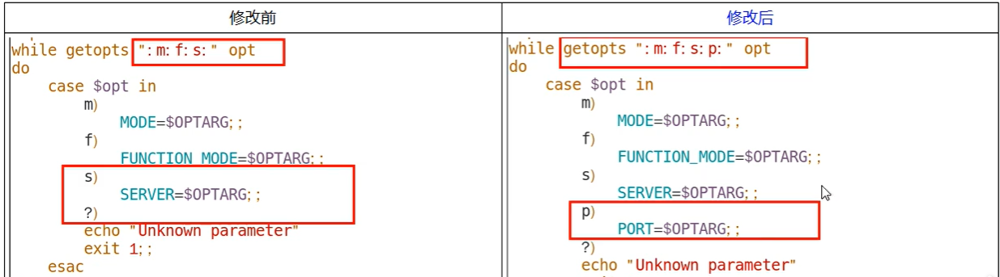

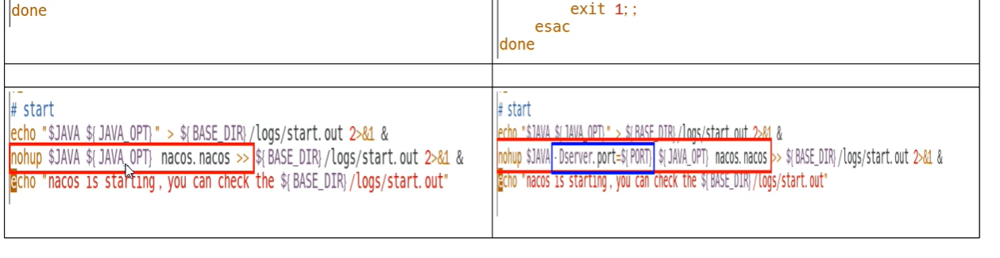


执行方式

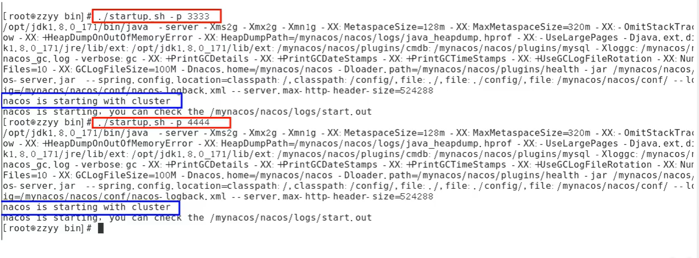


​    5.Nginx的配置，由他作为负载均衡器
​      修改nginx的配置文件

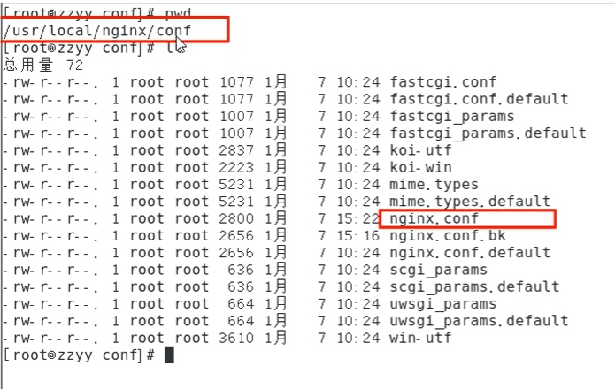

​      nginx.conf

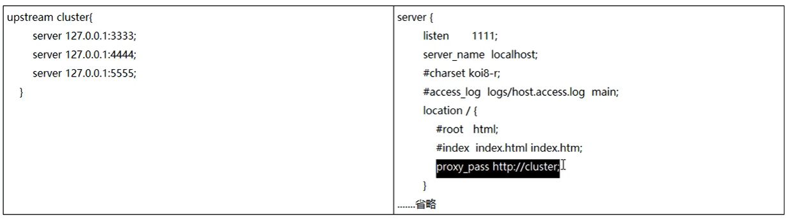

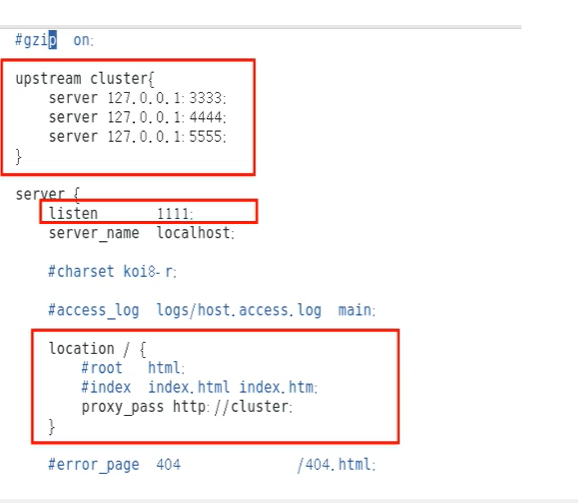

​      按照指定启动
​    6.截至到此为止，1个nginx+3个nacos注册中心+mysql
​      测试通过nginx访问nacos
​        http://192.168.111.144:1111/nacos/#/login
​      新建一个配置测试
​      linux服务器的mysql插入一条记录

#####   测试

​    微服务springalibaba-provider-payment9002启动注册进nacos集群
​      yml

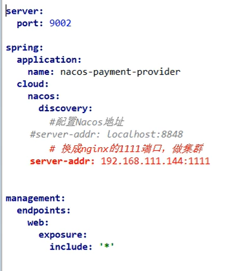


​      结果

#####   高可用小总结

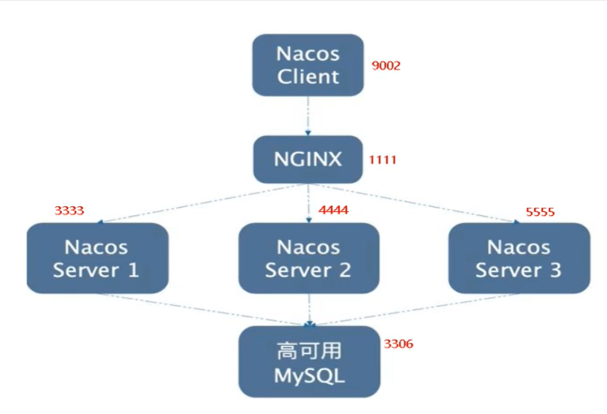


安装docker centos

```
docker pull centos
```


下载nacos，上传到192.168.137.14的/opt/software中，然后将它解压到/opt/module中

```


```

启动docker centos容器：

```shell
[root@nacos ~]# docker run -itd -v /opt/:/opt  --name centos7 centos    
c451d1301e0ac62ec8543e6b74f8e17e2bce56fce2f545c93671057c4f7edb59

```

查看容器：

```shell
[root@nacos ~]# docker exec -it centos7 /bin/bash
[root@c451d1301e0a /]# cd /opt/
[root@c451d1301e0a opt]# ls
containerd  data  edu  index.jsp  module  software  test  vod
[root@c451d1301e0a opt]# cd software/
[root@c451d1301e0a software]# ls
jdk-8u144-linux-x64.tar.gz  mysql-libs.zip  nacos-server-1.2.1.zip 
 mysql-8.0.16-linux-glibc2.12-x86_64.tar.xz  
[root@c451d1301e0a software]# ll
```


安装jdk：

```properties
#JAVA_HOME
export JAVA_HOME=/opt/module/jdk1.8.0_144
export PATH=$PATH:$JAVA_HOME/bin
```


启动三个Docker的Nacos实例

运行Mysql


```shell
[root@nacos ~]# docker pull nacos/nacos-server;
Using default tag: latest
latest: Pulling from nacos/nacos-server
5ad559c5ae16: Pull complete 
be7fcb81503b: Pull complete 
184628106033: Pull complete 
659182d1bc33: Pull complete 
f50076ce88c1: Pull complete 
7409127fbcf2: Pull complete 
110ead5a3247: Pull complete 
2a4cb2f6d49b: Pull complete 
Digest: sha256:ab9a49756f23ba89c389e855a5ec0ae8d81adf6875c43817e8f7091b5b56d401
Status: Downloaded newer image for nacos/nacos-server:latest
docker.io/nacos/nacos-server:latest
[root@nacos ~]# 
```


```shell
[root@nacos ~]# docker images;
REPOSITORY           TAG                 IMAGE ID            CREATED             SIZE
nacos/nacos-server   latest              00b7582cb6e6        12 days ago         724MB

[root@nacos ~]# 
```


```shell
[root@nacos ~]# docker run -d --name "nacos" e791337790a6
76f702585281e8fe39afe0dfaaa09db294f7de14bce4982290497b6d29257bad
[root@nacos ~]# docker ps 
CONTAINER ID IMAGE        COMMAND                CREATED        STATUS       PORTS  NAMES
76f702585281 e791337790a6 "nginx -g 'daemon of…" 10 seconds ago Up 8 seconds 80/tcp nacos
[root@nacos ~]# 
```


## 其他


### 1. 热部署


1. devtools to your project添加依赖：

   ```xml
   <dependency>
       <groupId>org.springframework.boot</groupId>
       <artifactId>spring-boot-devtools</artifactId>
       <scope>runtime</scope>
       <optional>true</optional>
   </dependency>
   
   ```

   

2. Adding plugin to your pom.xml

   ```xml
   下面配置我们粘贴进聚合父类总工程的pom.xml里
   <build>
       <fileName>你自己的工程名字<fileName>
       <plugins>
           <plugin>
               <groupId>org.springframework.boot</groupId>
               <artifactId>spring-boot-maven-plugin</artifactId>
               <configuration>
                   <fork>true</fork>
                   <addResources>true</addResources>
               </configuration>
           </plugin>
       </plugins>
   </build>
   ```
   
   

3. Enabling automatic build
    

4. 

5. 


4. Update the value of
   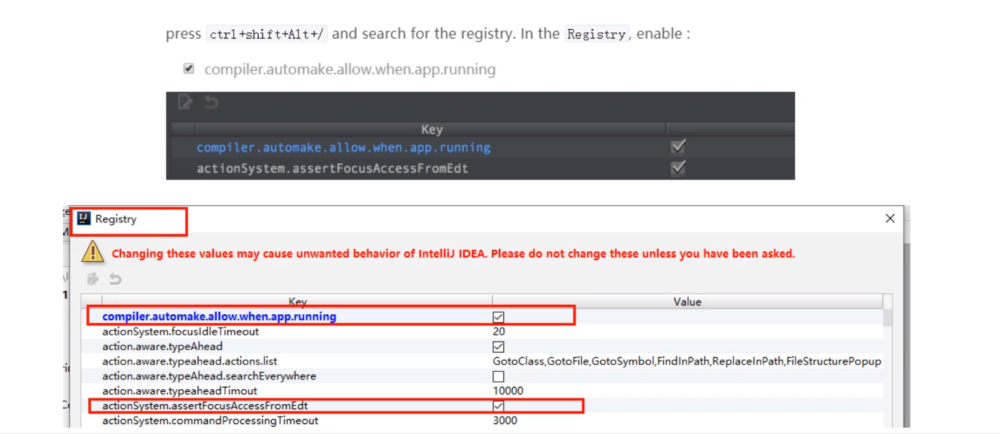
5. 重启idea


### 2. @Resources和@AutoWired的区别？


### 3. dashboard

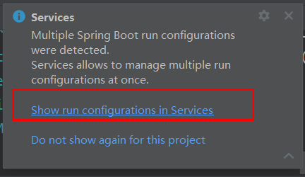


通过修改idea的workspace.xml的方式快速打开Run Dashboard窗口


```xml

<component name="RunDashboard">
    <option name="configurationTypes">
      <set>
        <option value="SpringBootApplicationConfigurationType" />
      </set>
    </option>
  </component> 
```


### 4. 检查服务提供者的健康状况

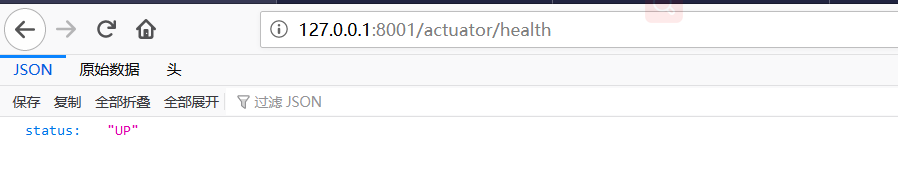

### 5. hutool工具包

 https://www.hutool.cn/docs/#/ 

该工具包提供了一系列能够媲美common-lang的一系列功能。

### 6. @Autowired和@Resource的区别

