## 18. SpringCloud Alibaba Sentinel实现熔断与限流


### 18.1 Sentiel


#### 官网

  https://github.com/alibaba/Sentinel
  中文
    https://github.com/alibaba/Sentinel/wiki/介绍

#### 是什么

  一句话解释就是我们之前讲过的hystrix

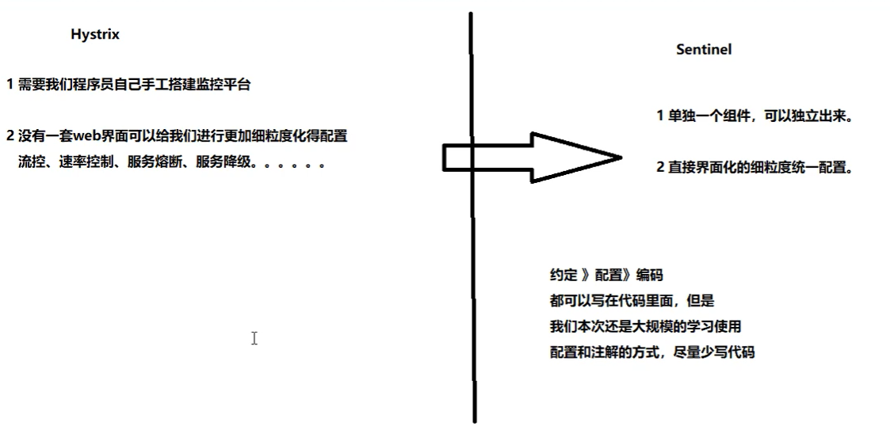


#### 去哪下

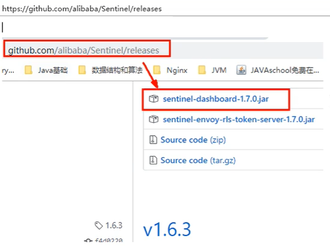

  https://github.com/alibaba/Sentinel/releases

#### 能干嘛

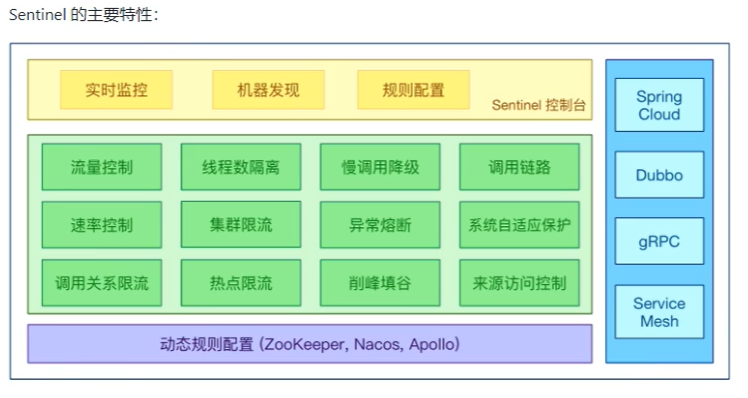


#### 怎么玩

服务中的各种问题

- 服务雪崩
- 服务降级

- 服务熔断

- 服务限流

### 18.2 安装Sentiel控制台

#### sentinel组件由两部分构成

  Sentinel分为两个部分:

1. 核心库(Java客户端)不依赖任何框架/库，能够运行于所有Java运行时环境，同时对Dubbo/Spring Cloud等框架也有较好的支持。
2. 控制台(Dashboard)基于Spring Boot开发，打包后可以直接运行，不需要额外的Tomcat等应用容器。

#### 安装步骤

（1）前提条件：

1. 安装和配置了Java8
2. 8080端口未被占用

（2）下载

​    https://github.com/alibaba/Sentinel/releases

（3）运行

```java
java -jar sentinel-dashboard-1.7.2.jar
```

（4）访问sentinel管理界面

​    http://localhost:8080，  登录账号密码均为sentinel


### 18.3 初始化演示功能

#### １）启动本地的Nacos

  访问：http://localhost:8848/nacos/#/login，查看是否能够成功访问

#### ２）启动本地的Sentinel

```
java -jar sentinel-dashboard-1.7.2.jar
```

访问：http://localhost:8080

#### ３）新建Module “cloudalibaba-sentinel-service8401”

POM

```xml
<dependencies>
        <dependency>
            <groupId>com.alibaba.cloud</groupId>
            <artifactId>spring-cloud-starter-alibaba-nacos-discovery</artifactId>
        </dependency>
        <!--     sentinel-datasource-nacos 后续持久化用   -->
        <dependency>
            <groupId>com.alibaba.csp</groupId>
            <artifactId>sentinel-datasource-nacos</artifactId>
        </dependency>
        <dependency>
            <groupId>com.alibaba.cloud</groupId>
            <artifactId>spring-cloud-starter-alibaba-sentinel</artifactId>
        </dependency>
        <dependency>
            <groupId>org.springframework.cloud</groupId>
            <artifactId>spring-cloud-starter-openfeign</artifactId>
        </dependency>
        <dependency>
            <groupId>org.springframework.boot</groupId>
            <artifactId>spring-boot-starter-web</artifactId>
        </dependency>
        <dependency>
            <groupId>org.springframework.boot</groupId>
            <artifactId>spring-boot-starter-actuator</artifactId>
        </dependency>
        <dependency>
            <groupId>org.projectlombok</groupId>
            <artifactId>lombok</artifactId>
            <optional>true</optional>
        </dependency>
        <dependency>
            <groupId>org.springframework.boot</groupId>
            <artifactId>spring-boot-starter-test</artifactId>
            <scope>test</scope>
        </dependency>
        <dependency>
            <groupId>com.atguigu.springcloud</groupId>
            <artifactId>cloud-api-common</artifactId>
            <version>${project.version}</version>
        </dependency>
    </dependencies>
```

YML

```yaml
server:
  port: 8401
spring:
  application:
    name: cloudalibaba-sentinel-service
  cloud:
    nacos:
      discovery:
        # Nacos服务注册中心地址
        server-addr: localhost:8848
    sentinel:
      transport:
        # sentinel dashboard 地址
        dashboard: localhost:8080
        # 默认为8719，如果被占用会自动+1，直到找到为止
        port: 8719
      
management:
  endpoints:
    web:
      exposure:
        include: "*"

```


主启动

```java
package com.atguigu.springcloud;

import org.springframework.boot.SpringApplication;
import org.springframework.boot.autoconfigure.SpringBootApplication;
import org.springframework.cloud.client.discovery.EnableDiscoveryClient;

/**
 * @author zzyy
 */
@SpringBootApplication
@EnableDiscoveryClient
public class MainApp8401 {
    public static void main(String[] args) {
        SpringApplication.run(MainApp8401.class, args);
    }
}

```

业务类FlowLimitController

```java
package com.atguigu.springcloud.controller;

import com.alibaba.csp.sentinel.annotation.SentinelResource;
import com.alibaba.csp.sentinel.slots.block.BlockException;
import lombok.extern.slf4j.Slf4j;
import org.springframework.web.bind.annotation.GetMapping;
import org.springframework.web.bind.annotation.RequestParam;
import org.springframework.web.bind.annotation.RestController;

import java.util.concurrent.TimeUnit;

/**
 *
 * @author zzyy
 * @version 1.0
 * @create 2020/03/06
 */
@RestController
@Slf4j
public class FlowLimitController {

    @GetMapping("/testA")
    public String testA(){
//        try {
//            TimeUnit.MILLISECONDS.sleep(800);
//        } catch (InterruptedException e) {
//            e.printStackTrace();
//        }
        return "testA-----";
    }

    @GetMapping("/testB")
    public String testB(){
        log.info(Thread.currentThread().getName() + "...testB ");
        return "testB   -----";
    }

    @GetMapping("/testD")
    public String testD(){
        try {
            TimeUnit.SECONDS.sleep(1);
        } catch (InterruptedException e) {
            e.printStackTrace();
        }
        log.info("testD 测试RT");
        return "testD -----";
    }

    @GetMapping("/testException")
    public String testException(){
        log.info("testException 异常比例");
        int age = 10 /0 ;
        return "testException -----";
    }

    @GetMapping("/testExceptionCount")
    public String testExceptionCount(){
        log.info("testExceptionCount 异常数");
        int age = 10 /0 ;
        return "testExceptionCount -----";
    }

    @GetMapping("/testHotKey")
    @SentinelResource(value = "testHotKey", blockHandler = "dealTestHotKey")
    public String testHotKey(@RequestParam(value = "p1", required = false) String p1,
                             @RequestParam(value = "p2", required = false) String p2){
        int age = 10 /0;
        return "testHotKey -----";
    }

    public String dealTestHotKey(String p1, String p2, BlockException blockException){
        return "dealTestHotKey---------";
    }
}

```


#### ４）启动微服务cloudalibaba-sentinel-service8401

#### ５）查看sentinel控制台

  （1）控制台没有出现监控的微服务

　　访问：http://localhost:8080

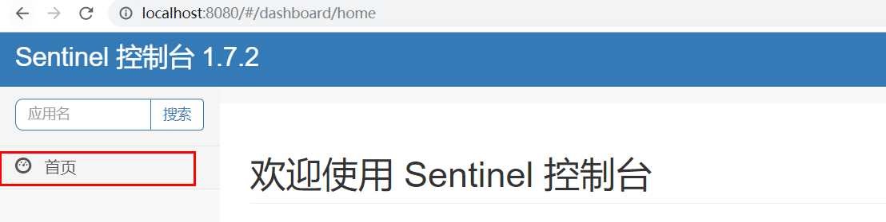

　　这是因为Sentinel采用懒加载

  （2）Sentinel采用了懒加载，服务需要访问才能够被监控

​    执行一次访问
​      http://localhost:8401/testA
​      http://localhost:8401/testB
​    效果


 （3）结论
    sentinel8080正在监控微服务“cloudalibaba-sentinel-service8401”


### 18.4 流控规则

#### 基本介绍

添加流控规则有两种方式：

方式1：

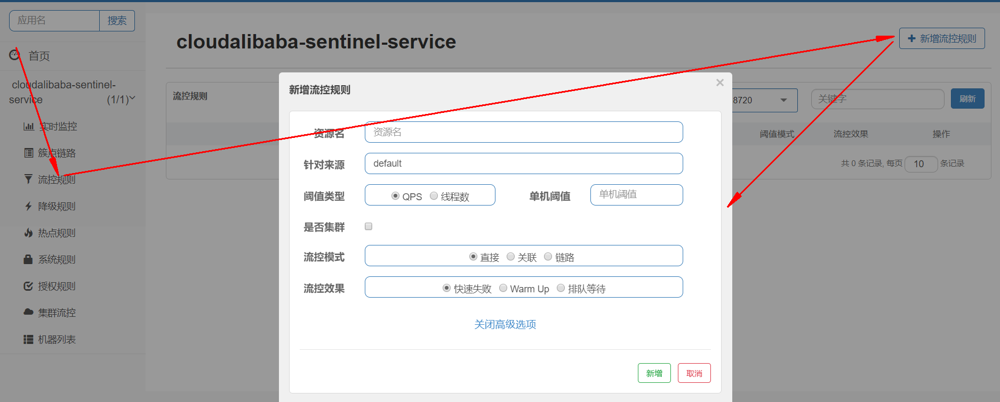

方式2：

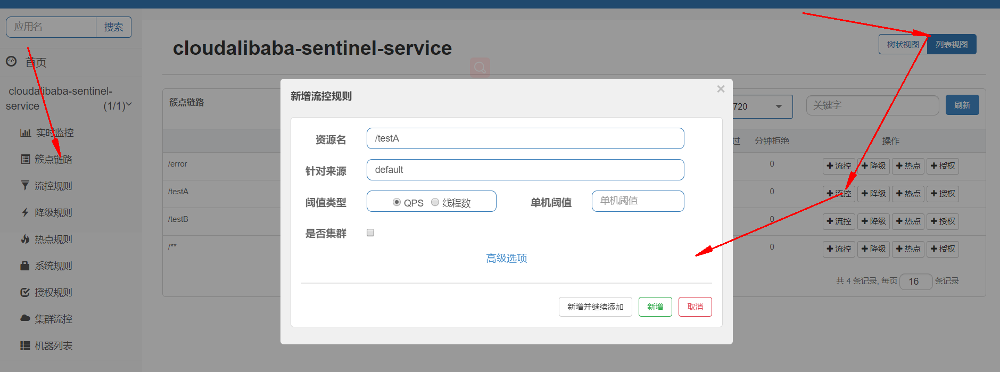


  进一步解释说明

1. 资源名：唯一名称，默认请求路径
2. 针对来源：Sentinel可以针对调用者进行限流，填写微服务名，默认default (不区分来源)
3. 阈值类型/单机阈值：
   - QPS (每秒钟的请求数量) ：当调用该api的QPS达到阈值的时候，进行限流。
   - 线程数：当调用该api的线程数达到阈值的时候，进行限流。
4. 是否集群：不需要集群
5. 流控模式：
   - 直接：api达到限流条件时，直接限流。
   - 关联：当关联的资源达到阈值时，就限流自己
   - 链路：只记录指定链路上的流量(指定从入口资源进来的流量，如果达到阈值，就进行限流) 【api级别】
6. 流控效果：

   * 快速失败：直接失败，抛出异常；

   * Warm Up：根据codeFactor (冷加载因子，默认3)的值，从阈值codeFactor开始，经过预热时长，才达到设置的QPS值；

   * 排队等待：匀速排队，让请求以匀速的速度通过，阈值类型必须设置为QPS,否则无效；


#### 流控模式

##### 直接(默认)

（1）直接->快速失败：系统默认

（2）配置及说明

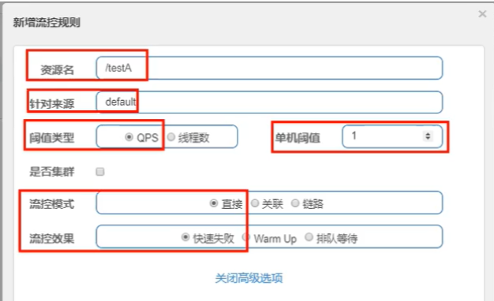

上图表示的含有是：表示1秒钟内查询次数为1时正常，否则就报默认错误，也即“直接——快速失败”。


​    

（3）测试
多次访问http://localhost:8401/testA

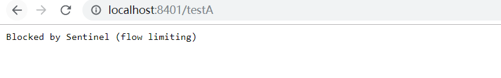

思考：
　　当到达指定的流控规则时，再次访问会出现报错信息，但是多数时候需要自定义错误回显信息，类似于Hystrix的fallback的，该要如何完成？
​          

#####  关联

###### 是什么

1. 当关联的资源达到阈值时，就限流自己
2. 当与A关联的资源B达到阈值后，就限流自己
   支付接口达到阈值后,就限流下订单的接口,防止连坐效应
3. B惹事，A挂了

###### 配置A

###### 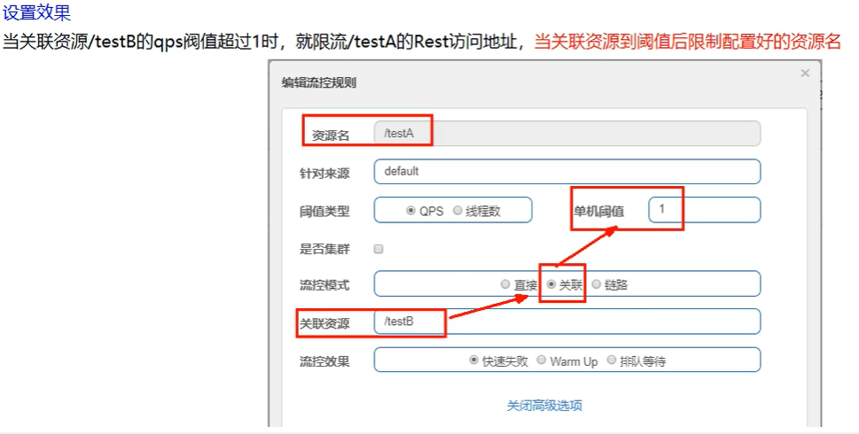    postman模拟并发密集访问testB

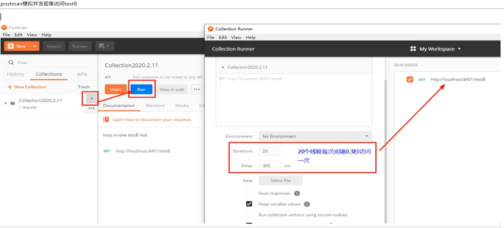

​      访问B成功

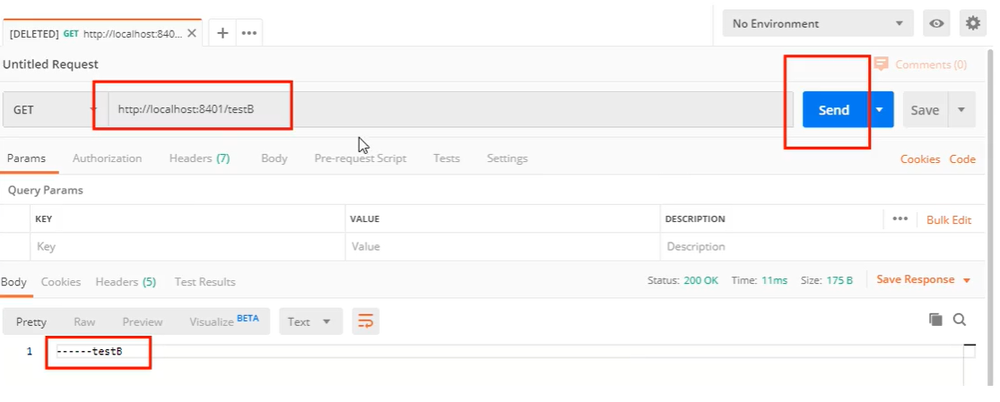

​      postman里新建多线程集合组


​      将访问地址添加进新线程组

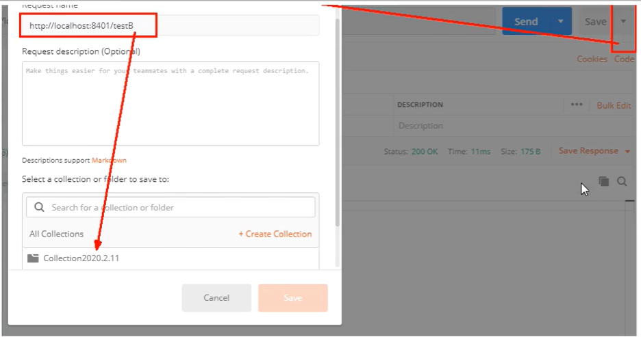

​      RUN
​        大批量线程高并发访问B，导致A失效了

###### 运行后发现testA挂了

​      点击访问A
​      结果
​        Blocked by Sentinel(flow limiting)

#####  链路

​    多个请求调用同一个微服务
​    

#### 流控效果

##### 直接->快速失败(默认的流控处理)

​    直接失败，抛出异常
​      Blocked by Sentinel(flow limiting)
​    源码
​      com.alibaba.csp.sentinel.slots.block.controller.DefaultController

#####  预热

###### 说明

​      公式:阈值除以coldFactor(默认值为3)，经过预热时长后才会达到阈值

###### 官网

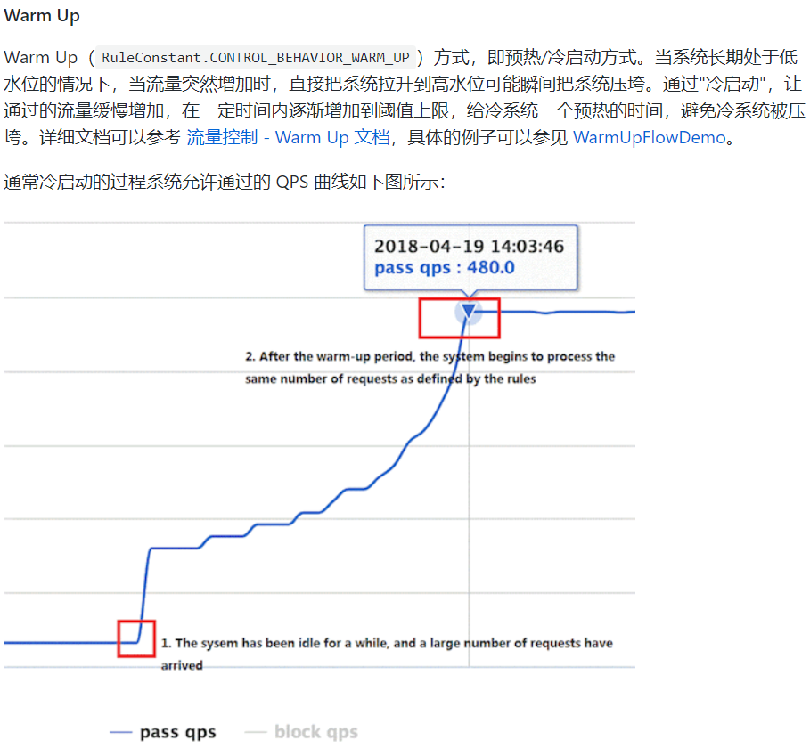

 


​     默认coldFactor为3，即请求QPS从threshold/3开始，经预热时长逐渐升至设定的QPS阈值
​      限流 冷启动
​        https://github.com/alibaba/Sentinel/wiki/%E9%99%90%E6%B5%81---%E5%86%B7%E5%90%AF%E5%8A%A8

###### 源码

###### WarmUp配置

1. 多次点击http://localhost:8401/testB
         刚开始不行，后续慢慢OK

2. 应用场景

   如：秒杀系统在开启瞬间，会有很多流量上来，很可能把系统打死，预热方式就是为了保护系统，可慢慢的把流量放进来，慢慢的把阈值增长到设置的阈值。

##### 排队等待

匀速排队，阈值必须设置为QPS
官网

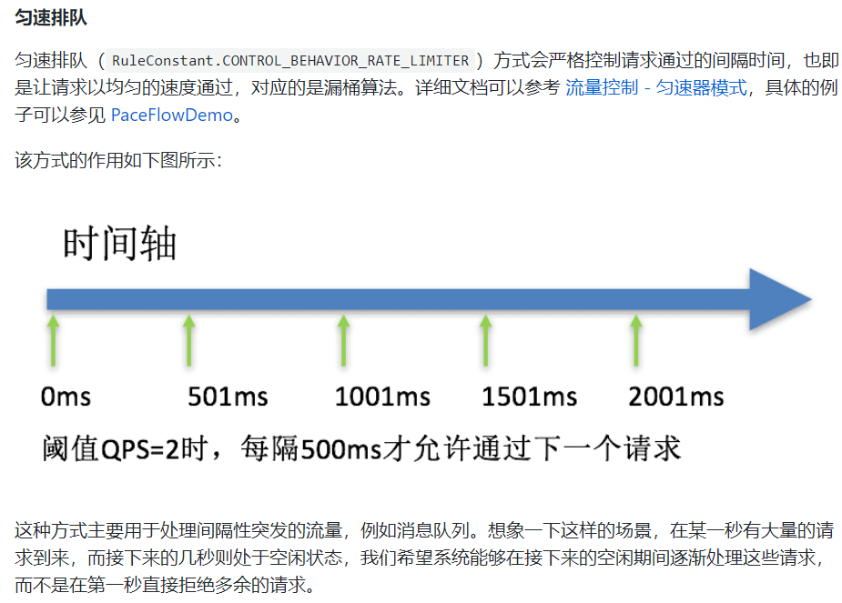

源码
  com.ailibaba.csp.sentinel.slots.block.controller.RateLimiterController
测试

配置“/testB”的流控效果为排队等待，超时时间设置为2000毫秒：

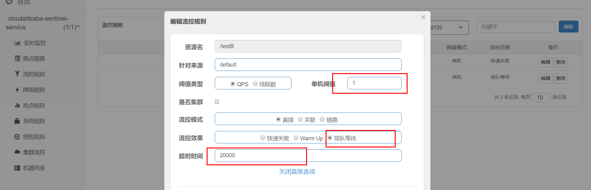

通过Postman发送请求：

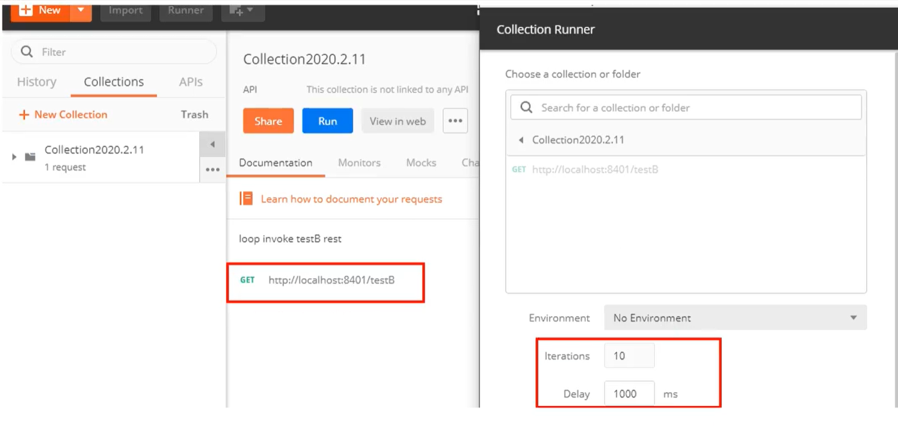

查看“cloudalibaba-sentinel-service8401”微服务后台输出：

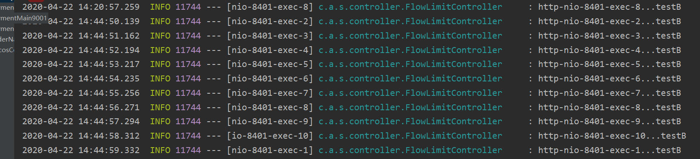


### 18.5 降级规则

Hystrix的服务降级策略：半开的状态系统自动去检测是否请求有异常，没有异常就关闭断路器恢复使用，有异常则继续打开断路器不可用，具体参考Hystrix
​    


#### 


#### 18.5.1 官网

https://github.com/alibaba/Sentinel/wiki/%E7%86%94%E6%96%AD%E9%99%8D%E7%BA%A7

#### 18.5.2 基本介绍

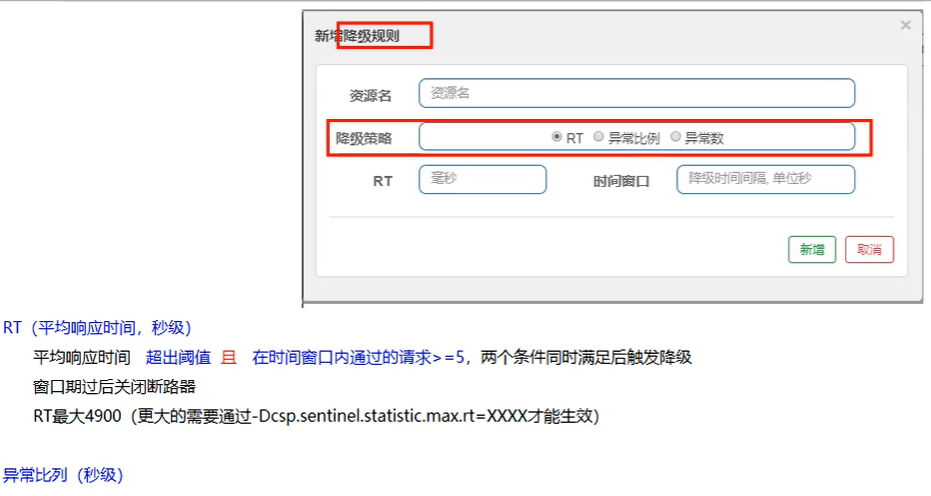

  QPS >=5且比例(秒级统计)超过阈值时，触发降级，时间窗口结束后，关闭降级

进一步说明
  **Sentinel的断路器是没有半开状态的**

Sentinel **熔断降级**会在调用链路中某个资源出现不稳定状态时（例如调用超时或异常比例升高），对这个资源的调用进行限制，让请求快速失败，避免影响到其它的资源而导致级联错误。

当资源被降级后，在接下来的降级时间窗口之内，对该资源的调用都自动熔断（默认行为是抛出 `DegradeException`）。

#### 18.5.3 降级策略实战

#####   1）平均响应时间

**平均响应时间 (`DEGRADE_GRADE_RT`)**：当 1s 内持续进入 N 个请求，对应时刻的平均响应时间（秒级）均超过阈值（`count`，以 ms 为单位），那么在接下的时间窗口（`DegradeRule` 中的 `timeWindow`，以 s 为单位）之内，对这个方法的调用都会自动地熔断（抛出 `DegradeException`）。注意 Sentinel 默认统计的 RT 上限是 4900 ms，**超出此阈值的都会算作 4900 ms**，若需要变更此上限可以通过启动配置项 `-Dcsp.sentinel.statistic.max.rt=xxx` 来配置。

此种情况下的异常降级图示：

​    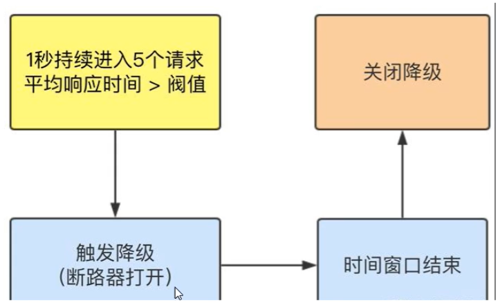


**实验步骤：**
（1）新增“/testD”请求映射：

```java
    @GetMapping("/testD")
    public String testD(){
        try {
            TimeUnit.SECONDS.sleep(1);
        } catch (InterruptedException e) {
            e.printStackTrace();
        }
        log.info("testD 测试RT");
        return "testD -----";
    }
```


（2） 添加降级规则：

访问：<http://localhost:8401/testD>，查看是否能够正常访问

在“簇点链路”中，对于“/testD”进行降级：


按照上述配置，永远一秒钟打进来10个线程(大于5个了)调用testD，我们希望200毫秒处理完本次任务。

上面表示的含义是，如果超过200毫秒还没处理完，在未来1秒钟的时间窗口内，断路器打开(保险丝跳闸)微服务不可用，保险丝跳闸断电了。

（3）jmeter压测


在线程组下新建HttpRequest请求：

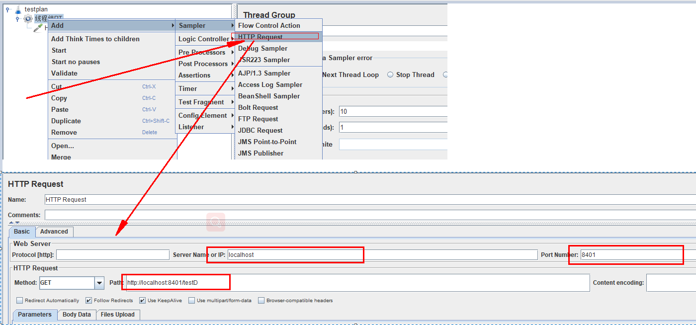

（4）启动jmeter压测

（5）测试

访问：<http://localhost:8401/testD>，观察到访问出现异常

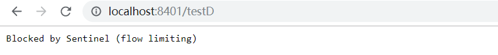

停止jmeter后，再次访问“http://localhost:8401/testD”：

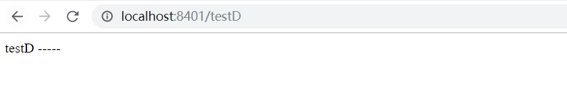

（6）结论

能够发现，在关闭jmeter后，访问量降低后，断路器关闭，微服务恢复正常。


#####   2）异常比例

**异常比例 (DEGRADE_GRADE_EXCEPTION_RATIO)**：当资源的每秒请求量 >= N（可配置），并且每秒异常总数占通过量的比值超过阈值（DegradeRule 中的 count）之后，资源进入降级状态，即在接下的时间窗口（DegradeRule 中的 timeWindow，以 s 为单位）之内，对这个方法的调用都会自动地返回。异常比率的阈值范围是 [0.0, 1.0]，代表 0% - 100%。

此种情况下的异常降级图示：

######     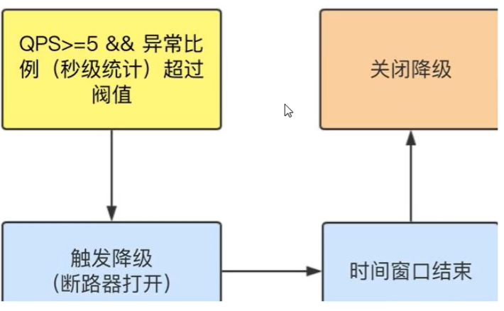


**实验步骤**：

（1）新增“/testException”请求映射：制造算术异常

```java
    @GetMapping("/testException")
    public String testException(){
        log.info("testException 异常比例");
        int age = 10 /0 ;
        return "testException -----";
    }
```


（2）添加降级规则：

访问：<http://localhost:8401/testException>，查看是否能够正常访问

在“簇点链路”中，对于“/testException”进行降级：

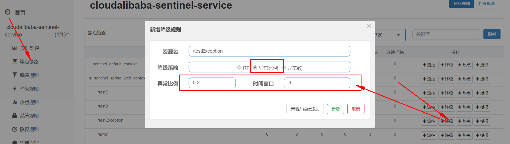

（3）jmeter压测

新建异常比例线程组：

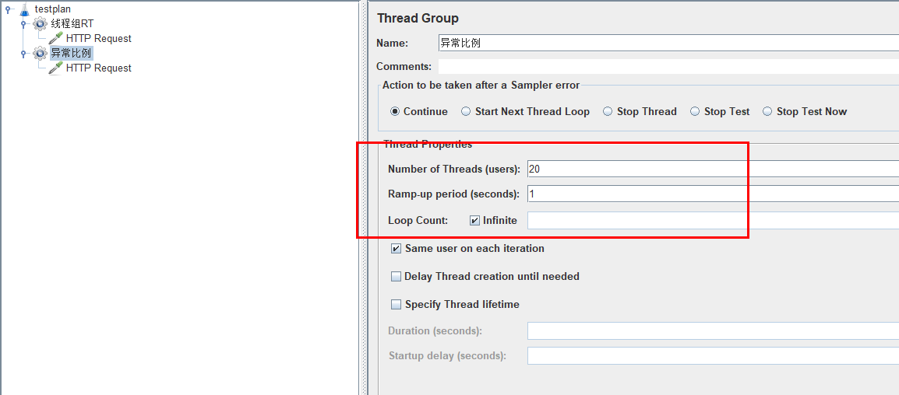

在该线程组下，添加针对于“<http://localhost:8401/testException>”的HttpRequest请求：

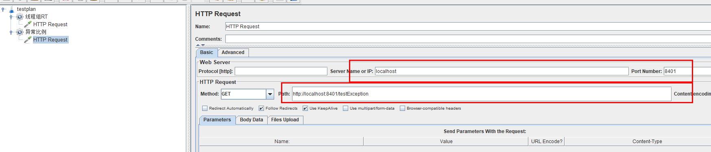


（4）启动jmeter压测

（5）测试

访问：<http://localhost:8401/testException>，观察到访问出现异常

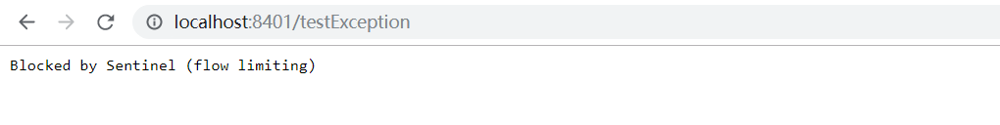

停止jmeter后，再次访问“http://localhost:8401/testException：

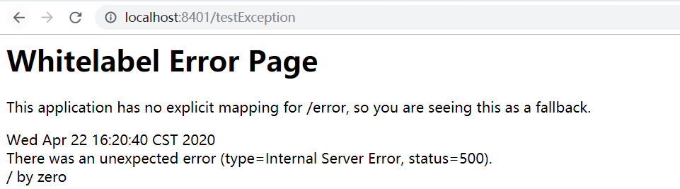

（6）结论

注意：这里的服务降级的条件是“每秒钟的访问量大于5”和“异常比例大于20%”的时候，才进入执行降级策略，上面我们通过jmeter，使用20个线程来请求“<http://localhost:8401/testException>”，这样每秒中的请求量和异常比例都能够满足降级策略，所以会触发针对于“/testException”的降级策略。

当停止了jmeter后，单次访问达不到降级策略（不过只要手速足够快，还是可以触发降级策略的），所以页面上直接抛出了运行时异常，而不是返回降级策略的fallback。


#####   3）异常数

**异常数 (DEGRADE_GRADE_EXCEPTION_COUNT)：**当资源近 1 分钟的异常数目超过阈值之后会进行熔断。注意由于统计时间窗口是分钟级别的，**若 timeWindow 小于 60s，则结束熔断状态后仍可能再进入熔断状态**

此种情况下的异常降级图示：

​    


异常数是按照分钟统计的

**实验步骤**：

（1）新增“/testExceptionCount”请求映射：制造算术异常

```java
    @GetMapping("/testExceptionCount")
    public String testExceptionCount(){
        log.info("testExceptionCount 异常数");
        int age = 10 /0 ;
        return "testExceptionCount -----";
    }
```

（2）添加降级规则：

访问：<http://localhost:8401/testExceptionCount>，查看是否能够正常访问

在“簇点链路”中，对于“/testExceptionCount”进行降级：

 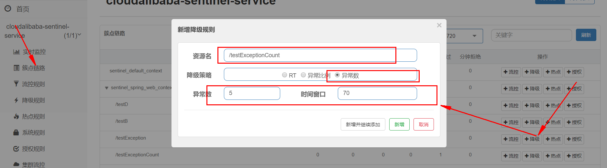

（3）测试

连续访问：<http://localhost:8401/testExceptionCount>，观察到进入到异常策略中了

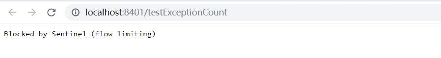

（4）结论

http://localhost:8401/testExceptionCount，首次访问报错，因为除数不能为零，我们看到error窗口,但是达到5次报错后，进入熔断后降级。


### 18.6 热点key限流


何为热点？热点即经常访问的数据。很多时候我们希望统计某个热点数据中访问频次最高的 Top K 数据，并对其访问进行限制。比如：

- 商品 ID 为参数，统计一段时间内最常购买的商品 ID 并进行限制
- 用户 ID 为参数，针对一段时间内频繁访问的用户 ID 进行限制

热点参数限流会统计传入参数中的热点参数，并根据配置的限流阈值与模式，对包含热点参数的资源调用进行限流。**热点参数限流可以看做是一种特殊的流量控制，仅对包含热点参数的资源调用生效。**


Sentinel 利用 LRU 策略统计最近最常访问的热点参数，结合令牌桶算法来进行参数级别的流控。热点参数限流支持集群模式。


#### 官网

  https://github.com/alibaba/Sentinel/wiki/%E7%83%AD%E7%82%B9%E5%8F%82%E6%95%B0%E9%99%90%E6%B5%81

#### 承上启下复习start

  SentinelResource

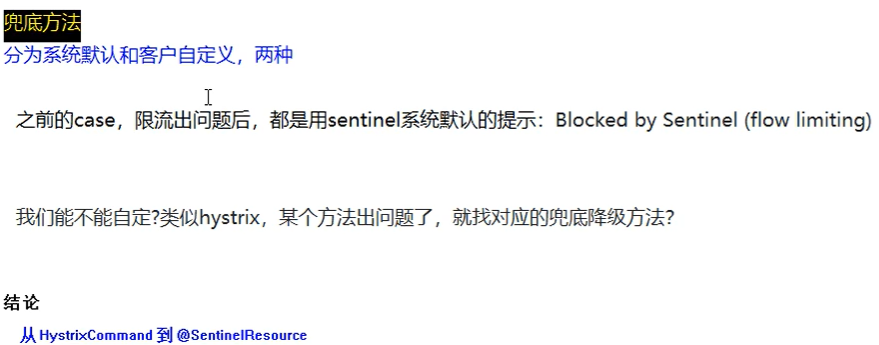

#### 代码

  com.alibaba.csp.sentinel.slots.block.BlockException

#### 配置

添加“/testHotKey”请求映射规则

```java
    @GetMapping("/testHotKey")
    @SentinelResource(value = "testHotKey", blockHandler = "dealTestHotKey")
    public String testHotKey(@RequestParam(value = "p1", required = false) String p1,
                             @RequestParam(value = "p2", required = false) String p2){
        
        return "testHotKey -----";
    }

    public String dealTestHotKey(String p1, String p2, BlockException blockException){
        return "dealTestHotKey---------";
    }
}
```


测试“<http://localhost:8401/testHotKey?p1=a&p2=b>”是否能够访问：

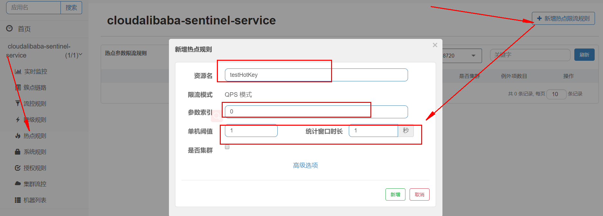

多次访问：http://localhost:8401/testHotKey?p1=a&p2=b

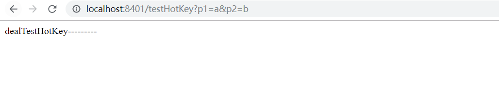


@SentinelResource(value = "testHotKey")
​      异常打到了前台用户界面看到，不友好

@SentinelResource(value = "testHotKey",blockHandler="dealHandler_testHotKey")
​      方法testHotKey里面第一个参数只要QPS超过每秒一次，马上降级处理用了我们自己定义的


#### 测试

  × error
    http://localhost:8401/testHotKey?p1=abc
  × error
    http://localhost:8401/testHotKey?p1=abc&p2=33
  √ right
    http://localhost:8401/testHotKey?p2=abc

#### 参数例外项

上述案例演示了第一个参数p1，当QPS超过1秒1次点击后马上被限流。而如果我们期望p1参数当它是某个特殊值时，设置单独的限流值，假如当p1的值等于5时，它的阈值可以达到200

接着修改上面所配置的热点规则，修改参数列表例外项：

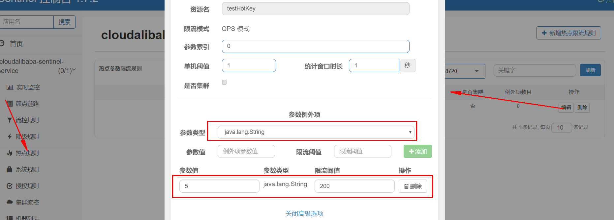

表示当p1=5的时候，QPS超过200时才进行限流。

注意：配置参数另外项的时候，参数必须是基本类型或者String。

#### 

 测试
  访问：http://localhost:8401/testHotKey?p1=5，点击量超过200才被限流。
  访问http://localhost:8401/testHotKey?p1=3，点击量超过1即被限流。

#### 其他

如果controller方法“/testHotKey”在出现了异常后，会直接将错误抛出到页面上，而没有fallback方法进行处理，这是因为“@SentinelResource”的“”并不负责对于异常的处理，它执行的对于不符合热点配置规则的访问，进行fallback处理。

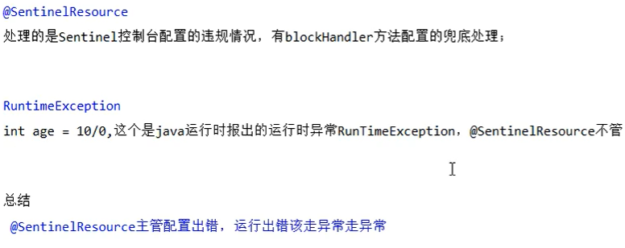


### 18.7 系统规则

 Sentinel 系统自适应限流从整体维度对应用入口流量进行控制，结合应用的 Load、CPU 使用率、总体平均 RT、入口 QPS 和并发线程数等几个维度的监控指标，通过自适应的流控策略，让系统的入口流量和系统的负载达到一个平衡，让系统尽可能跑在最大吞吐量的同时保证系统整体的稳定性。

#### 官网

 https://github.com/alibaba/Sentinel/wiki/系统自适应限流 

#### 各项配置说明

系统保护规则是从应用级别的入口流量进行控制，从单台机器的 load、CPU 使用率、平均 RT、入口 QPS 和并发线程数等几个维度监控应用指标，让系统尽可能跑在最大吞吐量的同时保证系统整体的稳定性。

系统保护规则是应用整体维度的，而不是资源维度的，并且**仅对入口流量生效**。入口流量指的是进入应用的流量（`EntryType.IN`），比如 Web 服务或 Dubbo 服务端接收的请求，都属于入口流量。

系统规则支持以下的模式：

- **Load 自适应**（仅对 Linux/Unix-like 机器生效）：系统的 load1 作为启发指标，进行自适应系统保护。当系统 load1 超过设定的启发值，且系统当前的并发线程数超过估算的系统容量时才会触发系统保护（BBR 阶段）。系统容量由系统的 `maxQps * minRt` 估算得出。设定参考值一般是 `CPU cores * 2.5`。
- **CPU usage**（1.5.0+ 版本）：当系统 CPU 使用率超过阈值即触发系统保护（取值范围 0.0-1.0），比较灵敏。
- **平均 RT**：当单台机器上所有入口流量的平均 RT 达到阈值即触发系统保护，单位是毫秒。
- **并发线程数**：当单台机器上所有入口流量的并发线程数达到阈值即触发系统保护。
- **入口 QPS**：当单台机器上所有入口流量的 QPS 达到阈值即触发系统保护。


#### 配置全局QPS

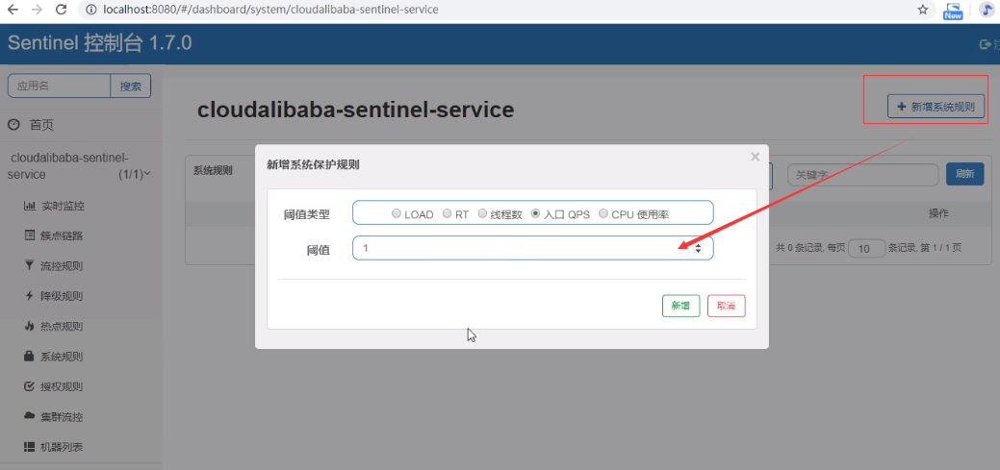


适合作为总的控制，不适合做细粒度的访问控制。


### 18.8 @SentinelResource

#### 18.8.1 官网

https://github.com/alibaba/Sentinel/wiki/注解支持

#### 18.8.2 按资源名称+后续处理

##### １）启动本地的Nacos

  访问：http://localhost:8848/nacos/#/login，查看是否能够成功访问

##### ２）启动本地的Sentinel

```
java -jar sentinel-dashboard-1.7.2.jar
```

访问：http://localhost:8080

#####   3）修改“cloudalibaba-sentinel-service8401”

新建业务类RateLimitController

```java
package com.atguigu.springcloud.controller;

import cn.hutool.core.util.IdUtil;
import com.atguigu.springcloud.entities.CommonResult;
import com.atguigu.springcloud.entities.Payment;
import com.atguigu.springcloud.myhandler.CustomerBlockHandler;
import com.alibaba.csp.sentinel.annotation.SentinelResource;
import com.alibaba.csp.sentinel.slots.block.BlockException;
import org.springframework.web.bind.annotation.GetMapping;
import org.springframework.web.bind.annotation.RestController;


@RestController
public class RateLimitController {

    @GetMapping("/byResource")
    @SentinelResource(value = "byResource", blockHandler = "handleException")
    public CommonResult byResource(){
        return new CommonResult(200, "按资源名称限流测试OK", new Payment(2020L, IdUtil.simpleUUID()));
    }

    public CommonResult handleException(BlockException blockException){
        return new CommonResult<>(444, blockException.getClass().getCanonicalName()+"\t服务不可用" );
    }

}

```


##### 4）启动“cloudalibaba-sentinel-service8401”

#####   5）配置流控规则

测试“<http://localhost:8401/byResource>”是否能够正常访问： 

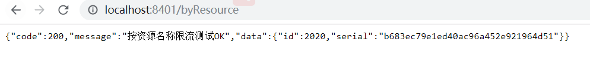

针对于“byResource”新增流控规则：

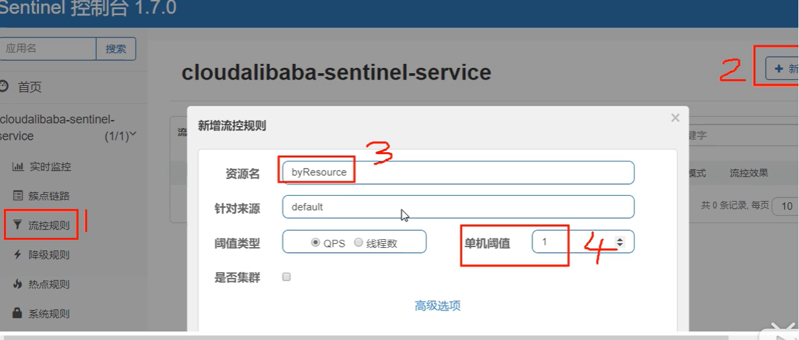

​    图形配置和代码关系
​    表示1秒钟内查询次数大于1，就跑到我们自定义的限流处，限流

##### 6）测试

连续多次访问 “<http://localhost:8401/byResource>”
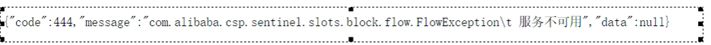


#####   7）其他问题

 关闭“cloudalibaba-sentinel-service8401”后，所配置的流控规则都丢失了，说明这种规则是临时的，那么如何持久化保存这些规则呢？


#### 18.8.3 按照Url地址限流+后续处理

通过访问URL来限流，会返回Sentinel自带默认的限流处理信息

（1）修改业务类RateLimitController

```java 
    @GetMapping("/rateLimit/byUrl")
    @SentinelResource(value = "byUrl")
    public CommonResult byUrl(){
        return new CommonResult(200, "by url限流测试OK", new Payment(2020L, IdUtil.simpleUUID()));
    }
```

（2）新增流控规则

测试“<http://localhost:8401/rateLimit/byUrl>”是否能够正常的访问。

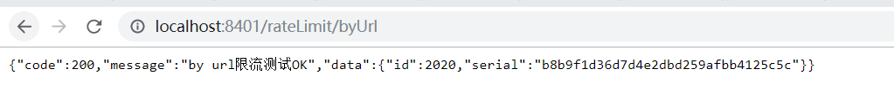

新增流控规则：  

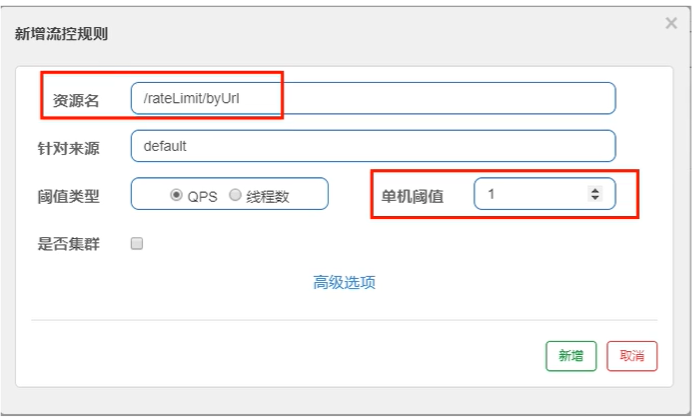

  （3）测试
  连续快速访问：http://localhost:8401/rateLimit/byUrl

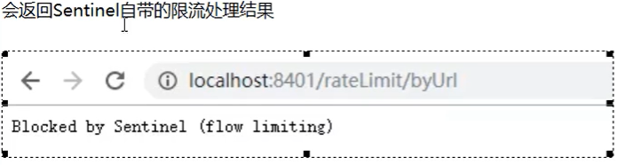

#### 18.8.4 上面兜底方案面临的问题

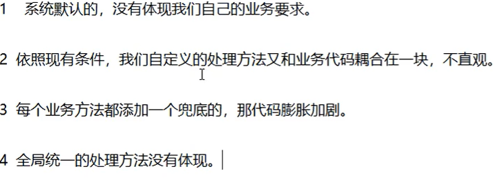

#### 18.8.5 客户自定义限流处理逻辑

 （1）创建CustomerBlockHandler类，用于自定义限流处理逻辑

```java
package com.atguigu.springcloud.myhandler;

import com.alibaba.csp.sentinel.slots.block.BlockException;
import com.atguigu.springcloud.entities.CommonResult ;


public class CustomerBlockHandler {

    public static CommonResult handlerException(BlockException exception) {
        return new CommonResult(444, "客户自定义，global handlerException---1");
    }

    public static CommonResult handlerException2(BlockException exception) {
        return new CommonResult(444, "客户自定义，global handlerException---2");
    }
}

```


（2）在RateLimitController中，添加如下的controller方法

```java
@GetMapping("/rateLimit/customerBlockHandler")
@SentinelResource(value = "customerBlockHandler",
                blockHandlerClass = CustomerBlockHandler.class, blockHandler = "handlerException2")
public CommonResult customerBlockHandler(){
    return new CommonResult(200, "客户自定义 限流测试OK", new Payment(2020L, IdUtil.simpleUUID()));
}
```

  （3）添加流控规则

访问：http://localhost:8401/rateLimit/customerBlockHandler

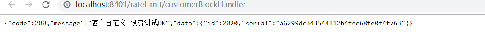

新建流控规则：

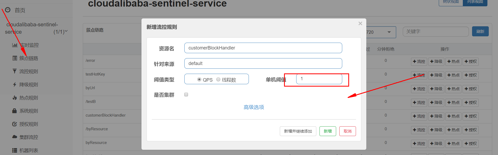

（4）测试

连续访问：<http://localhost:8401/rateLimit/customerBlockHandler>

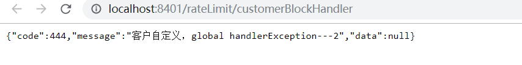


#### 18.8.6 更多注解说明


@SentinelResource 注解

> 注意：注解方式埋点不支持 private 方法。

`@SentinelResource` 用于定义资源，并提供可选的异常处理和 fallback 配置项。 `@SentinelResource` 注解包含以下属性：

- `value`：资源名称，必需项（不能为空）
- `entryType`：entry 类型，可选项（默认为 `EntryType.OUT`）
- `blockHandler` / `blockHandlerClass`: `blockHandler `对应处理 `BlockException` 的函数名称，可选项。blockHandler 函数访问范围需要是 `public`，返回类型需要与原方法相匹配，参数类型需要和原方法相匹配并且最后加一个额外的参数，类型为 `BlockException`。blockHandler 函数默认需要和原方法在同一个类中。若希望使用其他类的函数，则可以指定 `blockHandlerClass` 为对应的类的 `Class` 对象，注意对应的函数必需为 static 函数，否则无法解析。
- fallback：fallback 函数名称，可选项，用于在抛出异常的时候提供 fallback 处理逻辑。fallback 函数可以针对所有类型的异常（除了exceptionsToIgnore里面排除掉的异常类型）进行处理。fallback 函数签名和位置要求：
  - 返回值类型必须与原函数返回值类型一致；
  - 方法参数列表需要和原函数一致，或者可以额外多一个 `Throwable` 类型的参数用于接收对应的异常。
  - fallback 函数默认需要和原方法在同一个类中。若希望使用其他类的函数，则可以指定 `fallbackClass` 为对应的类的 `Class` 对象，注意对应的函数必需为 static 函数，否则无法解析。
- defaultFallback（since 1.6.0）：默认的 fallback 函数名称，可选项，通常用于通用的 fallback 逻辑（即可以用于很多服务或方法）。默认 fallback 函数可以针对所有类型的异常（除了exceptionsToIgnore里面排除掉的异常类型）进行处理。若同时配置了 fallback 和 defaultFallback，则只有 fallback 会生效。defaultFallback 函数签名要求：
  - 返回值类型必须与原函数返回值类型一致；
  - 方法参数列表需要为空，或者可以额外多一个 `Throwable` 类型的参数用于接收对应的异常。
  - defaultFallback 函数默认需要和原方法在同一个类中。若希望使用其他类的函数，则可以指定 `fallbackClass` 为对应的类的 `Class` 对象，注意对应的函数必需为 static 函数，否则无法解析。
- `exceptionsToIgnore`（since 1.6.0）：用于指定哪些异常被排除掉，不会计入异常统计中，也不会进入 fallback 逻辑中，而是会原样抛出。

> 注：1.6.0 之前的版本 fallback 函数只针对降级异常（`DegradeException`）进行处理，**不能针对业务异常进行处理**。

特别地，若 blockHandler 和 fallback 都进行了配置，则被限流降级而抛出 `BlockException` 时只会进入 `blockHandler` 处理逻辑。若未配置 `blockHandler`、`fallback` 和 `defaultFallback`，则被限流降级时会将 `BlockException` **直接抛出**（若方法本身未定义 throws BlockException 则会被 JVM 包装一层 `UndeclaredThrowableException`）。


  https://github.com/alibaba/Sentinel/wiki/%E6%B3%A8%E8%A7%A3%E6%94%AF%E6%8C%81
  多说一句

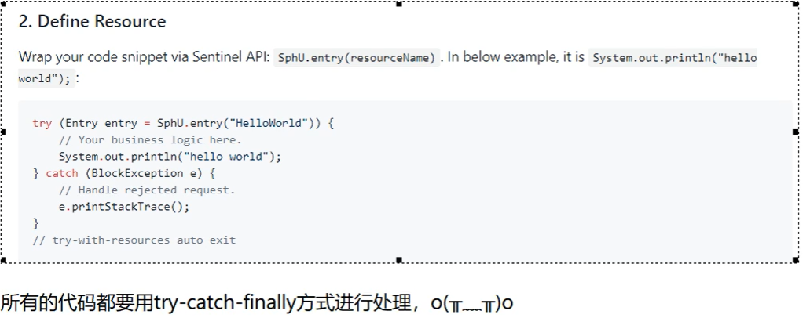

Sentinel主要有三个核心Api

- sphU定义资源
- Tracer定义统计
- ContextUtil定义了上下文


### 18.9 服务熔断功能


#### sentinel整合ribbon+openFeign+fallback

#### Ribbon系列

  修改84端口
    84消费者调用提供者9003
    Feign组件一般是消费测
  POM

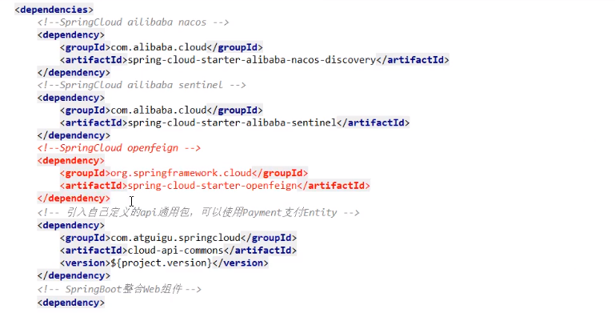

  YML
  业务类
  主启动

#### Feign系列

#### 熔断框架比较


### 18.10 规则持久化

#### 是什么

  一旦我们重启应用,sentinel规则消失,生产环境需要将配置规则进行持久化

#### 怎么玩

  将限流规则持久进Nacos保存,只要刷新8401某个rest地址,sentinel控制台的流控规则就能看得到,只要Nacos里面的配置不删除,针对8401上的流控规则持续有效

#### 步骤

  修改cloudalibaba-sentinel-server8401
  POM

```
<!--     sentinel-datasource-nacos 后续持久化用   -->
<dependency>
    <groupId>com.alibaba.csp</groupId>
    <artifactId>sentinel-datasource-nacos</artifactId>
</dependency>
```

  YML
    添加Nacos数据源配置

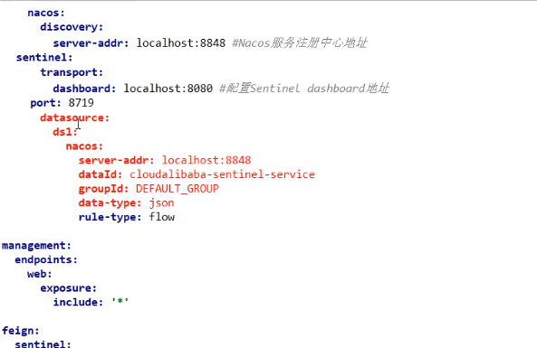

  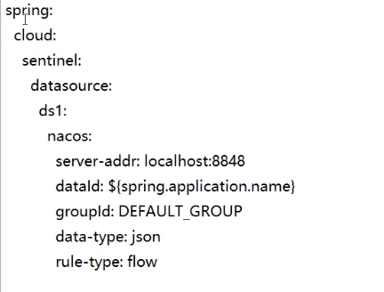

添加Nacos业务规则配置

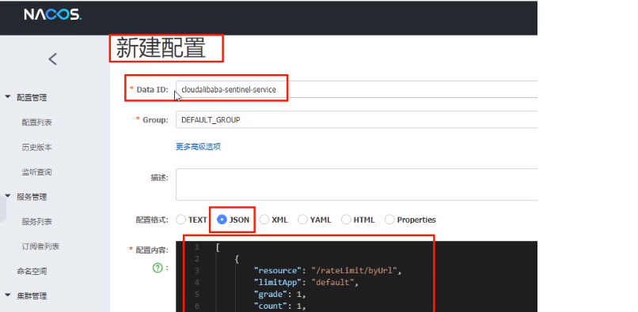

​    内容解析

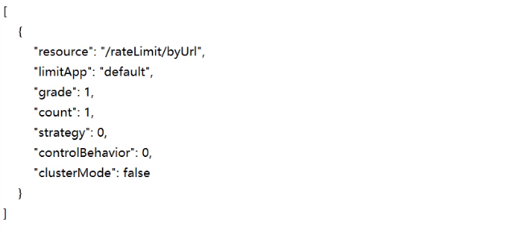

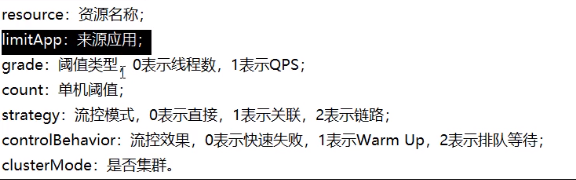

  启动8401刷新sentinel发现业务规则变了

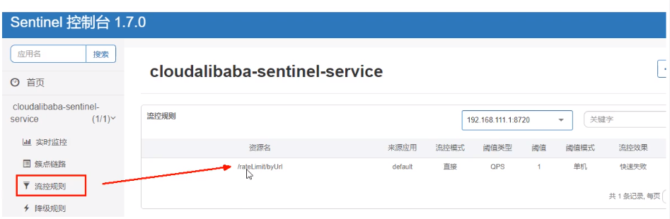

  快速访问测试接口
    http://localhost:8401/rateLimit/byUrl
    默认

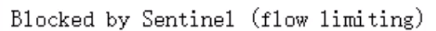

  停止8401再看sentinel

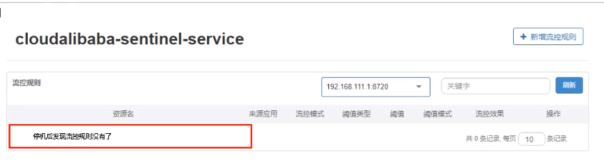

  重新启动8401再看sentinel
    咋一看还是没有了,稍等一会儿
    多次调用
      http://localhost:8401/rateLimit/byUrl
    重新配置出现了,持久化验证通过


## 19. SpringCloud Alibaba Seata处理分布式事务

### 19.1 分布式事务问题


#### 分布式前

  单机库存没这个问题
    O(∩_∩)O
  从1:1->1:N->N:N

#### 分布式之后


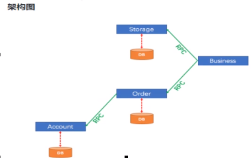

#### 一句话

  一次业务操作需要垮多个数据源或需要垮多个系统进行远程调用,就会产生分布式事务问题


### 19.2 Seata简介


#### 是什么

  Seata是一款开源的分布式事务解决方案,致力于在微服务架构下提供高性能和简单易用的分布式事务服务
  官网地址
    http://seata.io/zh-cn/

#### 能干嘛

  一个典型的分布式事务过程
    分布式事务处理过程-ID+三组件模型
      Transaction ID(XID)
        全局唯一的事务id
      三组件概念
        Transaction Coordinator(TC)
          事务协调器,维护全局事务的运行状态,负责协调并驱动全局事务的提交或回滚
        Transaction Manager(TM)
          控制全局事务的边界,负责开启一个全局事务,并最终发起全局提交或全局回滚的决议
        Resource Manager(RM)
          控制分支事务,负责分支注册、状态汇报,并接受事务协调的指令,驱动分支(本地)事务的提交和回滚
    处理过程


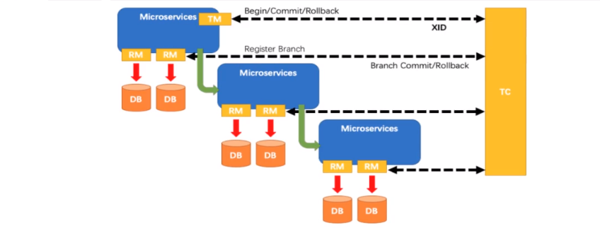

#### 下哪下

  发布说明: https://github.com/seata/seata/releases

#### 怎么玩

  本地@Transational
  全局@GlobalTranstional
    seata的分布式交易解决方案

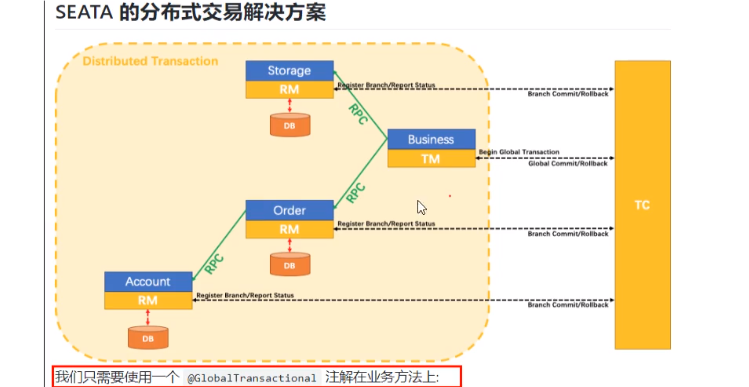

### 19.3 Seata-Server安装

1.官网地址
  https://seata.io/zh-cn/
2.下载版本
3.seata-server-0.9.0.zip解压到指定目录并修改conf目录下的file.conf配置文件
  先备份原始file.conf文件
  主要修改:自定义事务组名称+事务日志存储模式为db+数据库连接
  file.conf
    service模块

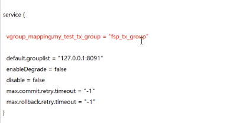

​    store模块

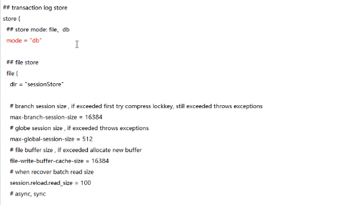

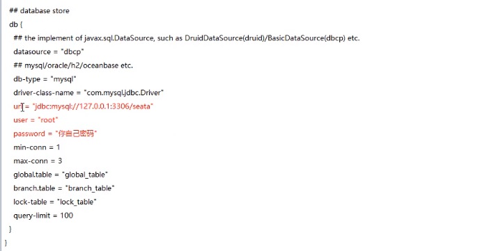

4.mysql5.7数据库新建库seata
  建表db_store.sql在seata-server-0.9.0\seata\conf目录里面
    db_store.sql
  SQL

```
-- the table to store GlobalSession data
drop table if exists `global_table`;
create table `global_table` (
  `xid` varchar(128)  not null,
  `transaction_id` bigint,
  `status` tinyint not null,
  `application_id` varchar(32),
  `transaction_service_group` varchar(32),
  `transaction_name` varchar(128),
  `timeout` int,
  `begin_time` bigint,
  `application_data` varchar(2000),
  `gmt_create` datetime,
  `gmt_modified` datetime,
  primary key (`xid`),
  key `idx_gmt_modified_status` (`gmt_modified`, `status`),
  key `idx_transaction_id` (`transaction_id`)
);
 
-- the table to store BranchSession data
drop table if exists `branch_table`;
create table `branch_table` (
  `branch_id` bigint not null,
  `xid` varchar(128) not null,
  `transaction_id` bigint ,
  `resource_group_id` varchar(32),
  `resource_id` varchar(256) ,
  `lock_key` varchar(128) ,
  `branch_type` varchar(8) ,
  `status` tinyint,
  `client_id` varchar(64),
  `application_data` varchar(2000),
  `gmt_create` datetime,
  `gmt_modified` datetime,
  primary key (`branch_id`),
  key `idx_xid` (`xid`)
);
 
-- the table to store lock data
drop table if exists `lock_table`;
create table `lock_table` (
  `row_key` varchar(128) not null,
  `xid` varchar(96),
  `transaction_id` long ,
  `branch_id` long,
  `resource_id` varchar(256) ,
  `table_name` varchar(32) ,
  `pk` varchar(36) ,
  `gmt_create` datetime ,
  `gmt_modified` datetime,
  primary key(`row_key`)
);
 

```

5.在seata库里新建表
6.修改seata-server-0.9.0\seata\conf目录下的registry.conf目录下的registry.conf配置文件

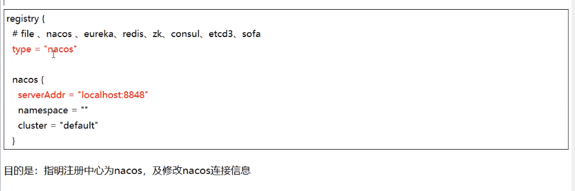


7.先启动Nacos端口号8848
8.再启动seata-server
  seata-server-0.9.0\seata\bin
    seata-server.bat


### 19.4 订单/库存/账户业务数据库准备

#### 以下演示都需要先启动Nacos后启动Seata,保证两个都OK 

  Seata没启动报错no available server to connect

#### 分布式事务业务说明

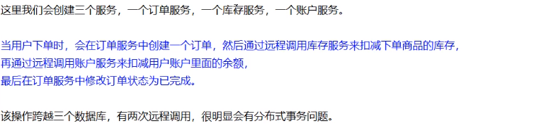


#### 创建业务数据库

  seata_order:存储订单的数据库
  seata_storage:存储库存的数据库
  seata_account:存储账户信息的数据库
  建表SQL

```
create database seata_order;
create database seata_storage;
create database seata_account;

```


#### 按照上述3库分别建立对应业务表

  seata_order库下新建t_order表

```
DROP TABLE IF EXISTS `t_order`;
CREATE TABLE `t_order`  (
  `int` bigint(11) NOT NULL AUTO_INCREMENT,
  `user_id` bigint(20) DEFAULT NULL COMMENT '用户id',
  `product_id` bigint(11) DEFAULT NULL COMMENT '产品id',
  `count` int(11) DEFAULT NULL COMMENT '数量',
  `money` decimal(11, 0) DEFAULT NULL COMMENT '金额',
  `status` int(1) DEFAULT NULL COMMENT '订单状态:  0:创建中 1:已完结',
  PRIMARY KEY (`int`) USING BTREE
) ENGINE = InnoDB CHARACTER SET = utf8 COLLATE = utf8_general_ci COMMENT = '订单表' ROW_FORMAT = Dynamic;

```

  seata_storage库下新建t_storage表

```
DROP TABLE IF EXISTS `t_storage`;
CREATE TABLE `t_storage`  (
  `int` bigint(11) NOT NULL AUTO_INCREMENT,
  `product_id` bigint(11) DEFAULT NULL COMMENT '产品id',
  `total` int(11) DEFAULT NULL COMMENT '总库存',
  `used` int(11) DEFAULT NULL COMMENT '已用库存',
  `residue` int(11) DEFAULT NULL COMMENT '剩余库存',
  PRIMARY KEY (`int`) USING BTREE
) ENGINE = InnoDB CHARACTER SET = utf8 COLLATE = utf8_general_ci COMMENT = '库存' ROW_FORMAT = Dynamic;
INSERT INTO `t_storage` VALUES (1, 1, 100, 0, 100);

```

  seata_account库下新建t_account表

```
CREATE TABLE `t_account`  (
  `id` bigint(11) NOT NULL COMMENT 'id',
  `user_id` bigint(11) DEFAULT NULL COMMENT '用户id',
  `total` decimal(10, 0) DEFAULT NULL COMMENT '总额度',
  `used` decimal(10, 0) DEFAULT NULL COMMENT '已用余额',
  `residue` decimal(10, 0) DEFAULT NULL COMMENT '剩余可用额度',
  PRIMARY KEY (`id`) USING BTREE
) ENGINE = InnoDB CHARACTER SET = utf8 COLLATE = utf8_general_ci COMMENT = '账户表' ROW_FORMAT = Dynamic;
 
INSERT INTO `t_account` VALUES (1, 1, 1000, 0, 1000);

```


#### 按照上述3库分别建立对应的回滚日志表

  订单-库存-账户3个库下都需要建各自独立的回滚日志表
  seata-server-0.9.0\seata\conf\目录下的db_undo_log.sql
  建表SQL

```
CREATE TABLE `undo_log` (
  `id` bigint(20) NOT NULL AUTO_INCREMENT,
  `branch_id` bigint(20) NOT NULL,
  `xid` varchar(100) NOT NULL,
  `context` varchar(128) NOT NULL,
  `rollback_info` longblob NOT NULL,
  `log_status` int(11) NOT NULL,
  `log_created` datetime NOT NULL,
  `log_modified` datetime NOT NULL,
  `ext` varchar(100) DEFAULT NULL,
  PRIMARY KEY (`id`),
  UNIQUE KEY `ux_undo_log` (`xid`,`branch_id`)
) ENGINE=InnoDB AUTO_INCREMENT=1 DEFAULT CHARSET=utf8;

```


#### 最终效果

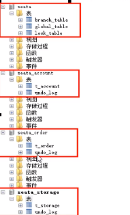


### 19.5 订单/库存/账户业务微服务准备

#### 业务需求

  下订单->减库存->扣余额->改(订单)状态

#### 新建订单Order-Module

  1.seata-order-service2001
  2.POM

```
<?xml version="1.0" encoding="UTF-8"?>
<project xmlns="http://maven.apache.org/POM/4.0.0"
         xmlns:xsi="http://www.w3.org/2001/XMLSchema-instance"
         xsi:schemaLocation="http://maven.apache.org/POM/4.0.0 http://maven.apache.org/xsd/maven-4.0.0.xsd">
    <parent>
        <artifactId>cloud2020</artifactId>
        <groupId>com.atguigu.springcloud</groupId>
        <version>1.0-SNAPSHOT</version>
    </parent>
    <modelVersion>4.0.0</modelVersion>

    <artifactId>seata-order-service2001</artifactId>


    <dependencies>
        <!-- nacos -->
        <dependency>
            <groupId>com.alibaba.cloud</groupId>
            <artifactId>spring-cloud-starter-alibaba-nacos-discovery</artifactId>
        </dependency>
        <!-- nacos -->

        <!-- seata-->
        <dependency>
            <groupId>com.alibaba.cloud</groupId>
            <artifactId>spring-cloud-starter-alibaba-seata</artifactId>
            <exclusions>
                <exclusion>
                    <groupId>io.seata</groupId>
                    <artifactId>seata-all</artifactId>
                </exclusion>
            </exclusions>
        </dependency>
        <dependency>
            <groupId>io.seata</groupId>
            <artifactId>seata-all</artifactId>
            <version>0.9.0</version>
        </dependency>
        <!-- seata-->
        <!--feign-->
        <dependency>
            <groupId>org.springframework.cloud</groupId>
            <artifactId>spring-cloud-starter-openfeign</artifactId>
        </dependency>
        <dependency>
            <groupId>org.springframework.boot</groupId>
            <artifactId>spring-boot-starter-web</artifactId>
        </dependency>
        <dependency>
            <groupId>org.mybatis.spring.boot</groupId>
            <artifactId>mybatis-spring-boot-starter</artifactId>
        </dependency>
        <dependency>
            <groupId>com.alibaba</groupId>
            <artifactId>druid-spring-boot-starter</artifactId>
        </dependency>
        <dependency>
            <groupId>mysql</groupId>
            <artifactId>mysql-connector-java</artifactId>
        </dependency>
        <!--jdbc-->
        <dependency>
            <groupId>org.springframework.boot</groupId>
            <artifactId>spring-boot-starter-jdbc</artifactId>
        </dependency>
        <dependency>
            <groupId>org.springframework.boot</groupId>
            <artifactId>spring-boot-starter-actuator</artifactId>
        </dependency>
        <dependency>
            <groupId>org.projectlombok</groupId>
            <artifactId>lombok</artifactId>
            <optional>true</optional>
        </dependency>
        <dependency>
            <groupId>org.springframework.boot</groupId>
            <artifactId>spring-boot-starter-test</artifactId>
            <scope>test</scope>
        </dependency>
    </dependencies>
</project>
 

```


  3.YML

```
server:
  port: 2001

spring:
  application:
    name: seata-order-service
  cloud:
    alibaba:
      seata:
        # 自定义事务组名称需要与seata-server中的对应
        tx-service-group: fsp_tx_group
    nacos:
      discovery:
        server-addr: localhost:8848
  datasource:
    # 当前数据源操作类型
    type: com.alibaba.druid.pool.DruidDataSource
    # mysql驱动类
    driver-class-name: com.mysql.cj.jdbc.Driver
    url: jdbc:mysql://localhost:3306/seata_order?useUnicode=true&characterEncoding=UTF-8&useSSL=false&serverTimezone=GMT%2B8
    username: root
    password: root
feign:
  hystrix:
    enabled: false
logging:
  level:
    io:
      seata: info

mybatis:
  mapper-locations: classpath:mapper/*.xml
 
 

```

  4.file.conf
    拷贝seata-server/conf目录下的file.conf

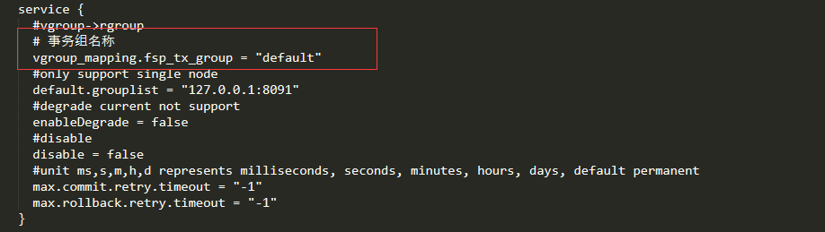

  5.registry.conf
    拷贝seata-server/conf目录下的registry.conf
  6.domain

CommonResult

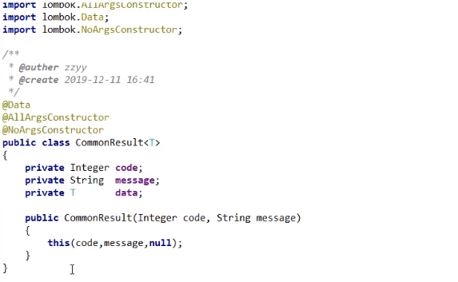

Order


  7.Dao接口实现
    OrderDao
    resources文件夹下新建mapper文件夹后添加
      OrderMapper.xml
  8.Service接口及实现
    OrderService
    AccountService
    StorageService
  9.Controller
    OrderController
  10.Config配置
    MyBatisConfig
    DataSourceProxyConfig
  11.主启动

#### 新建库存Storage-Module

  1.seata-storage-service2002

#### 新建账户Account-Module

  1.seata-account-service2003


### 19.6 Test

#### 数据库初始情况

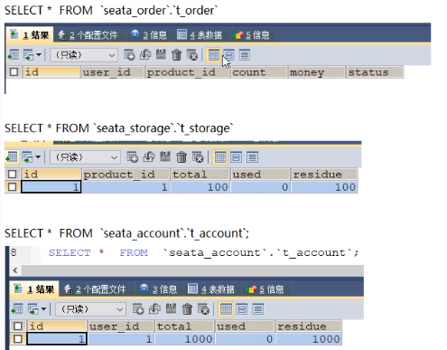


#### 下订单->减库存->扣余额->改(订单)状态


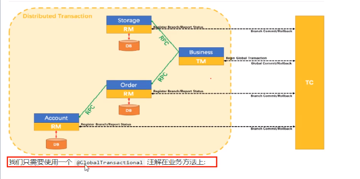


#### 正常下单

  http://localhost:2001/order/create?userId=1&productId=1&count=10&money=100
  数据库情况

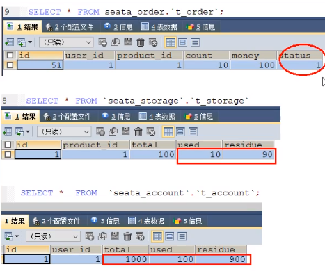


#### 超时异常,没加@GlobalTransactional

  AccountServiceImpl添加超时
  数据库情况
  故障情况
    当库存和账户金额扣减后,订单状态并没有设置为已经完成,没有从零改为1
    而且由于feign的重试机制,账户余额还有可能被多次扣减

#### 超时异常,添加@GlobalTransactional

  AccountServiceImpl添加超时
  OrderServiceImpl@GlobalTransactional

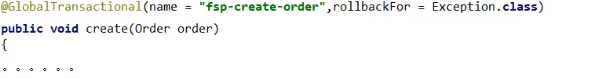


### 19.7 一部分补充

#### Seata

  2019年1月蚂蚁金服和阿里巴巴共同开源的分布式事务解决方案
  Simple Extensible Autonomous Transaction Architecture,简单可扩展自治事务框架
  2020起始,参加工作后用1.0以后的版本

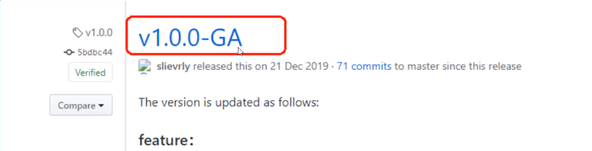


#### 再看TC/TM/RM三个组件


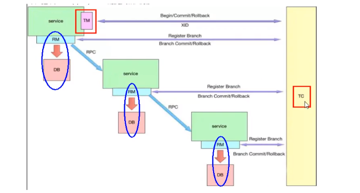

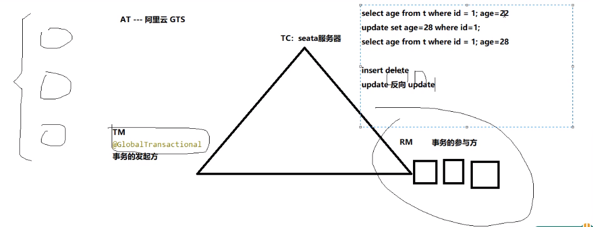

  分布式事务的执行流程
    TM开启分布式事务(TM向TC注册全局事务记录)
    按业务场景,编排数据库、服务等事务内资源(RM向TC汇报资源准备状态)
    TM结束分布式事务,事务一阶段结束(TM通知TC提交/回滚分布式事务)
    TC汇报事务信息,决定分布式事务是提交还是回滚
    TC通知所有RM提交/回滚资源,事务二阶段结束

#### AT模式如何做到对业务的无侵入

  是什么

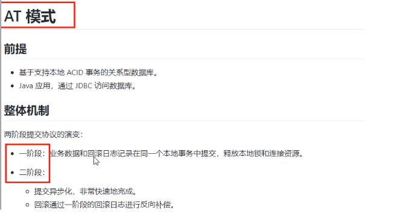

  一阶段加载

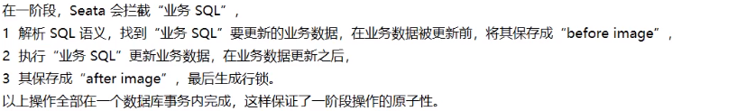

  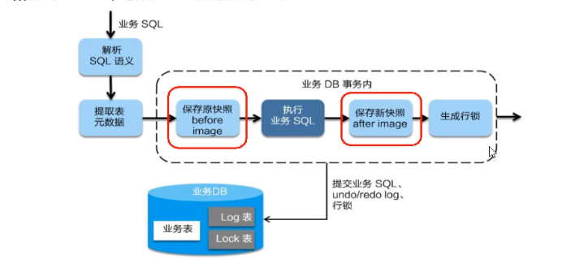

二阶段提交

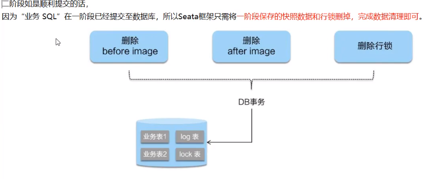


  三阶段回滚

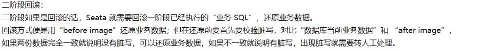

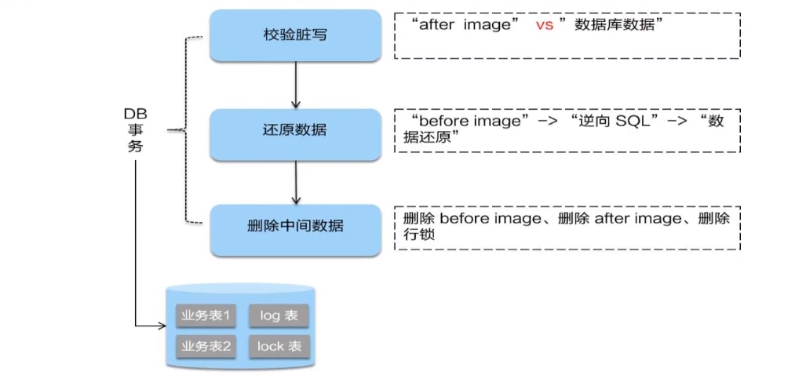

#### debug

AccountServiceImpl

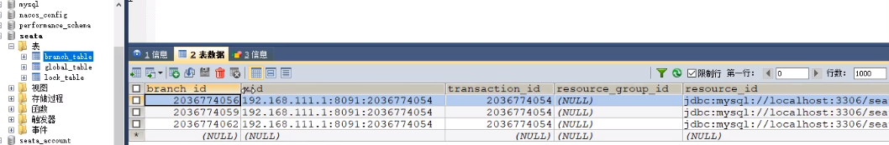

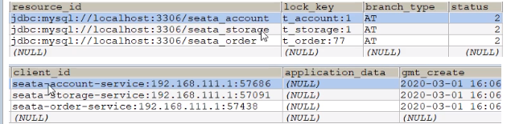

undo.log

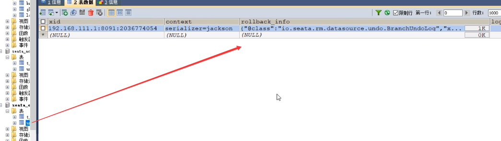

before image


#### 补充

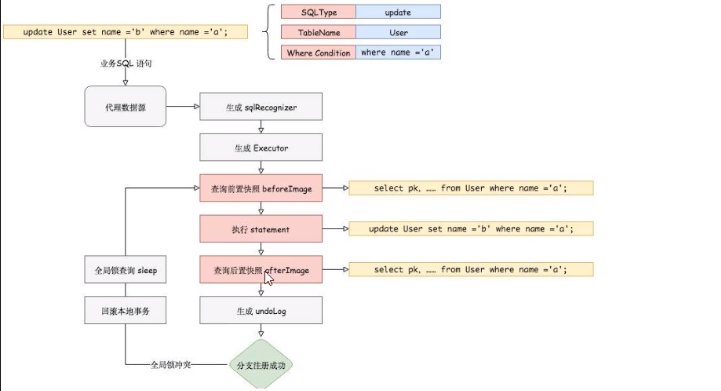

## 20. 大厂面试第三季(预告片)

### 1.Zookeeper实现过分布式锁吗


### 2.说说你用redis实现过分布式锁吗?如何实现的?你谈谈

### 3.集群高并发情况下如何保证分布式唯一全局id生成


#### 问题

  为什么需要分布式全局唯一ID以及分布式ID的业务需求 


  ID生成规则部分硬性要求
    1.全局唯一
      不能出现重复的ID号,既然是唯一标识,这是最基本的要求
    2.趋势递增
      在MySQL的innoDB引擎中使用的是聚集索引,由于多数RDBMS使用Btree的数据结构来存储索引数据,在主键的选择上面我们应该尽量使用有序的主键保证写入性能
    3.单调递增
      保证下一个ID大于上一个ID,例如事务版本号、IM增量信息、排序等特殊需求
    4.信息安全
      如果ID是连续的,恶意用户的扒取工作就非常容易做了,直接按照顺序下载指定URL即可 所以在一些应用场景下,需要ID无规则 不规则,让竞争对手不好猜
    5.含时间戳
      这样就能在开发中快速了解分布式id的生成时间
  ID号生成系统的可用性要求
    高可用
      发一个获取分布式ID的请求,服务器就要保证99.999%的情况下给我创建一个唯一分布式ID
    低延迟
      发一个获取分布式ID的请求,服务器就要快,极速
    搞QPS
      假如并发一口气创建分布式ID请求同时杀过来,服务器要顶得住且一下子成功创建10万

#### 一般通用方案

  UUID
    是什么

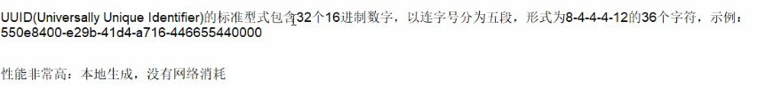

​      如果只考虑唯一性,OK 
​    But
​      入数据库性能查

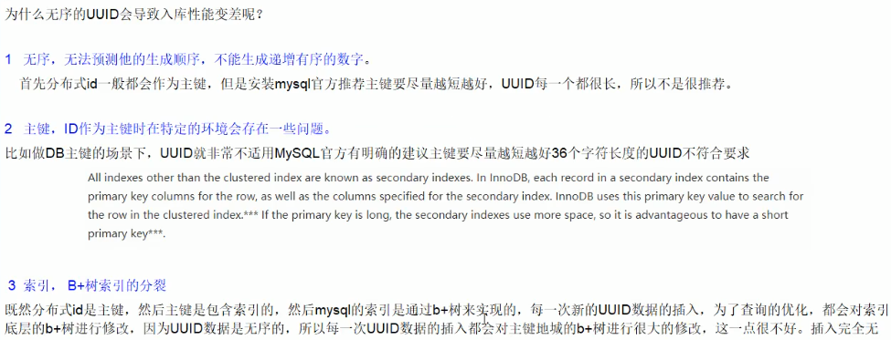


  数据库自增主键
    单机


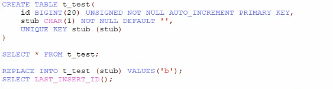

​    集群分布式

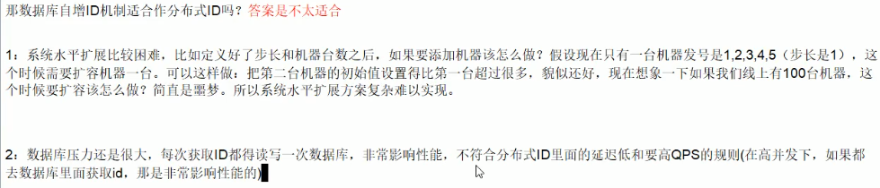

  基于redis生成全局id策略
    因为Redis是单线的天生保证原子性,可以使用原子操作INCR和INCRBY来实现
    集群分布式

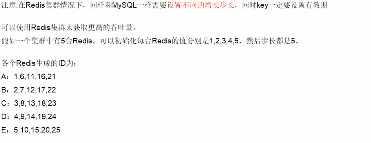

#### snowflake

  Twitter的分布式自增ID算法snowflake
    概述


​    结构

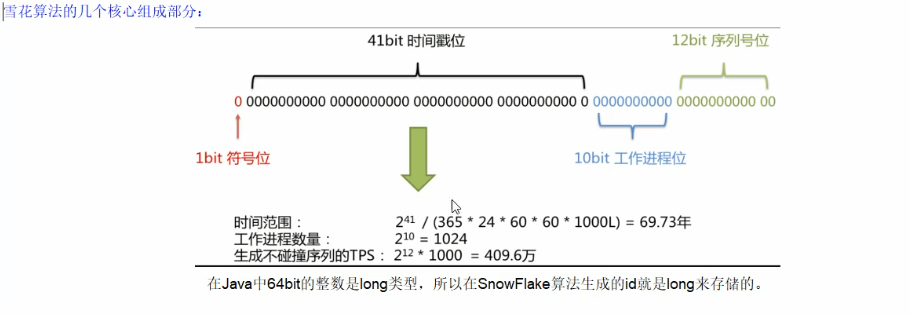

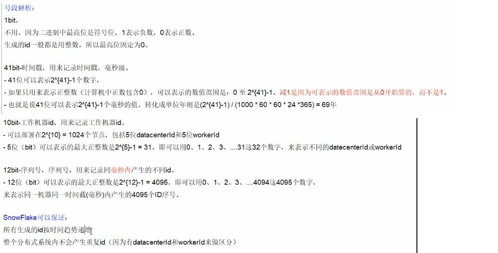

​    源码

```
/**
 * Twitter_Snowflake<br>
 * SnowFlake的结构如下(每部分用-分开):<br>
 * 0 - 0000000000 0000000000 0000000000 0000000000 0 - 00000 - 00000 - 000000000000 <br>
 * 1位标识，由于long基本类型在Java中是带符号的，最高位是符号位，正数是0，负数是1，所以id一般是正数，最高位是0<br>
 * 41位时间截(毫秒级)，注意，41位时间截不是存储当前时间的时间截，而是存储时间截的差值（当前时间截 - 开始时间截)
 * 得到的值），这里的的开始时间截，一般是我们的id生成器开始使用的时间，由我们程序来指定的（如下下面程序IdWorker类的startTime属性）。41位的时间截，可以使用69年，年T = (1L << 41) / (1000L * 60 * 60 * 24 * 365) = 69<br>
 * 10位的数据机器位，可以部署在1024个节点，包括5位datacenterId和5位workerId<br>
 * 12位序列，毫秒内的计数，12位的计数顺序号支持每个节点每毫秒(同一机器，同一时间截)产生4096个ID序号<br>
 * 加起来刚好64位，为一个Long型。<br>
 * SnowFlake的优点是，整体上按照时间自增排序，并且整个分布式系统内不会产生ID碰撞(由数据中心ID和机器ID作区分)，并且效率较高，经测试，SnowFlake每秒能够产生26万ID左右。
 */
public class SnowflakeIdWorker {
 
    // ==============================Fields===========================================
    /** 开始时间截 (2015-01-01) */
    private final long twepoch = 1420041600000L;
 
    /** 机器id所占的位数 */
    private final long workerIdBits = 5L;
 
    /** 数据标识id所占的位数 */
    private final long datacenterIdBits = 5L;
 
    /** 支持的最大机器id，结果是31 (这个移位算法可以很快的计算出几位二进制数所能表示的最大十进制数) */
    private final long maxWorkerId = -1L ^ (-1L << workerIdBits);
 
    /** 支持的最大数据标识id，结果是31 */
    private final long maxDatacenterId = -1L ^ (-1L << datacenterIdBits);
 
    /** 序列在id中占的位数 */
    private final long sequenceBits = 12L;
 
    /** 机器ID向左移12位 */
    private final long workerIdShift = sequenceBits;
 
    /** 数据标识id向左移17位(12+5) */
    private final long datacenterIdShift = sequenceBits + workerIdBits;
 
    /** 时间截向左移22位(5+5+12) */
    private final long timestampLeftShift = sequenceBits + workerIdBits + datacenterIdBits;
 
    /** 生成序列的掩码，这里为4095 (0b111111111111=0xfff=4095) */
    private final long sequenceMask = -1L ^ (-1L << sequenceBits);
 
    /** 工作机器ID(0~31) */
    private long workerId;
 
    /** 数据中心ID(0~31) */
    private long datacenterId;
 
    /** 毫秒内序列(0~4095) */
    private long sequence = 0L;
 
    /** 上次生成ID的时间截 */
    private long lastTimestamp = -1L;
 
    //==============================Constructors=====================================
    /**
     * 构造函数
     * @param workerId 工作ID (0~31)
     * @param datacenterId 数据中心ID (0~31)
     */
    public SnowflakeIdWorker(long workerId, long datacenterId) {
        if (workerId > maxWorkerId || workerId < 0) {
            throw new IllegalArgumentException(String.format("worker Id can't be greater than %d or less than 0", maxWorkerId));
        }
        if (datacenterId > maxDatacenterId || datacenterId < 0) {
            throw new IllegalArgumentException(String.format("datacenter Id can't be greater than %d or less than 0", maxDatacenterId));
        }
        this.workerId = workerId;
        this.datacenterId = datacenterId;
    }
 
    // ==============================Methods==========================================
    /**
     * 获得下一个ID (该方法是线程安全的)
     * @return SnowflakeId
     */
    public synchronized long nextId() {
        long timestamp = timeGen();
 
        //如果当前时间小于上一次ID生成的时间戳，说明系统时钟回退过这个时候应当抛出异常
        if (timestamp < lastTimestamp) {
            throw new RuntimeException(
                    String.format("Clock moved backwards.  Refusing to generate id for %d milliseconds", lastTimestamp - timestamp));
        }
 
        //如果是同一时间生成的，则进行毫秒内序列
        if (lastTimestamp == timestamp) {
            sequence = (sequence + 1) & sequenceMask;
            //毫秒内序列溢出
            if (sequence == 0) {
                //阻塞到下一个毫秒,获得新的时间戳
                timestamp = tilNextMillis(lastTimestamp);
            }
        }
        //时间戳改变，毫秒内序列重置
        else {
            sequence = 0L;
        }
 
        //上次生成ID的时间截
        lastTimestamp = timestamp;
 
        //移位并通过或运算拼到一起组成64位的ID
        return ((timestamp - twepoch) << timestampLeftShift) //
                | (datacenterId << datacenterIdShift) //
                | (workerId << workerIdShift) //
                | sequence;
    }
 
    /**
     * 阻塞到下一个毫秒，直到获得新的时间戳
     * @param lastTimestamp 上次生成ID的时间截
     * @return 当前时间戳
     */
    protected long tilNextMillis(long lastTimestamp) {
        long timestamp = timeGen();
        while (timestamp <= lastTimestamp) {
            timestamp = timeGen();
        }
        return timestamp;
    }
 
    /**
     * 返回以毫秒为单位的当前时间
     * @return 当前时间(毫秒)
     */
    protected long timeGen() {
        return System.currentTimeMillis();
    }
 
    //==============================Test=============================================
    /** 测试 */
    public static void main(String[] args) {
        SnowflakeIdWorker idWorker = new SnowflakeIdWorker(0, 0);
        for (int i = 0; i < 1000; i++) {
            long id = idWorker.nextId();
            System.out.println(Long.toBinaryString(id));
            System.out.println(id);
        }
    }
}

```


​      https://github.com/twitter-archive/snowflake
​    工程落地经验
​      糊涂工具包
​        https://github.com/looly/hutool
​        https://hutool.cn/
​      springboot整合雪花算法
​        POM

```
<dependency>
    <groupId>cn.hutool</groupId>
    <artifactId>hutool-captcha</artifactId>
    <version>5.2.0</version>
</dependency>

```


​        核心代码IdGeneratorSnowflake
​    优缺点

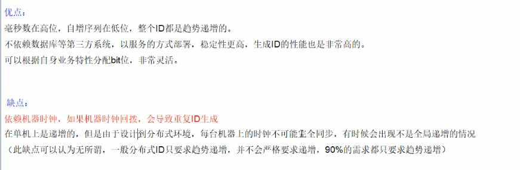


#### 其他补充

  百度开源的分布式唯一ID生成器UidGenerator
  Subtopic


### 4.在你的项目中,哪些数据是数据库和redis缓存双写一份的?如何保证双写一致性?

### 5.抗住了多少QPS?数据流回源会有多少QPS?