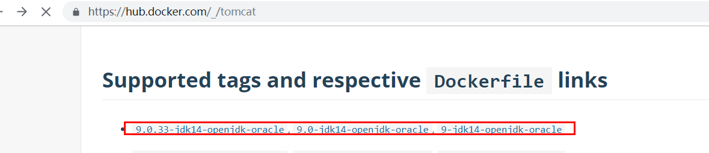

# Docker简记

## 1：Docker简介

### 1）出现背景

　　一款产品从开发到上线，从操作系统，到运行环境，再到应用配置。作为开发+运维之间的协作我们需要关心很多东西，这也是很多互联网公司都不得不面对的问题，特别是各种版本的迭代之后，不同版本环境的兼容，对运维人员都是考验Docker之所以发展如此迅速，也是因为它对此给出了一个标准化的解决方案。
　　环境配置如此麻烦，换一台机器，就要重来一次，费力费时。很多人想到，能不能从根本上解决问题，软件可以带环境安装？也就是说，安装的时候，把原始环境一模一样地复制过来。开发人员利用 Docker 可以消除协作编码时“在我的机器上可正常工作”的问题。


　　之前在服务器配置一个应用的运行环境，要安装各种软件，安装和配置这些东西有多麻烦就不说了，它还不能跨平台。假如我们是在 Windows 上安装的这些环境，到了 Linux 又得重新装。况且就算不跨操作系统，换另一台同样操作系统的服务器，要移植应用也是非常麻烦的。

　　传统上认为，软件编码开发/测试结束后，所产出的成果即是程序或是能够编译执行的二进制字节码等(java为例)。而为了让这些程序可以顺利执行，开发团队也得准备完整的部署文件，让维运团队得以部署应用程式，开发需要清楚的告诉运维部署团队，用的全部配置文件+所有软件环境。不过，即便如此，仍然常常发生部署失败的状况。Docker镜像的设计，使得Docker得以打破过去「程序即应用」的观念。透过镜像(images)将作业系统核心除外，运作应用程式所需要的系统环境，由下而上打包，达到应用程式跨平台间的无缝接轨运作。


### 2）docker理念

　　Docker是基于Go语言实现的云开源项目。
　　Docker的主要目标是“Build，Ship and Run Any App,Anywhere”，也就是通过对应用组件的封装、分发、部署、运行等生命周期的管理，使用户的APP（可以是一个WEB应用或数据库应用等等）及其运行环境能够做到“一次封装，到处运行”。


　　Linux 容器技术的出现就解决了这样一个问题，而 Docker 就是在它的基础上发展过来的。将应用运行在 Docker 容器上面，而 Docker 容器在任何操作系统上都是一致的，这就实现了跨平台、跨服务器。


### 3）虚拟机技术和容器虚拟化技术

1. 早期虚拟机技术

　　虚拟机（virtual machine）就是带环境安装的一种解决方案。它可以在一种操作系统里面运行另一种操作系统，比如在Windows 系统里面运行Linux 系统。应用程序对此毫无感知，因为虚拟机看上去跟真实系统一模一样，而对于底层系统来说，虚拟机就是一个普通文件，不需要了就删掉，对其他部分毫无影响。这类虚拟机完美的运行了另一套系统，能够使应用程序，操作系统和硬件三者之间的逻辑不变。  


虚拟机的缺点：

-  资源占用多     
- 冗余步骤多
- 启动慢

2. 容器虚拟化技术

　　由于前面虚拟机存在这些缺点，Linux 发展出了另一种虚拟化技术：Linux 容器（Linux Containers，缩写为 LXC）。
Linux 容器不是模拟一个完整的操作系统，而是对进程进行隔离。有了容器，就可以将软件运行所需的所有资源打包到一个隔离的容器中。容器与虚拟机不同，不需要捆绑一整套操作系统，只需要软件工作所需的库资源和设置。系统因此而变得高效轻量并保证部署在任何环境中的软件都能始终如一地运行。


 Docker 和传统虚拟化方式的不同之处：

* 传统虚拟机技术是虚拟出一套硬件后，在其上运行一个完整操作系统，在该系统上再运行所需应用进程；
* 而容器内的应用进程直接运行于宿主的内核，容器内没有自己的内核，而且也没有进行硬件虚拟。因此容器要比传统虚拟机更为轻便。
* 每个容器之间互相隔离，每个容器有自己的文件系统 ，容器之间进程不会相互影响，能区分计算资源。

### 4）为开发运维带来的便利

1. 更快速的应用交付和部署
传统的应用开发完成后，需要提供一堆安装程序和配置说明文档，安装部署后需根据配置文档进行繁杂的配置才能正常运行。Docker化之后只需要交付少量容器镜像文件，在正式生产环境加载镜像并运行即可，应用安装配置在镜像里已经内置好，大大节省部署配置和测试验证时间。

2. 更便捷的升级和扩缩容
随着微服务架构和Docker的发展，大量的应用会通过微服务方式架构，应用的开发构建将变成搭乐高积木一样，每个Docker容器将变成一块“积木”，应用的升级将变得非常容易。当现有的容器不足以支撑业务处理时，可通过镜像运行新的容器进行快速扩容，使应用系统的扩容从原先的天级变成分钟级甚至秒级。

3. 更简单的系统运维


   应用容器化运行后，生产环境运行的应用可与开发、测试环境的应用高度一致，容器会将应用程序相关的环境和状态完全封装起来，不会因为底层基础架构和操作系统的不一致性给应用带来影响，产生新的BUG。当出现程序异常时，也可以通过测试环境的相同容器进行快速定位和修复。

4. 更高效的计算资源利用

   Docker是内核级虚拟化，其不像传统的虚拟化技术一样需要额外的Hypervisor支持，所以在一台物理机上可以运行很多个容器实例，可大大提升物理服务器的CPU和内存的利用率。


**Docker**是一个开源的应用容器引擎；是一个轻量级容器技术；

Docker支持将软件编译成一个镜像；然后在镜像中各种软件做好配置，将镜像发布出去，其他使用者可以直接使用这个镜像；

运行中的这个镜像称为容器，容器启动是非常快速的。


### 5）docker的基本组成

#### 镜像（image）

Docker 镜像（Image）就是一个 只读 的模板。镜像可以用来创建 Docker 容器， 一个镜像可以创建很多容器 。

#### 容器（container）

Docker 利用容器（Container）独立运行的一个或一组应用。 容器是用镜像创建的运行实例 。

它可以被启动、开始、停止、删除。每个容器都是相互隔离的、保证安全的平台。

可以把容器看做是一个简易版的 Linux 环境 （包括root用户权限、进程空间、用户空间和网络空间等）和运行在其中的应用程序。

容器的定义和镜像几乎一模一样，也是一堆层的统一视角，唯一区别在于容器的最上面那一层是**可读可写**的。

#### 仓库（repository）


仓库（Repository）是 集中存放镜像 文件的场所。

仓库(Repository)和仓库注册服务器（Registry）是有区别的。仓库注册服务器上往往存放着多个仓库，每个仓库中又包含了多个镜像，每个镜像有不同的标签（tag）。

仓库分为公开仓库（Public）和私有仓库（Private）两种形式。

最大的公开仓库是 Docker Hub(https://hub.docker.com/) ，

存放了数量庞大的镜像供用户下载。国内的公开仓库包括阿里云 、网易云等.


### 6）docker的架构图


### 7）docker底层原理

#### docker是怎样工作的

Docker是一个Client-Server结构的系统，Docker守护进程运行在主机上， 然后通过Socket连接从客户端访问，守护进程从客户端接受命令并管理运行在主机上的容器。 容器，是一个运行时环境，就是我们前面说到的集装箱。


#### 为什么docker比vm快

1. docker有着比虚拟机更少的抽象层。由亍docker不需要Hypervisor实现硬件资源虚拟化,运行在docker容器上的程序直接使用的都是实际物理机的硬件资源。因此在CPU、内存利用率上docker将会在效率上有明显优势。

2. docker利用的是宿主机的内核,而不需要Guest OS。因此,当新建一个容器时,docker不需要和虚拟机一样重新加载一个操作系统内核。仍而避免引寻、加载操作系统内核返个比较费时费资源的过程,当新建一个虚拟机时,虚拟机软件需要加载Guest OS,返个新建过程是分钟级别的。而docker由于直接利用宿主机的操作系统,则省略了返个过程,因此新建一个docker容器只需要几秒钟。


## 2：Docker安装

centos7.6下安装docker

系统信息

```shell
[root@Linux5 ~]# uname -r
3.10.0-957.el7.x86_64
[root@Linux5 ~]# cat /etc/redhat-release 
CentOS Linux release 7.6.1810 (Core) 
[root@Linux5 ~]# 

```


### 1）安装gcc相关

```
yum -y install gcc
yum -y install gcc-c++
```

### 2）卸载旧版本

```
 yum remove docker \
                  docker-client \
                  docker-client-latest \
                  docker-common \
                  docker-latest \
                  docker-latest-logrotate \
                  docker-logrotate \
                  docker-engine
```


### 3）安装需要的软件包

```shell
yum install -y yum-utils device-mapper-persistent-data lvm2
```

如:

```shell
[root@Linux6 software]# yum install -y yum-utils \
>   device-mapper-persistent-data \
>   lvm2
Loaded plugins: fastestmirror
Loading mirror speeds from cached hostfile
 * base: mirrors.cqu.edu.cn
 * extras: mirrors.ustc.edu.cn
 * updates: mirrors.cqu.edu.cn
Resolving Dependencies
--> Running transaction check
...
Installed:
  yum-utils.noarch 0:1.1.31-52.el7                                                                                                                         

Dependency Installed:
  libxml2-python.x86_64 0:2.9.1-6.el7_2.3               python-chardet.noarch 0:2.2.1-3.el7               python-kitchen.noarch 0:1.1.1-5.el7              

Updated:
  device-mapper-persistent-data.x86_64 0:0.8.5-1.el7                                    lvm2.x86_64 7:2.02.185-2.el7_7.2                                   

Dependency Updated:
  device-mapper.x86_64 7:1.02.158-2.el7_7.2        device-mapper-event.x86_64 7:1.02.158-2.el7_7.2   device-mapper-event-libs.x86_64 7:1.02.158-2.el7_7.2  
  device-mapper-libs.x86_64 7:1.02.158-2.el7_7.2   lvm2-libs.x86_64 7:2.02.185-2.el7_7.2            

Complete!

```


### 4）设置stable镜像仓库

官方给出的是这个仓库,但是并不推荐使用它,因为速度慢

```shell
yum-config-manager --add-repo https://download.docker.com/linux/centos/docker-ce.repo
```


推荐使用阿里云的镜像[仓库]( https://mirrors.aliyun.com/docker-ce/linux/centos/7/x86_64/stable/Packages/ ):

```
yum-config-manager --add-repo http://mirrors.aliyun.com/docker-ce/linux/centos/docker-ce.repo
```

### 5）更新yum软件包索引

```shell
yum makecache fast
```

### 6）安装DOCKER CE

```
yum -y install docker-ce
```

安装过程：

```shell
[root@Linux6 ~]# yum -y install docker-ce
...
Installed:
  docker-ce.x86_64 3:19.03.8-3.el7                                                                                                                         

Dependency Installed:
  audit-libs-python.x86_64 0:2.8.5-4.el7            checkpolicy.x86_64 0:2.5-8.el7                        container-selinux.noarch 2:2.107-3.el7           
  containerd.io.x86_64 0:1.2.13-3.1.el7             docker-ce-cli.x86_64 1:19.03.8-3.el7                  libcgroup.x86_64 0:0.41-21.el7                   
  libsemanage-python.x86_64 0:2.5-14.el7            policycoreutils-python.x86_64 0:2.5-33.el7            python-IPy.noarch 0:0.75-6.el7                   
  setools-libs.x86_64 0:3.3.8-4.el7                

Dependency Updated:
  audit.x86_64 0:2.8.5-4.el7                    audit-libs.x86_64 0:2.8.5-4.el7                    policycoreutils.x86_64 0:2.5-33.el7                   

Complete!
[root@Linux6 ~]#
```


### 7）启动和停止docker

```shell
#启动docker
[root@localhost ~]# systemctl start docker
[root@localhost ~]# docker -v
Docker version 1.12.6, build 3e8e77d/1.12.6
#开机启动docker
[root@localhost ~]# systemctl enable docker
Created symlink from /etc/systemd/system/multi-user.target.wants/docker.service to /usr/lib/systemd/system/docker.service.
#停止docker
systemctl stop docker
```

查看Docker进程

```shell
[root@hadoop-104 ~]# ps -ef|grep docker
root     16425     1  0 01:53 ?        00:00:00 /usr/bin/dockerd -H fd:// --containerd=/run/containerd/containerd.sock
root     16598  9261  0 01:55 pts/0    00:00:00 grep --color=auto docker
```


### 8）测试

查看版本信息:

```shell
[root@Linux6 ~]# docker version
Client: Docker Engine - Community
 Version:           19.03.8
 API version:       1.40
 Go version:        go1.12.17
 Git commit:        afacb8b
 Built:             Wed Mar 11 01:27:04 2020
 OS/Arch:           linux/amd64
 Experimental:      false
Cannot connect to the Docker daemon at unix:///var/run/docker.sock. Is the docker daemon running?
[root@Linux6 ~]# 
```

运行hell world

```shell
[root@Linux6 ~]# docker run hello-world
Unable to find image 'hello-world:latest' locally

latest: Pulling from library/hello-world
1b930d010525: Pull complete 
Digest: sha256:f9dfddf63636d84ef479d645ab5885156ae030f611a56f3a7ac7f2fdd86d7e4e
Status: Downloaded newer image for hello-world:latest

Hello from Docker!
This message shows that your installation appears to be working correctly.

To generate this message, Docker took the following steps:
 1. The Docker client contacted the Docker daemon.
 2. The Docker daemon pulled the "hello-world" image from the Docker Hub.
    (amd64)
 3. The Docker daemon created a new container from that image which runs the
    executable that produces the output you are currently reading.
 4. The Docker daemon streamed that output to the Docker client, which sent it
    to your terminal.

To try something more ambitious, you can run an Ubuntu container with:
 $ docker run -it ubuntu bash

Share images, automate workflows, and more with a free Docker ID:
 https://hub.docker.com/

For more examples and ideas, visit:
 https://docs.docker.com/get-started/

[root@Linux6 ~]# 
```


更多安装详情见: https://docs.docker.com/install/linux/docker-ce/centos/ 

### 9）卸载docker

```shell
systemctl stop docker 

yum -y remove docker-ce

rm -rf /var/lib/docker
```


## 3：Docker常用命令

### 1）帮助命令

1. docker info

```shell
[root@Linux6 ~]# docker info
Client:
 Debug Mode: false

Server:
 Containers: 1
  Running: 0
  Paused: 0
  Stopped: 1
 Images: 1
 Server Version: 19.03.8
 Storage Driver: overlay2
  Backing Filesystem: <unknown>
  Supports d_type: true
  Native Overlay Diff: true
 Logging Driver: json-file
 Cgroup Driver: cgroupfs
 Plugins:
  Volume: local
  Network: bridge host ipvlan macvlan null overlay
  Log: awslogs fluentd gcplogs gelf journald json-file local logentries splunk syslog
 Swarm: inactive
 Runtimes: runc
 Default Runtime: runc
 Init Binary: docker-init
 containerd version: 7ad184331fa3e55e52b890ea95e65ba581ae3429
 runc version: dc9208a3303feef5b3839f4323d9beb36df0a9dd
 init version: fec3683
 Security Options:
  seccomp
   Profile: default
 Kernel Version: 3.10.0-957.el7.x86_64
 Operating System: CentOS Linux 7 (Core)
 OSType: linux
 Architecture: x86_64
 CPUs: 1
 Total Memory: 982.1MiB
 Name: Linux6
 ID: ULJW:GTJJ:QL5Z:P5EI:MIRG:D6RE:NUTX:54LS:XVJT:3N24:V4QJ:WXJJ
 Docker Root Dir: /var/lib/docker
 Debug Mode: false
 Registry: https://index.docker.io/v1/
 Labels:
 Experimental: false
 Insecure Registries:
  127.0.0.0/8
 Registry Mirrors:
  https://xxx.mirror.aliyuncs.com/
 Live Restore Enabled: false

[root@Linux6 ~]# 
```


2. docker --help 

```shell
[root@Linux6 ~]# docker --help

Usage:  docker [OPTIONS] COMMAND

A self-sufficient runtime for containers

Options:
      --config string      Location of client config files (default "/root/.docker")
  -c, --context string     Name of the context to use to connect to the daemon (overrides DOCKER_HOST env var and default context set with "docker
                           context use")
  -D, --debug              Enable debug mode
  -H, --host list          Daemon socket(s) to connect to
  -l, --log-level string   Set the logging level ("debug"|"info"|"warn"|"error"|"fatal") (default "info")
      --tls                Use TLS; implied by --tlsverify
      --tlscacert string   Trust certs signed only by this CA (default "/root/.docker/ca.pem")
      --tlscert string     Path to TLS certificate file (default "/root/.docker/cert.pem")
      --tlskey string      Path to TLS key file (default "/root/.docker/key.pem")
      --tlsverify          Use TLS and verify the remote
  -v, --version            Print version information and quit

Management Commands:
  builder     Manage builds
  config      Manage Docker configs
  container   Manage containers
  context     Manage contexts
  engine      Manage the docker engine
  image       Manage images
  network     Manage networks
  node        Manage Swarm nodes
  plugin      Manage plugins
  secret      Manage Docker secrets
  service     Manage services
  stack       Manage Docker stacks
  swarm       Manage Swarm
  system      Manage Docker
  trust       Manage trust on Docker images
  volume      Manage volumes

Commands:
  attach      Attach local standard input, output, and error streams to a running container
  build       Build an image from a Dockerfile
  commit      Create a new image from a container's changes
  cp          Copy files/folders between a container and the local filesystem
  create      Create a new container
  diff        Inspect changes to files or directories on a container's filesystem
  events      Get real time events from the server
  exec        Run a command in a running container
  export      Export a container's filesystem as a tar archive
  history     Show the history of an image
  images      List images
  import      Import the contents from a tarball to create a filesystem image
  info        Display system-wide information
  inspect     Return low-level information on Docker objects
  kill        Kill one or more running containers
  load        Load an image from a tar archive or STDIN
  login       Log in to a Docker registry
  logout      Log out from a Docker registry
  logs        Fetch the logs of a container
  pause       Pause all processes within one or more containers
  port        List port mappings or a specific mapping for the container
  ps          List containers
  pull        Pull an image or a repository from a registry
  push        Push an image or a repository to a registry
  rename      Rename a container
  restart     Restart one or more containers
  rm          Remove one or more containers
  rmi         Remove one or more images
  run         Run a command in a new container
  save        Save one or more images to a tar archive (streamed to STDOUT by default)
  search      Search the Docker Hub for images
  start       Start one or more stopped containers
  stats       Display a live stream of container(s) resource usage statistics
  stop        Stop one or more running containers
  tag         Create a tag TARGET_IMAGE that refers to SOURCE_IMAGE
  top         Display the running processes of a container
  unpause     Unpause all processes within one or more containers
  update      Update configuration of one or more containers
  version     Show the Docker version information
  wait        Block until one or more containers stop, then print their exit codes

Run 'docker COMMAND --help' for more information on a command.
[root@Linux6 ~]# 
```


### 2）镜像命令

#### docker images

作用：  **列出本地主机上的镜像** ，如：

```shell
[root@Linux5 ~]# docker images
REPOSITORY              TAG                 IMAGE ID            CREATED             SIZE
docker.io/redis         latest              4cdbec704e47        5 days ago          98.2 MB
docker.io/hello-world   latest              fce289e99eb9        15 months ago       1.84 kB
[root@Linux5 ~]#
```

 **各个字段说明:**

- REPOSITORY：表示镜像的仓库源

- TAG：镜像的标签

   同一仓库源可以有多个 TAG，代表这个仓库源的不同个版本，我们使用 REPOSITORY:TAG 来定义不同的镜像。
  如果不指定一个镜像的版本标签，例如只使用 ubuntu，docker 将默认使用 ubuntu:latest 镜像

- IMAGE ID：镜像ID

- CREATED：镜像创建时间

- SIZE：镜像大小

**OPTIONS说明：** 

- -a :列出本地所有的镜像（含中间映像层）
- -q :只显示镜像ID
- --digests :显示镜像的摘要信息
- --no-trunc :显示完整的镜像信息


#### docker search

作用：搜索镜像信息

docker search [OPTIONS] 镜像名字，如：


这个命令的效果等同于在docker hub上查询对应镜像。

 OPTIONS说明：

-  --no-trunc : 显示完整的镜像描述
-  -s : 列出收藏数不小于指定值的镜像
-  --automated : 只列出 automated build类型的镜像


#### docker pull

作用：下载镜像

 **docker pull 镜像名字[:TAG]** 

```shell
[root@Linux5 ~]# docker pull --help 

Usage:  docker pull [OPTIONS] NAME[:TAG|@DIGEST]

Pull an image or a repository from a registry

Options:
  -a, --all-tags                Download all tagged images in the repository
      --disable-content-trust   Skip image verification (default true)
      --help                    Print usage
[root@Linux5 ~]# 
```


#### docker rmi

作用：删除一个或一组镜像

```shell
[root@Linux5 ~]# docker rmi --help

Usage:  docker rmi [OPTIONS] IMAGE [IMAGE...]

Remove one or more images

Options:
  -f, --force      Force removal of the image
      --help       Print usage
      --no-prune   Do not delete untagged parents
[root@Linux5 ~]# 
```


删除单个：docker rmi -f 镜像ID

删除多个：docker rmi -f 镜像名1:TAG 镜像名2:TAG

删除全部：docker rmi -f $(docker images -qa)

### 3）容器命令

准备工作，先pull下来一个centos

```
docker pull centos
```

查看镜像:

```shell
[root@Linux6 ~]# docker images
REPOSITORY          TAG                 IMAGE ID            CREATED             SIZE
centos              latest              470671670cac        2 months ago        237MB
```


#### 1）新建并启动容器 

##### docker run

作用：创建新容器

```shell
[root@Linux6 ~]# docker run --help

Usage:  docker run [OPTIONS] IMAGE [COMMAND] [ARG...]

Run a command in a new container
```

 OPTIONS说明（常用）：

- --name="容器新名字": 为容器指定一个名称；
- -d: 后台运行容器，并返回容器ID，也即启动守护式容器；
- -i：以交互模式运行容器，通常与 -t 同时使用；
- -t：为容器重新分配一个伪输入终端，通常与 -i 同时使用；
- -P: 随机端口映射；
- -p: 指定端口映射，有以下四种格式
        ip:hostPort:containerPort
        ip::containerPort
        hostPort:containerPort
        containerPort


**docker run 命令原理：**


**实例：以交互方式启动centos**

```shell
[root@Linux6 ~]# docker images
REPOSITORY          TAG                 IMAGE ID            CREATED             SIZE
centos              latest              470671670cac        2 months ago        237MB
#创建centos容器
[root@Linux6 ~]# docker run -it centos /bin/bash
[root@f2caf0bce345 /]# ip addr
1: lo: <LOOPBACK,UP,LOWER_UP> mtu 65536 qdisc noqueue state UNKNOWN group default qlen 1000
    link/loopback 00:00:00:00:00:00 brd 00:00:00:00:00:00
    inet 127.0.0.1/8 scope host lo
       valid_lft forever preferred_lft forever
6: eth0@if7: <BROADCAST,MULTICAST,UP,LOWER_UP> mtu 1500 qdisc noqueue state UP group default 
    link/ether 02:42:ac:11:00:02 brd ff:ff:ff:ff:ff:ff link-netnsid 0
    inet 172.17.0.2/16 brd 172.17.255.255 scope global eth0
       valid_lft forever preferred_lft forever
#查看centos版本       
[root@f2caf0bce345 /]# cat /etc/redhat-release 
CentOS Linux release 8.1.1911 (Core) 
#查看内核信息
[root@f2caf0bce345 /]# uname -r
3.10.0-957.el7.x86_64
```


#### 2）列出当前所有正在运行的容器 

##### docker ps

```shell
[root@Linux6 ~]# docker ps --help

Usage:  docker ps [OPTIONS]    

List containers     #列出容器信息

Options:
  -a, --all             Show all containers (default shows just running) #显示所有的容器，默认仅仅显示运行着的容器
  
  -f, --filter filter   Filter output based on conditions provided #基于给定的条件，过滤输出
      --format string   Pretty-print containers using a Go template #优化输出格式
  -n, --last int        Show n last created containers (includes all states) (default -1) #显示最近创建的n个容器，包含所有的状态（运行着或已停止的），默认为-1，表示显示最近创建的一个容器
  -l, --latest          Show the latest created container (includes all states) #显示最近创建的容器
      --no-trunc        Don't truncate output     #显示全部信息
  -q, --quiet           Only display numeric IDs  #仅显示容器的id 
  -s, --size            Display total file sizes  #显示
[root@Linux6 ~]# 

```


**实例：列举出所有的容器信息**


#### 3）退出容器

1.  exit 容器停止退出
2.  ctrl+P+Q 容器不停止退出


实例：在容器内执行exit退出容器

```shell
[root@f2caf0bce345 /]# exit
exit
[root@Linux6 ~]#
[root@Linux6 ~]# docker ps -a
CONTAINER ID IMAGE  COMMAND      CREATED          STATUS                       PORTS   NAMES
f2caf0bce345 centos "/bin/bash"  15 minutes ago   Exited (127) 56 seconds ago          zen_kare
```

实例:使用 ctrl+P+Q ,退出但是不停止容器

```shell
[root@Linux6 ~]# docker ps -a
CONTAINER ID   IMAGE       COMMAND     CREATED        STATUS           PORTS     NAMES
f2caf0bce345   centos      "/bin/bash" 18 minutes ago Exited (127) 4 minutes ago zen_kare
#启动容器f2caf0bce345
[root@Linux6 ~]# docker start f2caf0bce345                                                               
f2caf0bce345                                                                                         #查看容器状态,能够看到已经在运行了    
[root@Linux6 ~]# docker ps -a                                                                         
CONTAINER ID  IMAGE       COMMAND     CREATED        STATUS         PORTS   NAMES
f2caf0bce345  centos      "/bin/bash" 19 minutes ago Up 12 seconds          zen_kare
[root@Linux6 ~]# 
```

进入到"f2caf0bce345"容器中:

```shell
[root@Linux6 ~]# docker attach f2caf0bce345
[root@f2caf0bce345 /]#  
```

执行" ctrl+P+Q"命令

```shell
[root@Linux6 ~]# docker attach f2caf0bce345
[root@f2caf0bce345 /]# read escape sequence      #读取到退出序列
[root@Linux6 ~]# 
```

再次查看容器状态

```shell
[root@Linux6 ~]# docker ps
CONTAINER ID  IMAGE   COMMAND     CREATED        STATUS       PORTS NAMES
f2caf0bce345  centos  "/bin/bash" 26 minutes ago Up 7 minutes       zen_kare
```


#### 4）启动容器 

 **docker start 容器ID或者容器名** 

```shell
[root@Linux6 ~]# docker start --help

Usage:  docker start [OPTIONS] CONTAINER [CONTAINER...]  

Start one or more stopped containers  #启动一个或多个容器

Options:
  -a, --attach               Attach STDOUT/STDERR and forward signals  
      --detach-keys string   Override the key sequence for detaching a container 
  -i, --interactive          Attach container's STDIN     
[root@Linux6 ~]# 
```


#### 5）重启容器 

  **docker stop 容器ID或者容器名** 

```shell
[root@Linux6 ~]# docker restart --help

Usage:  docker restart [OPTIONS] CONTAINER [CONTAINER...]

Restart one or more containers #重新启动一个或多个容器

Options:
  -t, --time int   Seconds to wait for stop before killing the container (default 10)#杀死容器之前等待停止的秒数(默认为10)
[root@Linux6 ~]# 
```


#### 6）停止容器 

  **docker stop 容器ID或者容器名** 

```shell
[root@Linux6 ~]# docker stop --help

Usage:  docker stop [OPTIONS] CONTAINER [CONTAINER...]

Stop one or more running containers #停止一个或多个正在运行的容器

Options:
  -t, --time int   Seconds to wait for stop before killing it (default 10)#等待停止的秒数(默认10)
[root@Linux6 ~]# 
```

停止所有容器：

```shell
 docker stop $(docker ps -a -q) //  stop停止所有容器
```


#### 7）强制停止容器 

 **docker kill 容器ID或者容器名** 

```shell
[root@Linux6 ~]# docker kill --help

Usage:  docker kill [OPTIONS] CONTAINER [CONTAINER...]

Kill one or more running containers  #杀死一个或多个正在运行的容器

Options:
  -s, --signal string   Signal to send to the container (default "KILL")#向容器发送信号(默认为kill)
[root@Linux6 ~]# 
```


#### 8）删除已停止的容器 

**docker rm 容器ID** 

```shell
[root@Linux6 ~]# docker rm --help

Usage:  docker rm [OPTIONS] CONTAINER [CONTAINER...]

Remove one or more containers #移除一个或多个容器

Options:
  -f, --force     Force the removal of a running container (uses SIGKILL)#强制移除运行的容器(使用SIGKILL)
  -l, --link      Remove the specified link#移除指定的链接
  -v, --volumes   Remove anonymous volumes associated with the container#移除与容器相关的匿名卷
[root@Linux6 ~]# 
```

  **一次性删除多个容器**

-   docker rm -f $(docker ps -a -q)
-   docker ps -a -q | xargs docker rm


#### 9）启动守护式容器 

使用镜像centos:latest以后台模式启动一个容器

```
docker run -d centos
```

**问题：docker ps -a 进行查看, 会发现容器已经退出,为什么?**

答：Docker容器后台运行,就必须有一个前台进程。容器运行的命令如果不是那些一直挂起的命令（比如运行top，tail），就是会自动退出的。

这是docker的机制问题，如web容器，以nginx为例，正常情况下，启动服务只需要启动响应的service即可。例如
service nginx start，但是这样做nginx为后台进程模式运行，就导致docker前台没有运行的应用，容器后台启动后，就会因为空闲自动停止，所以最佳的解决方案是，将要运行的程序以前台进程的形式运行。


实例：在后台运行centos容器

```shell
#创建一个新的容器，放到后台运行
[root@Linux6 ~]# docker run -d centos
239bc27110ad98e31e274cc5eb942cdb0d8ae126dcadb6ecd74b4667c0757f27
#查看容器状态，能够看到已经退出了
[root@Linux6 ~]# docker ps -a
CONTAINER ID IMAGE   COMMAND     CREATED       STATUS        PORTS      NAMES
239bc27110ad centos  "/bin/bash" 8 seconds ago Exited (0) 8 seconds ago angry_margulis
```

为了防止容器退出，我们可以这样来做

```shell
#让容器每2秒钟执行一次打印，这样容器就不会空闲了
[root@Linux6 ~]# docker run -d centos /bin/bash -c 'while true;do echo "hello world!" ;sleep 2;done'
a0172822e0c4a6f75336136ffa5f4495dce16091b781a3b66dcf82abf3f10213
[root@Linux6 ~]# docker ps -a
CONTAINER ID  IMAGE    COMMAND                 CREATED         STATUS     PORTS  NAMES
a0172822e0c4  centos   "/bin/bash -c 'while…"  34 seconds ago  Up 33 seconds     competent_shamir
```

登录到容器：

```shell
[root@Linux6 ~]# docker attach a0172822e0c4
hello world!
hello world!
hello world!
hello world!
hello world!
```

发现一直在界面上打印，根本没法操作。 建议使用后台模式和tty选项 

```shell
#将centos放到后台，并且加上-it选项
[root@Linux6 ~]# docker run -dit centos
9be59a36a1b1aee1b22c36670f866d3cadfcc0c86f81d0de98dccad75e2f1bbb
#查看后台进程，可以发现并没有退出
[root@Linux6 ~]# docker ps -a          
CONTAINER ID IMAGE  COMMAND     CREATED       STATUS       PORTS NAMES
9be59a36a1b1 centos "/bin/bash" 3 seconds ago Up 1 second        bold_pascal
#登录到容器中执行相应操作
[root@Linux6 ~]# docker attach 9be59a36a1b1
[root@9be59a36a1b1 /]# echo "hello world1！"  
hello world1！！
[root@9be59a36a1b1 /]# 
```

参考链接： [docker容器保持运行不退出](https://blog.csdn.net/chivalrousli/article/details/86567809 )


#### 10）查看容器日志

```shell
[root@Linux6 ~]# docker logs --help

Usage:  docker logs [OPTIONS] CONTAINER

Fetch the logs of a container   #取回容器的运行日志

Options:
      --details        Show extra details provided to logs # 显示提供给日志的额外细节
  -f, --follow         Follow log output #跟踪日志输出
      --since string   Show logs since timestamp (e.g. 2013-01-02T13:23:37) or relative (e.g. 42m for 42 minutes) #显示自时间戳以来的日志或相关的日志
      --tail string    Number of lines to show from the end of the logs (default "all")#从日志结束处显示的行数(默认为“all”)
  -t, --timestamps     Show timestamps#显示时间戳
      --until string   Show logs before a timestamp (e.g. 2013-01-02T13:23:37) or relative (e.g. 42m for 42 minutes) # 显示在时间戳前的日志(如2013-01-02T13:23:37)或相关日志(如42分钟内显示42m)
[root@Linux6 ~]# 
```


docker logs -f -t --tail 容器ID

* -t 是加入时间戳
  
* -f 跟随最新的日志打印
  
* --tail 数字 显示最后多少条

实例：查看容器运行日志

```shell
#让容器每2秒钟执行一次打印，查看容器的运行日志
[root@Linux6 ~]# docker run -d centos /bin/bash -c 'while true;do echo "hello world!" ;sleep 2;done'
bf20a45ef81ccaeadd8341392d5d93d7e7391d6cd71c03522389968b3ad53e4b
[root@Linux6 ~]# docker ps 
CONTAINER ID IMAGE  COMMAND                CREATED        STATUS     PORTS NAMES
bf20a45ef81c centos "/bin/bash -c 'while…" 14 seconds ago Up 13 seconds    peaceful_visvesvaraya
```

查看日志：

```shell
#显示时间戳，跟随最新的日志并显示最后的3条
[root@Linux6 ~]# docker logs -t -f --tail 3 bf20a45ef81c
2020-04-05T11:19:41.571167225Z hello world!
2020-04-05T11:19:43.575707465Z hello world!
2020-04-05T11:19:45.578891430Z hello world!
2020-04-05T11:19:47.581972299Z hello world!
2020-04-05T11:19:49.584529374Z hello world!
2020-04-05T11:19:51.588985219Z hello world!
2020-04-05T11:19:53.592472490Z hello world!
```


#### 11）查看容器内运行的进程

```shell
[root@Linux6 ~]# docker top --help

Usage:  docker top CONTAINER [ps OPTIONS]

Display the running processes of a container#显示容器内运行的进程
[root@Linux6 ~]# 
```


实例：查看前面所创建容器“bf20a45ef81c”中的进程

```shell
[root@Linux6 ~]# docker top bf20a45ef81c
UID  PID   PPID  C STIME  TTY TIME     CMD
root 10471 10455 0 07:17  ?   00:00:00 /bin/bash -c while true;do echo "hello world!" ;sleep 2;done
root 10656 10471 0 07:21  ?   00:00:00 /usr/bin/coreutils --coreutils-prog-shebang=sleep /usr/bin/sleep 2
```


#### 12）查看容器内部细节

 **docker inspect 容器ID** 

```shell
[root@Linux6 ~]# docker inspect --help

Usage:  docker inspect [OPTIONS] NAME|ID [NAME|ID...]

Return low-level information on Docker objects #返回Docker对象的低级信息

Options:
  -f, --format string   Format the output using the given Go template#使用给定的Go模板格式化输出
  -s, --size            Display total file sizes if the type is container#如果类型是容器，则显示总文件大小
      --type string     Return JSON for specified type #以JSON形式返回
[root@Linux6 ~]# 
```


**实例：显示“bf20a45ef81c”的信息**

```shell
[root@Linux6 ~]# docker inspect --size bf20a45ef81c
[
    {
        "Id": "bf20a45ef81ccaeadd8341392d5d93d7e7391d6cd71c03522389968b3ad53e4b",
        "Created": "2020-04-05T11:17:39.036142973Z",
        "Path": "/bin/bash",
        "Args": [
            "-c",
            "while true;do echo \"hello world!\" ;sleep 2;done"
        ],
        "State": {
            "Status": "running",
            "Running": true,
            "Paused": false,
            "Restarting": false,
            ...
```


#### 13）以交互方式进入运行的容器


```shell
[root@Linux6 module]# docker exec --help

Usage:  docker exec [OPTIONS] CONTAINER COMMAND [ARG...]

Run a command in a running container #在正在运行的容器中运行命令

Options:
  -d, --detach               Detached mode: run command in the background #分离模式:在后台运行命令
      --detach-keys string   Override the key sequence for detaching a container#覆盖用于分离容器的键序列
  -e, --env list             Set environment variables#设置环境变量
  -i, --interactive          Keep STDIN open even if not attached#保持STDIN打开，即使没有连接
      --privileged           Give extended privileges to the command#将扩展的特权授予该命令
  -t, --tty                  Allocate a pseudo-TTY#分配一个pseudo-TTY
  -u, --user string          Username or UID (format: <name|uid>[:<group|gid>])#用户名或UID
  -w, --workdir string       Working directory inside the container#容器内的工作目录
[root@Linux6 module]# 

```


docker exec -it 容器ID bashShell

重新进入容器：docker attach 容器ID

dcoker attach和docker exec区别

- docker attach 直接进入容器启动命令的终端，不会启动新的进程
- docker exec 是在容器中打开新的终端，并且可以启动新的进程


实例：进入到“bf20a45ef81c”容器中，查看它的根路径信息

```shell
[root@Linux6 module]# docker ps 
CONTAINER ID IMAGE  COMMAND                CREATED     STATUS     PORTS NAMES
bf20a45ef81c centos "/bin/bash -c 'while…" 2 hours ago Up 2 hours       peaceful_visvesvaraya
f2caf0bce345 centos "/bin/bash"            3 hours ago Up 3 hours       zen_kare
 
[root@Linux6 module]# docker exec  bf20a45ef81c ls -l /
total 0
lrwxrwxrwx.   1 root root   7 May 11  2019 bin -> usr/bin
drwxr-xr-x.   5 root root 340 Apr  5 11:17 dev
drwxr-xr-x.   1 root root  66 Apr  5 11:17 etc
drwxr-xr-x.   2 root root   6 May 11  2019 home
lrwxrwxrwx.   1 root root   7 May 11  2019 lib -> usr/lib
lrwxrwxrwx.   1 root root   9 May 11  2019 lib64 -> usr/lib64
drwx------.   2 root root   6 Jan 13 21:48 lost+found
drwxr-xr-x.   2 root root   6 May 11  2019 media
drwxr-xr-x.   2 root root   6 May 11  2019 mnt
drwxr-xr-x.   2 root root   6 May 11  2019 opt
dr-xr-xr-x. 121 root root   0 Apr  5 11:17 proc
dr-xr-x---.   2 root root 162 Jan 13 21:49 root
drwxr-xr-x.  11 root root 163 Jan 13 21:49 run
lrwxrwxrwx.   1 root root   8 May 11  2019 sbin -> usr/sbin
drwxr-xr-x.   2 root root   6 May 11  2019 srv
dr-xr-xr-x.  13 root root   0 Apr  5 04:15 sys
drwxrwxrwt.   7 root root 145 Jan 13 21:49 tmp
drwxr-xr-x.  12 root root 144 Jan 13 21:49 usr
drwxr-xr-x.  20 root root 262 Jan 13 21:49 var

```

可以看到，它可以不进入到容器，在宿主机中就可以完成对于容器内部的操作。

如：查看该容器的其他信息：

```shell
#查看进程
[root@Linux6 module]# docker exec  bf20a45ef81c ps -ef
UID   PID  PPID  C STIME TTY TIME CMD
root    1   0  0 11:17 ?    00:00:00 /bin/bash -c while true;do echo "hello world!" ;sleep 2;done
root 2841   1  0 12:52 ?   00:00:00 /usr/bin/coreutils --coreutils-prog-shebang=sleep /usr/bin/sleep 2
root 2842   0  0 12:52 ?   00:00:00 ps -ef
#查看磁盘空间
[root@Linux6 module]# docker exec  bf20a45ef81c df -h
Filesystem               Size  Used Avail Use% Mounted on
overlay                   13G  2.4G   11G  19% /
tmpfs                     64M     0   64M   0% /dev
tmpfs                    492M     0  492M   0% /sys/fs/cgroup
shm                       64M     0   64M   0% /dev/shm
/dev/mapper/centos-root   13G  2.4G   11G  19% /etc/hosts
tmpfs                    492M     0  492M   0% /proc/asound
tmpfs                    492M     0  492M   0% /proc/acpi
tmpfs                    492M     0  492M   0% /proc/scsi
tmpfs                    492M     0  492M   0% /sys/firmware
[root@Linux6 module]# 
```


另外也可以通过docker exe 也可以进入一个运行着的容器

```shell
[root@Linux6 module]# docker exec  -it bf20a45ef81c /bin/bash
[root@bf20a45ef81c /]# 
```

此时在宿主机上查看，能够看到一个exec进程：

```shell
[root@Linux6 ~]# ps -ef|grep docker|grep -v "grep"
root     13932 13172  0 08:57 pts/0    00:00:00 docker exec -it bf20a45ef81c /bin/bash
```


**注意：对于docker exec和docker attach 而言，如果容器不存在，则会报错，也就是执行这两个命令之前，容器必须是存在的**

```shell
[root@Linux6 ~]# docker exec -it centos /bin/bash
Error: No such container: centos
[root@Linux6 ~]# docker attach centos
Error: No such container: centos
[root@Linux6 ~]# 
```

#### 14）拷贝文件到宿主

 **docker cp 容器ID:容器内路径 目的主机路径** 

 **docker cp 宿主机路径 容器ID:容器目标路径** 

```shell
[root@Linux6 ~]# docker cp  --help

Usage:  docker cp [OPTIONS] CONTAINER:SRC_PATH DEST_PATH|-
        docker cp [OPTIONS] SRC_PATH|- CONTAINER:DEST_PATH

Copy files/folders between a container and the local filesystem #在容器和宿主机之间相互拷贝文件或文件夹

Use '-' as the source to read a tar archive from stdin
and extract it to a directory destination in a container.
#使用'-'作为从标准输入读取tar存档的源，并将其解压缩到容器中的目的地。
Use '-' as the destination to stream a tar archive of a
container source to stdout.
#使用“-”作为目标，将容器源的tar存档流传输到标准输出。

Options:
  -a, --archive       Archive mode (copy all uid/gid information)#存档模式(复制所有uid/gid信息)
  -L, --follow-link   Always follow symbol link in SRC_PATH #始终遵循SRC_PATH中的符号链接
[root@Linux6 ~]# 
```


**实例1：将宿主机上的“ /opt/tmp/host.txt”文件拷贝的容器的“/opt”路径下**

在宿主机上创建“ /opt/tmp/host.txt”

```shell
[root@Linux6 opt]# mkdir tmp
[root@Linux6 opt]# cd tmp
[root@Linux6 tmp]# echo "hello docker" > host.txt  
```

创建并启动一个新的容器：

```shell
[root@Linux6 tmp]# docker images
REPOSITORY  TAG    IMAGE ID     CREATED        SIZE
centos      latest 470671670cac 2 months ago   237MB

[root@Linux6 tmp]# docker run -dit centos /bin/bash
84ede8bde1db4eeb2c42fa59644cf64bc800437f98eb5cad1b857033690c268c

[root@Linux6 tmp]# docker ps -a
CONTAINER ID IMAGE  COMMAND     CREATED       STATUS        PORTS  NAMES
84ede8bde1db centos "/bin/bash" 8 seconds ago Up 8 seconds         nostalgic_euler

```

拷贝文件到容器"84ede8bde1db"

```shell
#查看容器/opt路径下文件
[root@Linux6 tmp]# docker exec 84ede8bde1db ls -l /opt
total 0
#拷贝文件到容器
[root@Linux6 tmp]# docker cp /opt/tmp/host.txt 84ede8bde1db:/opt

#查看容器/opt路径下文件
[root@Linux6 tmp]# docker exec 84ede8bde1db ls -l /opt          
total 4
-rw-r--r--. 1 root root 13 Apr  5 13:27 host.txt
##查看容器/opt路径下文件
[root@Linux6 tmp]# docker exec 84ede8bde1db cat /opt/host.txt
hello docker
[root@Linux6 tmp]
```


**实例2：在容器中创建"/opt/container.txt "文件，然后拷贝到宿主机的“/opt/tmp/”目录下**

```shell
#在容器上创建/opt/container.txt
[root@Linux6 tmp]# docker exec 84ede8bde1db touch /opt/container.txt 
#为/opt/container.txt添加内容      

[root@Linux6 tmp]# docker exec 84ede8bde1db /bin/bash -c 'echo "hello host,i am a container" > /opt/container.txt' 

#查看容器内/opt/container.txt
[root@Linux6 tmp]# docker exec 84ede8bde1db cat /opt/container.txt 
hello host,i am a container
#查看宿主机的/opt/tmp/目录下文件
[root@Linux6 tmp]# ls
host.txt
#拷贝容器内的文件到宿主机
[root@Linux6 tmp]# docker cp 84ede8bde1db:/opt/container.txt ./

#查看宿主机的/opt/tmp/目录下文件
[root@Linux6 tmp]# ls
container.txt  host.txt

#查看container.txt
[root@Linux6 tmp]# cat container.txt 
hello host,i am a container
[root@Linux6 tmp]# 
```


**实例3：使用tar的"-"，结合docker cp将宿主机上的文件拷贝到容器中**

```shell
[root@Linux6 yum.repos.d]# cd /etc/yum.repos.d/
[root@Linux6 yum.repos.d]# ls -l
-rw-r--r--. 1 root root 1664 Nov 23  2018 CentOS-Base.repo
-rw-r--r--. 1 root root 2640 Mar 16 06:38 docker-ce.repo

#拷贝这两个文件到84ede8bde1db容器中
[root@Linux6 yum.repos.d]# tar -czf - CentOS-Base.repo docker-ce.repo  |docker cp - 84ede8bde1db:/opt/         

#查看容器中两个拷贝的文件
[root@Linux6 yum.repos.d]# docker exec 84ede8bde1db ls -l /opt/
total 16
-rw-r--r--. 1 root root 1664 Nov 23  2018 CentOS-Base.repo
-rw-r--r--. 1 root root 2640 Mar 16 10:38 docker-ce.repo
[root@Linux6 yum.repos.d]# 
```

同样可以采用相同的方式，将容器中的文件拷贝到宿主机上。

参考链接：[关于tar 命令中 - （stdin/stdout）的巧用]( https://blog.csdn.net/qq_39919755/article/details/91492265 )


### 4）docker常用命令


* attach  Attach to a running container                 **# 当前 shell 下 attach 连接指定运行镜像**

* build   Build an image from a Dockerfile              **# 通过 Dockerfile 定制镜像**

* commit  Create a new image from a container changes   **# 提交当前容器为新的镜像**

* cp      Copy files/folders from the containers filesystem to the host path   **#从容器中拷贝指定文件或者目录到宿主机**中

* create  Create a new container                        **# 创建一个新的容器，同 run，但不启动容器**

* diff    Inspect changes on a container's filesystem   **# 查看 docker 容器变化**

* events  Get real time events from the server          **# 从 docker 服务获取容器实时事件**

* exec    Run a command in an existing container        **# 在已存在的容器上运行命令**

* export  Stream the contents of a container as a tar archive   **# 导出容器的内容流作为一个 tar 归档文件[对应 import ]**

* history Show the history of an image                  **# 展示一个镜像形成历史**

* images  List images                                   **# 列出系统当前镜像**

* import  Create a new filesystem image from the contents of a tarball **# 从tar包中的内容创建一个新的文件系统映像[对应export]**

* info    Display system-wide information               **# 显示系统相关信息**

* inspect Return low-level information on a container   **# 查看容器详细信息**

* kill    Kill a running container                      **# kill 指定 docker 容器**

* load    Load an image from a tar archive              **# 从一个 tar 包中加载一个镜像[对应 save]**

* login   Register or Login to the docker registry server    **# 注册或者登陆一个 docker 源服务器**

* logout  Log out from a Docker registry server          **# 从当前 Docker registry 退出**

* logs    Fetch the logs of a container                 **# 输出当前容器日志信息**

* port    Lookup the public-facing port which is NAT-ed to PRIVATE_PORT    **# 查看映射端口对应的容器内部源端口**

* pause   Pause all processes within a container        **# 暂停容器**

* ps      List containers                               **# 列出容器列表**

* pull    Pull an image or a repository from the docker registry server   **# 从docker镜像源服务器拉取指定镜像或者库镜像**

* push    Push an image or a repository to the docker registry server    **# 推送指定镜像或者库镜像至docker源服务器**

* restart Restart a running container                   **# 重启运行的容器**

* rm      Remove one or more containers                 **# 移除一个或者多个容器**

* rmi     Remove one or more images             **# 移除一个或多个镜像[无容器使用该镜像才可删除，否则需删除相关容器才可继续或 -f 强制删除]**

* run     Run a command in a new container              **# 创建一个新的容器并运行一个命令**

* save    Save an image to a tar archive                **# 保存一个镜像为一个 tar 包[对应 load]**

* search  Search for an image on the Docker Hub         **# 在 docker hub 中搜索镜像**

* start   Start a stopped containers                    **# 启动容器**

* stop    Stop a running containers                     **# 停止容器**

* tag     Tag an image into a repository                **# 给源中镜像打标签**

* top     Lookup the running processes of a container   **# 查看容器中运行的进程信息**

* unpause Unpause a paused container                    **# 取消暂停容器**

* version Show the docker version information           **# 查看 docker 版本号**

* wait    Block until a container stops, then print its exit code   **# 截取容器停止时的退出状态值**


## 4：Docker 镜像


以交互方式进入到镜像中:


在这个实例中,这个容器id为docker中的简易版的centos

在docker上启动了centos进项后,如果没有任何的操作,这个容器会退出,为了保证容器不会退出,通常都是在启动的时候,加上一些参数,在这里使用了循环打印的方式防止容器退出。


如果此时查看容器的运行日志可用发现，一直都在打印


如果想要让每秒钟和以追加的方式打印日志，则可以加上/t和/f参数。另外只看倒数第三行的日志：


查看容器内运行的进程：


问题:如何批量删除容器?


docker inspect打印容器内部的细节，返回的是实际上是一个JSON串：


docker exec：在外部之心命令，而不进入到容器中


docker attach进入一个运行着的docker容器：


另外它也可以进入到容器内部进行操作:


exec的功能要比attach强大一些，也就是它可以不进入到容器内就可以操作容器，而attach只能进入到容器内才能够操作容器。


docker run -it和docker exec：前者是登录到容器内部，而后者是在外部执行命令，对于容器进行操作。


容器一旦停止，容器内的数据就会丢失，为了持久化数据，可以将容器内的数据保存到宿主机上


上面的命令是将容器10b9a3内的数据（/tmp/yum.log），保存到宿主机的/root下。


## 5：Docker容器数据卷

数据卷的任务就是将docker容器的数据进行持久化


保存容器数据的方式，一种是做commit操作，另外一种方式是做容器数据卷。

在前面的学习中，我们通过docker cp将容器内的数据拷贝到目标主机中，而如果想要将目标主机内的数据拷贝到容器内，该要怎样进行操作呢？


在进行了挂载卷之后，通过docker inspect命令可以看到这个volumes：


volumesRW：说明可以对于容器的对应目录执行读写操作。


在容器上创建container.txt文件，在宿主机上创建host.txt，然后再容器内修改host.txt文件，并在宿主机上查看所修改的内容；在宿主机上修改container.txt文件，然后在容器内查看修改。

通过上面的实例可以看到容器和宿主机内的数据是共享的。

为了验证容器关闭后，在宿主机内的修改是否能够被同步到容器中，设计如下的实例：

在宿主机的“”的目录下创建.txt文件，然后添加内容

再次启动容器（docker start container-id），查看容器内的目录宿主机的修改是否出现了。


权限：


在启动容器的时候，通过ro参数能够指定宿主机上的对应目录是只读的，


在上面的实例中，容器内dataVolumeContainer目录映射到了宿主机的myDataVolume目录，并且dataVolumeContainer是只读的，只读的含义是容器不能对于该目录进行写操作，但是宿主机却可以做任何它想要做的操作，这里的只读只是针对于容器而非宿主机。

在上面上宿主机上创建了一个host.txt文件，然后在容器内可以查看到该文件，但是修改该文件的时候发生了错误。

此时通过docker inspect检查发现，存在了只读标识


## 6：DockerFile解析


先来解答一个问题，为什么我们所pull的tomcat是4xxM的？


现在我们来到docker hub中，随机选择一个tomcat的版本，打开它的dockerFile描述信息


为了理解上面的这些命令，就务必要了解到dockerFile的一些语法

在上面中：



```shell
#
FROM openjdk:14-jdk-oracle    

ENV CATALINA_HOME /usr/local/tomcat
ENV PATH $CATALINA_HOME/bin:$PATH
RUN mkdir -p "$CATALINA_HOME"
WORKDIR $CATALINA_HOME

# let "Tomcat Native" live somewhere isolated
ENV TOMCAT_NATIVE_LIBDIR $CATALINA_HOME/native-jni-lib
ENV LD_LIBRARY_PATH ${LD_LIBRARY_PATH:+$LD_LIBRARY_PATH:}$TOMCAT_NATIVE_LIBDIR

# see https://www.apache.org/dist/tomcat/tomcat-$TOMCAT_MAJOR/KEYS
# see also "update.sh" (https://github.com/docker-library/tomcat/blob/master/update.sh)
ENV GPG_KEYS 05AB33110949707C93A279E3D3EFE6B686867BA6 07E48665A34DCAFAE522E5E6266191C37C037D42 47309207D818FFD8DCD3F83F1931D684307A10A5 541FBE7D8F78B25E055DDEE13C370389288584E7 61B832AC2F1C5A90F0F9B00A1C506407564C17A3 79F7026C690BAA50B92CD8B66A3AD3F4F22C4FED 9BA44C2621385CB966EBA586F72C284D731FABEE A27677289986DB50844682F8ACB77FC2E86E29AC A9C5DF4D22E99998D9875A5110C01C5A2F6059E7 DCFD35E0BF8CA7344752DE8B6FB21E8933C60243 F3A04C595DB5B6A5F1ECA43E3B7BBB100D811BBE F7DA48BB64BCB84ECBA7EE6935CD23C10D498E23

ENV TOMCAT_MAJOR 9
ENV TOMCAT_VERSION 9.0.33
ENV TOMCAT_SHA512 caaed46e47075aff5cb97dfef0abe7fab7897691f2e81a2660c3c59f86df44d5894a5136188808e48685919ca031acd541da97c4aba2512e0937455972004a2b

RUN set -eux; \
	\
# http://yum.baseurl.org/wiki/YumDB.html
	if ! command -v yumdb > /dev/null; then \
		yum install -y yum-utils; \
		yumdb set reason dep yum-utils; \
	fi; \
	if [ -f /etc/oracle-release ]; then \
# TODO there's an odd bug on Oracle Linux where installing "cpp" (which gets pulled in as a dependency of "gcc") and then marking it as automatically-installed will result in the "filesystem" package being removed during "yum autoremove" (which then fails), so we set it as manually-installed to compensate
		yumdb set reason user filesystem; \
	fi; \
# a helper function to "yum install" things, but only if they aren't installed (and to set their "reason" to "dep" so "yum autoremove" can purge them for us)
	_yum_install_temporary() { ( set -eu +x; \
		local pkg todo=''; \
		for pkg; do \
			if ! rpm --query "$pkg" > /dev/null 2>&1; then \
				todo="$todo $pkg"; \
			fi; \
		done; \
		if [ -n "$todo" ]; then \
			set -x; \
			yum install -y $todo; \
			yumdb set reason dep $todo; \
		fi; \
	) }; \
	_yum_install_temporary gzip tar; \
	\
	ddist() { \
		local f="$1"; shift; \
		local distFile="$1"; shift; \
		local success=; \
		local distUrl=; \
		for distUrl in \
# https://issues.apache.org/jira/browse/INFRA-8753?focusedCommentId=14735394#comment-14735394
			'https://www.apache.org/dyn/closer.cgi?action=download&filename=' \
# if the version is outdated (or we're grabbing the .asc file), we might have to pull from the dist/archive :/
			https://www-us.apache.org/dist/ \
			https://www.apache.org/dist/ \
			https://archive.apache.org/dist/ \
		; do \
			if curl -fL -o "$f" "$distUrl$distFile" && [ -s "$f" ]; then \
				success=1; \
				break; \
			fi; \
		done; \
		[ -n "$success" ]; \
	}; \
	\
	ddist 'tomcat.tar.gz' "tomcat/tomcat-$TOMCAT_MAJOR/v$TOMCAT_VERSION/bin/apache-tomcat-$TOMCAT_VERSION.tar.gz"; \
	echo "$TOMCAT_SHA512 *tomcat.tar.gz" | sha512sum --strict --check -; \
	ddist 'tomcat.tar.gz.asc' "tomcat/tomcat-$TOMCAT_MAJOR/v$TOMCAT_VERSION/bin/apache-tomcat-$TOMCAT_VERSION.tar.gz.asc"; \
	export GNUPGHOME="$(mktemp -d)"; \
	for key in $GPG_KEYS; do \
		gpg --batch --keyserver ha.pool.sks-keyservers.net --recv-keys "$key"; \
	done; \
	gpg --batch --verify tomcat.tar.gz.asc tomcat.tar.gz; \
	tar -xf tomcat.tar.gz --strip-components=1; \
	rm bin/*.bat; \
	rm tomcat.tar.gz*; \
	command -v gpgconf && gpgconf --kill all || :; \
	rm -rf "$GNUPGHOME"; \
	\
# https://tomcat.apache.org/tomcat-9.0-doc/security-howto.html#Default_web_applications
	mv webapps webapps.dist; \
	mkdir webapps; \
# we don't delete them completely because they're frankly a pain to get back for users who do want them, and they're generally tiny (~7MB)
	\
	nativeBuildDir="$(mktemp -d)"; \
	tar -xf bin/tomcat-native.tar.gz -C "$nativeBuildDir" --strip-components=1; \
	_yum_install_temporary \
		apr-devel \
		gcc \
		make \
		openssl-devel \
	; \
	( \
		export CATALINA_HOME="$PWD"; \
		cd "$nativeBuildDir/native"; \
		aprConfig="$(command -v apr-1-config)"; \
		./configure \
			--libdir="$TOMCAT_NATIVE_LIBDIR" \
			--prefix="$CATALINA_HOME" \
			--with-apr="$aprConfig" \
			--with-java-home="$JAVA_HOME" \
			--with-ssl=yes; \
		make -j "$(nproc)"; \
		make install; \
	); \
	rm -rf "$nativeBuildDir"; \
	rm bin/tomcat-native.tar.gz; \
	\
# mark any explicit dependencies as manually installed
	deps="$( \
		find "$TOMCAT_NATIVE_LIBDIR" -type f -executable -exec ldd '{}' ';' \
			| awk '/=>/ && $(NF-1) != "=>" { print $(NF-1) }' \
			| sort -u \
			| xargs -r rpm --query --whatprovides \
			| sort -u \
	)"; \
	[ -z "$deps" ] || yumdb set reason user $deps; \
	\
# clean up anything added temporarily and not later marked as necessary
	yum autoremove -y; \
	yum clean all; \
	rm -rf /var/cache/yum; \
	\
# sh removes env vars it doesn't support (ones with periods)
# https://github.com/docker-library/tomcat/issues/77
	find ./bin/ -name '*.sh' -exec sed -ri 's|^#!/bin/sh$|#!/usr/bin/env bash|' '{}' +; \
	\
# fix permissions (especially for running as non-root)
# https://github.com/docker-library/tomcat/issues/35
	chmod -R +rX .; \
	chmod 777 logs temp work

# verify Tomcat Native is working properly
RUN set -e \
	&& nativeLines="$(catalina.sh configtest 2>&1)" \
	&& nativeLines="$(echo "$nativeLines" | grep 'Apache Tomcat Native')" \
	&& nativeLines="$(echo "$nativeLines" | sort -u)" \
	&& if ! echo "$nativeLines" | grep 'INFO: Loaded APR based Apache Tomcat Native library' >&2; then \
		echo >&2 "$nativeLines"; \
		exit 1; \
	fi
#暴露8080端口
EXPOSE 8080
CMD ["catalina.sh", "run"]
```


另外来看看redis的dockefile


```shell
FROM debian:buster-slim

# add our user and group first to make sure their IDs get assigned consistently, regardless of whatever dependencies get added
RUN groupadd -r -g 999 redis && useradd -r -g redis -u 999 redis

# grab gosu for easy step-down from root
# https://github.com/tianon/gosu/releases
ENV GOSU_VERSION 1.11
RUN set -eux; \
# save list of currently installed packages for later so we can clean up
	savedAptMark="$(apt-mark showmanual)"; \
	apt-get update; \
	apt-get install -y --no-install-recommends \
		ca-certificates \
		dirmngr \
		gnupg \
		wget \
	; \
	rm -rf /var/lib/apt/lists/*; \
	\
	dpkgArch="$(dpkg --print-architecture | awk -F- '{ print $NF }')"; \
	wget -O /usr/local/bin/gosu "https://github.com/tianon/gosu/releases/download/$GOSU_VERSION/gosu-$dpkgArch"; \
	wget -O /usr/local/bin/gosu.asc "https://github.com/tianon/gosu/releases/download/$GOSU_VERSION/gosu-$dpkgArch.asc"; \
	\
# verify the signature
	export GNUPGHOME="$(mktemp -d)"; \
	gpg --batch --keyserver hkps://keys.openpgp.org --recv-keys B42F6819007F00F88E364FD4036A9C25BF357DD4; \
	gpg --batch --verify /usr/local/bin/gosu.asc /usr/local/bin/gosu; \
	gpgconf --kill all; \
	rm -rf "$GNUPGHOME" /usr/local/bin/gosu.asc; \
	\
# clean up fetch dependencies
	apt-mark auto '.*' > /dev/null; \
	[ -z "$savedAptMark" ] || apt-mark manual $savedAptMark > /dev/null; \
	apt-get purge -y --auto-remove -o APT::AutoRemove::RecommendsImportant=false; \
	\
	chmod +x /usr/local/bin/gosu; \
# verify that the binary works
	gosu --version; \
	gosu nobody true

ENV REDIS_VERSION 6.0-rc3
ENV REDIS_DOWNLOAD_URL https://github.com/antirez/redis/archive/6.0-rc3.tar.gz
ENV REDIS_DOWNLOAD_SHA a81f92ed0aeb2ecab1488ce916725da1283fa86c3ff43828430e77ce8e612534

RUN set -eux; \
	\
	savedAptMark="$(apt-mark showmanual)"; \
	apt-get update; \
	apt-get install -y --no-install-recommends \
		ca-certificates \
		wget \
		\
		gcc \
		libc6-dev \
		libssl-dev \
		make \
	; \
	rm -rf /var/lib/apt/lists/*; \
	\
	wget -O redis.tar.gz "$REDIS_DOWNLOAD_URL"; \
	echo "$REDIS_DOWNLOAD_SHA *redis.tar.gz" | sha256sum -c -; \
	mkdir -p /usr/src/redis; \
	tar -xzf redis.tar.gz -C /usr/src/redis --strip-components=1; \
	rm redis.tar.gz; \
	\
# disable Redis protected mode [1] as it is unnecessary in context of Docker
# (ports are not automatically exposed when running inside Docker, but rather explicitly by specifying -p / -P)
# [1]: https://github.com/antirez/redis/commit/edd4d555df57dc84265fdfb4ef59a4678832f6da
	grep -E '^ *createBoolConfig[(]"protected-mode",.*, *1 *,.*[)],$' /usr/src/redis/src/config.c; \
	sed -ri 's!^( *createBoolConfig[(]"protected-mode",.*, *)1( *,.*[)],)$!\10\2!' /usr/src/redis/src/config.c; \
	grep -E '^ *createBoolConfig[(]"protected-mode",.*, *0 *,.*[)],$' /usr/src/redis/src/config.c; \
# for future reference, we modify this directly in the source instead of just supplying a default configuration flag because apparently "if you specify any argument to redis-server, [it assumes] you are going to specify everything"
# see also https://github.com/docker-library/redis/issues/4#issuecomment-50780840
# (more exactly, this makes sure the default behavior of "save on SIGTERM" stays functional by default)
	\
	export BUILD_TLS=yes; \
	make -C /usr/src/redis -j "$(nproc)" all; \
	make -C /usr/src/redis install; \
	\
# TODO https://github.com/antirez/redis/pull/3494 (deduplicate "redis-server" copies)
	serverMd5="$(md5sum /usr/local/bin/redis-server | cut -d' ' -f1)"; export serverMd5; \
	find /usr/local/bin/redis* -maxdepth 0 \
		-type f -not -name redis-server \
		-exec sh -eux -c ' \
			md5="$(md5sum "$1" | cut -d" " -f1)"; \
			test "$md5" = "$serverMd5"; \
		' -- '{}' ';' \
		-exec ln -svfT 'redis-server' '{}' ';' \
	; \
	\
	rm -r /usr/src/redis; \
	\
	apt-mark auto '.*' > /dev/null; \
	[ -z "$savedAptMark" ] || apt-mark manual $savedAptMark > /dev/null; \
	find /usr/local -type f -executable -exec ldd '{}' ';' \
		| awk '/=>/ { print $(NF-1) }' \
		| sort -u \
		| xargs -r dpkg-query --search \
		| cut -d: -f1 \
		| sort -u \
		| xargs -r apt-mark manual \
	; \
	apt-get purge -y --auto-remove -o APT::AutoRemove::RecommendsImportant=false; \
	\
	redis-cli --version; \
	redis-server --version

RUN mkdir /data && chown redis:redis /data
VOLUME /data
WORKDIR /data

COPY docker-entrypoint.sh /usr/local/bin/
ENTRYPOINT ["docker-entrypoint.sh"]

EXPOSE 6379
CMD ["redis-server"]
```


通过上面的内容，可以看出dockerFile是images的描述文件，正如java中类是被class所描述。

在容器下创建一个mydocker文件夹，同时常见一个“/mydocker/Dockerfile”的文件


“/mydocker/Dockerfile”中添加如下的内容：


使用docker build命令运行


此时查看镜像，就可以看到所生成的镜像


运行这个镜像，查看到下面存在两个我们在Dockefile中所指定的目录


创建容器dc01，在它的dataVolumeContainer2目录下创建一个名为“dc01_add.txt”的文件


创建dc02容器，在该容器启动的时候添加--volumes-from 参数


然后进入到dc02容器内能看到dc01所创建的文件，这样就实现类数据在容器之间的共享。


创建dc03容器，并关联到dc03,然后在它的“dataVolumeContainer2”目录下，创建“dc03_add.txt”文件，


那么在dc03容器中增加的文件是否会反映到dc01和dc02中呢？


通过查看dc01的对应目录可以发现，的确是显示了这个文件。


### Centos的dockefile

docker centos地址： https://hub.docker.com/search?q=centos&type=image  

这里选择的是centos7.7版本的

```shell
FROM scratch
ADD centos-7-x86_64-docker.tar.xz /
#该部分是描述信息
LABEL org.label-schema.schema-version="1.0" \
    org.label-schema.name="CentOS Base Image" \
    org.label-schema.vendor="CentOS" \
    org.label-schema.license="GPLv2" \
    org.label-schema.build-date="20191001"
#默认的命令，在docker run 的时候没有加上/bin/bash，则执行它
CMD ["/bin/bash"]
```

下面是该文件的解读

* scratch：它是一个源镜像
* LABEL


dockefile的语法格式：

 


## 7：Docker常用安装
## 8：本地镜像发布到阿里云


## 2、核心概念

docker主机(Host)：安装了Docker程序的机器（Docker直接安装在操作系统之上）；

docker客户端(Client)：连接docker主机进行操作；

docker仓库(Registry)：用来保存各种打包好的软件镜像；

docker镜像(Images)：软件打包好的镜像；放在docker仓库中；

docker容器(Container)：镜像启动后的实例称为一个容器；容器是独立运行的一个或一组应用


使用Docker的步骤：

1）、安装Docker

2）、去Docker仓库找到这个软件对应的镜像；

3）、使用Docker运行这个镜像，这个镜像就会生成一个Docker容器；

4）、对容器的启动停止就是对软件的启动停止；

## 3、安装Docker

 在linux虚拟机上安装docker

步骤：

```shell
1、检查内核版本，必须是3.10及以上
uname -r
2、安装docker
yum -y install docker
3、输入y确认安装
4、启动docker
[root@localhost ~]# systemctl start docker
[root@localhost ~]# docker -v
Docker version 1.12.6, build 3e8e77d/1.12.6
5、开机启动docker
[root@localhost ~]# systemctl enable docker
Created symlink from /etc/systemd/system/multi-user.target.wants/docker.service to /usr/lib/systemd/system/docker.service.
6、停止docker
systemctl stop docker
```

## 4、Docker常用命令&操作

### 1）、镜像操作

| 操作 | 命令                                            | 说明                                                     |
| ---- | ----------------------------------------------- | -------------------------------------------------------- |
| 检索 | docker  search 关键字  eg：docker  search redis | 我们经常去docker  hub上检索镜像的详细信息，如镜像的TAG。 |
| 拉取 | docker pull 镜像名:tag                          | :tag是可选的，tag表示标签，多为软件的版本，默认是latest  |
| 列表 | docker images                                   | 查看所有本地镜像                                         |
| 删除 | docker rmi image-id                             | 删除指定的本地镜像                                       |

https://hub.docker.com/

### 2）、容器操作

软件镜像（QQ安装程序）----运行镜像----产生一个容器（正在运行的软件，运行的QQ）；

步骤：

```shell
1、搜索镜像
[root@localhost ~]# docker search tomcat
2、拉取镜像
[root@localhost ~]# docker pull tomcat
3、根据镜像启动容器
docker run --name mytomcat -d tomcat:latest
4、docker ps  
查看运行中的容器
5、 停止运行中的容器
docker stop  容器的id
6、查看所有的容器
docker ps -a
7、启动容器
docker start 容器id
8、删除一个容器
 docker rm 容器id
9、启动一个做了端口映射的tomcat
[root@localhost ~]# docker run -d -p 8888:8080 tomcat
-d：后台运行
-p: 将主机的端口映射到容器的一个端口    主机端口:容器内部的端口

10、为了演示简单关闭了linux的防火墙
service firewalld status ；查看防火墙状态
service firewalld stop：关闭防火墙
11、查看容器的日志
docker logs container-name/container-id

更多命令参看
https://docs.docker.com/engine/reference/commandline/docker/
可以参考每一个镜像的文档

```


### 3）、安装MySQL示例

```shell
docker pull mysql
```

错误的启动

```shell
[root@localhost ~]# docker run --name mysql01 -d mysql
42f09819908bb72dd99ae19e792e0a5d03c48638421fa64cce5f8ba0f40f5846

mysql退出了
[root@localhost ~]# docker ps -a
CONTAINER ID        IMAGE               COMMAND                  CREATED             STATUS                           PORTS               NAMES
42f09819908b        mysql               "docker-entrypoint.sh"   34 seconds ago      Exited (1) 33 seconds ago                            mysql01
538bde63e500        tomcat              "catalina.sh run"        About an hour ago   Exited (143) About an hour ago                       compassionate_
goldstine
c4f1ac60b3fc        tomcat              "catalina.sh run"        About an hour ago   Exited (143) About an hour ago                       lonely_fermi
81ec743a5271        tomcat              "catalina.sh run"        About an hour ago   Exited (143) About an hour ago                       sick_ramanujan


//错误日志
[root@localhost ~]# docker logs 42f09819908b
error: database is uninitialized and password option is not specified 
  You need to specify one of MYSQL_ROOT_PASSWORD, MYSQL_ALLOW_EMPTY_PASSWORD and MYSQL_RANDOM_ROOT_PASSWORD；这个三个参数必须指定一个
```

正确的启动

```shell
[root@localhost ~]# docker run --name mysql01 -e MYSQL_ROOT_PASSWORD=123456 -d mysql
b874c56bec49fb43024b3805ab51e9097da779f2f572c22c695305dedd684c5f
[root@localhost ~]# docker ps
CONTAINER ID        IMAGE               COMMAND                  CREATED             STATUS              PORTS               NAMES
b874c56bec49        mysql               "docker-entrypoint.sh"   4 seconds ago       Up 3 seconds        3306/tcp            mysql01
```

做了端口映射

```shell
[root@localhost ~]# docker run -p 3306:3306 --name mysql02 -e MYSQL_ROOT_PASSWORD=123456 -d mysql
ad10e4bc5c6a0f61cbad43898de71d366117d120e39db651844c0e73863b9434
[root@localhost ~]# docker ps
CONTAINER ID        IMAGE               COMMAND                  CREATED             STATUS              PORTS                    NAMES
ad10e4bc5c6a        mysql               "docker-entrypoint.sh"   4 seconds ago       Up 2 seconds        0.0.0.0:3306->3306/tcp   mysql02
```


几个其他的高级操作

```
docker run --name mysql03 -v /conf/mysql:/etc/mysql/conf.d -e MYSQL_ROOT_PASSWORD=my-secret-pw -d mysql:tag
把主机的/conf/mysql文件夹挂载到 mysqldocker容器的/etc/mysql/conf.d文件夹里面
改mysql的配置文件就只需要把mysql配置文件放在自定义的文件夹下（/conf/mysql）

docker run --name some-mysql -e MYSQL_ROOT_PASSWORD=my-secret-pw -d mysql:tag --character-set-server=utf8mb4 --collation-server=utf8mb4_unicode_ci
指定mysql的一些配置参数
```

在外部使用navicat连接到容器内的MySQL的时候，出现了如下的问题：


Client does not suport authentication……

问题参考链接：[[docker mysql authentication_string client does not support authentication 连接问题 ](<https://www.cnblogs.com/ph7seven/p/9261433.html>)

解决方法如下：

```shell
[root@Linux4 ~]# docker ps 
CONTAINER ID        IMAGE               COMMAND                  CREATED             STATUS              PORTS                               NAMES
66a2a9482b3d        mysql               "docker-entrypoint..."   6 minutes ago       Up 6 minutes        0.0.0.0:3306->3306/tcp, 33060/tcp   mysql01
[root@Linux4 ~]# docker exec -it 66a2a9482b3d /bin/bash
root@66a2a9482b3d:/# mysql -uroot -pAdmin@23
mysql: [Warning] Using a password on the command line interface can be insecure.
Welcome to the MySQL monitor.  Commands end with ; or \g.
Your MySQL connection id is 13
Server version: 8.0.18 MySQL Community Server - GPL

Copyright (c) 2000, 2019, Oracle and/or its affiliates. All rights reserved.

Oracle is a registered trademark of Oracle Corporation and/or its
affiliates. Other names may be trademarks of their respective
owners.

Type 'help;' or '\h' for help. Type '\c' to clear the current input statement.

mysql>use mysql;
mysql> show tables;
mysql> select host,user,authentication_string from user ; 
+-----------+---------------+-------------------------------------------+
| host      | user          | authentication_string                     |
+-----------+---------------+-------------------------------------------+
| localhost | root          | *6BB4837EB74329105EE4568DDA7DC67ED2CA2AD9 |
| localhost | mysql.session | *THISISNOTAVALIDPASSWORDTHATCANBEUSEDHERE |
| localhost | mysql.sys     | *THISISNOTAVALIDPASSWORDTHATCANBEUSEDHERE |
| %         | root          | *6BB4837EB74329105EE4568DDA7DC67ED2CA2AD9 |
+-----------+---------------+-------------------------------------------+
4 rows in set (0.00 sec)
## 执行下面的三条SQL语句
mysql> alter user 'root'@'localhost' identified with mysql_native_password by 'Admin@23';
Query OK, 0 rows affected (0.01 sec)
mysql>update user set authentication_string = 'root' where user = 'root' and host = 'localhost';
mysql>update user set authentication_string = 'root' where user = 'root' and host = '%';
mysql>flush privileges;

```


is not allowed to connecte to this Mysql server，在前面的操作后要重启一下mysql容器。

再次连接测试：


## 5、拷贝镜像到另外一台设备

### 1)、导出镜像到文件

```shell
[root@Linux4 software]# docker images
REPOSITORY          TAG                 IMAGE ID            CREATED             SIZE
docker.io/mysql     5.7                 f6a0f3bb2722        13 hours ago        437 MB
docker.io/mysql     latest              b6487d0ec59e        13 hours ago        456 MB
#保存镜像的方式有两种：
   # docker save -o 文件 镜像名
   # docker save 镜像名 > 文件
[root@Linux4 software]# docker save -o mysql5.7.tar docker.io/mysql
```


### 2)、拷贝镜像到另外一台设备

```shell
#将生成的文件拷贝到另外一台设备上：             
[root@Linux4 software]# scp mysql5.7.tar root@192.168.137.25:/opt/software
[root@Linux4 software]# 
```


###  3)、在另外一台设备上加载镜像

加载镜像：加载方式有两种，docker load --input 文件   docker load <  文件名

```shell
[root@Linux5 software]#  docker load --input mysql5.7.tar
```

###  4)、在另外一台设备上运行镜像

```shell

[root@Linux5 software]# docker images
REPOSITORY          TAG                 IMAGE ID            CREATED             SIZE
docker.io/mysql     5.7                 f6a0f3bb2722        14 hours ago        437 MB
#运行镜像
[root@Linux5 software]# docker run -p 3306:3306 --name mysql02 -e MYSQL_ROOT_PASSWORD=123456 -d f6a0f3bb2722
#查看镜像的运行状态
[root@Linux5 software]# docker ps -a
CONTAINER ID        IMAGE               COMMAND                  CREATED             STATUS              PORTS                               NAMES
5214efd157dc        f6a0f3bb2722        "docker-entrypoint..."   10 seconds ago      Up 9 seconds        0.0.0.0:3306->3306/tcp, 33060/tcp   mysql02
#执行
[root@Linux5 software]# docker exec -it 5214efd157dc /bin/bash
```


## 6、Docker基本概念

###  


## 7、制作自己的docker镜像

### 1)、阿里云docker管理平台创建仓库

进入[阿里云镜像服务控制台](https://cr.console.aliyun.com/?spm=5176.166170.863063.btn1cr3.5bb8217f9bKZ7S#/imageList)，新建镜像仓库，如图


更多使用方法见：[制作自己的Docker镜像](<https://blog.csdn.net/weixin_40475396/article/details/80423980>)

### 2）、使用镜像加速服务

鉴于国内网络问题，后续拉取 Docker 镜像十分缓慢，我们可以需要配置加速器来解决。

* 打开镜像加速器，查看自己的专属加速器地址，然后点击Centos（笔者使用的centos，其他系统自选）选项卡，将黑色部分复制并执行即可


*  粘贴上面框选部分到Linux终端

```shell
[root@Linux6 ~]# sudo mkdir -p /etc/docker
sudo tee /etc/docker/daemon.json <<-'EOF'
{
  "registry-mirrors": ["https://xxx.mirror.aliyuncs.com"]
}
EOF
[root@Linux6 ~]# sudo tee /etc/docker/daemon.json <<-'EOF'
> {
>   "registry-mirrors": ["https://xxx.mirror.aliyuncs.com"]
> }
> EOF
sudo systemctl daemon-reload
sudo systemctl restart docker{
  "registry-mirrors": ["https://xxx.mirror.aliyuncs.com"]
}
[root@Linux6 ~]# sudo systemctl daemon-reload
[root@Linux6 ~]# sudo systemctl restart docker
[root@Linux6 ~]# 
```

查看"/etc/docker/daemon.json"：

```shell
[root@Linux6 ~]# ll  /etc/docker/daemon.json
-rw-r--r--. 1 root root 67 Apr  5 04:44 /etc/docker/daemon.json
[root@Linux6 ~]# 
```


### 3）、推送镜像到阿里云上

手动构建Docker镜像


```shell
[root@Linux4 ~]# docker commit -a 个人阿里云名 -m "initial centos" 6513375d8301 mycentos:1.8

[root@Linux4 ~]# docker images
REPOSITORY          TAG                 IMAGE ID            CREATED             SIZE
mycentos            1.8                 97f81563fe45        34 seconds ago      220 MB
docker.io/centos    latest              0f3e07c0138f        2 weeks ago         220 MB
```


docker中，删除所有正在运行的容器（不是删除镜像）：


这个-q表示什么含义？是否是已经退出了的容器？

docker ps查看所有运行的容器，docker ps -a：查看所有运行容器的containerID

在这个实例中，是否就意味着，对于镜像在操作后，如果没有保存称为新的镜像，所做的配置就不会生效呢？


docker采用分层的概念，所有的操作都是在内存中进行的，这也是为什么上面删除了doc文件之后，停止了docker再次查看文件已经存在的原因。


现在就给定了一种思路，如果我不想修改原来的镜像，而是在原来的镜像操作后，直接commit保存到新的版本镜像上，这样就能够实现既不修改原来的镜像，也能够保存配置。


拷贝数据到目标主机：


拷贝数据到容器：

容器卷能够同时实现双向的文件共享


“docker inspect  容器ID” 的显示效果：


docker attach是什么操作，它和exec有什么区别？


关于dockerFile


前面所提及到的登录的时候，进入到了usr/local/tomcat目录，就是这里定义的。


考虑是否要将Haoop安装进入到Docker中的Centos，因为在Docker中是centos是一个精简版的centos，会有很多命令无法运行，这样显然是不行的。考虑解决办法，查看博客中别人是如何不是Hadoop集群的


另外可以不需要通过“”拷贝当前镜像的方式，构建新的image，只需要进行执行dockerfiles


可以非交互方式，直接执行容器的命令：


docker 重命名镜像：

<https://blog.csdn.net/jiangyu1013/article/details/84338359>


使用上的一个小问题，在使用Docker mysql的时候，所创建的数据库，在容器关闭后，下次再次启动时，数据也就丢失了，该要如何解决这个问题呢？


### Docker和Kubernetes的区别？

有人说，docker是简化版的Kubernetes。

### 3. 关于`/var/lib/docker/`

 The contents of `/var/lib/docker/`, including images, containers, volumes, and networks, are preserved. The Docker Engine - Community package is now called `docker-ce`. 

`/var/lib/docker/`下包含了一些镜像，容器，卷和网络的相关配置信息。docker的社区引擎包现在称为docker-ce.

### 4. 在docker中安装的tomcat没有配置jdk为什么能够运行呢？而且这个tomcat为什么这么大？

### 5. 在docker中安装的Redis，没有经过配置，也没有指定配置文件它是怎样运行的？

为了能够以后这个redis一直都可以携带配置文件，可以让redis的容器导出为新的redis镜像，这种想法来源于前面的实例中，将tomcat的doc部分删除，然后保存为tomcat:1.2的想法。


实际上通过容器卷，提供了另外的一种选择，在宿主机上行创建redis.conf文件，然后再启动redis容器的时候，创建数据卷，这样就可以通过修改reids.conf文件，来在不同的端口上启动redis了。

另外看看官方是怎么对于docker redis在不同端口上运行的配置说明。

在dockerfile没有指定映射到宿主机目录的情况下，默认的映射到宿主机目录，可以通过docker inspect命令来查看


前面表示容器卷，后面表示宿主机内的路径。


### 6. 查看Hello world的dockerfile


### 7. dokcer中安装nginx

```shell
[root@hadoop-104 ~]# docker pull nginx 
Using default tag: latest
latest: Pulling from library/nginx
123275d6e508: Pull complete 
6cd6a943ce27: Pull complete 
a50b5ac4a7fb: Pull complete 
Digest: sha256:d81f010955749350ef31a119fb94b180fde8b2f157da351ff5667ae037968b28
Status: Downloaded newer image for nginx:latest
docker.io/library/nginx:latest


[root@hadoop-104 ~]# docker images;
REPOSITORY          TAG                 IMAGE ID            CREATED             SIZE
nginx               latest              e791337790a6        2 days ago          127MB
tomcat              latest              238e6d7313e3        9 months ago        506MB
centos              latest              9f38484d220f        13 months ago       202MB
hello-world         latest              fce289e99eb9        15 months ago       1.84kB
[root@hadoop-104 ~]# 
```

### 8. docker 的port参数能否接收多个端口作为参数？

